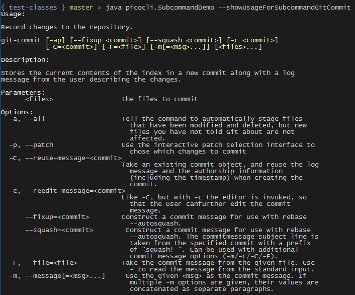

= picocli - a mighty tiny command line interface
//:author: Remko Popma
//:email: rpopma@apache.org
:revnumber: 4.7.6-SNAPSHOT
:revdate: 2023-08-27
:toc: left
:numbered:
:toclevels: 2
:toc-title: Features
:source-highlighter: rouge
:rouge-languages: kotlin, groovy, scala
//:source-highlighter: highlightjs
//:highlightjs-theme: darkula
:icons: font
:imagesdir: images
:sectanchors:
:linkattrs:
:docinfo: shared-head,private
ifdef::env-github[]
:caution-caption: :fire:
:important-caption: :heavy_exclamation_mark:
:note-caption: :information_source:
:tip-caption: :bulb:
:warning-caption: :warning:
endif::[]

[link=https://github.com/remkop/picocli]
image::https://s3.amazonaws.com/github/ribbons/forkme_right_red_aa0000.png[Fork me on GitHub,float="right"]
++++
<iframe src="https://ghbtns.com/github-btn.html?user=remkop&repo=picocli&type=star&count=true" frameborder="0" scrolling="0" width="170px" height="20px" style="float:right"></iframe>
++++

[quote]
Every main method deserves picocli!

image:logo/horizontal.png[picocli the Mighty Tiny Command Line Interface,width=800]

The user manual for the latest release is at https://picocli.info.
For the busy and impatient: there is also a link:quick-guide.html[Quick Guide].

== Introduction
Picocli aims to be the easiest way to create rich command line applications that can run on and off the JVM.
Considering picocli?
Check https://github.com/remkop/picocli/wiki/Feedback-from-Users[what happy users say] about picocli.


=== Overview
Picocli is a one-file framework for creating Java command line applications with almost zero code.
It supports a variety of command line syntax styles including POSIX, GNU, MS-DOS and more. It generates highly customizable usage help messages that use <<ANSI Colors and Styles,ANSI colors and styles>> to contrast important elements and reduce the cognitive load on the user.

Picocli-based applications can have link:autocomplete.html[command line TAB completion] showing available options, option parameters and subcommands, for any level of nested subcommands.
Picocli-based applications can be ahead-of-time compiled to a image:https://www.graalvm.org/resources/img/logo-colored.svg[GraalVM]
<<GraalVM Native Image,native image>>, with extremely fast startup time and lower memory requirements, which can be distributed as a single executable file.

Picocli <<Generate Man Page Documentation,generates beautiful documentation>> for your application (HTML, PDF and Unix man pages).

.An example usage help message with ANSI colors and styles
image:checksum-usage-help.png[Screenshot of usage help with Ansi codes enabled]

Another distinguishing feature of picocli is how it aims to let users run picocli-based applications without requiring picocli as an external dependency:
all the source code lives in a single file, to encourage application authors to include it _in source form_.

Picocli makes it easy to follow https://clig.dev/#guidelines[Command Line Interface Guidelines].

How it works: annotate your class and picocli initializes it from the command line arguments, converting the input to strongly typed values in the fields of your class.

TIP: Picocli also provides a <<Programmatic API,programmatic API>>, separately from the annotations API.

=== Example application
The example below shows a short but fully functional picocli-based `checksum` command line application.

// NOTE: other documents reference the [[CheckSum-application]] link; do not change it
.Java
[[CheckSum-application]]
[source,java,role="primary"]
----
import picocli.CommandLine;
import picocli.CommandLine.Command;
import picocli.CommandLine.Option;
import picocli.CommandLine.Parameters;

import java.io.File;
import java.math.BigInteger;
import java.nio.file.Files;
import java.security.MessageDigest;
import java.util.concurrent.Callable;

@Command(name = "checksum", mixinStandardHelpOptions = true, version = "checksum 4.0",
         description = "Prints the checksum (SHA-256 by default) of a file to STDOUT.")
class CheckSum implements Callable<Integer> {

    @Parameters(index = "0", description = "The file whose checksum to calculate.")
    private File file;

    @Option(names = {"-a", "--algorithm"}, description = "MD5, SHA-1, SHA-256, ...")
    private String algorithm = "SHA-256";

    @Override
    public Integer call() throws Exception { // your business logic goes here...
        byte[] fileContents = Files.readAllBytes(file.toPath());
        byte[] digest = MessageDigest.getInstance(algorithm).digest(fileContents);
        System.out.printf("%0" + (digest.length*2) + "x%n", new BigInteger(1, digest));
        return 0;
    }

    // this example implements Callable, so parsing, error handling and handling user
    // requests for usage help or version help can be done with one line of code.
    public static void main(String... args) {
        int exitCode = new CommandLine(new CheckSum()).execute(args);
        System.exit(exitCode);
    }
}
----
// Note: this example deliberately does not have the callouts and detailed explanation of the Quick Guide;
// in this document we want to keep the introduction section very light-weight and high-level.
// The goal of the introduction is to show how easy picocli is.
// (The rest of this document has plenty of details.)

.Groovy
[[CheckSum-App-Groovy]]
[source,groovy,role="secondary"]
----
@Grab('info.picocli:picocli-groovy:4.7.6-SNAPSHOT')
import picocli.CommandLine
import static picocli.CommandLine.*

import java.security.MessageDigest
import java.util.concurrent.Callable

@Command(name = 'checksum', mixinStandardHelpOptions = true, version = 'checksum 4.0',
  description = 'Prints the checksum (SHA-256 by default) of a file to STDOUT.')
class Checksum implements Callable<Integer> {

    @Parameters(index = '0', description = 'The file whose checksum to calculate.')
    File file

    @Option(names = ['-a', '--algorithm'], description = 'MD5, SHA-1, SHA-256, ...')
    String algorithm = 'SHA-256'

    Integer call() throws Exception {
        println MessageDigest.getInstance(algorithm).digest(file.bytes).encodeHex().toString()
        0
    }

    static void main(String[] args) {
        System.exit(new CommandLine(new Checksum()).execute(args))
    }
}
----

.Groovy script
[[CheckSum-App-Groovy-Script]]
[source,groovy,role="secondary"]
----
@Grab('info.picocli:picocli-groovy:4.7.6-SNAPSHOT')
import static picocli.CommandLine.*
import groovy.transform.Field
import java.security.MessageDigest

@Command(name = 'checksum', mixinStandardHelpOptions = true, version = 'checksum 4.0',
  description = 'Prints the checksum (SHA-256 by default) of a file to STDOUT.')
@picocli.groovy.PicocliScript

@Parameters(index = '0', description = 'The file whose checksum to calculate.')
@Field File file

@Option(names = ['-a', '--algorithm'], description = 'MD5, SHA-1, SHA-256, ...')
@Field String algorithm = 'SHA-256'

println MessageDigest.getInstance(algorithm).digest(file.bytes).encodeHex().toString()
----

.Kotlin
[[CheckSum-App-Kotlin]]
[source,kotlin,role="secondary"]
----
import picocli.CommandLine
import picocli.CommandLine.Command
import picocli.CommandLine.Option
import picocli.CommandLine.Parameters

import java.io.File
import java.math.BigInteger
import java.nio.file.Files
import java.security.MessageDigest
import java.util.concurrent.Callable
import kotlin.system.exitProcess

@Command(name = "checksum", mixinStandardHelpOptions = true, version = ["checksum 4.0"],
    description = ["Prints the checksum (SHA-256 by default) of a file to STDOUT."])
class Checksum : Callable<Int> {

    @Parameters(index = "0", description = ["The file whose checksum to calculate."])
    lateinit var file: File

    @Option(names = ["-a", "--algorithm"], description = ["MD5, SHA-1, SHA-256, ..."])
    var algorithm = "SHA-256"

    override fun call(): Int {
        val fileContents = Files.readAllBytes(file.toPath())
        val digest = MessageDigest.getInstance(algorithm).digest(fileContents)
        println(("%0" + digest.size * 2 + "x").format(BigInteger(1, digest)))
        return 0
    }
}

fun main(args: Array<String>) : Unit = exitProcess(CommandLine(Checksum()).execute(*args))
----

.Scala
[[CheckSum-App-Scala]]
[source,scala,role="secondary"]
----
import picocli.CommandLine
import picocli.CommandLine.{Command, Option, Parameters}

import java.io.File
import java.math.BigInteger
import java.nio.file.Files
import java.security.MessageDigest
import java.util.concurrent.Callable

@Command(name = "checksum", mixinStandardHelpOptions = true, version = Array("checksum 4.0"),
  description = Array("Prints the checksum (SHA-256 by default) of a file to STDOUT."))
class Checksum extends Callable[Int] {

  @Parameters(index = "0", description = Array("The file whose checksum to calculate."))
   private var file: File = null

  @Option(names = Array("-a", "--algorithm"), description = Array("MD5, SHA-1, SHA-256, ..."))
  private var algorithm = "SHA-256"

  def call(): Int = {
    val fileContents = Files.readAllBytes(file.toPath)
    val digest = MessageDigest.getInstance(algorithm).digest(fileContents)
    println(("%0" + digest.size * 2 + "x").format(new BigInteger(1, digest)))
    0
  }
}

object Checksum {
  def main(args: Array[String]): Unit = {
    System.exit(new CommandLine(new Checksum()).execute(args: _*))
  }
}
----


[TIP]
====
You can https://www.jdoodle.com/embed/v0/2mQM?stdin=1&arg=1[run this example online^].
Try it without arguments, with an option like `--help` or `--version`, or with a file name like `/usr/bin/java` as command line argument.
====


Implement `Runnable` or `Callable` and your command can be <<Executing Commands,executed>> in one line of code.
The example `main` method calls `CommandLine.execute` to parse the command line, handle errors, handle requests for usage and version help, and invoke the business logic. Applications can call `System.exit` with the returned exit code to signal success or failure to their caller.

The <<Mixin Standard Help Options,mixinStandardHelpOptions>> attribute adds `--help` and `--version` options to your application.

[TIP]
====
The picocli Quick Guide shows other https://picocli.info/quick-guide.html#_example_applications[sample applications] and explains them in more detail.
====

[TIP]
====
The https://github.com/remkop/picocli/tree/main/picocli-examples[picocli-examples] module in the picocli git repository has many more examples.
====


== Getting Started
You can add picocli as an external dependency to your project, or you can include it as source.

=== Add as External Dependency
Below are examples of configuring Gradle or Maven to use picocli as an external dependency in your project:

.Gradle
[source,groovy,role="primary"]
----
dependencies {
    implementation 'info.picocli:picocli:4.7.6-SNAPSHOT'
}
----
.Maven
[source,xml,role="secondary"]
----
<dependency>
  <groupId>info.picocli</groupId>
  <artifactId>picocli</artifactId>
  <version>4.7.6-SNAPSHOT</version>
</dependency>
----

=== Add as Source
To include as source, get the source code from the link:https://github.com/remkop/picocli/blob/main/src/main/java/picocli/CommandLine.java[GitHub file]. Copy and paste it into a file called `CommandLine.java`, add it to your project, and enjoy!

=== Annotation Processor

The `picocli-codegen` module includes an annotation processor that can build a model from the picocli annotations at compile time rather than at runtime.

Enabling this annotation processor in your project is optional, but strongly recommended. Use this if you’re interested in:

* **Compile time error checking**. The annotation processor shows errors for invalid annotations and attributes immediately when you compile, instead of during testing at runtime, resulting in shorter feedback cycles.
* **<<GraalVM Native Image,GraalVM native images>>**. The annotation processor generates and updates https://www.graalvm.org/latest/reference-manual/native-image/overview/BuildConfiguration/[GraalVM configuration] files under
`META-INF/native-image/picocli-generated/$project` during compilation, to be included in the application jar.
This includes configuration files for https://www.graalvm.org/latest/reference-manual/native-image/dynamic-features/Reflection/[reflection], https://www.graalvm.org/latest/reference-manual/native-image/dynamic-features/Resources/[resources] and https://www.graalvm.org/latest/reference-manual/native-image/dynamic-features/DynamicProxy/[dynamic proxies].
By embedding these configuration files, your jar is instantly Graal-enabled.
In most cases no further configuration is needed when generating a native image.

==== Processor option: `project`

The picocli annotation processor supports a number of https://github.com/remkop/picocli/tree/main/picocli-codegen#picocli-processor-options[options], most important of which is the `project` option to control the output subdirectory: the generated files are written to `META-INF/native-image/picocli-generated/${project}`. A good convention is to use the Maven `${project.groupId}/${project.artifactId}` as the value; a unique subdirectory ensures your jar can be shaded with other jars that may also contain generated configuration files.

To configure this option, pass the `-Aproject=<some value>` to the javac compiler. The examples below show how to do this for Maven and Gradle.

==== Enabling the Annotation Processor

===== IDE
https://immutables.github.io/apt.html[This page] shows the steps to configure Eclipse and IntelliJ IDEA to enable annotation processing.

===== Using Build Tools

.Gradle
[source,groovy,role="primary"]
----
dependencies {
    implementation 'info.picocli:picocli:4.7.6-SNAPSHOT'
    annotationProcessor 'info.picocli:picocli-codegen:4.7.6-SNAPSHOT'
}


compileJava {
    options.compilerArgs += ["-Aproject=${project.group}/${project.name}"]
}
----

.Maven
[source,xml,role="secondary"]
----
<plugin>
  <groupId>org.apache.maven.plugins</groupId>
  <artifactId>maven-compiler-plugin</artifactId>
  <!-- annotationProcessorPaths requires maven-compiler-plugin version 3.5 or higher -->
  <version>${maven-compiler-plugin-version}</version>
  <configuration>
    <annotationProcessorPaths>
      <path>
        <groupId>info.picocli</groupId>
        <artifactId>picocli-codegen</artifactId>
        <version>4.7.6-SNAPSHOT</version>
      </path>
    </annotationProcessorPaths>
    <compilerArgs>
      <arg>-Aproject=${project.groupId}/${project.artifactId}</arg>
    </compilerArgs>
  </configuration>
</plugin>
----

See the https://github.com/remkop/picocli/tree/main/picocli-codegen[`picocli-codegen` README] for more details.

===== Kotlin Projects Using Gradle
Kotlin projects should add the `kotlin-kapt` plugin to enable the Kotlin Annotation processing tool (https://kotlinlang.org/docs/reference/kapt.html[kapt]),
then replace `annotationProcessor` with `kapt`:

```
apply plugin: 'kotlin-kapt' // required
dependencies {
    // ...
    kapt 'info.picocli:picocli-codegen:4.7.6-SNAPSHOT'
}
```

And replace `compileJava.options.compilerArgs` with `kapt.arguments`:
```
kapt {
    arguments {
        arg("project", "${project.group}/${project.name}")
    }
}
```
See the https://github.com/remkop/picocli/tree/main/picocli-codegen[`picocli-codegen` README] for more details.

=== Running the Application

After we successfully compiled our <<CheckSum-application,example `CheckSum` application>>, let's quickly look at how to run it.

There are many ways to run picocli-based applications, depending on whether we included picocli as source, created a jar for our application or not, and whether we created a shaded jar (also known as uber-jar) containing all dependencies.

Before we run our `CheckSum` application, let's create an example file whose checksum we want to print. For example:

[source,bash]
----
echo "hello" > hello.txt
----

Now, assuming we created a jar named `checksum.jar` containing our compiled `CheckSum.class`, we can run the application with `java -cp <classpath> <MainClass> [OPTIONS]`. For example:

[source,bash]
----
java -cp "picocli-4.7.6-SNAPSHOT.jar:checksum.jar" CheckSum --algorithm SHA-1 hello.txt
----

You may want to package your application in such a way that end users can invoke it with a short command like this:

[source,bash]
----
checksum --algorithm SHA-1 hello.txt
----

See the <<Packaging Your Application>> section for ideas on how to accomplish this.

== Options and Parameters
Command line arguments can be separated into _options_  and _positional parameters_.
Options have a name, positional parameters are usually the values that follow the options, but they may be mixed.

image:OptionsAndParameters2.png[Example command with annotated @Option and @Parameters]

Picocli has separate annotations for options and positional parameters.

=== Options
An option must have one or more `names`.
Picocli lets you use any option name you want.
Option names are case-sensitive by default, but this is <<Case Sensitivity,customizable>>.

TIP: You may be interested in this http://catb.org/~esr/writings/taoup/html/ch10s05.html#id2948149[list of common option names]. Following these conventions may make your application more intuitive to use for experienced users.

The below example shows options with one or more names, options that take an option parameter, and a <<Help Options,help>> option.

.Java
[source,java,role="primary"]
----
class Tar {
    @Option(names = "-c", description = "create a new archive")
    boolean create;

    @Option(names = { "-f", "--file" }, paramLabel = "ARCHIVE", description = "the archive file")
    File archive;

    @Parameters(paramLabel = "FILE", description = "one or more files to archive")
    File[] files;

    @Option(names = { "-h", "--help" }, usageHelp = true, description = "display a help message")
    private boolean helpRequested = false;
}
----

.Kotlin
[source,kotlin,role="secondary"]
----
class Tar : Runnable {
    @Option(names = ["-c"], description = ["create a new archive"])
    var create: Boolean = false;

    @Option(names = ["-f", "--file"], paramLabel = "ARCHIVE", description = ["the archive file"])
    lateinit var archive: File;

    @Parameters(paramLabel = "FILE", description = ["one or more files to archive"])
    lateinit var files: Array<File>;

    @Option(names = ["-h", "--help"], usageHelp = true, description = ["display a help message"])
    private var helpRequested: Boolean = false;
}
----

Picocli matches the option names to set the field values.

.Java
[source,java,role="primary"]
----
String[] args = { "-c", "--file", "result.tar", "file1.txt", "file2.txt" };
Tar tar = new Tar();
new CommandLine(tar).parseArgs(args);

assert !tar.helpRequested;
assert  tar.create;
assert  tar.archive.equals(new File("result.tar"));
assert  Arrays.equals(tar.files, new File[] {new File("file1.txt"), new File("file2.txt")});
----

.Kotlin
[source,kotlin,role="secondary"]
----
val args1 = arrayOf("-c", "--file", "result.tar", "file1.txt", "file2.txt")
var tar = Tar()
CommandLine(tar).parseArgs(*args1);

assert(!tar.helpRequested)
assert(tar.create)
assert(tar.archive.equals(File("result.tar")))
assert(Arrays.equals(tar.files, arrayOf<File>(File("file1.txt"), File("file2.txt"))))
----

=== Interactive (Password) Options
Picocli 3.5 introduced password support: for options and positional parameters marked as `interactive`, the user is prompted to enter a value on the console.
When running on Java 6 or higher, picocli will use the https://docs.oracle.com/javase/8/docs/api/java/io/Console.html#readPassword-java.lang.String-java.lang.Object...-[`Console.readPassword`] API so that user input is not echoed to the console.

From picocli 4.6, applications can choose to echo user input to the console by setting `echo = true`, and set the `prompt` text to control what is shown on the console when asking the user for input.

CAUTION: Interactive _positional parameters_ have a limitation: they must be followed by a non-interactive positional parameter.
Commands where the _last_ positional parameter is `interactive` are currently not supported.

==== Example
The example below demonstrates how an interactive option can be used to specify a password.
From picocli 3.9.6, interactive options can use type `char[]` instead of String, to allow applications to null out the array after use so that sensitive information is no longer resident in memory.

Example usage:

.Java
[source,java,role="primary"]
----
class Login implements Callable<Integer> {
    @Option(names = {"-u", "--user"}, description = "User name")
    String user;

    @Option(names = {"-p", "--password"}, description = "Passphrase", interactive = true)
    char[] password;

    public Integer call() throws Exception {
        byte[] bytes = new byte[password.length];
        for (int i = 0; i < bytes.length; i++) { bytes[i] = (byte) password[i]; }

        MessageDigest md = MessageDigest.getInstance("SHA-256");
        md.update(bytes);

        System.out.printf("Hi %s, your password is hashed to %s.%n", user, base64(md.digest()));

        // null out the arrays when done
        Arrays.fill(bytes, (byte) 0);
        Arrays.fill(password, ' ');

        return 0;
    }

    private String base64(byte[] arr) { /* ... */ }
}
----

.Kotlin
[source,kotlin,role="secondary"]
----
class Login : Callable<Int> {
    @Option(names = ["-u", "--user"], description = ["User name"])
    var user: String? = null

    @Option(names = ["-p", "--password"], description = ["Passphrase"], interactive = true)
    lateinit var password: CharArray

    override fun call(): Int {
        val bytes = ByteArray(password.size)
        for (i in bytes.indices) { bytes[i] = password[i].toByte() }

        val md = MessageDigest.getInstance("SHA-256")
        md.update(bytes)

        println(("Hi %s, your password is hashed to %s.").format(user, base64(md.digest())))

        // null out the arrays when done
        Arrays.fill(bytes, 0.toByte())
        Arrays.fill(password, ' ')

        return 0
    }

    private fun base64(arr: ByteArray): String { /* ... */ }
}
----

When this command is invoked like this:

.Java
[source,java,role="primary"]
----
new CommandLine(new Login()).execute("-u", "user123", "-p");
----

.Kotlin
[source,kotlin,role="secondary"]
----
CommandLine(Login()).execute("-u", "user123", "-p")
----

Then the user will be prompted to enter a value:

[source]
----
Enter value for --password (Passphrase):
----
When running on Java 6 or higher, the user input is not echoed to the console.
After the user enters a password value and presses enter, the `call()` method is invoked, which prints something like the following:
[source]
----
Hi user123, your passphrase is hashed to 75K3eLr+dx6JJFuJ7LwIpEpOFmwGZZkRiB84PURz6U8=.
----

==== Optionally Interactive
Interactive options by default cause the application to wait for input on stdin. For commands that need to be run interactively as well as in batch mode, it is useful if the option can optionally consume an argument from the command line.

The default <<Arity,arity>> for interactive options is zero, meaning that the option takes no parameters. From picocli 3.9.6, interactive options can also take a value from the command line if configured with `arity = "0..1"`. (See <<Optional Values>>.)

For example, if an application has these options:

.Java
[source,java,role="primary"]
----
@Option(names = "--user")
String user;

@Option(names = "--password", arity = "0..1", interactive = true)
char[] password;
----

.Kotlin
[source,kotlin,role="secondary"]
----
@Option(names = ["--user"])
lateinit var user: String

@Option(names = ["--password"], arity = "0..1", interactive = true)
lateinit var password: CharArray
----

With the following input, the `password` field will be initialized to `"123"` without prompting the user for input:

----
--password 123 --user Joe
----

However, if the password is not specified, the user will be prompted to enter a value. In the following example, the password option has no parameter, so the user will be prompted to type in a value on the console:

----
--password --user Joe
----


[TIP]
.Providing Passwords to Batch Scripts Securely
====
Note that specifying a password in plain text on the command line or in scripts is not secure. There are alternatives that are more secure.

One idea is to add a separate different option (that could be named `--password:file`) that takes a `File` or `Path` parameter, where the application reads the password from the specified file.
Another idea is to add a separate different option (that could be named `--password:env`) that takes an environment variable name parameter, where the application gets the password from the user’s environment variables.

A command that combines either of these with an interactive `--password` option (with the default `arity = "0"`) allows end users to provide a password without specifying it in plain text on the command line. Such a command can be executed both interactively and in batch mode.

The https://github.com/remkop/picocli/blob/main/picocli-examples[`picocli-examples`] module has an example, coded both in https://github.com/remkop/picocli/blob/main/picocli-examples/src/main/java/picocli/examples/interactive/PasswordDemo.java[Java] and https://github.com/remkop/picocli/tree/main/picocli-examples/src/main/kotlin/picocli/examples/kotlin/interactive/PasswordDemo.kt[Kotlin].
====

[CAUTION]
.Interactive options and shell applications with JLine 2
====
Interactive options do not work in conjunction with JLine 2's `ConsoleReader`. Either implement a <<Custom Parameter Processing,`IParameterConsumer`>> which uses JLine2's `ConsoleReader` directly or use https://github.com/remkop/picocli/tree/main/picocli-shell-jline3[`picocli-shell-jline3`].
====


==== Forcing Interactive Input

Be aware that picocli only prompts the user when the interactive option is specified without parameter:

----
$ myprogram                             # option not specified: no prompting
You provided value 'null'

$ myprogram --interactive-option=abc    # option specified with parameter: no prompting
You provided value 'abc'

$ myprogram --interactive-option        # option specified WITHOUT parameter: prompt for input
Enter value for --interactive-option (...):    #  <--- type xxx and hit Enter
You provided value 'xxx'
----

Applications that also need the user to be prompted when the option is not specified, need to do this in the business logic.
For example:

.Java
[source,java,role="primary"]
----
@Command
public class Main implements Runnable {
    @Option(names = "--interactive", interactive = true)
    String value;

    public void run() {
        if (value == null && System.console() != null) {
            // alternatively, use Console::readPassword
            value = System.console().readLine("Enter value for --interactive: ");
        }
        System.out.println("You provided value '" + value + "'");
    }

    public static void main(String[] args) {
        new CommandLine(new Main()).execute(args);
    }
}
----

.Kotlin
[source,kotlin,role="secondary"]
----
@Command
class Main : Runnable {
    @Option(names = ["--interactive"], description = ["unattended run"], interactive = true)
    var value: String? = null
    override fun run() {
        if (value == null && System.console() != null) {
            // alternatively, use console::readPassword
            value = System.console().readLine("Enter value for --interactive: ")
        }
        println("You provided value '$value'")
    }
}

fun main(args: Array<String>) : Unit = exitProcess(CommandLine(Main()).execute(*args))
----

=== Short (POSIX) Options
Picocli supports https://pubs.opengroup.org/onlinepubs/9699919799/basedefs/V1_chap12.html#tag_12_02[POSIX clustered short options]:
one or more single-character options without option-arguments, followed by at most one option with an option-argument, can be grouped behind one '-' delimiter.


For example, given this annotated class:

.Java
[source,java,role="primary"]
----
class ClusteredShortOptions {
    @Option(names = "-a") boolean aaa;
    @Option(names = "-b") boolean bbb;
    @Option(names = "-c") boolean ccc;
    @Option(names = "-f") String  file;
}
----

.Kotlin
[source,kotlin,role="secondary"]
----
class ClusteredShortOptions {
    @Option(names = ["-a"]) var aaa = false
    @Option(names = ["-b"]) var bbb = false
    @Option(names = ["-c"]) var ccc = false
    @Option(names = ["-f"]) lateinit var file: String
}
----

The following command line arguments are all equivalent and parsing them will give the same result:

[source,bash]
----
<command> -abcfInputFile.txt
<command> -abcf=InputFile.txt
<command> -abc -f=InputFile.txt
<command> -ab -cf=InputFile.txt
<command> -a -b -c -fInputFile.txt
<command> -a -b -c -f InputFile.txt
<command> -a -b -c -f=InputFile.txt
...
----

[TIP]
.POSIX short options and usability
====
Applications can give a subtle hint to end users that an option is common and encouraged by providing both a short and a long name for an option.
Conversely, the absence of a short option can signal that the option is unusual or perhaps should be used with care.
====


=== Boolean Options
Boolean options usually don't need a parameter: it is enough to specify the option name on the command line.

.Java
[source,java,role="primary"]
----
class BooleanOptions {
    @Option(names = "-x") boolean x;
}
----

.Kotlin
[source,kotlin,role="secondary"]
----
class BooleanOptions {
    @Option(names = ["-x"]) var x = false
}
----

The value of `x` is `false` by default, and is set to `true` (the opposite of the default) if the `-x` option is specified on the command line.
If the `-x` option is specified multiple times on the command line, the value of `x` remains `true`. (Prior to picocli 4.0, the value of `x` would "toggle" (flip to its opposite) for every `-x` option on the command line. This can still be <<Toggle Boolean Flags,configured>> if required.)

This is enough in most cases, but picocli offers alternatives for applications that need to get the value from something other than the default value. When the option is specified on the command line, the annotated field (or <<option-parameters-methods,method>>) is assigned a value, as follows:

* If the parser is configured to <<Toggle Boolean Flags,toggle boolean options>>, the opposite of the _current value_ is assigned. (This was the default prior to picocli 4.0.)
* If a <<fallbackValue-annotation, fallback value>> is defined, the fallback value is assigned.
* If the option is defined with a non-zero <<Arity,arity>>, and an option parameter was specified on the command line, this option <<Boolean Options with Parameters,parameter value is assigned>>.
* Otherwise, the value assigned is the logical opposite of the _default value_.


=== Negatable Options

From picocli 4.0, boolean options can be `negatable`.

.Java
[source,java,role="primary"]
----
@Command(name = "negatable-options-demo")
class NegatableOptionsDemo {
    @Option(names = "--verbose",           negatable = true) boolean verbose;
    @Option(names = "-XX:+PrintGCDetails", negatable = true) boolean printGCDetails;
    @Option(names = "-XX:-UseG1GC",        negatable = true) boolean useG1GC = true;
}
----

.Kotlin
[source,kotlin,role="secondary"]
----
@Command(name = "negatable-options-demo")
class NegatableOptionsDemo {
    @Option(names = ["--verbose"],           negatable = true) var verbose = false
    @Option(names = ["-XX:+PrintGCDetails"], negatable = true) var printGCDetails = false
    @Option(names = ["-XX:-UseG1GC"],        negatable = true) var useG1GC = true
}
----

When an option is negatable, picocli will recognize negative aliases of the option on the command line.

The usage help for the above example looks like this:

----
Usage: negatable-options-demo [--[no-]verbose] [-XX:(+|-)PrintGCDetails]
                              [-XX:(+|-)UseG1GC]
      --[no-]verbose     Show verbose output
      -XX:(+|-)PrintGCDetails
                         Prints GC details
      -XX:(+|-)UseG1GC   Use G1 algorithm for GC
----

For *nix-style long options, aliases have the prefix `no-` to the given names, for example `--no-verbose`.
For Java JVM-style options like `-XX:+PrintGCDetails`, the `:+` is turned into `:-` and vice versa.
Short option names are not given a negative alias by default. (This is <<Customizing Negatable Options,customizable>>.)

If the negated form of the option is found, for example `--no-verbose`, the value is set to the provided default. Otherwise, with a regular call, for example `--verbose`, it is set to the opposite of the default.

[TIP]
.Negatable options that are `true` by default
====
When a negatable option is `true` by default, give it both a `defaultValue` and a `fallbackValue` of `"true"`. For example:

.Java
[source,java,role="primary"]
----
@Option(names = "--backup", negatable = true,
  defaultValue = "true", fallbackValue = "true",
  description = "Make a backup. True by default.")
boolean backup;
----

.Kotlin
[source,kotlin,role="secondary"]
----
@Option(names = ["--backup"], negatable = true,
  defaultValue = "true", fallbackValue = "true",
  description = ["Make a backup. True by default."])
var backup = true
----

The table below shows the value assigned to the annotated option field for a number of possible user input strings:

//.Negatable option values for various user input strings
//[grid=cols,cols="10,10",options="header"]
//|===
//| End user input | Option value
//| (no args)             | `true`
//| `--backup`            | `true`
//| `--backup=true`       | `true`
//| `--backup=false`      | `false`
//| `--no-backup`         | `false`
//| `--no-backup=true`    | `false`
//| `--no-backup=false`   | `true`
//|===
//

----
End user input      Option value
--------------      ------------
(no args)           true
--backup            true
--backup=true       true
--backup=false      false
--no-backup         false
--no-backup=true    false
--no-backup=false   true
----

====

=== Positional Parameters
Any command line arguments that are not subcommands or options (or option parameters) are interpreted as positional parameters.
Positional parameters generally follow the options but from picocli 2.0, positional parameters can be mixed with options on the command line.

==== Explicit Index

Use the (zero-based) `index` attribute to specify exactly which parameters to capture.
Array or collection fields can capture multiple values.

The `index` attribute accepts _range_ values, so an annotation like `@Parameters(index="2..4")` captures the arguments at index 2, 3 and 4. Range values can be _open-ended_. For example, `@Parameters(index="3..*")` captures all arguments from index 3 and up.

For example:

.Java
[source,java,role="primary"]
----
class PositionalParameters {
    @Parameters(index = "0")    InetAddress host;
    @Parameters(index = "1")    int port;
    @Parameters(index = "2..*") File[] files;

    @Parameters(hidden = true)  // "hidden": don't show this parameter in usage help message
    List<String> allParameters; // no "index" attribute: captures _all_ arguments
}
----

.Kotlin
[source,kotlin,role="secondary"]
----
class PositionalParameters {
    @Parameters(index = "0")    lateinit var host: InetAddress
    @Parameters(index = "1")    var port = 0
    @Parameters(index = "2..*") lateinit var files: Array<File>

    @Parameters(hidden = true)   // "hidden": don't show this parameter in usage help message
    lateinit var allParameters: List<String> // no "index" attribute: captures _all_ arguments
}
----

Picocli initializes fields with the values at the specified index in the arguments array.

.Java
[source,java,role="primary"]
----
String[] args = { "localhost", "12345", "file1.txt", "file2.txt" };
PositionalParameters params = CommandLine.populateCommand(new PositionalParameters(), args);

assert params.host.getHostName().equals("localhost");
assert params.port == 12345;
assert Arrays.equals(params.files, new File[] {new File("file1.txt"), new File("file2.txt")});

assert params.allParameters.equals(Arrays.asList(args));
----

.Kotlin
[source,kotlin,role="secondary"]
----
val args = arrayOf("localhost", "12345", "file1.txt", "file2.txt")
val params: PositionalParameters = CommandLine.populateCommand(PositionalParameters(), *args)

assert(params.host.getHostName().equals("localhost"))
assert(params.port === 12345)
assert(Arrays.equals(params.files, arrayOf(File("file1.txt"), File("file2.txt"))))

assert(params.allParameters.equals(Arrays.asList(*args)))
----

See <<Strongly Typed Everything>> for which types are supported out of the box and how to add custom types.

==== Omitting the Index
It is possible to omit the `index` attribute. This means different things for single-value and for multi-value positional parameters.

For *multi-value* positional parameters (arrays or collections), omitting the `index` attribute means the field captures _all_ positional parameters (the equivalent of `index = "0..*"`).

For *single-value* positional parameters, picocli's behaviour has changed since version 4.3:
prior to picocli 4.3, the default index for single-value positional parameters was also `index = "0..*"`, even though only one value (usually the first argument) can be captured.
From version 4.3, picocli assigns an index automatically, based on the other positional parameters defined in the same command.

[CAUTION]
====
Automatic indexes depend on the ability of Java reflection and Java annotation processors to iterate over fields in declaration order in the source code.
Officially this is not guaranteed by the Java spec.
In practice this has worked in Oracle JVMs and OpenJDK from Java 6, but there is some risk this may not work in the future or on other JVM's.
In general, for single-value positional parameters, using <<Explicit Index,explicit indexes>> is the safer option.
(Multi-value positional parameters can safely omit the `index` attribute.)
====

IMPORTANT: Methods cannot be iterated over in predictable order.
For applications with <<option-parameters-methods,`@Parameters`-annotated methods>> or combinations of `@Parameters`-annotated methods and `@Parameters`-annotated fields, we recommend using <<Explicit Index,explicit indexes>> for single-value positional parameters.


See <<Automatic Parameter Indexes>> for details.

=== Mixing Options and Positional Parameters
From picocli 2.0, positional parameters can be specified anywhere on the command line, they no longer need to follow the options.

For example:

.Java
[source,java,role="primary"]
----
class Mixed {
    @Parameters
    List<String> positional;

    @Option(names = "-o")
    List<String> options;
}
----

.Kotlin
[source,kotlin,role="secondary"]
----
class Mixed {
    @Parameters
    lateinit var positional: List<String>

    @Option(names = ["-o"])
    lateinit var options: List<String>
}
----

Any command line argument that is not an option or subcommand is interpreted as a positional parameter.

.Java
[source,java,role="primary"]
----
String[] args = { "param0", "-o", "AAA", "param1", "param2", "-o", "BBB", "param3" };
Mixed mixed = new Mixed();
new CommandLine(mixed).parseArgs(args);

assert mixed.positional.equals(Arrays.asList("param0", "param1", "param2", "param3");
assert mixed.options.equals   (Arrays.asList("AAA", "BBB"));
----

.Kotlin
[source,kotlin,role="secondary"]
----
val args = arrayOf("param0", "-o", "AAA", "param1", "param2", "-o", "BBB", "param3")
val mixed = Mixed()
CommandLine(mixed).parseArgs(*args)

assert(mixed.positional == Arrays.asList("param0", "param1", "param2", "param3"))
assert(mixed.options == Arrays.asList("AAA", "BBB"))
----

=== Double dash (`--`)
When one of the command line arguments is just two dashes without any characters attached (`--`),
picocli interprets all following arguments as positional parameters, even arguments that match an option name.

.Java
[source,java,role="primary"]
----
class DoubleDashDemo {
    @Option(names = "-v")     boolean verbose;
    @Option(names = "-files") List<String> files;
    @Parameters               List<String> params;
}
----

.Kotlin
[source,kotlin,role="secondary"]
----
class DoubleDashDemo {
    @Option(names = ["-v"])     var verbose = false
    @Option(names = ["-files"]) var files: List<String>? = null
    @Parameters                 lateinit var params: List<String>
}
----

The `--` end-of-options delimiter clarifies which of the arguments are positional parameters:

.Java
[source,java,role="primary"]
----
String[] args = { "-v", "--", "-files", "file1", "file2" };
DoubleDashDemo demo = new DoubleDashDemo();
new CommandLine(demo).parseArgs(args);

assert demo.verbose;
assert demo.files == null;
assert demo.params.equals(Arrays.asList("-files", "file1", "file2"));
----

.Kotlin
[source,kotlin,role="secondary"]
----
val args = arrayOf("-v", "--", "-files", "file1", "file2")
val demo = DoubleDashDemo()
CommandLine(demo).parseArgs(*args)

assert(demo.verbose)
assert(demo.files == null)
assert(demo.params == Arrays.asList("-files", "file1", "file2"))
----

A custom delimiter can be configured with `CommandLine.setEndOfOptionsDelimiter(String)`.

From picocli 4.3, an entry for `--` can be shown in the options list of the usage help message of a command with the `@Command(showEndOfOptionsDelimiterInUsageHelp = true)` annotation.
See <<Show End of Options>> for details.


[[AtFiles]]
=== @-files
==== Argument Files for Long Command Lines
Users sometimes run into system limitations on the length of a command line when creating a
command line with lots of options or with long arguments for options.

Starting from v2.1.0, picocli supports "argument files" or "@-files".
Argument files are files that themselves contain arguments to the command.
When picocli encounters an argument beginning with the character `@`,
it expands the contents of that file into the argument list.

An argument file can include options and positional parameters in any combination.
The arguments within a file can be space-separated or newline-separated.
If an argument contains embedded whitespace, put the whole argument in double or single quotes.
Within quoted values, backslashes need to be escaped with another backslash.

For example, it is possible to have a path with a space,
such as `c:\Program Files` that can be specified as either `"c:\\Program Files"` or,
to avoid an escape, `c:\Program" "Files`.

CAUTION: Argument files do have a limitation: parameter or option values enclosed in quotes must not be preceded by an equal sign.
Something like `myoption="foo bar"` does *not* work inside an argument file.
To work around this, either omit the equal sign (`myoption "foo bar"`) or enclose the whole expression in quotes (`"myoption=\"foo bar\""`).

Lines starting with `#` are comments and are ignored.
The comment character can be configured with `CommandLine.setAtFileCommentChar(Character)`,
and comments can be switched off by setting the comment character to `null`.

The file may itself contain additional @-file arguments; any such arguments will be processed recursively.

If the file does not exist, or cannot be read, then the argument will be treated literally, and not removed.
Multiple @-files may be specified on the command line. The specified path may be relative (to the current directory) or absolute.

For example, suppose a file with arguments exists at `/home/foo/args`, with these contents:

----
# This line is a comment and is ignored.
ABC -option=123
'X Y Z'
----

A command may be invoked with the @file argument, like this:
[source,bash]
----
java MyCommand @/home/foo/args
----
The above will be expanded to the contents of the file:
[source,bash]
----
java MyCommand ABC -option=123 "X Y Z"
----

[CAUTION]
====
Handling of UTF-8 encoded argument files is tricky on Windows OS with Java up to version 17.
Either use `-Dfile.encoding=UTF-8` as VM argument or set the environment variable `JAVA_TOOL_OPTIONS`.
So both command calls given below will work on a Windows command line:
[source,cmd]
----
java -Dfile.encoding=UTF-8 MyCommand @/home/foo/args
----
[source,cmd]
----
SET JAVA_TOOL_OPTIONS=-Dfile.encoding=UTF-8
java MyCommand @/home/foo/args
----
====
CAUTION: In Java 18 the default encoding was changed from a system dependent value to
always be UTF-8. If you require the old behavior, you need to
set the `file.encoding` system property to the value `COMPAT`.

@-file expansion can be switched off by calling `CommandLine::setExpandAtFiles` with `false`.
If turned on, you can still pass a real parameter with an initial `@` character by escaping it
with an additional `@` symbol, e.g. `@@somearg` will become `@somearg` and not be subject to expansion.

This feature is similar to the 'Command Line Argument File' processing supported by gcc, javadoc and javac.
The documentation for these tools has more details.
See for example the documentation for https://docs.oracle.com/en/java/javase/14/docs/specs/man/java.html#java-command-line-argument-files[java Command-Line Argument Files].

[TIP]
====
If you think your users may find this feature (@files) useful, you could consider adding an option to your application that generates an @file for the specified arguments.
The `picocli-examples` module on GitHub has an https://github.com/remkop/picocli/blob/main/picocli-examples/src/main/java/picocli/examples/atfile/AtFileGenerator.java[example] to get you started.
====

==== @-files Usage Help

From picocli 4.2, an entry for `@<filename>` can be shown in the options and parameters list of the usage help message of a command with the `@Command(showAtFileInUsageHelp = true)` annotation.
See <<Show At Files>> for details.


==== Simplified Format

From picocli 3.8.1, a simpler argument file format is also supported where every line (except empty lines and comment lines)
is interpreted as a single argument. Arguments containing whitespace do not need to be quoted,
but it is not possible to have arguments with embedded newlines or to have empty string arguments without quotes.
From picocli 3.9, this simpler argument format is fully compatible with https://jcommander.org/#_syntax[JCommander]'s `@-file` argument file format.

You can tell picocli to use the simplified argument file format programmatically with `CommandLine.setUseSimplifiedAtFiles(true)`,
or by setting system property `picocli.useSimplifiedAtFiles` without a value or with value `"true"`
(case-insensitive). The system property is useful to allow end users control over the format.


== Strongly Typed Everything
When command line options and positional parameters are mapped to the annotated fields,
the text value is converted to the type of the annotated field.

=== Built-in Types
Out of the box, picocli can convert command line argument strings to a number of common data types.

Most of the built-in types work with Java 5, but picocli also has some default converters for Java 7 types like `Path` and Java 8 types like `Duration`, etc. These converters are loaded using reflection and are only available when running on a Java version that supports them. See the below list for details.

* any Java primitive type or their wrapper
* any `enum`
* `String`, `StringBuilder`, `CharSequence`
* `java.math.BigDecimal`, `java.math.BigInteger`
* `java.nio.Charset`
* `java.io.File`
* `java.net.InetAddress`
* `java.util.regex.Pattern`
* `java.util.Date` (for values in `"yyyy-MM-dd"` format)
* `java.net.URL`, `java.net.URI`
* `java.util.UUID`
* `java.lang.Class` (from picocli 2.2, for the fully qualified class name)
* `java.nio.ByteOrder` (from picocli 2.2, for the Strings `"BIG_ENDIAN"` or `"LITTLE_ENDIAN"`)
* `java.util.Currency` (from picocli 2.2, for the ISO 4217 code of the currency)
* `java.net.NetworkInterface` (from picocli 2.2, for the InetAddress or name of the network interface)
* `java.util.TimeZone` (from picocli 2.2, for the ID for a TimeZone)

Converters loaded using reflection:

* `java.nio.file.Path` (from picocli 2.2, requires Java 7 or higher)
* `java.time` value objects: `Duration`, `Instant`, `LocalDate`, `LocalDateTime`, `LocalTime`, `MonthDay`, `OffsetDateTime`, `OffsetTime`, `Period`, `Year`, `YearMonth`, `ZonedDateTime`, `ZoneId`, `ZoneOffset`  (from picocli 2.2, requires Java 8 or higher, invokes the `parse` method of these classes)
* `java.sql.Time` (for values in any of the `"HH:mm"`, `"HH:mm:ss"`, `"HH:mm:ss.SSS"`, or `"HH:mm:ss,SSS"` formats)
* `java.sql.Timestamp` (from picocli 2.2, for values in the `"yyyy-MM-dd HH:mm:ss"` or `"yyyy-MM-dd HH:mm:ss.fffffffff"` formats)
* `java.sql.Connection` (from picocli 2.2, for a database url of the form `jdbc:subprotocol:subname`)
* `java.sql.Driver` (from picocli 2.2, for a database URL of the form `jdbc:subprotocol:subname`)

TIP: Sometimes loading converters with reflection is not desirable.
Use system property `picocli.converters.excludes` to specify a comma-separated list of fully qualified class names for which the converter should not be loaded.
Regular expressions are supported.
For example, invoking the program with `-Dpicocli.converters.excludes=java.sql.Ti.*` will not load type converters for `java.sql.Time` and `java.sql.Timestamp`.

=== Custom Type Converters
Register a custom type converter to handle data types other than the above built-in ones.

==== Single Parameter Type Converters
Custom converters need to implement the `picocli.CommandLine.ITypeConverter` interface:

[source,java]
----
public interface ITypeConverter<K> {
    /**
     * Converts the specified command line argument value to some domain object.
     * @param value the command line argument String value
     * @return the resulting domain object
     * @throws Exception an exception detailing what went wrong during the conversion
     */
    K convert(String value) throws Exception;
}
----

For example:

[source,java]
----
import javax.crypto.Cipher;

class CipherConverter implements ITypeConverter<Cipher> {
    public Cipher convert(String value) throws Exception {
        return Cipher.getInstance(value);
    }
}
----

Custom type converters can be specified for a specific option or positional parameter with the `converter` annotation attribute.
This is described in more detail in the <<Option-specific Type Converters>> section, but here is a quick example:

.Java
[source,java,role="primary"]
----
class App {
    @Option(names = "-a", converter = CipherConverter.class)
    javax.crypto.Cipher cipher;
}
----

.Kotlin
[source,kotlin,role="secondary"]
----
class App {
    @Option(names = ["-a"], converter = [CipherConverter::class])
    lateinit var cipher: javax.crypto.Cipher
}
----

.Groovy
[source,groovy,role="secondary"]
----
class App {
    @Option(names = "-a", converter = CipherConverter.class)
    def cipher
}
----

.Groovy Script
[source,groovy,role="secondary"]
----
class App {
    @Option(names = "-a", converter = [ // requires Groovy 3.0.7
            { { str -> Cipher.getInstance(str) } as ITypeConverter }
    ])
    def cipher
}
----

TIP: Groovy programs can use <<Closures in Annotations,closures in the `converter` attribute of the annotation>>.


Alternatively, custom type converters can be registered _per type_ in each command with the `CommandLine.registerConverter(Class<K> cls, ITypeConverter<K> converter)` method.
All options and positional parameters with the specified type will be converted by the specified converter.

After registering custom converters, call the `execute(String...)` or `parseArgs(String...)` method on the `CommandLine` instance where the converters are registered. (The static `populateCommand` method cannot be used.) For example:

.Java
[source,java,role="primary"]
----
class App {
    @Parameters java.util.Locale locale;
    @Option(names = "-a") javax.crypto.Cipher cipher;
}
----

.Kotlin
[source,kotlin,role="secondary"]
----
import java.util.Locale
import javax.crypto.Cipher
// ...

class App {
    @Parameters
    lateinit var locale: Locale

    @Option(names = ["-a"])
    lateinit var cipher: Cipher
}
----

NOTE: Java 8 lambdas make it easy to register custom converters:

.Java
[source,kotlin,role="primary"]
----
App app = new App();
CommandLine commandLine = new CommandLine(app)
    .registerConverter(Locale.class, s -> new Locale.Builder().setLanguageTag(s).build())
    .registerConverter(Cipher.class, s -> Cipher.getInstance(s));

commandLine.parseArgs("-a", "AES/CBC/NoPadding", "en-GB");
assert app.locale.toLanguageTag().equals("en-GB");
assert app.cipher.getAlgorithm().equals("AES/CBC/NoPadding");
----

.Kotlin
[source,kotlin,role="secondary"]
----
val app = App()
val commandLine = CommandLine(app)
    .registerConverter(Locale::class.java) {
        s: String? -> Locale.Builder().setLanguageTag(s).build()
    }
    .registerConverter(Cipher::class.java) {
        Cipher.getInstance(it)
    }

commandLine.parseArgs("-a", "AES/CBC/NoPadding", "en-GB")
assert(app.locale.toLanguageTag() == "en-GB")
assert(app.cipher.algorithm == "AES/CBC/NoPadding")
----

CAUTION: _Note on subcommands:_ the specified converter will be registered with the `CommandLine` object
and all subcommands (and nested sub-subcommands) that were added _before_ the converter was registered.
Subcommands added later will not have the converter added automatically.
To ensure a custom type converter is available to all subcommands, register the type converter last, after adding subcommands.

==== Multi Parameter Type Converters

Some types take more than one parameter.
The `IParameterConsumer` interface can be used to implement a multi-parameter type converter.

.Java
[source,java,role="primary"]
----
@Command(name = "set-position")
class SetPositionCommand {
    @Parameters(parameterConsumer = PointConverter.class)
    private Point position;

    static class PointConverter implements IParameterConsumer {
        public void consumeParameters(Stack<String> args,
                                      ArgSpec argSpec,
                                      CommandSpec commandSpec) {
            if (args.size() < 2) {
                throw new ParameterException(commandSpec.commandLine(),
                        "Missing coordinates for Point. Please specify 2 coordinates."));
            }
            int x = Integer.parseInt(args.pop());
            int y = Integer.parseInt(args.pop());
            argSpec.setValue(new Point(x, y));
        }
    }
}
----

.Kotlin
[source,kotlin,role="secondary"]
----
@Command(name = "set-position")
class SetPositionCommand {
    @Parameters(parameterConsumer = PointConverter::class)
    private lateinit var position: Point

    class PointConverter : IParameterConsumer {
        override fun consumeParameters(args: Stack<String>,
                                       argSpec: ArgSpec,
                                       commandSpec: CommandSpec) {
            if (args.size < 2) {
                throw ParameterException(commandSpec.commandLine(),
                    "Missing coordinates for Point. Please specify 2 coordinates.")
            }
            val x = args.pop().toInt()
            val y = args.pop().toInt()
            argSpec.setValue(Point(x, y))
        }
    }
}
----

See the sections on <<Custom Parameter Processing>> for more details.

CAUTION: Make sure any nested classes are `static`, or picocli will not be able to instantiate them.

=== Handling Invalid Input

If the user specifies invalid input, custom type converters should throw an exception.
Any exception is fine, and will result in a message like the below being displayed to the user:

----
Invalid value for option '--socket-address': cannot convert 'xxxinvalidinput' to InetSocketAddress (java.lang.IllegalArgumentException: Invalid format: must be 'host:port' but was 'xxxinvalidinput')
----

The above error message is generic and is reasonable for many exceptions, but sometimes you want more control over the error message displayed to the user.
To achieve this, throw a `picocli.CommandLine.TypeConversionException` instead.
When a `TypeConversionException` is thrown, picocli will show an error message that indicates the problematic option, followed by the exception message text. The resulting output looks something like this:

----
Invalid value for option '--socket-address': Invalid format: must be 'host:port' but was 'xxxinvalidinput'
----

Below is an example custom converter that throws a `TypeConversionException`:

.Java
[source,java,role="primary"]
----
import java.net.InetSocketAddress;

class InetSocketAddressConverter implements ITypeConverter<InetSocketAddress> {
    @Override
    public InetSocketAddress convert(String value) {
        int pos = value.lastIndexOf(':');
        if (pos < 0) {
            throw new TypeConversionException(
                "Invalid format: must be 'host:port' but was '" + value + "'");
        }
        String adr = value.substring(0, pos);
        int port = Integer.parseInt(value.substring(pos + 1));
        return new InetSocketAddress(adr, port);
    }
}
----

.Kotlin
[source,kotlin,role="secondary"]
----
import java.net.InetSocketAddress
// ...

class InetSocketAddressConverter : ITypeConverter<InetSocketAddress> {
    override fun convert(value: String): InetSocketAddress {
        val pos = value.lastIndexOf(':')
        if (pos < 0) {
            throw CommandLine.TypeConversionException(
                "Invalid format: must be 'host:port' but was '$value'")
        }
        val adr = value.substring(0, pos)
        val port = value.substring(pos + 1).toInt()
        return InetSocketAddress(adr, port)
    }
}
----

The `picocli-examples` module on GitHub has a minimal working https://github.com/remkop/picocli/blob/main/picocli-examples/src/main/java/picocli/examples/typeconverter/InetSocketAddressConverterDemo.java[example] which you can run in our https://www.jdoodle.com/embed/v0/2mxo?stdin=1&arg=1[online-editor^].

[WARNING]
====
Note that when an option has <<Arity,variable arity>>, the picocli  parser cannot tell whether each next argument belongs to that option or to a positional parameter. It will try to assign to the option first, but it will take the type conversion exception to mean that it has reached the end of the parameters for that option, and this argument must be assigned to a positional parameter instead.

If it then cannot find a positional parameter, an <<Unmatched Input,unmatched argument error>> is shown to the end user instead.
====


=== Option-specific Type Converters
Picocli 2.2 added a `converter` attribute to the `@Option` and `@Parameter` annotations. This allows a specific option or positional parameter to use a different converter than would be used by default based on the type of the field.

For example, for a specific field you may want to use a converter that maps the constant names defined in https://docs.oracle.com/javase/9/docs/api/java/sql/Types.html[`java.sql.Types`] to the `int` value of these constants, but any other `int` fields should not be affected by this and should continue to use the standard int converter that parses numeric values.

Example usage:

.Java
[source,java,role="primary"]
----
class App {
    @Option(names = "--sqlType", converter = SqlTypeConverter.class)
    int sqlType;
}
----

.Kotlin
[source,kotlin,role="secondary"]
----
class App {
    @Option(names = ["--sqlType"], converter = [SqlTypeConverter::class])
    var sqlType = 0
}
----

Example implementation:

.Java
[source,java,role="primary"]
----
class SqlTypeConverter implements ITypeConverter<Integer> {
    public Integer convert(String value) throws Exception {
        switch (value) {
            case "ARRAY"  : return Types.ARRAY;
            case "BIGINT" : return Types.BIGINT;
            case "BINARY" : return Types.BINARY;
            case "BIT"    : return Types.BIT;
            case "BLOB"   : return Types.BLOB;
            // ...
        }
    }
}
----

.Kotlin
[source,kotlin,role="secondary"]
----
class SqlTypeConverter : ITypeConverter<Int> {
    @Throws(Exception::class)
    override fun convert(value: String): Int {
        when (value) {
            "ARRAY"  -> return Types.ARRAY
            "BIGINT" -> return Types.BIGINT
            "BINARY" -> return Types.BINARY
            "BIT"    -> return Types.BIT
            "BLOB"   -> return Types.BLOB
            // ...
        }
    }
}
----

This may also be useful for applications that need a custom type converter but want to use the static convenience methods (`populateCommand`, `run`, `call`, `invoke`). The `converter` annotation does not require a `CommandLine` instance so it can be used with the static convenience methods.

Type converters declared with the `converter` attribute need to have a public no-argument constructor to be instantiated, unless a <<Custom Factory>> is installed to instantiate classes.

CAUTION: If your type converter is declared as nested class, make sure you mark this class as `static`, or picocli will not be able to instantiate your nested converter class.

=== Arrays, Collections, Maps
NOTE: Starting from picocli 2.0, the `type` attribute is no longer necessary for `Collection` and `Map` fields:
picocli will infer the collection element type from the generic type.
(The `type` attribute still works as before, it is just optional in most cases.)

==== Arrays and Collections

Multiple parameters can be captured together in a single array or `Collection` field.
The array or collection elements can be any type for which a <<Strongly Typed Everything,converter>> is registered.
For example:

.Java
[source,java,role="primary"]
----
import java.util.regex.Pattern;
import java.io.File;

class Convert {
    @Option(names = "-patterns", description = "the regex patterns to use")
    Pattern[] patterns;

    @Parameters(/* type = File.class, */ description = "the files to convert")
    List<File> files; // picocli infers type from the generic type
}
----

.Kotlin
[source,kotlin,role="secondary"]
----
import java.io.File
import java.util.regex.Pattern
// ...

class Convert {
    @Option(names = ["-patterns"], description = ["the regex patterns to use"])
    lateinit var patterns: Array<Pattern>

    @Parameters( /* type = [File::class], */ description = ["the files to convert"])
    lateinit var files: List<File> // picocli infers type from the generic type
}
----

.Java
[source,java,role="primary"]
----
String[] args = { "-patterns", "a*b", "-patterns", "[a-e][i-u]", "file1.txt", "file2.txt" };
Convert convert = CommandLine.populateCommand(new Convert(), args);

// convert.patterns now has two Pattern objects
// convert.files now has two File objects
----

.Kotlin
[source,kotlin,role="secondary"]
----
val args = arrayOf("-patterns", "a*b", "-patterns", "[a-e][i-u]", "file1.txt", "file2.txt")
val convert = CommandLine.populateCommand(Convert(), *args)

// convert.patterns now has two Pattern objects
// convert.files now has two File objects
----

NOTE: If a collection is returned from a type converter, the _contents_ of the collection are added to the field or method parameter, not the collection itself.

If the field or method parameter is `null`, picocli will instantiate it when the option or positional parameter is successfully matched.
If the `Collection` type is not a concrete class, picocli will make a best effort to instantiate it based on the field type:
`List -> ArrayList`, `SortedSet -> TreeSet`, `Set -> LinkedHashSet`, `Queue -> LinkedList`, otherwise, `ArrayList`.

Multi-value options and positional parameters can be defined with a `split` regular expression to allow end users to specify multiple values in a single parameter.
See the <<Split Regex>> section for details.


==== Maps
Picocli 1.0 introduced support for `Map` fields similar to Java's system properties `-Dkey=value` or Gradle properties `-P myprop=myvalue`.

`Map` fields may have any type for their key and value
as long as a <<Strongly Typed Everything,converter>> is registered for both the key and the value type.
Key and value types are inferred from the map's generic type parameters.
For example:

.Java
[source,java,role="primary"]
----
import java.net.InetAddress;
import java.net.Proxy.Type;
import java.util.concurrent.TimeUnit;

class MapDemo {
    @Option(names = {"-p", "--proxyHost"})
    Map<Proxy.Type, InetAddress> proxies;

    @Option(names = {"-u", "--timeUnit"})
    Map<TimeUnit, Long> timeout;
}
----

.Kotlin
[source,kotlin,role="secondary"]
----
import java.net.InetAddress
import java.net.Proxy
import java.util.concurrent.TimeUnit
// ...

class MapDemo {
    @Option(names = ["-p", "--proxyHost"])
    lateinit var proxies: Map<Proxy.Type, InetAddress>

    @Option(names = ["-u", "--timeUnit"])
    lateinit var timeout: Map<TimeUnit, Long>
}
----

Map options may be specified multiple times with different key-value pairs. (See <<Multiple Values>>.)

[source,bash]
----
<command> -p HTTP=123.123.123.123 --proxyHost SOCKS=212.212.212.212
<command> -uDAYS=3 -u HOURS=23 -u=MINUTES=59 --timeUnit=SECONDS=13
----
If the annotated field is `null`, picocli will instantiate it when the option or positional parameter is matched.
If the `Map` type is not a concrete class, picocli will instantiate a `LinkedHashMap` to preserve the input ordering.

NOTE: On the command line, the key and the value must be separated by an `=` character.

Map options and positional parameters can be defined with a `split` regular expression to allow end users to specify multiple values in a single parameter.
See the <<Split Regex>> section for details.

==== Key-only map parameters
By default, picocli expects Map options and positional parameters to look like `key=value`,
that is, the option parameter or positional parameter is expected to have a key part and a value part, separated by an `=` character.
If this is not the case, picocli shows a user-facing error message: `Value for ... should be in KEY=VALUE format but was ...`.

From picocli 4.6, applications can specify a `mapFallbackValue` to allow end users to specify only the key part.
The specified `mapFallbackValue` is put into the map when end users do specify only a key.
The value type can be <<Optional<T>, wrapped in a `java.util.Optional`>>.
For example:

.Java
[source,java,role="primary"]
----
@Option(names = {"-P", "--properties"}, mapFallbackValue = Option.NULL_VALUE)
Map<String, Optional<Integer>> properties;

@Parameters(mapFallbackValue = "INFO", description = "... ${MAP-FALLBACK-VALUE} ...")
Map<Class<?>, LogLevel> logLevels;
----

.Kotlin
[source,kotlin,role="secondary"]
----
@Option(names = ["-P", "--properties"], mapFallbackValue = Option.NULL_VALUE)
lateinit var properties: Map<String, Optional<Int>>

@Parameters(mapFallbackValue = "INFO", description = "... ${MAP-FALLBACK-VALUE} ...")
lateinit var logLevels: Map<Class<?>, LogLevel>
----

This allows input like the following:

----
<cmd> --properties=key1 -Pkey2 -Pkey3=3 org.myorg.MyClass org.myorg.OtherClass=DEBUG
----

The above input would give the following results:
----
properties = [key1: Optional.empty, key2: Optional.empty, key3: Optional[3]]
logLevels  = [org.myorg.MyClass: INFO, org.myorg.OtherClass: DEBUG]
----

Note that the option description may contain the <<_predefined_variables,`${MAP-FALLBACK-VALUE}`>> variable which will be replaced with the actual map fallback value when the usage help is shown.

==== System Properties
A common requirement for command line applications is to support the `-Dkey=value` syntax to allow end users to set system properties.

The example below uses the `Map` type to define an `@Option`-<<option-parameters-methods,annotated method>> that delegates all key-value pairs to `System::setProperty`.
Note the use of `mapFallbackValue = ""` to allow <<Key-only map parameters,key-only option parameters>>.

.Java
[source,java,role="primary"]
----
class SystemPropertiesDemo {
    @Option(names = "-D", mapFallbackValue = "") // allow -Dkey
    void setProperty(Map<String, String> props) {
        props.forEach((k, v) -> System.setProperty(k, v));
    }
}
----

.Kotlin
[source,kotlin,role="secondary"]
----
class SystemPropertiesDemo {
    @Option(names = ["-D"], mapFallbackValue = "") // allow -Dkey
    fun setProperty(props: Map<String, String>) {
        props.forEach { (k: String, v: String) -> System.setProperty(k, v) }
    }
}
----

=== Optional<T>
From version 4.6, picocli supports single-value types wrapped in a `java.util.Optional` container object when running on Java 8 or higher.
If the option or positional parameter was not specified on the command line, picocli assigns the value `Optional.empty()` instead of `null`.
For example:

.Java
[source,java,role="primary"]
----
@Option(names = "-x")
Optional<Integer> x;

@Option(names = "-D", mapFallbackValue = Option.NULL_VALUE)
Map<String, Optional<Integer>> map;
----

.Kotlin
[source,kotlin,role="secondary"]
----
@Option(names = ["-x"])
lateinit var x: Optional<Int>

@Option(names = ["-D"], mapFallbackValue = Option.NULL_VALUE)
lateinit var map: Map<String, Optional<Int>>
----

WARNING: Picocli has only limited support for `java.util.Optional` types:
only single-value types, and the values in a `Map` (but not the keys!) can be wrapped in an `Optional` container.
`java.util.Optional` cannot be combined with arrays or other `Collection` classes.

=== Abstract Field Types
The field's type can be an interface or an abstract class.
The `type` attribute can be used to control for each field what concrete class the string value should be converted to.
For example:

.Java
[source,java,role="primary"]
----
class App {
    @Option(names = "--big", type = BigDecimal.class) // concrete Number subclass
    Number[] big; // array type with abstract component class

    @Option(names = "--small", type = Short.class) // other Number subclass
    Number[] small;

    @Parameters(type = StringBuilder.class) // StringBuilder implements CharSequence
    CharSequence address; // interface type
}
----

.Kotlin
[source,kotlin,role="secondary"]
----
class App {
    @Option(names = ["--big"], type = [BigDecimal::class]) // concrete Number subclass
    lateinit var big: Array<Number> // array type with abstract component class

    @Option(names = ["--small"], type = [Short::class]) // other Number subclass
    lateinit var small: Array<Number>

    @Parameters(type = [StringBuilder::class]) // StringBuilder implements CharSequence
    lateinit var address: CharSequence // interface type
}
----

==== Maps and Collections with Abstract Elements
For raw maps and collections, or when using generics with unbounded wildcards like `Map<?, ?>`, or when the type parameters are themselves abstract classes like `List<CharSequence>` or `Map<? extends Number, ? super Number>`, there is not enough information to convert to a stronger type. By default, the raw String values are added as is to such collections.

The `type` attribute can be specified to convert to a stronger type than String. For example:

.Java
[source,java,role="primary"]
----
class TypeDemo {
    @Option(names = "-x")  // not enough information to convert
    Map<?, ?> weaklyTyped; // String keys and values are added as is

    @Option(names = "-y", type = {Short.class, BigDecimal.class})
    Map<? extends Number, ? super Number> stronglyTyped;

    @Option(names = "-s", type = CharBuffer.class)
    List<CharSequence> text;
}
----

.Kotlin
[source,kotlin,role="secondary"]
----
class TypeDemo {
    @Option(names = ["-x"])              // not enough information to convert
    lateinit var weaklyTyped: Map<*, *> // String keys and values are added as is

    @Option(names = ["-y"], type = [Short::class, BigDecimal::class])
    lateinit var stronglyTyped: Map<out Number, Number>

    @Option(names = ["-s"], type = [CharBuffer::class])
    lateinit var text: List<CharSequence>
}
----

=== Enum Types
It is encouraged to use `enum` types for options or positional parameters with a limited set of valid values.
Not only will picocli validate the input, it allows you to <<Show Default Values,show all values>> in the usage help message with `@Option(description = "Valid values: ${COMPLETION-CANDIDATES}")`. It also allows command line completion to suggest completion candidates for the values of this option.

Enum value matching is case-sensitive by default, but as of picocli 3.4 this can be controlled with `CommandLine::setCaseInsensitiveEnumValuesAllowed` and `CommandSpec::caseInsensitiveEnumValuesAllowed`.

== Default Values
It is possible to define a default value for an option or positional parameter, that is assigned when the user did not specify this option or positional parameter on the command line.

Configuring a default value guarantees that the `@Option` or `@Parameters`-annotated field will get set, annotated method will get called, and, when using the programmatic API, that the https://picocli.info/apidocs-all/info.picocli/picocli/CommandLine.Model.ArgSpec.html#setValue(T)[`ArgSpec.setValue`] method will get invoked, even when the option or positional parameter was not specified on the command line.

[#defaultValue-annotation]
=== `defaultValue` Annotation
The recommended way to give an option or positional parameter a default value is to use the `defaultValue` annotation attribute. This works correctly with argument groups, `@Option` and `@Parameters`-annotated methods, and allows annotation processors to detect and use default values.

For <<option-parameters-methods,@Option and @Parameters-annotated methods>> and <<command-methods,@Command-annotated methods>>, there is no alternative but to use the `defaultValue` annotation attribute. For example, for an annotated interface:

.Java
[source,java,role="primary"]
----
interface Spec {
    @Option(names = "-c", defaultValue = "123", description = "... ${DEFAULT-VALUE} ...")
    int count();
}
----

.Kotlin
[source,kotlin,role="secondary"]
----
interface Spec {
    @Option(names = ["-c"], defaultValue = "123", description = ["... \${DEFAULT-VALUE} ..."])
    fun count(): Int
}
----

Example of using the `defaultValue` attribute in the option of a command method:

.Java
[source,java,role="primary"]
----
class CommandMethod {
    @Command(description = "Do something.")
    void doit(@Option(names = "-c", defaultValue = "123") int count) {
        // ...
    }
}
----

.Kotlin
[source,kotlin,role="secondary"]
----
class CommandMethod {
    @Command(description = ["Do something."])
    fun doit(@Option(names = ["-c"], defaultValue = "123") count: Int) {
        // ...
    }
}
----

Note that you can use the `${DEFAULT-VALUE}` <<Predefined Variables,variable>> in the `description` of the option or positional parameter and picocli will <<Show Default Values,show>> the actual default value.


=== Field Values
For annotated fields, it is possible to declare the field with a value:

.Java
[source,java,role="primary"]
----
@Option(names = "-c", description = "The count (default: ${DEFAULT-VALUE})")
int count = 123; // default value is 123
----

.Kotlin
[source,kotlin,role="secondary"]
----
@Option(names = ["-c"], description = ["The count (default: \${DEFAULT-VALUE})"])
var count = 123 // default value is 123
----

[WARNING]
====
Defining a default value by assigning a value at the field declaration has limitations:

* when the option is used in an argument group, the usage help <<Default Values in Argument Groups,cannot show the default value>>
* picocli's annotation processors can only detect default values in annotations, not in the field declaration. Your application may not work correctly with future features like documentation generated from the annotations.
====

=== Variables in Default Values
The default value itself may also contain <<Custom Variables, variables>>. For example:


.Java
[source,java,role="primary"]
----
@Option(names = "-c", defaultValue = "${COUNT:-123}")
int count;
----

.Kotlin
[source,kotlin,role="secondary"]
----
@Option(names = ["-c"], defaultValue = "\${COUNT:-123}")
lateinit count: int
----

Picocli will look up the value of the `COUNT` variable in the system properties, environment variables, and resource bundle, and finally use value `123` if no value is found for any of these lookups.


=== Default Provider
Finally, you can specify a default provider in the `@Command` annotation:

.Java
[source,java,role="primary"]
----
@Command(defaultValueProvider = MyDefaultProvider.class)
class MyCommand // ...
----

.Kotlin
[source,kotlin,role="secondary"]
----
@Command(defaultValueProvider = MyDefaultProvider::class)
class MyCommand // ...
----

The default provider allows you to get default values from a configuration file or some other central place.
Default providers need to implement the `picocli.CommandLine.IDefaultValueProvider` interface:

[source,java]
----
public interface IDefaultValueProvider {

    /**
     * Returns the default value for an option or positional parameter or {@code null}.
     * The returned value is converted to the type of the option/positional parameter
     * via the same type converter used when populating this option/positional
     * parameter from a command line argument.
     *
     * @param argSpec the option or positional parameter, never {@code null}
     * @return the default value for the option or positional parameter, or {@code null} if
     *       this provider has no default value for the specified option or positional parameter
     * @throws Exception when there was a problem obtaining the default value
     */
    String defaultValue(ArgSpec argSpec) throws Exception;
}
----

See the
https://github.com/remkop/picocli/blob/main/picocli-examples/src/main/java/picocli/examples/defaultprovider/[default provider examples]
for example implementations.

NOTE: If the command has a default provider configured, and the option or positional parameter has a default value configured, then picocli will first try to find the value in the default provider.
If the default provider has no value for that option or positional parameter, then the default value configured on the option or positional parameter is used.


=== PropertiesDefaultProvider
From picocli 4.1, applications can use the built-in `PropertiesDefaultProvider`
implementation that loads default values from a properties file.

By default, this implementation tries to find a properties file named `.${COMMAND-NAME}.properties` in the user home directory or in the classpath, where `${COMMAND-NAME}` is the name of the command. If a command has aliases in addition to its name, these aliases are also used to try to find the properties file. For example:

.Java
[source,java,role="primary"]
----
import picocli.CommandLine.PropertiesDefaultProvider;
// ...
@Command(name = "git", defaultValueProvider = PropertiesDefaultProvider.class)
class Git { }
----

.Kotlin
[source,kotlin,role="secondary"]
----
import picocli.CommandLine.PropertiesDefaultProvider;
// ...
@Command(name = "git", defaultValueProvider = PropertiesDefaultProvider::class)
class Git { }
----

The above will try to load default values from `new File(System.getProperty("user.home"), ".git.properties")`.
The location of the properties file can also be controlled with system property `"picocli.defaults.${COMMAND-NAME}.path"` (`"picocli.defaults.git.path"` in this example), in which case the value of the property must be the path to the file containing the default values.
Finally, picocli will try to load the `.git.properties` file from the classpath.

The location of the properties file may also be specified programmatically. For example:

.Java
[source,java,role="primary"]
----
CommandLine cmd = new CommandLine(new MyCommand());
File defaultsFile = new File("path/to/config/mycommand.properties");
cmd.setDefaultValueProvider(new PropertiesDefaultProvider(defaultsFile));
cmd.execute(args);
----

.Kotlin
[source,kotlin,role="secondary"]
----
val cmd = CommandLine(MyCommand())
val defaultsFile = File("path/to/config/mycommand.properties")
cmd.defaultValueProvider = PropertiesDefaultProvider(defaultsFile)
cmd.execute(*args)
----

==== PropertiesDefaultProvider Format
The `PropertiesDefaultProvider` expects the properties file to be in the standard java `.properties` https://en.wikipedia.org/wiki/.properties[format].

For options, the key is either the https://picocli.info/apidocs-all/info.picocli/picocli/CommandLine.Option.html#descriptionKey()[descriptionKey],
or the option's https://picocli.info/apidocs-all/info.picocli/picocli/CommandLine.Model.OptionSpec.html#longestName()[longest name], without the prefix. So, for an option `--verbose`, the key would be `verbose`, and for an option `/F`, the key would be `F`.

For positional parameters, the key is either the https://picocli.info/apidocs-all/info.picocli/picocli/CommandLine.Parameters.html#descriptionKey()[descriptionKey],
or the positional parameter's https://picocli.info/apidocs-all/info.picocli/picocli/CommandLine.Parameters.html#paramLabel()[param label].

End users may not know what the `descriptionKey` of your options and positional parameters are, so be sure  to document that with your application.

==== Subcommands Default Values

The default values for options and positional parameters of subcommands can be included in the
properties file for the top-level command, so that end users need to maintain only a single file.
This can be achieved by prefixing the keys for the options and positional parameters
with their command's qualified name.
For example, to give the  `git commit` command's `--cleanup` option a
default value of `strip`, define a key of `git.commit.cleanup` and assign
it a default value:

[source]
----
# /home/remko/.git.properties
git.commit.cleanup = strip
----


[#fallbackValue-annotation]
=== `fallbackValue` Annotation

If an option is defined with `arity = "0..1"`, it <<Optional Values,may or may not have a parameter value>>.
If such an option is specified without a value on the command line, it is assigned the fallback value.

The `fallbackValue` annotation attribute was introduced in picocli 4.0; prior to this, (from picocli 2.3) an empty String was assigned.

This is different from the `defaultValue`, which is assigned if the option is not specified at all on the command line.

For example:

.Java
[source, java,role="primary"]
----
class FallbackValueDemo implements Runnable {
    @Option(names = "-x", arity = "0..1",
            defaultValue = "-1", fallbackValue = "-2",
            description = "Option with optional parameter. Default: ${DEFAULT-VALUE}, " +
                          "if specified without parameter: ${FALLBACK-VALUE}")
    int x;

    public void run() { System.out.printf("x = %s%n", x); }

    public static void main(String... args) {
       new CommandLine(new FallbackValueDemo()).execute(args);
    }
}
----

.Kotlin
[source,kotlin,role="secondary"]
----
class FallbackValueDemo : Runnable {
    @Option(names = ["-x"], arity = "0..1",
            defaultValue = "-1", fallbackValue = "-2",
            description = ["Option with optional parameter. Default: \${DEFAULT-VALUE}, " +
                           "if specified without parameter: \${FALLBACK-VALUE}"])
    var x = 0

    override fun run() { println("x = $x") }
}

fun main(args: Array<String>) {
    CommandLine(FallbackValueDemo()).execute(*args)
}
----

Gives the following results:
[source, bash]
----
java FallbackValueDemo -x 100
x = 100

java FallbackValueDemo -x
x = -2

java FallbackValueDemo
x = -1
----

Any String value is converted to the type of the option before it is assigned to the option. Options and positional parameters may define a <<Custom Type Converters,custom type converter>> if necessary.

Note that the option description may contain the `${FALLBACK-VALUE}` <<Predefined Variables,variable>> which will be replaced with the actual fallback value when the usage help is shown.

<<Boolean Options,Boolean options>> can also define a `fallbackValue` to specify the value that should be set when the option is matched on the command line, regardless of the default value. This can be useful when the default is configurable by the end user, for example.

=== Was a Value Defaulted?

Sometimes an application is interested in knowing whether an option value was specified on the command line, or whether the default value was assigned.

You can use `ParseResult::hasMatchedOption` to detect whether an option was actually matched on the command line,
and `ParseResult::matchedOptionValue` to get the (type-converted) value that was specified on the command line.
`OptionSpec::getValue` will return the value assigned (which may be a command line argument or may be the default value).

For example:

.Java
[source,java,role="primary"]
----
@Command(name = "defaults", mixinStandardHelpOptions = true, version = "defaults 0.1")
public class DefaultValueDemo implements Runnable {

    @Option(names = "-x")
    int x = 10;

    @Option(names = "-y", defaultValue = "20")
    int y;

    @Spec CommandSpec spec;

    @Override
    public void run() {
        ParseResult pr = spec.commandLine().getParseResult();

        for (OptionSpec option : spec.options()) {
            String name = option.longestName();
            System.out.printf("%s was specified: %s%n", name, pr.hasMatchedOption(option));
            System.out.printf("%s=%s (-1 means this option was not matched on command line)%n",
                    name, pr.matchedOptionValue(name, -1));
            System.out.printf("%s=%s (arg value or default)%n", name, option.getValue());
            System.out.println();
        }
    }

    public static void main(String[] args) {
        new CommandLine(new DefaultValueDemo()).execute(args);
    }
}
----

.Kotlin
[source,kotlin,role="secondary"]
----
@Command(name = "defaults", mixinStandardHelpOptions = true, version = ["defaults 0.1"])
class DefaultValueDemo<T> : Runnable {

    @Option(names = ["-x"])
    var x = 10

    @Option(names = ["-y"], defaultValue = "20")
    var y = 0

    @Spec lateinit var spec: CommandSpec

    override fun run() {
        val pr: ParseResult = spec.commandLine().parseResult

        for (option in spec.options()) {
            val name = option.longestName()
            println("$name was specified: ${pr.hasMatchedOption(option)}")
            println("$name=${pr.matchedOptionValue(name, -1)} " +
                    "(-1 means this option was not matched on command line)")
            println("$name=${option.getValue<T>()} (arg value or default)")
            println()
        }
    }
}

fun main(args: Array<String>) {
    CommandLine(DefaultValueDemo<Any>()).execute(*args)
}
----

=== Null Default Values
To assign `null` as default value, applications can use the value `Option.NULL_VALUE` in the annotations for `defaultValue` and `fallbackValue`.

If the type of the option or positional parameter is `Optional<T>`, then picocli assigns the default value `Optional.empty()` instead of `null`.

For example:

.Java
[source,java,role="primary"]
----
@Option(names = "-x", defaultValue = Option.NULL_VALUE)
Integer x; // default value is null

@Option(names = "-y", defaultValue = Option.NULL_VALUE)
Optional<Integer> y; // default value is Optional.empty()

@Option(names = "-D", mapFallbackValue = Option.NULL_VALUE)
Map<String, Optional<Integer>> map; // "-Dkey" results in ["key" : Optional.empty()]
----

.Kotlin
[source,kotlin,role="secondary"]
----
@Option(names = ["-x"], defaultValue = Option.NULL_VALUE)
lateinit var x: Int // default value is null

@Option(names = ["-y"], defaultValue = Option.NULL_VALUE)
lateinit var y: Optional<Int> // default value is Optional.empty()

@Option(names = ["-D"], mapFallbackValue = Option.NULL_VALUE)
lateinit var map: Map<String, Optional<Int>> // "-Dkey" results in ["key" : Optional.empty()]
----


== Multiple Values
Multi-valued options and positional parameters are annotated fields that can capture multiple values from the command line.

=== Multiple Occurrences

==== Repeated Options
The simplest way to create a multi-valued option is to declare an annotated field whose type is an array, collection or a map.

.Java
[source,java,role="primary"]
----
@Option(names = "-option")
int[] values;
----

.Kotlin
[source,kotlin,role="secondary"]
----
@Option(names = ["-option"])
lateinit var values: IntArray
----

Users may specify the same option multiple times. For example:
----
<command> -option 111 -option 222 -option 333
----
Each value is appended to the array or collection.

==== Multiple Positional Parameters
Similarly for multi-valued positional parameters:

.Java
[source,java,role="primary"]
----
@Parameters
List<TimeUnit> units;
----

.Kotlin
[source,kotlin,role="secondary"]
----
@Parameters
lateinit var units: List<TimeUnit>
----

Users may specify multiple positional parameters. For example:
----
<command> SECONDS HOURS DAYS
----
Again, each value is appended to the array or collection.


==== Repeated Boolean Options
Boolean options with multiple values are supported as of picocli 2.1.0.

.Java
[source,java,role="primary"]
----
@Option(names = "-v", description = { "Specify multiple -v options to increase verbosity.",
                                      "For example, `-v -v -v` or `-vvv`"})
boolean[] verbosity;
----

.Kotlin
[source,kotlin,role="secondary"]
----
@Option(names = ["-v"], description = ["Specify multiple -v options to increase verbosity.",
                                        "For example, `-v -v -v` or `-vvv`"])
lateinit var verbosity: BooleanArray
----

Users may specify multiple boolean flag options without parameters. For example:
----
<command> -v -v -v -vvv
----
The above example results in six `true` values being added to the `verbosity` array.

=== Split Regex
Options and parameters may also specify a `split` regular expression used to split each option parameter into smaller substrings.
Each of these substrings is converted to the type of the collection or array. See <<Arrays and Collections>>.

.Java
[source,java,role="primary"]
----
@Option(names = "-option", split = ",")
int[] values;
----

.Kotlin
[source,kotlin,role="secondary"]
----
@Option(names = ["-option"], split = ",")
lateinit var values: IntArray
----

A single command line argument like the following will be split up and three `int` values are added to the array:
----
-option 111,222,333
----

Similarly for <<Maps>>:

.Java
[source,java,role="primary"]
----
@Option(names = "-fix", split = "\\|", splitSynopsisLabel = "|")
Map<Integer, String> message;
----

.Kotlin
[source,kotlin,role="secondary"]
----
@Option(names = ["-fix"], split = "\\|", splitSynopsisLabel = "|")
lateinit var message: Map<Int, String>
----

With the above option, command line arguments like the following are interpreted as a set of key-value pairs instead of a single string:

.Note: end users need to quote the option parameter to prevent the vertical bar `|` characters from being interpreted by the shell as "pipe" directives to connect processes.
----
-fix "8=FIX.4.4|9=69|35=A|49=MBT|56=TargetCompID|34=9|52=20130625-04:05:32.682|98=0|108=30|10=052"
----

The above input results in the `message` field being assigned a `LinkedHashMap` with the following key-value pairs:

----
{8=FIX.4.4, 9=69, 35=A, 49=MBT, 56=TargetCompID, 34=9, 52=20130625-04:05:32.682, 98=0, 108=30, 10=052}
----

See <<Quoted Values>> for details on handling more complex cases.

Picocli 4.3 introduced the `splitSynopsisLabel` attribute to control what is shown in the synopsis of the usage help message.
See <<Split Synopsis Label>> for details.

=== Arity
Sometimes you want to define an option that requires more than one option parameter _for each option occurrence_ on the command line.

The `arity` attribute lets you control exactly how many parameters to consume for each option occurrence.

The `arity` attribute can specify an exact number of required parameters, or a _range_ with a minimum and a maximum number of parameters.
The maximum can be an exact upper bound, or it can be `"*"` to denote _any number_ of parameters. For example:

.Java
[source,java,role="primary"]
----
class ArityDemo {
    @Parameters(arity = "1..3", description = "one to three Files")
    File[] files;

    @Option(names = "-f", arity = "2", description = "exactly two floating point numbers")
    double[] doubles;

    @Option(names = "-s", arity = "1..*", description = "at least one string")
    String[] strings;
}
----

.Kotlin
[source,kotlin,role="secondary"]
----
class ArityDemo {
    @Parameters(arity = "1..3", description = ["one to three Files"])
    lateinit var files: Array<File>

    @Option(names = ["-f"], arity = "2", description = ["exactly two floating point numbers"])
    lateinit var doubles: DoubleArray

    @Option(names = ["-s"], arity = "1..*", description = ["at least one string"])
    lateinit var strings: Array<String>
}
----

A `MissingParameterException` is thrown when fewer than the minimum number of parameters is specified on the command line.

Once the minimum number of parameters is consumed, picocli will check each subsequent command line argument to see whether it is an additional parameter, or a new option. For example:

----
ArityDemo -s A B C -f 1.0 2.0 /file1 /file2
----
Option `-s` has arity `"1..*"` but instead of consuming all parameters,
the `-f` argument is recognized as a separate option.


=== Variable Arity Limitations
==== Variable Arity Options and Unknown Options
As mentioned in the <<Arity,previous section>>, while processing parameters for an option with variable arity, when a known option, a subcommand, or the <<Double dash (`--`),end-of-options delimiter>> is encountered, picocli will stop adding parameters to the variable arity option.

However, by default the picocli parser does not give special treatment to <<Unknown Options,unknown options>> (values that "look like" an option) when processing parameters for an option with variable arity.
Such values are simply consumed by the option with variable arity. From picocli 4.4 this is <<Option Parameters Resembling Options,configurable>>.


==== Variable Arity Options and Positional Parameters
Be careful when defining commands that have both an option with variable arity (like `arity = "0..*"`) and a positional parameter.

[WARNING]
====
The picocli parser is "greedy" when it handles option parameters for options with variable arity: it looks at the value following the option name, and if that value can be taken as a parameter (not another option or subcommand, and max arity is not reached yet) then it will process the value as a parameter for that option. This may not always be what you want.
====

For example:

.Java
[source,java,role="primary"]
----
class Ambiguous {
    @Parameters(description = "The file (required).")
    File file;

    @Option(names = "-y", arity = "0..*",
      description = "Option with optional parameters")
    List<String> values;
}
----

.Kotlin
[source,kotlin,role="secondary"]
----
class Ambiguous {
    @Parameters(description = ["The file (required)."])
    lateinit var file: File

    @Option(names = ["-y"], arity = "0..*",
      description = ["Option with optional parameters"])
    lateinit var values: List<String>
}
----

When `-y a b c path/to/file` is specified on the command line, this results in an error: `Missing required parameter: <file>`.

Users can use the <<Double dash (`--`),end-of-options delimiter>> and disambiguate the input with
`-y a b c &dash;&dash; VALUE`, but this may not be obvious to many users.
One idea is to <<Show End of Options,show the end-of-options>> delimiter in the usage help.

A better alternative may be to redesign your command to avoid the ambiguity altogether.
One idea is to use the <<Default Arity,default arity>> (`arity = "1"` in our example) and use the <<Split Regex,split>> attribute to allow users to specify multiple values in a single argument like `a,b,c`.
If `-y` takes only a single parameter, then user input like `-y a,b,c path/to/file` is no longer ambiguous.


=== Default Arity
If no `arity` is specified, the number of parameters depends on the field's type.

==== Option Arity
.Default `arity` for `@Option` fields
[grid=cols,cols="30,5,65",options="header"]
|===
| @Option Field Type | Default Arity | Notes
| boolean      | 0..1 | Boolean options by default don't require an option parameter. The field is set to the opposite of its default value when the option name is recognized. (This can be <<Toggle Boolean Flags,configured>>.)
| Single-valued type (e.g., `int`, `String`, `File`) | 1 | The option name must be followed by a value.
| Multi-valued type (arrays, collections or maps) | 1 | The option name must be followed by a value.
|===


CAUTION: Prior to picocli 2.0, multi-valued options used to greedily consume as many arguments as possible until
encountering another option or subcommand.
If your application relies on the previous behaviour, you need to explicitly specify an option arity of `0..*` when migrating to picocli 2.0.

==== Positional Parameter Arity

.Default `arity` for `@Parameters` fields
[grid=cols,cols="30,5,65",options="header"]
|===
| @Parameters Field Type | Default Arity | Notes
| boolean      | 1 |Positional parameters of type `boolean` or `Boolean` require a value. Only `true` or `false` (case insensitive) are valid values.
| Single-valued type (e.g., `int`, `String`, `File`) | 1 | One parameter required for each position.
| Multi-valued type (arrays, collections or maps) | 0..1 | For multi-valued positional parameters (arrays, collections or maps), values are optional, not <<Required Parameters,required>>.
|===


`@Parameters` fields are applied to a command line argument if their index matches the argument's position.
The default index is `\*`, meaning all positions.
A `@Parameters` field with `index = "*"` is applied multiple times: once for each positional parameter on the command line.

When a `@Parameters` field is applied (because its index matches the index of the positional parameter), the field may consume zero, one or more arguments, depending on its arity.

=== Optional Values

==== Optional Option Parameters
When an option is defined with `arity = "0..1"`, it may or not have a parameter value.

The <<fallbackValue-annotation,fallback value>> determines what value is assigned when the option is specified without a value, while the <<defaultValue-annotation,default value>> determines what value is assigned when the option is not specified at all.

==== Optional Parameter Use Cases
This feature is commonly used when an application wants to combine two options into one:
the presence or absence of the option can be used like a boolean flag to trigger some behaviour, and the option value can be used to modify this behaviour.

An example use case is an option that switches on logging when present, with an optional value to set the log level. For example:

.Java
[source,java,role="primary"]
----
@Option(names = "--syslog", defaultValue = "OFF", fallbackValue = "INFO",
    description = {
        "When specified without arguments, start sending syslog messages at INFO level.",
        "If absent, no messages are sent to syslog.",
        "Optionally specify a severity value. Valid values: ${COMPLETION-CANDIDATES}."})
MyLogLevel syslogLevel;
----

.Kotlin
[source,kotlin,role="secondary"]
----
@Option(names = ["--syslog"], defaultValue = "OFF", fallbackValue = "INFO",
    description = [
        "When specified without arguments, start sending syslog messages at INFO level.",
        "If absent, no messages are sent to syslog.",
        "Optionally specify a severity value. Valid values: \${COMPLETION-CANDIDATES}."])
lateinit var syslogLevel: MyLogLevel
----

Another example use case is <<Optionally Interactive,password options>>.

==== Optional Parameter Limitations
Be careful when defining commands that have both an option with an optional parameter and a positional parameter.

[WARNING]
====
The picocli parser is "greedy" when it handles optional parameters: it looks at the value following the option name, and if that value is likely to be a parameter (not another option or subcommand) then it will process the value as a parameter for that option. This may not always be what you want.
====

For example:

.Java
[source,java,role="primary"]
----
class Ambiguous {
    @Parameters(description = "The file (required).")
    File file;

    @Option(names = "-x", arity = "0..1",
      description = "Option with optional parameter")
    String value;
}
----

.Kotlin
[source,kotlin,role="secondary"]
----
class Ambiguous {
    @Parameters(description = ["The file (required)."])
    lateinit var file: File

    @Option(names = ["-x"], arity = "0..1",
        description = ["Option with optional parameter"])
    lateinit var value: String
}
----

When `-x VALUE` is specified on the command line, this results in an error: `Missing required parameter: <file>`.

Users can use the <<Double dash (`--`),end-of-options delimiter>> and disambiguate the input with
`-x &dash;&dash; VALUE`, but this may not be obvious to many users.
One idea is to <<Show End of Options,show the end-of-options>> delimiter in the usage help.
Another idea is to make use of the <<IParameterPreprocessor_Parser_Plugin,IParameterPreprocessor Parser Plugin>> introduced with picocli 4.6.

An alternative is to avoid the use of optional parameters and use the default arity in this scenario to eliminate the ambiguity altogether.


== Required Arguments
=== Required Options
Options can be marked `required` to make it mandatory for the user to specify them on the command line. When a required option is not specified, a `MissingParameterException` is thrown from the `parse` method. For example:

.Java
[source,java,role="primary"]
----
class MandatoryOption {
    @Option(names = "-n", required = true, description = "mandatory number")
    int number;

    @Parameters
    File[] files;
}
----

.Kotlin
[source,kotlin,role="secondary"]
----
class MandatoryOption {
    @Option(names = ["-n"], required = true, description = ["mandatory number"])
    var number = 0

    @Parameters
    lateinit var files: Array<File>
}
----

The following command line arguments would result in an exception complaining that `number` is missing:
----
// invalid: missing option -n
<command> file1 file2 file3
----
The following command line arguments would be accepted:
----
// valid: required option -n has a value
<command> -n 123 file1 file2 file3
----

=== Required Parameters
Single-value `@Parameters` are always mandatory, because single-value positional parameters <<Positional Parameter Arity,have `arity = "1"`>> by default.

The `arity` attribute can be used to make multi-value `@Parameters` mandatory:

.Java
[source,java,role="primary"]
----
class BothOptionAndParametersMandatory {
    @Parameters(arity = "1..*", description = "at least one File")
    File[] files;

    @Option(names = "-n", required = true, description = "mandatory number")
    int number;
}
----

.Kotlin
[source,kotlin,role="secondary"]
----
class BothOptionAndParametersMandatory {
    @Parameters(arity = "1..*", description = ["at least one File"])
    lateinit var files: Array<File>

    @Option(names = ["-n"], required = true, description = ["mandatory number"])
    var number = 0
}
----

The following command line arguments would result in an exception complaining that `files` are missing:
----
// invalid: missing file parameters
<command> -n 123
----
The following command line arguments would be accepted:
----
// valid: both required fields have a value
<command> -n 123 file1
----

=== Options with an Optional Parameter
See <<Optional Values>>.

== Argument Groups
Picocli 4.0 introduces a new `@ArgGroup` annotation and its `ArgGroupSpec` programmatic equivalent.

Argument Groups can be used to define:

* mutually exclusive options
* options that must co-occur (dependent options)
* option sections in the usage help message
* repeating composite arguments

To create a group using the annotations API, annotate a field or method with `@ArgGroup`.
The field's type refers to the class containing the options and positional parameters in the group.
(For annotated interface methods this would be the return type, for annotated setter methods in a concrete class this would be the setter's parameter type.)

Picocli will instantiate this class when needed to capture command line argument values in the `@Option` and `@Parameters`-annotated fields and methods of this class.


[CAUTION]
====
<<Inherited Options>> currently cannot be used in Argument Groups.
Applications that want to reuse Argument Groups across subcommands need to use <<Mixins>>.
See https://github.com/remkop/picocli/blob/main/picocli-examples/src/main/java/picocli/examples/arggroup/ArgGroupMixinDemo2.java[this example] for sharing an Argument Group defining global options between subcommands.
====

=== Mutually Exclusive Options

Annotate a field or method with `@ArgGroup(exclusive = true)` to create a group of mutually exclusive options and positional parameters. For example:

.Java
[source, java,role="primary"]
----
@Command(name = "exclusivedemo")
public class MutuallyExclusiveOptionsDemo {

    @ArgGroup(exclusive = true, multiplicity = "1")
    Exclusive exclusive;

    static class Exclusive {
        @Option(names = "-a", required = true) int a;
        @Option(names = "-b", required = true) int b;
        @Option(names = "-c", required = true) int c;
    }
}
----

.Kotlin
[source,kotlin,role="secondary"]
----
@Command(name = "exclusivedemo")
class MutuallyExclusiveOptionsDemo {

    @ArgGroup(exclusive = true, multiplicity = "1")
    lateinit var exclusive: Exclusive

    class Exclusive {
        @Option(names = ["-a"], required = true) var a = 0
        @Option(names = ["-b"], required = true) var b = 0
        @Option(names = ["-c"], required = true) var c = 0
    }
}
----

The above example defines a command with mutually exclusive options `-a`, `-b` and `-c`.

The group itself has a `multiplicity` attribute that defines how many times the group may be specified within the command.
The default is `multiplicity = "0..1"`, meaning that by default a group may be omitted or specified once.
In this example the group has `multiplicity = "1"`, so the group must occur once: one of the exclusive options must occur on the command line.

The synopsis of this command is:

----
Usage: exclusivedemo (-a=<a> | -b=<b> | -c=<c>)
----

When one of the options in the group is matched, picocli creates an instance of the `Exclusive` class and assigns it to the `@ArgGroup`-annotated `exclusive` field.

Note that the options are defined as `required = true`; this means required _within the group_, not required within the command.

CAUTION: As of picocli 4.1.2, all options in an exclusive group are automatically considered required, even if they are not marked as `required = true` in the annotations. Applications using older versions of picocli should mark all options in exclusive groups as required.

Picocli will validate the arguments and throw a `MutuallyExclusiveArgsException` if multiple mutually exclusive arguments were specified. For example:

.Java
[source,java,role="primary"]
----
MutuallyExclusiveOptionsDemo example = new MutuallyExclusiveOptionsDemo();
CommandLine cmd = new CommandLine(example);

try {
    cmd.parseArgs("-a=1", "-b=2");
} catch (MutuallyExclusiveArgsException ex) {
    assert "Error: -a=<a>, -b=<b> are mutually exclusive (specify only one)"
            .equals(ex.getMessage());
}
----

.Kotlin
[source,kotlin,role="secondary"]
----
val example = MutuallyExclusiveOptionsDemo()
val cmd = CommandLine(example)

try {
    cmd.parseArgs("-a=1", "-b=2")
} catch (ex: MutuallyExclusiveArgsException) {
    assert("Error: -a=<a>, -b=<b> are mutually exclusive (specify only one)" == ex.message)
}
----

For the above group, only one of the options can be specified. Any other combination of options, or the absence of options, is invalid.

CAUTION: Picocli will not initialize the `@ArgGroup`-annotated field
if none of the group options is specified on the command line.
For optional groups (groups with `multiplicity = "0..1"` - the default) this means that the `@ArgGroup`-annotated field may remain `null`.

=== Mutually Dependent Options

==== Overview

Annotate a field or method with `@ArgGroup(exclusive = false)` to create a group of dependent options and positional parameters that must co-occur. For example:

.Java
[source, java,role="primary"]
----
@Command(name = "co-occur")
public class DependentOptionsDemo {

    @ArgGroup(exclusive = false)
    Dependent dependent;

    static class Dependent {
        @Option(names = "-a", required = true) int a;
        @Option(names = "-b", required = true) int b;
        @Option(names = "-c", required = true) int c;
    }
}
----

.Kotlin
[source,kotlin,role="secondary"]
----
@Command(name = "co-occur")
class DependentOptionsDemo {

    @ArgGroup(exclusive = false)
    lateinit var dependent: Dependent

    class Dependent {
        @Option(names = ["-a"], required = true) var a = 0
        @Option(names = ["-b"], required = true) var b = 0
        @Option(names = ["-c"], required = true) var c = 0
    }
}
----

The above example defines a command with dependent options `-a`, `-b` and `-c` that must co-occur.

The group itself has a `multiplicity` attribute that defines how many times the group may be specified within the command.
In this example the group uses the default multiplicity, `multiplicity = "0..1"`, meaning that the group may be omitted or specified once.

The synopsis of this command is:

----
Usage: co-occur [-a=<a> -b=<b> -c=<c>]
----

When the first option in the group is matched, picocli creates an instance of the `Dependent` class and assigns it to the `@ArgGroup`-annotated `dependent` field.

Note that the options are defined as `required = true`; this means required _within the group_, not required within the command.

Picocli will validate the arguments and throw a `MissingParameterException` if not all dependent arguments were specified. For example:

.Java
[source, java,role="primary"]
----
DependentOptionsDemo example = new DependentOptionsDemo();
CommandLine cmd = new CommandLine(example);

try {
    cmd.parseArgs("-a=1", "-b=2");
} catch (MissingParameterException ex) {
    assert "Error: Missing required argument(s): -c=<c>".equals(ex.getMessage());
}
----

.Kotlin
[source,kotlin,role="secondary"]
----
val example = DependentOptionsDemo()
val cmd = CommandLine(example)

try {
    cmd.parseArgs("-a=1", "-b=2")
} catch (ex: MissingParameterException) {
    assert("Error: Missing required argument(s): -c=<c>" == ex.message)
}
----

CAUTION: Picocli will not initialize the `@ArgGroup`-annotated field
if none of the group options is specified on the command line.
For optional groups (groups with `multiplicity = "0..1"` - the default) this means that the `@ArgGroup`-annotated field may remain `null`.

==== Non-Required Options in Mutually Dependent Groups
In mutually dependent groups it is possible to have one or more options that are not required. This is different from <<Mutually Exclusive Options,exclusive groups>>, where all options are always required.

It is useful to be able to define a co-occurring group as `(-a -b [-c])` so that both `-a -b -c` and `-a -b` are valid on the command line, but not `-a -c` for example.
This can be implemented by marking the optional option with `required = false`, as in the below example:

.Java
[source, java,role="primary"]
----
@Command(name = "co-occur-with-optional-options")
public class DependentWithOptionalOptionsDemo {

    @ArgGroup(exclusive = false, multiplicity = "1")
    DependentWithOptionalOptions group;

    static class DependentWithOptionalOptions {
        @Option(names = "-a", required = true)  int a;
        @Option(names = "-b", required = true)  int b;
        @Option(names = "-c", required = false) int c;
    }
}
----

.Kotlin
[source,kotlin,role="secondary"]
----
@Command(name = "co-occur-with-optional-options")
class DependentWithOptionalOptionsDemo {

    @ArgGroup(exclusive = false, multiplicity = "1")
    lateinit var group: DependentWithOptionalOptions

    class DependentWithOptionalOptions {
        @Option(names = ["-a"], required = true)  var a = 0
        @Option(names = ["-b"], required = true)  var b = 0
        @Option(names = ["-c"], required = false) var c = 0
    }
}
----

More than one option can be optional in mutually dependent groups, but it is recommended to have at least one required option in the group (or there is not much point in using a mutually dependent group).

=== Option Sections in Usage Help

==== Use Heading to Enable Option Sections

The example below uses groups to define options sections in the usage help.
When a group has a non-null `heading` (or `headingKey`), the options in the group are given the specified heading in the usage help message.
The `headingKey` attribute can be used to get the heading text from the command's resource bundle.

This works for mutually exclusive or co-occurring groups, but it is also possible to define a group that does no validation but only creates an option section in the usage help.

Annotate a field or method with `@ArgGroup(validate = false)` to create a group for display purposes only. For example:

.Java
[source, java,role="primary"]
----
@Command(name = "sectiondemo", description = "Section demo")
public class OptionSectionDemo {

    @ArgGroup(validate = false, heading = "This is the first section%n")
    Section1 section1;

    static class Section1 {
        @Option(names = "-a", description = "Option A") int a;
        @Option(names = "-b", description = "Option B") int b;
        @Option(names = "-c", description = "Option C") int c;
    }

    @ArgGroup(validate = false, heading = "This is the second section%n")
    Section2 section2;

    static class Section2 {
        @Option(names = "-x", description = "Option X") int x;
        @Option(names = "-y", description = "Option Y") int y;
        @Option(names = "-z", description = "Option Z") int z;
    }

    public static void main(String[] args) {
        new CommandLine(new OptionSectionDemo()).usage(System.out);
    }
}
----

.Kotlin
[source,kotlin,role="secondary"]
----
@Command(name = "sectiondemo", description = ["Section demo"])
class OptionSectionDemo {

    @ArgGroup(validate = false, heading = "This is the first section%n")
    lateinit var section1: Section1

    class Section1 {
        @Option(names = ["-a"], description = ["Option A"]) var a = 0
        @Option(names = ["-b"], description = ["Option B"]) var b = 0
        @Option(names = ["-c"], description = ["Option C"]) var c = 0
    }

    @ArgGroup(validate = false, heading = "This is the second section%n")
    lateinit var section2: Section2

    class Section2 {
        @Option(names = ["-x"], description = ["Option X"]) var x = 0
        @Option(names = ["-y"], description = ["Option Y"]) var y = 0
        @Option(names = ["-z"], description = ["Option Z"]) var z = 0
    }
}

fun main(args: Array<String>) {
    CommandLine(OptionSectionDemo()).usage(System.out)
}
----

This prints the following usage help message:

----
Usage: sectiondemo [-a=<a>] [-b=<b>] [-c=<c>] [-x=<x>] [-y=<y>] [-z=<z>]
Section demo
This is the first section
  -a=<a>    Option A
  -b=<b>    Option B
  -c=<c>    Option C
This is the second section
  -x=<x>    Option X
  -y=<y>    Option Y
  -z=<z>    Option Z
----

Note that the heading text must end with `%n` to insert a newline between the heading text and the first option.
This is for consistency with other headings in the usage help, like `@Command(headerHeading = "Usage:%n", optionListHeading = "%nOptions:%n")`.

CAUTION: Picocli will not initialize the `@ArgGroup`-annotated field
if none of the group options is specified on the command line.
For optional groups (groups with `multiplicity = "0..1"` - the default) this means that the `@ArgGroup`-annotated field may remain `null`.

==== Option Section Order
Options that are not in any argument group are always displayed before any group option sections.

The ordering of group option sections can be controlled with the `order` attribute. For example:

.Java
[source, java,role="primary"]
----
@ArgGroup(heading = "First%n", order = 1) Section1 section1;
@ArgGroup(heading = "Next%n",  order = 2) Section2 section2;
@ArgGroup(heading = "Last%n",  order = 3) Section3 section3;
----

.Kotlin
[source,kotlin,role="secondary"]
----
@ArgGroup(heading = "First%n", order = 1) lateinit var section1: Section1
@ArgGroup(heading = "Next%n", order = 2)  lateinit var section2: Section2
@ArgGroup(heading = "Last%n", order = 3)  lateinit var section3: Section3
----

==== Validation Trade-offs
Note that setting `validate = false` means that picocli won't validate user input for the group.
For example, even for groups with `multiplicity = 1`, when the end user specifies the group multiple times, no error is shown.
If the group is a single-value field, only the last occurrence is stored and previous occurrences are silently dropped.

If validation is needed, the recommendation is to make the field holding the group a collection, and doing <<Custom Validation>>. For example to ensure that this collection holds only a single element:


.Java
[source, java,role="primary"]
----
@ArgGroup(validate = false, heading = "This is the first section%n", multiplicity = "0..1")
private List<Section1> section1List = new ArrayList<>();

@Spec CommandSpec spec;

// validate in the business logic
public void run() {
    if (section1List.size() > 1) {
        throw new ParameterException(spec.commandLine(),
                "Group [-a=<a>] [-b=<b>] [-c=<c>] can be specified at most once.");
    }
    // remaining business logic...
}
----

=== Repeating Composite Argument Groups

The below example shows how groups can be composed of other groups, and how arrays and collections can be used to capture repeating groups (with a `multiplicity` greater than one):

.Java
[source, java,role="primary"]
----
@Command(name = "repeating-composite-demo")
public class CompositeGroupDemo {

    @ArgGroup(exclusive = false, multiplicity = "1..*")
    List<Composite> composites;

    static class Composite {
        @ArgGroup(exclusive = false, multiplicity = "0..1")
        Dependent dependent;

        @ArgGroup(exclusive = true, multiplicity = "1")
        Exclusive exclusive;
    }

    static class Dependent {
        @Option(names = "-a", required = true) int a;
        @Option(names = "-b", required = true) int b;
        @Option(names = "-c", required = true) int c;
    }

    static class Exclusive {
        @Option(names = "-x", required = true) boolean x;
        @Option(names = "-y", required = true) boolean y;
        @Option(names = "-z", required = true) boolean z;
    }
}
----

.Kotlin
[source,kotlin,role="secondary"]
----
@Command(name = "repeating-composite-demo")
class CompositeGroupDemo {
    @ArgGroup(exclusive = false, multiplicity = "1..*") lateinit var composites: List<Composite>

    class Composite {
        @ArgGroup(exclusive = false, multiplicity = "0..1")
        lateinit var dependent: Dependent

        @ArgGroup(exclusive = true, multiplicity = "1")
        lateinit var exclusive: Exclusive
    }

    class Dependent {
        @Option(names = ["-a"], required = true) var a = 0
        @Option(names = ["-b"], required = true) var b = 0
        @Option(names = ["-c"], required = true) var c = 0
    }

    class Exclusive {
        @Option(names = ["-x"], required = true) var x = false
        @Option(names = ["-y"], required = true) var y = false
        @Option(names = ["-z"], required = true) var z = false
    }
}
----

In the above example, the annotated `composites` field defines a composite group that must be specified at least once, and may be specified many times (`multiplicity = "1..*"`), on the command line. Notice that for multi-value groups the type of the `@ArgGroup`-annotated field must be a collection or an array to capture the multiple `Composite` instances that hold the values that were matched on the command line.

The synopsis of this command is:

----
Usage: repeating-composite-demo ([-a=<a> -b=<b> -c=<c>] (-x | -y | -z))...
----

Each time the group is matched, picocli creates an instance of the `Composite` class and adds it to the `composites` list.

The `Composite` class itself contains two groups: an optional (`multiplicity = "0..1"`) group of dependent options that must co-occur, and another group of mutually exclusive options, which is mandatory (`multiplicity = "1"`).

The below example illustrates:

.Java
[source, java,role="primary"]
----
CompositeGroupDemo example = new CompositeGroupDemo();
CommandLine cmd = new CommandLine(example);

cmd.parseArgs("-x", "-a=1", "-b=1", "-c=1", "-a=2", "-b=2", "-c=2", "-y");
assert example.composites.size() == 2;

Composite c1 = example.composites.get(0);
assert c1.exclusive.x;
assert c1.dependent.a == 1;
assert c1.dependent.b == 1;
assert c1.dependent.c == 1;

Composite c2 = example.composites.get(1);
assert c2.exclusive.y;
assert c2.dependent.a == 2;
assert c2.dependent.b == 2;
assert c2.dependent.c == 2;
----

.Kotlin
[source,kotlin,role="secondary"]
----
val example = CompositeGroupDemo()
val cmd = CommandLine(example)

cmd.parseArgs("-x", "-a=1", "-b=1", "-c=1", "-a=2", "-b=2", "-c=2", "-y")
assert(example.composites.size == 2)

val c1 = example.composites[0]
assert(c1.exclusive.x)
assert(c1.dependent.a === 1)
assert(c1.dependent.b === 1)
assert(c1.dependent.c === 1)

val c2 = example.composites[1]
assert(c2.exclusive.y)
assert(c2.dependent.a === 2)
assert(c2.dependent.b === 2)
assert(c2.dependent.c === 2)
----

[CAUTION]
====
Picocli will not initialize the `@ArgGroup`-annotated field
if none of the group options is specified on the command line.
For optional groups (groups with `multiplicity = "0..1"` - the default) this means that the `@ArgGroup`-annotated field may remain `null`.
If the application assigned a non-`null` Collection in the field declaration (e.g., `@ArgGroup List<Composite> composites = new ArrayList<>();`), then the collection will remain empty if none of the group options is specified on the command line.
====

=== Default Values in Argument Groups

The <<Default Values,default values>> of options in an argument group are applied when at least one option in the group is matched on the command line and picocli instantiates the user object of the group.

Picocli will not initialize the `@ArgGroup`-annotated field (and so no default values are applied) if none of the group options is specified on the command line.

==== Showing Default Values in Group Usage Help

Options used in argument groups should define default values via the `@Option(defaultValue = "...")` annotation.

When default values are defined in the annotation, the `${DEFAULT-VALUE}` variable can be used to <<Show Default Values,show the default value>> in the description of options in an argument group. For example:

.This works correctly: usage help will show the default value.

.Java
[source,java,role="primary"]
----
class GoodGroup {
    @Option(names = "-x", defaultValue = "123", description = "Default: ${DEFAULT-VALUE}")
    int x;
}

@Command(name = "good", description = "usage help shows the default value")
class GoodExample {
    @ArgGroup GoodGroup goodGroup;

    public static void main(String[] args) {
        new CommandLine(new GoodExample()).usage(System.out);
    }
}
----

.Kotlin
[source,kotlin,role="secondary"]
----
class GoodGroup {
    @Option(names = ["-x"], defaultValue = "123", description = ["Default: \${DEFAULT-VALUE}"])
    var x = 0
}

@Command(name = "good", description = ["usage help shows the default value"])
class GoodExample {
    @ArgGroup
    lateinit var goodGroup: GoodGroup
}

fun main(args: Array<String>) {
    CommandLine(GoodExample()).usage(System.out)
}
----

When the default value is defined in the annotation, the usage help shows the correct default value:

----
Usage: good [[-x=<x>]]
usage help shows the default value
  -x=<x>    Default: 123
----

[WARNING]
====
Picocli will not be able to retrieve the default values that are defined by assigning a value in the declaration of an `@Option`-annotated field in a group. For example:

.This does not work correctly: usage help shows `null` as the default value.

.Java
[source,java,role="primary"]
----
class BadGroup {
    @Option(names = "-x", description = "Default: ${DEFAULT-VALUE}")
    int x = 123; // value not found until `BadGroup` is instantiated
}

@Command(name = "bad", description = "usage help shows the wrong default value")
class BadExample {
    @ArgGroup BadGroup badGroup;

    public static void main(String[] args) {
        new CommandLine(new BadExample()).usage(System.out);
    }
}
----

.Kotlin
[source,kotlin,role="secondary"]
----
class BadGroup {
    @Option(names = ["-x"], description = ["Default: \${DEFAULT-VALUE}"])
    var x = 123 // value not found until `BadGroup` is instantiated
}

@Command(name = "bad", description = ["usage help shows wrong default value"])
class BadExample {
    @ArgGroup
    lateinit var badGroup: BadGroup
}

fun main(args: Array<String>) {
    CommandLine(BadExample()).usage(System.out)
}
----

When the default value is defined in the field declaration and not in the annotation, usage help for the options in the group incorrectly shows `null` as the default value:

----
Usage: bad [[-x=<x>]]
usage help shows the wrong default value
  -x=<x>    Default: null
----
====

==== Assigning Default Values in Argument Groups
Applications need to do extra work for argument group options with default values.
Picocli does not instantiate the group if none of the options in the group is specified on the command line, so applications need to do this manually.

Below are some recommendations for using default values in argument group options and positional parameters:

* specify default values in both the `@Option` annotation, and in the initial value of the `@Option`-annotated field. Yes, that means some duplication. This recommendation also holds for positional `@Parameters`.
* the application needs to manually instantiate the `@ArgGroup`-annotated field. More details follow below.

The default value in the `@Option` or `@Parameters` annotation means that picocli can <<Showing Default Values in Group Usage Help,show the default value>> in the usage help, and the initial value means that any new instance of the group that contains the option will already have the default value assigned to that option field.

The example below shows an option that defines the default value in the annotation as well as in the initial value of the field:

.Java
[source,java,role="primary"]
----
class MyGroup {
    // (group options):
    // specify default values both in the annotation and in the initial value
    @Option(names = "-x", defaultValue = "XX")
    String x = "XX"; // yes, some duplication :-(
}
----

.Kotlin
[source,kotlin,role="secondary"]
----
class MyGroup {
    // (group options):
    // specify default values both in the annotation and in the initial value
    @Option(names = "-x", defaultValue = "XX")
    var x = "XX"; // yes, some duplication :-(
}
----

Next, the application needs to manually instantiate the `@ArgGroup`-annotated field.
There is a trade-off:

* instantiating the `@ArgGroup`-annotated field in the declaration is simple and short but applications cannot easily detect whether a group option was specified on the command line or not
* leaving the `@ArgGroup`-annotated field `null` in the declaration allows applications to easily detect whether a group option was specified on the command line, but is a bit more code

The example below shows the first idea: instantiating the group object in the declaration.
This way, the group object is never `null` and (if you followed the previous recommendation) all option fields in this group object will have the default value as their initial value.

.Java
[source,java,role="primary"]
----
// instantiating the group in the declaration:
// all options in this group now also have their initial (default) value
@ArgGroup MyGroup myGroup = new MyGroup();
----

.Kotlin
[source,kotlin,role="secondary"]
----
// instantiating the group in the declaration:
// all options in this group now also have their initial (default) value
@ArgGroup var myGroup = MyGroup();
----

Alternatively, applications can initialize the group objects in the business logic: in the `run` or `call` method.
This allows the application to determine whether the user specified a value for any of the options in the group.

The example below demonstrates initializing the group objects in the business logic:

.Java
[source,java,role="primary"]
----
@Command(name = "group-default-demo")
class MyApp implements Runnable {
    @ArgGroup Outer outer; // no initial value

    static class Outer {
        @Option(names = "-x", defaultValue = "XX") String x = "XX";

        @ArgGroup(exclusive = true)
        Inner inner; // no initial value
    }

    static class Inner {
        @Option(names = "-a", defaultValue = "AA") String a = "AA";
        @Option(names = "-b", defaultValue = "BB") String b = "BB";
    }

    public void run() {
        if (outer == null) { // -x option was not specified on command line
            // perform any logic that needs to happen if -x is missing
            outer = new Outer(); // assign default values
        }
        if (outer.inner == null) { // neither -a nor -b was specified
            // perform any logic that needs to happen if -a or -b is missing
            outer.inner = new Inner(); // assign defaults for inner group
        }

        // remaining business logic...
    }
}
----

.Kotlin
[source,kotlin,role="secondary"]
----

@Command(name = "group-default-demo")
class MyApp : Runnable {
    @ArgGroup lateinit var outer: Outer // no initial value

    class Outer {
        @Option(names = "-x", defaultValue = "XX") var x = "XX";

        @ArgGroup(exclusive = true)
        lateinit var inner: Inner // no initial value
    }

    class Inner {
        @Option(names = "-a", defaultValue = "AA") var a = "AA";
        @Option(names = "-b", defaultValue = "BB") var b = "BB";
    }

    override fun run() {
        if (outer == null) { // -x option was not specified on command line
            // perform any logic that needs to happen if -x is missing
            outer = Outer(); // assign default values
        }
        if (outer.inner == null) { // neither -a nor -b was specified
            // perform any logic that needs to happen if -a or -b is missing
            outer.inner = Inner(); // assign defaults for inner group
        }

        // remaining business logic...
    }
}
----


=== Positional Parameters

When a `@Parameters` positional parameter is part of a group, its `index` is the index _within the group_, not within the command.

Below is an example of an application that uses a repeating group of positional parameters:

.Java
[source,java,role="primary"]
----
@Command(name = "grades", mixinStandardHelpOptions = true, version = "grades 1.0")
public class Grades implements Runnable {

    static class StudentGrade {
        @Parameters(index = "0") String name;
        @Parameters(index = "1") BigDecimal grade;
    }

    @ArgGroup(exclusive = false, multiplicity = "1..*")
    List<StudentGrade> gradeList;

    @Override
    public void run() {
        gradeList.forEach(e -> System.out.println(e.name + ": " + e.grade));
    }

    public static void main(String[] args) {
        System.exit(new CommandLine(new Grades()).execute(args));
    }
}
----

.Kotlin
[source,kotlin,role="secondary"]
----
@Command(name = "grades", mixinStandardHelpOptions = true, version = ["grades 1.0"])
class Grades : Runnable {

    class StudentGrade {
        @Parameters(index = "0") lateinit var name: String
        @Parameters(index = "1") lateinit var grade: BigDecimal
    }

    @ArgGroup(exclusive = false, multiplicity = "1..*")
    lateinit var gradeList: List<StudentGrade>

    override fun run() {
        gradeList.forEach { e -> println("${e.name}: ${e.grade}") }
    }
}

fun main(args: Array<String>) {
    System.exit(CommandLine(Grades()).execute(*args))
}
----

Running the above program with this input:

----
Alice 3.1 Betty 4.0 "X Æ A-12" 3.5 Zaphod 3.4
----

Produces the following output:

----
Alice: 3.1
Betty: 4.0
X Æ A-12: 3.5
Zaphod: 3.4
----

=== Argument Group Limitations

* Options with the same name cannot be defined in multiple groups.
  Similarly, it is not possible to define an option outside of a group with the same name as a different option that is part of a group.
* Positional parameters in a single group work fine, but take care (or avoid) defining positional parameters in multiple groups or positional parameters in a group as well as outside a group.
  Positional parameters are matched by index, and while the index of a group is reset when a new group multiple is encountered, the index of positional parameters outside a group only increases and is never reset.
* Some relationships between options cannot be expressed with picocli argument groups.
  In general, picocli argument groups can only express relationship for which you can write a command line synopsis with every option occurring only once.
  For example, it is not possible to use argument groups to create a relationship with exclusive options `[-a | -b]`,
  where `-a` requires another option `-c`: `[[-a] -c]`, while at the same time `-b` is independent of `-c`: `[-b] [-c]`.
  The application may need to do some programmatic validation in such cases.


[#less-boilerplate]
[#execute]
== Executing Commands

Parsing the command line arguments is the first step. A robust real-world application needs to handle a number of scenarios:

. User input was invalid
. User requested usage help (potentially for a subcommand)
. User requested version help (potentially for a subcommand)
. None of the above: we can run the business logic (potentially for a subcommand)
. The business logic may throw an exception

Picocli 4.0 introduces an `execute` method for handling all of the above scenarios in a single line of code. For example:

.Java
[source,java,role="primary"]
----
new CommandLine(new MyApp()).execute(args);
----

.Kotlin
[source,kotlin,role="secondary"]
----
CommandLine(MyApp()).execute(*args)
----

With the `execute` method, application code can be *extremely compact*:

.Java
[source,java,linenumbers,role="primary"]
----
@Command(name = "myapp", mixinStandardHelpOptions = true, version = "1.0")
class MyApp implements Callable<Integer> {

    @Option(names = "-x") int x;

    @Override
    public Integer call() { // business logic
        System.out.printf("x=%s%n", x);
        return 123; // exit code
    }

    public static void main(String... args) { // bootstrap the application
        System.exit(new CommandLine(new MyApp()).execute(args));
    }
}
----

.Kotlin
[source,kotlin,linenumbers,role="secondary"]
----
@Command(name = "myapp", mixinStandardHelpOptions = true, version = ["1.0"])
class MyApp : Callable<Int> {

    @Option(names = ["-x"])
    var x = 0

    override fun call(): Int { // business logic
        println("x=$x")
        return 123 // exit code
    }
}

fun main(args: Array<String>) { // bootstrap the application
    exitProcess(CommandLine(MyApp()).execute(*args))
}
----

Despite being only 15 lines long, this is a full-fledged application, with <<Mixin Standard Help Options,`--help` and `--version`>> options in addition to the `-x` option.
The `execute` method will show the usage help or version information if requested by the user, and invalid user input will result
in a helpful <<Handling Errors,error message>>. If the user input was valid, the business logic is invoked.
Finally, the `execute` method returns an <<Exit Code,exit status code>> that can be used to call `System.exit` if desired.

IMPORTANT: A command is executable if its user object implements `Runnable` or `Callable`, or is a `@Command`-annotated `Method`. Examples follow below.

NOTE: The `execute` method replaces the older `run`, `call`, `invoke` and `parseWithHandlers` methods.

The <<DIY Command Execution>> section shows an example of the boilerplate code that can be omitted with the `execute` method.

=== Exit Code
Many command line applications return an https://en.wikipedia.org/wiki/Exit_status[exit code] to signify success or failure. Zero often means success, a non-zero exit code is often used for errors, but other than that, meanings differ per application.

The `CommandLine.execute` method introduced in picocli 4.0 returns an `int`, and applications can use this return value to call `System.exit` if desired. For example:

.Java
[source,java,role="primary"]
----
public static void main(String... args) {
  int exitCode = new CommandLine(new MyApp()).execute(args);
  System.exit(exitCode);
}
----

.Kotlin
[source,kotlin,role="secondary"]
----
fun main(args: Array<String>) {
    val exitCode = CommandLine(MyApp()).execute(*args)
    exitProcess(exitCode)
}
----


CAUTION: Older versions of picocli had some limited exit code support where picocli would call `System.exit`, but this is now deprecated.

=== Generating an Exit Code

`@Command`-annotated classes that implement `Callable` and `@Command`-<<command-methods,annotated methods>> can simply return an `int` or `Integer`, and this value will be returned from `CommandLine.execute`. For example:

.Java
[source,java,role="primary"]
----
@Command(name = "greet")
class Greet implements Callable<Integer> {
    public Integer call() {
        System.out.println("hi");
        return 1;
    }

    // define a "shout" subcommand with a @Command-annotated method
    @Command
    int shout() {
        System.out.println("HI!");
        return 2;
    }
}

assert 1 == new CommandLine(new Greet()).execute();
assert 2 == new CommandLine(new Greet()).execute("shout");
----

.Kotlin
[source,kotlin,role="secondary"]
----
@Command(name = "greet")
class Greet : Callable<Int> {
    override fun call(): Int {
        println("hi")
        return 1
    }

    // define a "shout" subcommand with a @Command-annotated method
    @Command
    fun shout(): Int {
        println("HI!")
        return 2
    }
}

assert(1 == CommandLine(Greet()).execute())
assert(2 == CommandLine(Greet()).execute("shout"))
----

Commands with a user object that implements `Runnable` can implement the `IExitCodeGenerator` interface to generate an exit code. For example:

.Java
[source,java,role="primary"]
----
@Command(name = "wave")
class Gesture implements Runnable, IExitCodeGenerator {

    @Override public void run() {
        System.out.println("wave");
    }

    @Override public int getExitCode() {
        return 3;
    }
}

assert 3 == new CommandLine(new Gesture()).execute();
----

.Kotlin
[source,kotlin,role="secondary"]
----
@Command(name = "wave")
class Gesture : Runnable, IExitCodeGenerator {

    override fun run() {
        println("wave")
    }

    override fun getExitCode(): Int {
        return 3
    }
}

assert(3 == CommandLine(Gesture()).execute())
----

=== Exception Exit Codes

By default, the `execute` method returns `CommandLine.ExitCode.OK` (`0`) on success, `CommandLine.ExitCode.SOFTWARE` (`1`) when an exception occurred in the Runnable, Callable or command method, and `CommandLine.ExitCode.USAGE` (`2`) for invalid input. (These are common values according to https://stackoverflow.com/questions/1101957/are-there-any-standard-exit-status-codes-in-linux/40484670#40484670[this StackOverflow answer]). This can be customized with the `@Command` annotation. For example:

//.Java / Kotlin
//[source,java,role="primary"]
[source,java]
----
@Command(exitCodeOnInvalidInput = 123,
   exitCodeOnExecutionException = 456)
----

Additionally, applications can configure a `IExitCodeExceptionMapper` to map a specific exception to an exit code:

.Java
[source,java,role="primary"]
----
class MyMapper implements IExitCodeExceptionMapper {
    @Override
    public int getExitCode(Throwable t) {
        if (t instanceof FileNotFoundException) {
            return 74;
        }
        return 1;
    }
}
----

.Kotlin
[source,kotlin,role="secondary"]
----
class MyMapper : IExitCodeExceptionMapper {
    override fun getExitCode(t: Throwable): Int {
        return if (t is FileNotFoundException) {
            74
        } else 1
    }
}
----

When the end user specified invalid input, the `execute` method prints an error message followed by the usage help message of the command, and returns an exit code. This can be <<Invalid User Input,customized>> by configuring an `IParameterExceptionHandler`.

If the business logic of the command throws an exception, the `execute` method prints the stack trace of the exception and returns an exit code. This can be customized by configuring an `IExecutionExceptionHandler`.

=== Usage Help Exit Code Section
By default, the usage help message does not include exit code information.
Applications that call `System.exit` need to configure the usage help message to show exit code details,
either with the `exitCodeListHeading` and `exitCodeList` annotation attributes,
or programmatically by calling `UsageMessageSpec.exitCodeListHeading` and `UsageMessageSpec.exitCodeList`.

See <<Exit Code List>> for details.

=== Execution Configuration

The following methods can be used to configure the behaviour of the `execute` method:

* get/setOut
* get/setErr
* get/setColorScheme - see <<Color Scheme,Color Scheme example>>
* get/setExecutionStrategy - see <<Initialization Before Execution,Initialization Before Execution example>>
* get/setParameterExceptionHandler - see <<Invalid User Input,Invalid User Input example>>
* get/setExecutionExceptionHandler - see <<Business Logic Exceptions,Business Logic Exceptions example>>
* get/setExitCodeExceptionMapper

CAUTION: The above methods are not applicable with (and ignored by) other entry points like `parse`, `parseArgs`, `populateCommand`, `run`, `call`, `invoke`, `parseWithHandler` and `parseWithHandlers`.

=== Migration

Older versions of picocli supported `run`, `call`, `invoke` and `parseWithHandlers` convenience methods that were similar to `execute` but had limited support for parser configuration and limited support for exit codes.
These methods are deprecated from picocli 4.0.
The sections below show some common usages and how the same can be achieved with the `execute` API.

==== Customizing Output Streams and ANSI settings

Before:

.Java
[source,java,role="primary"]
----
PrintStream out = // output stream for user-requested help
PrintStream err = // output stream for error messages
Ansi ansi = // to use ANSI colors and styles or not
CommandLine.run(new MyRunnable(), out, err, ansi, args);
----

.Kotlin
[source,kotlin,role="secondary"]
----
val out: PrintStream = // output stream for user-requested help
val err: PrintStream = // output stream for error messages
val ansi: Ansi = // to use ANSI colors and styles or not
CommandLine.run(MyRunnable(), out, err, ansi, *args)
----

After:

.Java
[source,java,role="primary"]
----
PrintWriter out = // output stream for user-requested help
PrintWriter err = // output stream for error messages
Ansi ansi = // to use ANSI colors and styles or not

CommandLine cmd = new CommandLine(new MyRunnable())
        .setOut(out);
        .setErr(err);
        .setColorScheme(Help.defaultColorScheme(ansi));

int exitCode = cmd.execute(args);
----

.Kotlin
[source,kotlin,role="secondary"]
----
var out: PrintWriter = // output stream for user-requested help
var err: PrintWriter = // output stream for error messages
val ansi: Ansi = // to use ANSI colors and styles or not

val cmd = CommandLine(MyRunnable())
        .setOut(out)
        .setErr(err)
        .setColorScheme(Help.defaultColorScheme(ansi));

val exitCode = cmd.execute(*args)
----

==== Return Value from Callable or Method

Before:

.Java
[source,java,role="primary"]
----
class MyCallable implements Callable<MyResult> {
    public MyResult call() { /* ... */ }
}

MyResult result = CommandLine.call(new MyCallable(), args);
----

.Kotlin
[source,kotlin,role="secondary"]
----
class MyCallable : Callable<MyResult> {
    override fun call(): MyResult { /* ... */ }
}

val result: MyResult = CommandLine.call(MyCallable(), *args)
----

After:

.Java
[source,java,role="primary"]
----
CommandLine cmd = new CommandLine(new MyCallable());
int exitCode = cmd.execute(args);
MyResult result = cmd.getExecutionResult();
----

.Kotlin
[source,kotlin,role="secondary"]
----
val cmd = CommandLine(MyCallable())
val exitCode = cmd.execute(*args)
val result: MyResult = cmd.getExecutionResult()
----

==== Invoking Command Methods

Before:

.Java
[source,java,role="primary"]
----
class MyCommand {
    @Command
    public MyResult doit(@Option(names = "-x") int x) { ... }
}

MyResult result = CommandLine.invoke("doit", MyCommand.class, args);
----

.Kotlin
[source,kotlin,role="secondary"]
----
class MyCommand {
    @Command
    fun doit(@Option(names = ["-x"]) x: Int) : MyResult{ /* ... */ }
}

val result = CommandLine.invoke("doit", MyCommand::class.java, *args) as MyResult
----

After:

.Java
[source,java,role="primary"]
----
Method doit = CommandLine.getCommandMethods(MyCommand.class, "doit").get(0);
CommandLine cmd = new CommandLine(doit);
int exitCode = cmd.execute(args);
MyResult result = cmd.getExecutionResult();
----

.Kotlin
[source,kotlin,role="secondary"]
----
val doit: Method = CommandLine.getCommandMethods(MyCommand::class.java, "doit")[0]
val cmd = CommandLine(doit)
val exitCode = cmd.execute(*args)
val result: MyResult = cmd.getExecutionResult()
----

==== Executing Commands with Subcommands

The `IParseResultHandler2` interface has been deprecated in picocli 4.0 in favor of `IExecutionStrategy`. The existing built-in handlers `RunLast`, `RunAll` and `RunFirst` implement the `IExecutionStrategy` interface and can still be used:

* the `RunLast` handler prints help if requested, and otherwise gets the _last specified_ command or subcommand and tries to execute it as a `Runnable`, `Callable` or `Method`. This is the default execution strategy.
* the `RunFirst` handler prints help if requested, and otherwise executes the _top-level_ command as a `Runnable`, `Callable` or `Method`
* the `RunAll` handler prints help if requested, and otherwise executes _all_ commands and subcommands that the user specified on the command line as `Runnable`, `Callable` or `Method` tasks

Before

.Java
[source,java,role="primary"]
----
CommandLine cmd = new CommandLine(MyTopLevelCommand())
        .addSubcommand("status",   new GitStatus())
        .addSubcommand("commit",   new GitCommit())
        .addSubcommand("add",      new GitAdd());
List<Object> result = cmd.parseWithHandler(new RunAll(), args);
----

.Kotlin
[source,kotlin,role="secondary"]
----
val cmd = CommandLine(MyTopLevelCommand())
        .addSubcommand("status",   GitStatus())
        .addSubcommand("commit",   GitCommit())
        .addSubcommand("add",      GitAdd())
val result = cmd.parseWithHandler<List<Any>>(CommandLine.RunAll(), args)}
----

After

.Java
[source,java,role="primary"]
----
CommandLine cmd = new CommandLine(MyTopLevelCommand())
        .addSubcommand("status",   new GitStatus())
        .addSubcommand("commit",   new GitCommit())
        .addSubcommand("add",      new GitAdd());

// the default is RunLast, this can be customized:
cmd.setExecutionStrategy(new RunAll());
int exitCode = cmd.execute(args);
----

.Kotlin
[source,kotlin,role="secondary"]
----
val cmd = CommandLine(MyTopLevelCommand())
        .addSubcommand("status",   GitStatus())
        .addSubcommand("commit",   GitCommit())
        .addSubcommand("add",      GitAdd())

// the default is RunLast, this can be customized:
cmd.executionStrategy = RunAll()
val exitCode = cmd.execute(*args)
----

The `ParseResult` can be used to get the return value from a Callable or Method subcommand:

.Java
[source,java,role="primary"]
----
// getting return value from Callable or Method command
Object topResult = cmd.getExecutionResult();

// getting return value from Callable or Method subcommand
ParseResult parseResult = cmd.getParseResult();
if (parseResult.subcommand() != null) {
    CommandLine sub = parseResult.subcommand().commandSpec().commandLine();
    Object subResult = sub.getExecutionResult();
}
----

.Kotlin
[source,kotlin,role="secondary"]
----
// getting return value from Callable or Method command
val topResult: Int = cmd.getExecutionResult()

// getting return value from Callable or Method subcommand
val parseResult = cmd.parseResult
if (parseResult.subcommand() != null) {
    val sub: CommandLine = parseResult.subcommand().commandSpec().commandLine()
    val subResult = sub.getExecutionResult<Int>()
}
----

=== DIY Command Execution

Alternatively, applications may want to use the `parseArgs` method directly and write their own "Do It Yourself" command execution logic.

The example below covers the following common scenarios:

. Handle invalid user input, and report any problems to the user (potentially suggesting alternative options and subcommands for simple typos if we want to get fancy).
. Check if the user requested usage help, and print this help and abort processing if this was the case.
. Check if the user requested version information, and print this information and abort processing if this was the case.
. If none of the above, run the business logic of the application.
. Handle any errors that occurred in the business logic.

.Java
[source,java,role="primary"]
----
Callable<Object> callable = new MyCallable();
CommandLine cmd = new CommandLine(callable);
try {
    ParseResult parseResult = cmd.parseArgs(args);

    // Did user request usage help (--help)?
    if (cmd.isUsageHelpRequested()) {
        cmd.usage(cmd.getOut());
        return cmd.getCommandSpec().exitCodeOnUsageHelp();

    // Did user request version help (--version)?
    } else if (cmd.isVersionHelpRequested()) {
        cmd.printVersionHelp(cmd.getOut());
        return cmd.getCommandSpec().exitCodeOnVersionHelp();
    }
    // invoke the business logic
    Object result = callable.call();
    cmd.setExecutionResult(result);
    return cmd.getCommandSpec().exitCodeOnSuccess();

// invalid user input: print error message and usage help
} catch (ParameterException ex) {
    cmd.getErr().println(ex.getMessage());
    if (!UnmatchedArgumentException.printSuggestions(ex, cmd.getErr())) {
        ex.getCommandLine().usage(cmd.getErr());
    }
    return cmd.getCommandSpec().exitCodeOnInvalidInput();

// exception occurred in business logic
} catch (Exception ex) {
    ex.printStackTrace(cmd.getErr());
    return cmd.getCommandSpec().exitCodeOnExecutionException();
}
----

.Kotlin
[source,kotlin,role="secondary"]
----
val callable: Callable<Int> = MyCallable()
val cmd = CommandLine(callable)
return try {
    val parseResult = cmd.parseArgs(*args)

    // Did user request usage help (--help)?
    if (cmd.isUsageHelpRequested) {
        cmd.usage(cmd.out)
        cmd.commandSpec.exitCodeOnUsageHelp()

        // Did user request version help (--version)?
    } else if (cmd.isVersionHelpRequested) {
        cmd.printVersionHelp(cmd.out)
        return cmd.commandSpec.exitCodeOnVersionHelp()
    }
    // invoke the business logic
    val result = callable.call()
    cmd.setExecutionResult(result)
    cmd.commandSpec.exitCodeOnSuccess()

    // invalid user input: print error message and usage help
} catch (ex: ParameterException) {
    cmd.err.println(ex.message)
    if (!UnmatchedArgumentException.printSuggestions(ex, cmd.err)) {
        ex.commandLine.usage(cmd.err)
    }
    cmd.commandSpec.exitCodeOnInvalidInput()

    // exception occurred in business logic
} catch (ex: Exception) {
    ex.printStackTrace(cmd.err)
    cmd.commandSpec.exitCodeOnExecutionException()
}
----

The `CommandLine.execute` method is equivalent to the above, and additionally handles subcommands correctly.

=== Handling Errors

Internally, the `execute` method parses the specified user input and populates the options and positional parameters defined by the annotations.
When the user specified invalid input, this is handled by the `IParameterExceptionHandler`.

After parsing the user input, the business logic of the command is invoked: the `run`, `call` or `@Command`-annotated method.
When an exception is thrown by the business logic, this is handled by the `IExecutionExceptionHandler`.

In most cases, the default handlers are sufficient, but the sections below show how they can be customized.

==== Invalid User Input

When the user specified invalid input, the parser throws a `ParameterException`.
In the `execute` method, such exceptions are caught and passed to the `IParameterExceptionHandler`.

The default parameter exception handler prints an error message describing the problem,
followed by either https://picocli.info/apidocs-all/info.picocli/picocli/CommandLine.UnmatchedArgumentException.html#printSuggestions(picocli.CommandLine.ParameterException,java.io.PrintWriter)[suggested alternatives]
for mistyped options, or the full usage help message of the problematic command.
Finally, the handler returns an <<Exception Exit Codes,exit code>>.
This is sufficient for most applications.

Sometimes you want to display a shorter message. For example, the `grep` utility does not show the full usage help when it gets an invalid argument:

----
$ grep -d recurese "ERROR" logs/*

Error: invalid argument ‘recurese’ for ‘--directories’
Valid arguments are:
  - ‘read’
  - ‘recurse’
  - ‘skip’
Usage: grep [OPTION]... PATTERN [FILE]...
Try 'grep --help' for more information.
----

You can customize how your application handles invalid user input by setting a custom `IParameterExceptionHandler`:

.Java
[source,java,role="primary"]
----
new CommandLine(new MyApp())
    .setParameterExceptionHandler(new ShortErrorMessageHandler())
    .execute(args);
----

.Kotlin
[source,kotlin,role="secondary"]
----
CommandLine(MyApp())
    .setParameterExceptionHandler(ShortErrorMessageHandler())
    .execute(*args)
----

Where the `IParameterExceptionHandler` implementation could be something like this:

.Java
[source,java,role="primary"]
----
class ShortErrorMessageHandler implements IParameterExceptionHandler {

    public int handleParseException(ParameterException ex, String[] args) {
        CommandLine cmd = ex.getCommandLine();
        PrintWriter err = cmd.getErr();

        // if tracing at DEBUG level, show the location of the issue
        if ("DEBUG".equalsIgnoreCase(System.getProperty("picocli.trace"))) {
            err.println(cmd.getColorScheme().stackTraceText(ex));
        }

        err.println(cmd.getColorScheme().errorText(ex.getMessage())); // bold red
        UnmatchedArgumentException.printSuggestions(ex, err);
        err.print(cmd.getHelp().fullSynopsis());

        CommandSpec spec = cmd.getCommandSpec();
        err.printf("Try '%s --help' for more information.%n", spec.qualifiedName());

        return cmd.getExitCodeExceptionMapper() != null
                    ? cmd.getExitCodeExceptionMapper().getExitCode(ex)
                    : spec.exitCodeOnInvalidInput();
    }
}
----

.Kotlin
[source,kotlin,role="secondary"]
----
class ShortErrorMessageHandler : IParameterExceptionHandler {

    override fun handleParseException(ex: ParameterException, args: Array<String>): Int {
        val cmd = ex.commandLine
        val err = cmd.err

        // if tracing at DEBUG level, show the location of the issue
        if ("DEBUG".equals(System.getProperty("picocli.trace"), ignoreCase = true)) {
            err.println(cmd.colorScheme.stackTraceText(ex))
        }

        err.println(cmd.colorScheme.errorText(ex.message)) // bold red
        UnmatchedArgumentException.printSuggestions(ex, err)
        err.print(cmd.help.fullSynopsis())

        val spec = cmd.commandSpec
        err.print("Try '${spec.qualifiedName()} --help' for more information.%n")

        return if (cmd.exitCodeExceptionMapper != null)
            cmd.exitCodeExceptionMapper.getExitCode(ex)
            else spec.exitCodeOnInvalidInput()
    }
}
----

==== Business Logic Exceptions

When the business logic throws an exception, this exception is caught and passed to the `IExecutionExceptionHandler`.

The default execution exception handling results in the stack trace of the exception being printed and an <<Exception Exit Codes,exit code>> being returned.
This is sufficient for most applications.

If you have designed your business logic to throw exceptions with user-facing error messages, you want to print this error message instead of the stack trace.
This can be accomplished by installing a custom `IExecutionExceptionHandler`, like this:

.Java
[source,java,role="primary"]
----
new CommandLine(new MyApp())
    .setExecutionExceptionHandler(new PrintExceptionMessageHandler())
    .execute(args);
----

.Kotlin
[source,kotlin,role="secondary"]
----
CommandLine(MyApp())
    .setExecutionExceptionHandler(PrintExceptionMessageHandler())
    .execute(*args)
----

Where the `IExecutionExceptionHandler` implementation could look something like this:

.Java
[source,java,role="primary"]
----
class PrintExceptionMessageHandler implements IExecutionExceptionHandler {
    public int handleExecutionException(Exception ex,
                                        CommandLine cmd,
                                        ParseResult parseResult) {

        // bold red error message
        cmd.getErr().println(cmd.getColorScheme().errorText(ex.getMessage()));

        return cmd.getExitCodeExceptionMapper() != null
                    ? cmd.getExitCodeExceptionMapper().getExitCode(ex)
                    : cmd.getCommandSpec().exitCodeOnExecutionException();
    }
}
----

.Kotlin
[source,kotlin,role="secondary"]
----
class PrintExceptionMessageHandler : IExecutionExceptionHandler {
    override fun handleExecutionException(ex: Exception,
                                          cmd: CommandLine,
                                          parseResult: ParseResult): Int {

        // bold red error message
        cmd.err.println(cmd.colorScheme.errorText(ex.message))

        return if (cmd.exitCodeExceptionMapper != null)
            cmd.exitCodeExceptionMapper.getExitCode(ex)
            else cmd.commandSpec.exitCodeOnExecutionException()
    }
}
----

=== Rare Use Cases

The `CommandLine::execute` method is the recommended way to execute your command line application, as it provides configurable exception handling, handles user requests for usage help or version information, results in short and simple application code, and never throws an exception.

However, there may be use cases for which the `execute` method is not a good match.
The alternative is to use `CommandLine::parseArgs` and handle the resulting `ParseResult` object in your application.
The <<DIY Command Execution>> section shows what is involved in doing so.

The `parseArgs` method may be useful when writing parser test code, or when your application's `main` method is called by another application. The following sections go into some detail.

==== Parser Test Code Example
The `parseArgs` method is useful in test code that only exercises the parsing logic, without involving the business logic.
For example:

.Java
[source,java,role="primary"]
----
MyApp app = new MyApp();
new CommandLine(app).parseArgs("--some --options and parameters".split(" "));
assertTrue(app.some);
----

.Groovy
[source,groovy,role="secondary"]
----
MyApp app = new MyApp()
new CommandLine(app).parseArgs('--some --options and parameters'.split(' '))
assert app.some
----

==== Percolating Exceptions Up
The `execute` method never throws an exception, and for some applications this is undesirable.

The `parseArgs` method can also be useful when the `main` method of your application is called by another application, and this other application is responsible for error handling.

An common use case is when your application is called as part of the build.
For example, Maven provides the https://www.mojohaus.org/exec-maven-plugin/[`exec-maven-plugin`] with https://www.mojohaus.org/exec-maven-plugin/java-mojo.html[`exec:java` goal], and Gradle similarly provides the https://docs.gradle.org/current/dsl/org.gradle.api.tasks.Exec.html[Exec] and https://docs.gradle.org/current/dsl/org.gradle.api.tasks.JavaExec.html[JavaExec] tasks.

The Maven `exec:java` goal invokes the target class in the same Maven process.
In this case, we don't want to call `System.exit`, because it would stop the entire Maven process, and additionally, we want the exceptions thrown by the command line application to be handled by Maven.

One idea is to provide a separate `main` method that uses `parseArgs` instead of `execute`.
For example:

.Java
[source,java,role="primary"]
----
public class MyApp implements Callable {
    /** Calls System.exit when called from the command line. */
    public static void main(String... args) throws Exception {
        System.exit(new CommandLine(new MyApp()).execute(args));
    }

    /**
     * Nested helper class that can be used safely from the build tool:
     * it does not call System.exit and it percolates exceptions up
     * for handling by the caller.
     */
    public static class NoSystemExit {
        public static void main(String... args) throws Exception {
            MyApp app = new MyApp();
            ParseResult pr = new CommandLine(app).parseArgs(args);
            if (CommandLine.executeHelpRequest(pr) != null) { return; } // help was requested
            app.call(); // execute business logic, which may also throw an exception
        }
    }
    //...
----

Then, in the build configuration, invoke nested class `MyApp.NoSystemExit` instead of `MyApp` to let the build tool handle any exceptions and avoid calling `System.exit`.

==== System.exit or not?
An alternative to the above solution is to decide at runtime whether to call `System.exit` or not.

The example implementation below demonstrates how to use system properties to determine whether to call `System.exit` or not:

.Java
[source,java,role="primary"]
----
public static void main(String... args) {
    int exitCode = new CommandLine(new App()).execute(args);
    if ((exitCode == CommandLine.ExitCode.OK && exitOnSuccess())
    || (exitCode != CommandLine.ExitCode.OK && exitOnError())) {
        System.exit(exitCode);
    }
}

private static boolean exitOnSuccess() {
    return syspropDefinedAndNotFalse("systemExitOnSuccess");
}

private static boolean exitOnError() {
    return syspropDefinedAndNotFalse("systemExitOnError");
}

private static boolean syspropDefinedAndNotFalse(String key) {
    String value = System.getProperty(key);
    return value != null && !"false".equalsIgnoreCase(value);
}
----

Picocli's own <<TAB Autocomplete,Bash and ZSH completion script generator>> tool uses this method:
when this tool is called with a link:autocomplete.html#_maven_example[specific system property] (`picocli.autocomplete.systemExitOnError`) it will call `System.exit` when an error occurs.


== Validation
=== Built-in Validation
Picocli provides some limited form of validation:

* <<Required Options,required options>>
* <<Required Parameters,required positional parameters>>
* options with one or more <<Arity,required parameters>>
* <<Overwriting Single Options,allow/disallow>> single-value options being specified multiple times
* <<Mutually Dependent Options,mutually dependent>> options
* <<Mutually Exclusive Options,mutually exclusive>> options
* <<Repeating Composite Argument Groups,repeating groups>> of exclusive or dependent options
* <<Required Subcommands,required subcommands>>
* <<Handling Invalid Input,type conversion>>
* <<Unmatched Input,unmatched input>>
* <<Unknown Options,unknown options>>

=== Custom Validation
Most applications will need to do additional validations to verify some business rules.

Applications that use the <<Executing Commands,`execute` API>> may find it useful to throw a `ParameterException` when validation fails:
any `ParameterExceptions` will be caught and handled by picocli's built-in <<Invalid User Input,error handler>>, which shows the error message in bold red, and is followed by the usage help message.

To construct a `ParameterException`, you need the `CommandLine` instance where the error occurred.
This can be obtained from the `CommandSpec`, which in turn can be obtained from a <<spec-annotation,`@Spec`-annotated>> field.
The sections below show some examples.

==== Single Value Validation
Methods annotated with `@Option` and `@Parameters` can do simple input validation by throwing a `ParameterException` when invalid values are specified on the command line.

The following example validates that the value specified for the `--prime` option is a prime number:

.Java
[source,java,role="primary"]
----
class SingleOptionValidationExample {
    private int prime;

    @Spec CommandSpec spec; // injected by picocli

    @Option(names = {"-p", "--prime"}, paramLabel = "NUMBER")
    public void setPrimeNumber(int value) {
        boolean invalid = false;
        for (int i = 2; i <= value / 2; i++) {
            if (value % i == 0) {
                invalid = true;
                break;
            }
        }
        if (invalid) {
            throw new ParameterException(spec.commandLine(),
                    String.format("Invalid value '%s' for option '--prime': " +
                            "value is not a prime number.", value));
        }
        prime = value;
    }
    // ...
}
----

.Kotlin
[source,kotlin,role="secondary"]
----
class SingleOptionValidationExample {
    private var prime = 0

    @Spec lateinit var spec : CommandSpec // injected by picocli

    @Option(names = ["-p", "--prime"], paramLabel = "NUMBER")
    fun setPrimeNumber(value: Int) {
        var invalid = false
        for (i in 2..value / 2) {
            if (value % i == 0) {
                invalid = true
                break
            }
        }
        if (invalid) {
            throw ParameterException(spec.commandLine(),
                String.format("Invalid value '%s' for option '--prime': " +
                              "value is not a prime number.", value))
        }
        prime = value
    }
    // ...
}
----

==== Validating Option Combinations
Another common scenario is that the combination of multiple options and positional parameters is valid.
One way to accomplish this is to perform such validation at the beginning of the business logic.

The following example validates that at least one of the `--xml`, `--csv`, or `--json` options is specified:

.Java
[source,java,role="primary"]
----
@Command(name = "myapp", mixinStandardHelpOptions = true, version = "myapp 0.1")
class MultiOptionValidationExample implements Runnable {
    @Option(names="--xml")  List<File> xmlFiles;
    @Option(names="--csv")  List<File> csvFiles;
    @Option(names="--json") List<File> jsonFiles;

    @Spec CommandSpec spec; // injected by picocli

    public static void main(String... args) {
        System.exit(new CommandLine(new MultiOptionValidationExample()).execute(args));
    }

    public void run() {
        validate();

        // remaining business logic here
    }

    private void validate() {
        if (missing(xmlFiles) && missing(csvFiles) && missing(jsonFiles)) {
            throw new ParameterException(spec.commandLine(),
                    "Missing option: at least one of the " +
                    "'--xml', '--csv', or '--json' options must be specified.");
        }
    }

    private boolean missing(List<?> list) {
        return list == null || list.isEmpty();
    }
}
----

.Kotlin
[source,kotlin,role="secondary"]
----
@Command(name = "myapp", mixinStandardHelpOptions = true, version = ["myapp 0.1"])
class MultiOptionValidationExample : Runnable {
    @Option(names = ["--xml"])  var xmlFiles: List<File>? = null
    @Option(names = ["--csv"])  var csvFiles: List<File>? = null
    @Option(names = ["--json"]) var jsonFiles: List<File>? = null

    @Spec lateinit var spec : CommandSpec // injected by picocli

     override fun run() {
        validate()

        // remaining business logic here
    }

    private fun validate() {
        if (missing(xmlFiles) && missing(csvFiles) && missing(jsonFiles)) {
            throw ParameterException(spec.commandLine(),
                "Missing option: at least one of the " +
                "'--xml', '--csv', or '--json' options must be specified.")
        }
    }

    private fun missing(list: List<*>?): Boolean {
        return list == null || list.isEmpty()
    }
}

fun main(args: Array<String>) {
    exitProcess(CommandLine(MultiOptionValidationExample()).execute(*args))
}
----

==== JSR-380 BeanValidation
If you want to keep your validation declarative and annotation-based, take a look at https://jcp.org/en/jsr/detail?id=380[JSR 380].

JSR-380 is a specification of the Java API for bean validation, part of JavaEE and JavaSE, which ensures that the properties of a bean meet specific criteria, using annotations such as `@NotNull`, `@Min`, and `@Max`.

The picocli wiki has a https://github.com/remkop/picocli/wiki/JSR-380-BeanValidation[full example], below is a snippet:

.Java
[source,java,role="primary"]
----
import picocli.CommandLine;
import picocli.CommandLine.Model.CommandSpec;
import picocli.CommandLine.*;

import jakarta.validation.ConstraintViolation;
import jakarta.validation.Validation;
import jakarta.validation.Validator;
import jakarta.validation.constraints.*;
import java.util.Set;

// Example inspired by https://www.baeldung.com/javax-validation
public class User implements Runnable {

    @NotNull(message = "Name cannot be null")
    @Option(names = {"-n", "--name"}, description = "mandatory")
    private String name;

    @Min(value = 18, message = "Age should not be less than 18")
    @Max(value = 150, message = "Age should not be greater than 150")
    @Option(names = {"-a", "--age"}, description = "between 18-150")
    private int age;

    @Email(message = "Email should be valid")
    @Option(names = {"-e", "--email"}, description = "valid email")
    private String email;

    @Spec CommandSpec spec;

    public User() { }

    @Override
    public String toString() {
        return String.format("User{name='%s', age=%s, email='%s'}", name, age, email);
    }

    public static void main(String... args) {
        new CommandLine(new User()).execute(args);
    }

    @Override
    public void run() {
        validate();

        // remaining business logic here
    }

    private void validate() {
        Validator validator = Validation.buildDefaultValidatorFactory().getValidator();
        Set<ConstraintViolation<User>> violations = validator.validate(this);

        if (!violations.isEmpty()) {
            String errorMsg = "";
            for (ConstraintViolation<User> violation : violations) {
                errorMsg += "ERROR: " + violation.getMessage() + "\n";
            }
            throw new ParameterException(spec.commandLine(), errorMsg);
        }
    }
}
----

.Kotlin
[source,kotlin,role="secondary"]
----
import picocli.CommandLine
import picocli.CommandLine.Model.CommandSpec
import picocli.CommandLine.*

import jakarta.validation.ConstraintViolation
import jakarta.validation.Validation
import jakarta.validation.Validator
import jakarta.validation.constraints.*

// Example inspired by https://www.baeldung.com/javax-validation
class User : Runnable {

    @NotNull(message = "Name cannot be null")
    @CommandLine.Option(names = ["-n", "--name"], description = ["mandatory"])
    private lateinit var name: String

    @Min(value = 18, message = "Age should not be less than 18")
    @Max(value = 150, message = "Age should not be greater than 150")
    @Option(names = ["-a", "--age"], description = ["between 18-150"])
    private var age = 0

    @Email(message = "Email should be valid")
    @Option(names = ["-e", "--email"], description = ["valid email"])
    private lateinit var email: String

    @Spec
    lateinit var spec: CommandSpec
    override fun toString(): String {
        return "User{name=$name, age=$age, email=$email}"
    }

    override fun run() {
        validate()

        // remaining business logic here
    }

    private fun validate() {
        val validator: Validator = Validation.buildDefaultValidatorFactory().validator
        val violations: Set<ConstraintViolation<User>> = validator.validate(this)
        if (violations.isNotEmpty()) {
            var errorMsg = ""
            for (violation in violations) {
                errorMsg += "ERROR: ${violation.message}\n"
            }
            throw CommandLine.ParameterException(spec.commandLine(), errorMsg)
        }
    }
}

fun main(args: Array<String>) {
    CommandLine(User()).execute(*args)
}
----

==== Using a Custom Execution Strategy for Validation

The above JSR-380 BeanValidation can also be accomplished with a custom `IExecutionStrategy` that does the validation before executing the command.
This moves the validation logic into a separate class.
Picocli invokes this logic, removing the need to call a `validate` method from the business logic.

Such a custom execution strategy could look like this:

.Java
[source,java,role="primary"]
----
class ValidatingExecutionStrategy implements IExecutionStrategy {
    public int execute(ParseResult parseResult) {
        validate(parseResult.commandSpec());
        return new CommandLine.RunLast().execute(parseResult); // default execution strategy
    }

    void validate(CommandSpec spec) {
        Validator validator = Validation.buildDefaultValidatorFactory().getValidator();
        Set<ConstraintViolation<Object>> violations = validator.validate(spec.userObject());
        if (!violations.isEmpty()) {
            String errorMsg = "";
            for (ConstraintViolation<?> violation : violations) {
                errorMsg += "ERROR: " + violation.getMessage() + "\n";
            }
            throw new ParameterException(spec.commandLine(), errorMsg);
        }
    }
}
----

.Kotlin
[source,kotlin,role="secondary"]
----
class ValidatingExecutionStrategy : IExecutionStrategy {
    override fun execute(parseResult : ParseResult) : Int {
        validate(parseResult.commandSpec())
        return CommandLine.RunLast().execute(parseResult) // default execution strategy
    }

    private fun validate(spec : CommandSpec) {
        val validator: Validator = Validation.buildDefaultValidatorFactory().validator
        val violations: Set<ConstraintViolation<Any>> = validator.validate(spec.userObject())
        if (violations.isNotEmpty()) {
            var errorMsg = ""
            for (violation in violations) {
                errorMsg += "ERROR: ${violation.message}\n"
            }
            throw CommandLine.ParameterException(spec.commandLine(), errorMsg)
        }
    }
}
----

The application can wire in this custom execution strategy as follows:

.Java
[source,java,role="primary"]
----
    public static void main(String... args) {
        new CommandLine(new MyApp())
                .setExecutionStrategy(new ValidatingExecutionStrategy())
                .execute(args);
    }
----

.Kotlin
[source,kotlin,role="secondary"]
----
    public static void main(String... args) {
        CommandLine(MyApp())
                .setExecutionStrategy(ValidatingExecutionStrategy())
                .execute(*args)
    }
----

== Parser Configuration

=== Case Sensitivity
By default, all options and subcommands are case sensitive.
From picocli 4.3, case sensitivity is configurable.
Case sensitivity can be switched off globally, as well as on a per-command basis.

To toggle case sensitivity for all commands, use the `CommandLine::setSubcommandsCaseInsensitive` and `CommandLine::setOptionsCaseInsensitive` methods.
Use the `CommandSpec::subcommandsCaseInsensitive` and `CommandSpec::optionsCaseInsensitive` methods to give some commands a different case sensitivity than others.

Where possible, picocli will try to prevent ambiguity: when multiple options with the same name are registered in a command, a `DuplicateOptionAnnotationsException` is thrown.
When multiple subcommands with the same name are registered in a command, a `DuplicateNameException` is thrown.

With case sensitivity switched off, the same principle applies: multiple options whose names differ only in case cannot be registered in a command.
Similarly, multiple subcommands cannot be registered when their names differ only in case.

[WARNING]
====
When a combination of POSIX options resembles a long option, picocli will prioritize the long option.
This is the case regardless of case sensitivity, but be aware that with case sensitivity switched off, the chance of such collisions increases.
For example, if a command has POSIX options `-a`, `-b`, and `-c`, and a long option `-ABC`, then, when the user specifies `-abc`, picocli will recognize it as the long option `-ABC`, not as the POSIX options.
====

See the https://github.com/remkop/picocli/tree/main/picocli-examples/src/main/java/picocli/examples/casesensitivity[casesensitivity] package in `picocli-examples` for some examples.

=== Abbreviated Options and Subcommands

Since picocli 4.4, the parser can recognize abbreviated options and subcommands.
This needs to be enabled explicitly with `CommandLine::setAbbreviatedOptionsAllowed` and `CommandLine::setAbbreviatedSubcommandsAllowed`.

==== Recognized Abbreviations
When abbreviations are enabled, users can specify the initial letter(s) of the first component and optionally of one or more subsequent components of an option or subcommand name.

"Components" are separated by `-` dash characters or by case, so for example, both `--CamelCase` and `--kebab-case` have two components.

[NOTE]
====
When case sensitivity is <<Case Sensitivity,disabled>> only the `-` dash character can be used to separate components.
====

.Examples of valid abbreviations
[options="header"]
|===
|Option or Subcommand|Sample Recognized Abbreviations
|`--veryLongCamelCase` | `--very`, `--vLCC`, `--vCase` (...)
|`--super-long-option` | `--sup`, `--sLO`, `--s-l-o`, `--s-lon`, `--s-opt`, `--sOpt` (...)
|`some-long-command` | `so`, `sLC`, `s-l-c`, `soLoCo`, `someCom` (...)
|===

==== Ambiguous Abbreviations
When the user specifies input that can match multiple options or subcommands, the parser throws a `ParameterException`.
When applications use the `execute` method, an error message and the usage help is <<Invalid User Input,displayed>> to the user.

For example, given a command with subcommands `help` and `hello`, then ambiguous user input like `hel` will show this error message:

----
Error: 'hel' is not unique: it matches 'hello', 'help'
----

==== Abbreviated Long Options and POSIX Clustered Short Options

When an argument can match both an abbreviated long option and a set of <<Short (POSIX) Options,clustered short options>>, picocli matches the long option.
This is the case regardless of abbreviations, but be aware that with abbreviated options enabled, the chance of such collisions increases.

For example:

.Java
[source,java,role="primary"]
----
class AbbreviationsAndPosix {
    @Option(names = "-A")      boolean a;
    @Option(names = "-B")      boolean b;
    @Option(names = "-AaaBbb") boolean aaaBbb;
}

AbbreviationsAndPosix app = new AbbreviationsAndPosix();
new CommandLine(app).setAbbreviatedOptionsAllowed(true).parseArgs("-AB");
assert app.aaaBbb == true; // the long option is matched from abbreviated input -AB
assert app.a == false;
assert app.b == false;
----

.Kotlin
[source,kotlin,role="secondary"]
----
class AbbreviationsAndPosix {
    @Option(names = ["-A"])       var a = false
    @Option(names = ["-B"])       var b = false
    @Option(names = ["-AaaBbb"])  var aaaBbb = false
}

val app = AbbreviationsAndPosix()
CommandLine(app).setAbbreviatedOptionsAllowed(true).parseArgs("-AB")
assertTrue(app.aaaBbb) // the long option is matched from abbreviated input -AB
assertFalse(app.a)
assertFalse(app.b)
----

When abbreviated options are enabled, user input `-AB` will match the long `-AaaBbb` option, but not the `-A` and `-B` options.


=== Overwriting Single Options

When a single-value option is specified multiple times on the command line, the default parser behaviour is to throw an `OverwrittenOptionException`.
For example:

.Java
[source,java,role="primary"]
----
@Option(names = "-p") int port;
----

.Kotlin
[source,kotlin,role="secondary"]
----
@Option(names = ["-p"]) var port = 0
----

The following input results in an `OverwrittenOptionException`:
----
<command> -p 80 -p 8080
----
Applications can change this by calling `CommandLine::setOverwrittenOptionsAllowed` with `true` before parsing the input.
When overwritten options are allowed, the last specified value takes effect (the above input will set the `port` field to `8080`)
and a WARN level message is printed to the console. (See <<Tracing>> for how to switch off the warnings.)

=== Stop At Positional
By default, positional parameters can be mixed with options on the command line, but this is not always desirable.
From picocli 2.3, applications can call `CommandLine::setStopAtPositional` with `true`
to force the parser to treat all values following the first positional parameter as positional parameters.

When this flag is set, the first positional parameter effectively serves as an "<<Double dash (`--`),end of options>>" marker.

=== Stop At Unmatched
From picocli 2.3, applications can call `CommandLine::setStopAtUnmatched` with `true` to force the parser to stop interpreting
options and positional parameters as soon as it encounters an unmatched argument.

When this flag is set, the first unmatched argument and all subsequent command line arguments are added to the
unmatched arguments list returned by `CommandLine::getUnmatchedArguments`.

=== Unmatched Input
By default, an `UnmatchedArgumentException` is thrown when a command line argument cannot be assigned to an option or positional parameter.
For example:

.Java
[source,java,role="primary"]
----
class OnlyThree {
    @Parameters(arity = "3") String[] values;
}
----

.Kotlin
[source,kotlin,role="secondary"]
----
class OnlyThree {
    @Parameters(arity = "3") lateinit var values: Array<String>
}
----

The command has only one annotated field, `values`, and it expects exactly three arguments,
so the following input results in an `UnmatchedArgumentException`:
----
java OnlyThree 1 2 3 4 5
----

Applications can change this by calling `CommandLine::setUnmatchedArgumentsAllowed` with `true` before parsing the input.
When unmatched arguments are allowed, the above input will be accepted and a WARN level message is printed to the console.
(See <<Tracing>> for how to switch off the warnings.)

The unmatched argument values can be obtained with the `CommandLine::getUnmatchedArguments` method.

=== `@Unmatched` annotation [[unmatched-annotation]]
As of picocli 3.0, fields annotated with `@Unmatched` will be populated with the unmatched arguments.
The field must be of type `String[]` or `List<String>`.

If picocli finds a field annotated with `@Unmatched`, it automatically sets `unmatchedArgumentsAllowed` to `true`
so no `UnmatchedArgumentException` is thrown when a command line argument cannot be assigned to an option or positional parameter.
If no unmatched arguments are found, the value of the field annotated with `@Unmatched` is unchanged.

=== Unknown Options

==== Unknown Options Definition
A special case of unmatched input are arguments that resemble options but don't match any of the defined options.
Picocli determines if a value "resembles an option" by comparing its leading characters to the prefix characters of the known options.

NOTE: Negative numbers are not considered to be unknown options, so values like `-123`, `-NaN`, `-Infinity`, `-#ABC` and `-0xCAFEBABE` will not be treated specially for resembling an option name.

For example, the value `-z` is considered an unknown option when we have a command that only defines options `-x` and `-y`:

.Java
[source,java,role="primary"]
----
@Option(names = "-x") String x;
@Option(names = "-y") String y;
@Parameters String[] remainder;
----

.Kotlin
[source,kotlin,role="secondary"]
----
@Option(names = ["-x"]) lateinit var x: String
@Option(names = ["-y"]) lateinit var y: String
@Parameters lateinit var remainder: Array<String>
----

The above defines options `-x` and `-y`, but no option `-z`. So what should the parser do when the user gives input like this?

----
<command> -z -x XXX
----


==== Positional Parameters Resembling Options

One possibility is to silently accept such values as positional parameters, but this is often not desirable.

By default, when the value resembles an option, picocli throws an `UnmatchedArgumentException` rather than treating it as a positional parameter.

Picocli 3.0 introduced the `CommandLine::setUnmatchedOptionsArePositionalParams` method that can be used to force the parser to treat arguments resembling an option as positional parameters.
For example:

----
<command> -z -x XXX
----
When `unmatchedOptionsArePositionalParams` is set to `true`, the unknown option `-z` is treated as a positional parameter.
The next argument `-x` is recognized and processed as a known option like you would expect.

NOTE: An alternative is to call `CommandLine::setUnmatchedArgumentsAllowed` with `true`, this will accept and store such values separately as described in <<Unmatched Input>>.

==== Option Parameters Resembling Options

By default, options accept parameter values that "resemble" (but don't exactly match) an option.

Picocli 4.4 introduced a `CommandLine::setUnmatchedOptionsAllowedAsOptionParameters` method that makes it possible to configure the parser to reject values that resemble options as option parameters.
Setting this to `false` will result in values resembling option names being rejected as option values.

For example:

.Java
[source,java,role="primary"]
----
class MyApp {
    @Option(names = "-x") String x;
}
----

.Kotlin
[source,kotlin,role="secondary"]
----
class MyApp {
    @Option(names = ["-x"]) lateinit var x: String
}
----

By default, a value like `-z`, which resembles an option, is accepted as the parameter for `-x`:

.Java
[source,java,role="primary"]
----
MyApp app = new MyApp();
new CommandLine(app).parseArgs("-x", "-z");
assert "-z".equals(app.x);
----

.Kotlin
[source,kotlin,role="secondary"]
----
val app = MyApp()
CommandLine(app).parseArgs("-x", "-z")
assertEquals("-z", app.x)
----

After setting the `unmatchedOptionsAllowedAsOptionParameters` parser option to `false`, values resembling an option are rejected as parameter for `-x`:

.Java
[source,java,role="primary"]
----
new CommandLine(new MyApp())
        .setUnmatchedOptionsAllowedAsOptionParameters(false)
        .parseArgs("-x", "-z");
----

.Kotlin
[source,kotlin,role="secondary"]
----
CommandLine(MyApp())
        .setUnmatchedOptionsAllowedAsOptionParameters(false)
        .parseArgs("-x", "-z")
----

This will throw an `UnmatchedArgumentException` with message:

----
"Unknown option: '-z'; Expected parameter for option '-x' but found '-z'"
----


=== Option Names or Subcommands as Option Values
==== By Default Options Do Not Consume Option Names or Subcommands
Since picocli 4.4, the parser will no longer assign values that match a subcommand name or an option name to options that take a parameter, unless the value is in quotes.
For example:

.Java
[source,java,role="primary"]
----
class App {
    @Option(names = "-x") String x;
    @Option(names = "-y") String y;

    public static void main(String... args) {
        App app = new App();
        new CommandLine(app).setTrimQuotes(true).parseArgs(args);
        System.out.printf("x='%s', y='%s'%n", app.x, app.y);
    }
}
----

.Kotlin
[source,kotlin,role="secondary"]
----
class App {
    @Option(names = ["-x"]) var x: String? = null
    @Option(names = ["-y"]) var y: String? = null
}

fun main(args: Array<String>) {
    val app = App()
    CommandLine(app).setTrimQuotes(true).parseArgs(*args)
    println("x='${app.x}', y='${app.y}'")
}
----

In previous versions of picocli, the above command would accept input `-x -y`, and the value `-y` would be assigned to the `x` String field.
As of picocli 4.4, the above input will be rejected with an error message indicating that the `-x` option requires a parameter.

If it is necessary to accept values that match option names, such values need to be quoted.
For example:

[source,bash]
----
java App -x=\"-y\"
----

This will print the following output:

[source,bash]
----
x='-y', y='null'
----

==== Enable Consuming Option Names or Subcommands

Picocli 4.7.0 introduces two parser configuration options to change this behaviour:

* `CommandLine::setAllowOptionsAsOptionParameters` allows options to consume option names
* `CommandLine::setAllowSubcommandsAsOptionParameters` allows options to consume subcommand names

When set to `true`, all options in the command (options that take a parameter) can consume values that match option names or subcommand names.

This means that any option will consume the maximum number of arguments possible for its <<Arity,arity>>.

[CAUTION]
====
USE WITH CAUTION!

If an option is defined as `arity = "*"`, this option will consume _all_ remaining command line arguments following this option (until the <<Double dash (`--`),End-of-options delimiter>>) as parameters of this option.
====

==== Custom Parsing for Option-Specific Behaviour
The parser configuration options in the previous section apply to _all_ options in the command.

Some applications may want to enable options consuming option names or subcommands for _some_ options, but not for all options in the command.
Such applications can replace or augment picocli's parser by doing <<Custom Parameter Processing,custom parameter processing>> for such options.
For example:

.Java
[source,java,role="primary"]
----
class App implements Runnable {
    @Option(names = "-x", parameterConsumer = App.CustomConsumer.class)
    String x;

    @Option(names = "-y")
    String y;

    @Command
    public void mySubcommand() {}

    static class CustomConsumer implements IParameterConsumer {
        @Override
        public void consumeParameters(Stack<String> args, ArgSpec argSpec, CommandSpec cmdSpec) {
            if (args.isEmpty()) {
                throw new ParameterException(cmdSpec.commandLine(),
                        "Error: option '-x' requires a parameter");
            }
            String arg = args.pop();
            argSpec.setValue(arg);
        }
    }

    public void run() {
        System.out.printf("x='%s', y='%s'%n", x, y);
    }

    public static void main(String... args) {
        new CommandLine(new App()).execute(args);
    }
}
----

.Kotlin
[source,kotlin,role="secondary"]
----
class App : Runnable {
    @Option(names = ["-x"], parameterConsumer = CustomConsumer::class)
    var x: String? = null

    @Option(names = ["-y"])
    var y: String? = null

    @Command
    fun mySubcommand() {}

    internal class CustomConsumer : IParameterConsumer {
        override fun consumeParameters(args: Stack<String>, argSpec: ArgSpec, cmdSpec: CommandSpec) {
            if (args.isEmpty()) {
                throw ParameterException(cmdSpec.commandLine(),
                        "Error: option '-x' requires a parameter"
                )
            }
            val arg = args.pop()
            argSpec.setValue(arg)
        }
    }

    override fun run() {
        System.out.printf("x='%s', y='%s'%n", x, y)
    }

    companion object {
        @JvmStatic
        fun main(args: Array<String>) {
            CommandLine(App()).execute(*args)
        }
    }
}
----

The above code assigns whatever command line argument that follows the `-x` option to that option,
and allows input like the following:

[source,bash]
----
java App -x=mySubcommand
java App -x mySubcommand
java App -x=-y
java App -x -y -y=123
----


=== Toggle Boolean Flags
When a flag option is specified on the command line picocli will set its value to the opposite of its _default_ value.

Prior to 4.0, the default was to "toggle" boolean flags to the opposite of their _current_ value:
if the previous value was `true` it is set to `false`, and when the value was `false` it is set to `true`.

Applications can call `CommandLine::setToggleBooleanFlags` with `true` to enable toggling.
Note that when toggling is enabled, specifying a flag option twice on the command line will have no effect because they cancel each other out.


=== POSIX Clustered Short Options
By default, the picocli parser allows POSIX clustered short options, so short options like `-x -v -f SomeFile` can be clustered together like `-xvfSomeFile`.
From picocli 3.0, applications can call `CommandLine::setPosixClusteredShortOptionsAllowed` with `false` to enforce that options must be separated with whitespace on the command line.
(This also means that option parameters must be separated from the option name by whitespace or the `=` <<Option-Parameter Separators,separator>> character, so `-D key=value` and `-D=key=value` will be recognized but `-Dkey=value` will not.)

=== Lenient Mode
From picocli 3.2, the parser can be configured to continue parsing invalid input to the end.
When `collectErrors` is set to `true`, and a problem occurs during parsing, an `Exception` is added to the list returned by `ParseResult::errors` and parsing continues. The default behaviour (when `collectErrors` is `false`) is to abort parsing by throwing the `Exception`.

This is useful when generating completion candidates on partial input, and is also useful when using picocli in
languages like Clojure where idiomatic error handling does not involve throwing and catching exceptions.

When using this feature, applications are responsible for actively verifying that no errors occurred before executing the business logic. Use with care!

=== Quoted Values
==== Trimming Quotes
From picocli 3.7, quotes around command line parameters are preserved by default (previously they were removed). This can be configured with `CommandLine::setTrimQuotes`, or the parser configuration `trimQuotes`. From picocli 4.0, quoted arguments can contain nested quoted substrings, to give end users fine-grained control over how values are split.

If `CommandLine::setTrimQuotes`, or the parser configuration `trimQuotes` is set to `true`, picocli will remove quotes from the command line arguments, as follows:

* As each command line argument is processed, the below <<Smart Unquote,smart unquote>> procedure is used to trim the outermost quotes.
* Next, if the option or positional parameter has a `split` regex defined, the parameter value is split while respecting quotes: the `split` regex is not matched if it occurs in a quoted substring of the parameter value. Each of the parts found by the splitting process will have its quotes removed using the below "smart unquote" procedure.

See the <<Splitting Quoted Parameters>> section below for examples.

===== Smart Unquote
* If the command line argument contains just the leading and trailing quote, these quotes are removed.
* If the command line argument contains unescaped quotes, other than the leading and trailing quote, the argument is unchanged (the leading and trailing quotes remain).
* If a quoted command line argument contains backslash-escaped quotes, the leading and trailing quotes are removed, backslash-escaped quotes are converted to unescaped quotes, and backslash-escaped backslashes are converted to unescaped backslashes.

For example:

[cols=3*,options="header"]
|===
|Command Line Argument|After Trimming Quotes|Note
|`"-x=abc"`|`-x=abc`| quotes removed
|`"a,b","x,y"` |`"a,b","x,y"`|left unchanged
|`"-x=a,b,\"c,d,e\",f"`|`-x=a,b,"c,d,e",f`|Splitting will find 4 values: `a`; `b`; `c,d,e`; and `f`
|`"-x=\"a,b,\\"c,d,e\\",f\""`|`-x="a,b,\"c,d,e\",f"`|Splitting will find 1 value: `a,b,"c,d,e",f`
|===

==== Splitting Quoted Parameters
By default, if the option or positional parameter has a <<Split Regex,`split`>> regex defined, parameter values are split into parts while respecting quotes: the `split` regular expression is not matched inside a quoted region.

Example:

.Java
[source,java,role="primary"]
----
@Option(names = "-x", split = ",")
String[] parts;
----

.Kotlin
[source,kotlin,role="secondary"]
----
@Option(names = ["-x"], split = ",")
lateinit var parts: Array<String>
----

Given input like below:

```
<command> -x "-Dvalues=a,b,c","-Dother=1,2"
```
This results in the `parts` array having the following values, assuming the parser configuration `trimQuotes` is `false` (the default):
```
"-Dvalues=a,b,c"
"-Dother=1,2"
```

If the parser configuration `trimQuotes` is `true`, the above example would be split into the following values (with quotes trimmed from the resulting parts):
```
-Dvalues=a,b,c
-Dother=1,2
```

Given input like below:

```
<command> -x a,b,"c,d,e",f,"xxx,yyy"
```
This results in the `parts` array having the following values:
```
a
b
"c,d,e"
f
"xxx,yyy"
```

Or, if the parser configuration `trimQuotes` is `true`:

```
a
b
c,d,e
f
xxx,yyy
```

To preserve quotes when `trimQuotes` is `true`, specify additional nested quotes on the command line. For example:

```
<command> "-x=\"a,b,\\"c,d,e\\",f\"" "x,y,z" "\"1,2,3\"" "\\"1,2,3\\""
```
With parser configuration `trimQuotes` set to `true`, the above input gives the following values:
```
a,b,"c,d,e",f
x
y
z
1,2,3
"1,2,3"
```


This "smart splitting" (respecting quotes) can be switched off with `CommandLine::setSplitQuotedStrings`:
setting the `splitQuotedStrings` parser attribute to `true` switches off smart splitting,
and the `split` regex is applied to the parameter value regardless of quotes.

[WARNING]
====
`splitQuotedStrings` is mostly for backwards compatibility, for applications that want the pre-3.7 behaviour of simply splitting regardless of quotes.
Most applications should leave this setting to the default (`false`).
When this setting is `true`, the above input is parsed as:
```
a
b
"c
d
e"
f
"xxx
yyy"
```
====

=== Customizing Negatable Options

<<Negatable Options,Negatable options>> can be customized via the `INegatableOptionTransformer` interface:

[source,java]
----
interface INegatableOptionTransformer {
    /**
     * Returns the negative form of the specified option name for the parser to recognize
     * when parsing command line arguments.
     * @param optionName the option name to create a negative form for,
     *                   for example {@code --force}
     * @param cmd the command that the option is part of
     * @return the negative form of the specified option name, for example {@code --no-force}
     */
    String makeNegative(String optionName, CommandSpec cmd);

    /**
     * Returns the documentation string to show in the synopsis and usage help message for
     * the specified option. The returned value should be concise and clearly suggest that
     * both the positive and the negative form are valid option names.
     * @param optionName the option name to create a documentation string for,
     *                   for example {@code --force}, or {@code -XX:+<option>}
     * @param cmd the command that the option is part of
     * @return the documentation string for the negatable option,
     *         for example {@code --[no-]force}, or {@code -XX:(+|-)<option>}
     */
    String makeSynopsis(String optionName, CommandSpec cmd);
}
----

This allows you to control:

* which option names should have a negative form
* the negative form recognized by the parser while parsing the command line
* the documentation string showing both the positive and the negative form in the usage help message

By default, a set of https://picocli.info/apidocs-all/info.picocli/picocli/CommandLine.RegexTransformer.html#createDefault()[regular expressions] is used to control the above.
Use `CommandLine::setNegatableOptionTransformer` to replace the https://picocli.info/apidocs-all/info.picocli/picocli/CommandLine.INegatableOptionTransformer[`INegatableOptionTransformer`] with a custom version.
See the JavaDoc for details.

=== Custom Parameter Processing

As of version 4.6, picocli offers two different parser plugins for custom parameter processing: while the `IParameterPreprocessor` is a powerful and flexible tool, the `IParameterConsumer` serves as a simpler alternative.

==== `IParameterConsumer` Parser Plugin

Options or positional parameters can be assigned an `IParameterConsumer` that implements
custom logic to process the parameters for this option or this position.
When an option or positional parameter with a custom `IParameterConsumer`
is matched on the command line, picocli's internal parser is temporarily suspended,
and the custom parameter consumer becomes responsible for consuming and processing as many
command line arguments as needed.

This can be useful when passing options through to another command.

For example, the unix https://en.wikipedia.org/wiki/Find_(Unix)[`find`] command
has a https://en.wikipedia.org/wiki/Find_(Unix)#Execute_an_action[`-exec`]
option to execute some action for each file found.
Any arguments following the `-exec` option until a `;` or `+` argument are not
options for the `find` command itself, but are interpreted as a separate command and its options.

The example below demonstrates how to implement `find -exec` using this API:

.Java
[source,java,role="primary"]
----
@Command(name = "find")
class Find {
    @Option(names = "-exec", parameterConsumer = ExecParameterConsumer.class)
    List<String> list = new ArrayList<String>();
}

class ExecParameterConsumer implements IParameterConsumer {
    public void consumeParameters(Stack<String> args, ArgSpec argSpec, CommandSpec commandSpec) {
        List<String> list = argSpec.getValue();
        while (!args.isEmpty()) {
            String arg = args.pop();
            list.add(arg);

            // `find -exec` semantics: stop processing after a ';' or '+' argument
            if (";".equals(arg) || "+".equals(arg)) {
                break;
            }
        }
    }
}
----

.Kotlin
[source,kotlin,role="secondary"]
----
@Command(name = "find")
class Find {
    @Option(names = ["-exec"], parameterConsumer = ExecParameterConsumer::class)
    var list: List<String> = ArrayList()
}

class ExecParameterConsumer : IParameterConsumer {
    override fun consumeParameters(args: Stack<String>, argSpec: ArgSpec, commandSpec: CommandSpec) {
        val list = argSpec.getValue<MutableList<String>>()
        while (!args.isEmpty()) {
            val arg = args.pop()
            list.add(arg)

            // `find -exec` semantics: stop processing after a ';' or '+' argument
            if (";".equals(arg) || "+".equals(arg)) {
                break
            }
        }
    }
}
----

CAUTION: Make sure any nested classes are `static`, or picocli will not be able to instantiate them.

[[IParameterPreprocessor_Parser_Plugin]]
==== `IParameterPreprocessor` Parser Plugin

Introduced in picocli 4.6, the `IParameterPreprocessor` is also a parser plugin, similar to `IParameterConsumer`, but more flexible.

Options, positional parameters and commands can be assigned an `IParameterPreprocessor` that implements custom logic to preprocess the parameters for this option, position or command.
When an option, positional parameter or command with a custom `IParameterPreprocessor` is matched on the command line, picocli's internal parser is temporarily suspended, and this custom logic is invoked.

This custom logic may completely replace picocli's internal parsing for this option, positional parameter or command, or augment it by doing some preprocessing before picocli's internal parsing is resumed for this option, positional parameter or command.

The "preprocessing" actions can include modifying the stack of command line parameters, or modifying the model.

===== Example use case
This may be useful when disambiguating input for commands that have both a positional parameter and an option with an optional parameter.
For example, suppose we have a command with the following synopsis:

----
edit [--open[=<editor>]] <file>
----

One of the <<Optional Parameter Limitations, limitations of options with an optional parameter>> is that they are difficult to combine with positional parameters.

With a custom parser plugin, we can customize the parser, such that `VALUE` in `--option=VALUE` is interpreted as the option parameter, and in `--option VALUE` (without the `=` separator), VALUE is interpreted as the positional parameter.
The code below demonstrates this:

.Java
[source,java,role="primary"]
----
@Command(name = "edit")
class Edit {

    @Parameters(index = "0", arity="0..1", description = "The file to edit.")
    File file;

    enum Editor { defaultEditor, eclipse, idea, netbeans }

    @Option(names = "--open", arity = "0..1", preprocessor = Edit.MyPreprocessor.class,
        description = {
           "Optionally specify the editor to use (${COMPLETION-CANDIDATES}). " +
           "If omitted the default editor is used. ",
           "Example: edit --open=idea FILE opens IntelliJ IDEA (notice the '=' separator)",
           "         edit --open FILE opens the specified file in the default editor"
        })
    Editor editor = Editor.defaultEditor;

    static class MyPreprocessor implements IParameterPreprocessor {
        public boolean preprocess(Stack<String> args,
                                  CommandSpec commandSpec,
                                  ArgSpec argSpec,
                                  Map<String, Object> info) {
            // we need to decide whether the next arg is the file to edit
            // or the name of the editor to use...
            if (" ".equals(info.get("separator"))) { // parameter was not attached to option

                // act as if the user specified --open=defaultEditor
                args.push(Editor.defaultEditor.name());
            }
            return false; // picocli's internal parsing is resumed for this option
        }
    }
}
----

.Kotlin
[source,kotlin,role="secondary"]
----
class Edit : Runnable {

    @Parameters(index = "0", arity = "0..1", description = ["The file to edit."])
    var file: File? = null

    enum class Editor { defaultEditor, eclipse, idea, netbeans }

    @Option(names = ["--open"], arity = "0..1", preprocessor = MyPreprocessor::class,
        description = ["Optionally specify the editor to use (\${COMPLETION-CANDIDATES}). " +
            "If omitted the default editor is used. ",
            "Example: edit --open=idea FILE ",
            "  opens file in IntelliJ IDEA (notice the '=' separator)",
            "         edit --open FILE",
            "  opens the specified file in the default editor"])
    var editor = Editor.defaultEditor

    class MyPreprocessor : IParameterPreprocessor {
        override fun preprocess(args: Stack<String>,
                                commandSpec: CommandSpec,
                                argSpec: ArgSpec,
                                info: Map<String, Any>): Boolean {
            // we need to decide whether the next arg is the file to edit
            // or the name of the editor to use ...
            if (" " == info["separator"]) { // parameter was not attached to option

                // act as if the user specified --open=defaultEditor
                args.push(Editor.defaultEditor.name)
            }
            return false // picocli's internal parsing is resumed for this option
        }
    }
}
----

CAUTION: Make sure any nested classes are `static`, or picocli will not be able to instantiate them.

With this preprocessor in place the user can now specify his editor of choice (e.g. `--open=idea`). If no editor is given, the default editor is used:

// We don't want to use a HTML table here: it suggests readers need to pay more attention to this than is really called for; while this is just an example.

----
# User input # Command State
# --------------------------
--open A B   # editor: defaultEditor, file: A,    unmatched: [B]
--open A     # editor: defaultEditor, file: A,    unmatched: []
--open=A B   # editor: A,             file: B,    unmatched: []
--open=A     # editor: A,             file: null, unmatched: []
----

==== Parser Plugin Comparison

.Comparison of `IParameterPreprocessor` and `IParameterConsumer` parser plugins.
[grid=cols,cols=3*,options="header"]
|===
| | *`IParameterPreprocessor`* | *`IParameterConsumer`*
| *Summary* | Either augment (return `false`) or replace (return `true`) picocli parsing logic for the matched element. | Replaces picocli parsing logic for the matched element.
| *Scope* | Commands as well as options and positional parameters. | Options and positional parameters only.
| *Read parser state* | Yes, information may be received via the `info` map | No
| *Modify parser state* | Yes, via modifying the `info` map | No
|===


== Help

=== Help Options
Applications can define help options by setting attribute `versionHelp = true`, `usageHelp = true` or `help = true`.
If one of the arguments specified on the command line is a "help" option, picocli will not throw a `MissingParameterException` when required options are missing.

For example:

.Java
[source,java,role="primary"]
----
@Option(names = {"-V", "--version"}, versionHelp = true, description = "display version info")
boolean versionInfoRequested;

@Option(names = {"-h", "--help"}, usageHelp = true, description = "display this help message")
boolean usageHelpRequested;
----

.Kotlin
[source,kotlin,role="secondary"]
----
@Option(names = ["-V", "--version"], versionHelp = true, description = ["display version info"])
var versionInfoRequested = false

@Option(names = ["-h", "--help"], usageHelp = true, description = ["display this help message"])
var usageHelpRequested = false
----

Use these attributes for options that request the usage help message or version information to be shown on the console.

.Java
[source,java,role="primary"]
----
App app = CommandLine.populateCommand(new App(), args);
if (app.usageHelpRequested) {
    CommandLine.usage(new App(), System.out);
    return;
}
----

.Kotlin
[source,kotlin,role="secondary"]
----
val app: App = CommandLine.populateCommand(App(), *args)
if (app.usageHelpRequested) {
    CommandLine.usage(App(), System.out)
    return
}
----

The `CommandLine` class offers two methods that allow external components to detect whether
usage help or version information was requested (without inspecting the annotated domain object):

* `CommandLine::isUsageHelpRequested` returns `true` if the parser matched an option annotated with `usageHelp=true`
* `CommandLine::isVersionHelpRequested` returns `true` if the parser matched an option annotated with `versionHelp=true`

.Java
[source,java,role="primary"]
----
CommandLine commandLine = new CommandLine(new App());
commandLine.parseArgs(args);
if (commandLine.isUsageHelpRequested()) {
    commandLine.usage(System.out);
    return;
} else if (commandLine.isVersionHelpRequested()) {
    commandLine.printVersionHelp(System.out);
    return;
}
// ... run App's business logic
----

.Kotlin
[source,kotlin,role="secondary"]
----
val commandLine = CommandLine(App())
commandLine.parseArgs(*args)
if (commandLine.isUsageHelpRequested) {
    commandLine.usage(System.out)
    return
} else if (commandLine.isVersionHelpRequested) {
    commandLine.printVersionHelp(System.out)
    return
}
// ... run App's business logic
----

See also <<Printing Help Automatically>>.

=== Mixin Standard Help Options
Picocli 3.0 introduced the `mixinStandardHelpOptions` command attribute. When this attribute is set to `true`, picocli adds a <<Mixins,mixin>> to the
command that adds <<Help Options,`usageHelp`>> and <<Help Options,`versionHelp`>> options to the command. For example:

.Java
[source,java,role="primary"]
----
@Command(mixinStandardHelpOptions = true, version = "auto help demo - picocli 3.0")
class AutoHelpDemo implements Runnable {

    @Option(names = "--option", description = "Some option.")
    String option;

    @Override public void run() { /* ... */ }
}
----

.Kotlin
[source,kotlin,role="secondary"]
----
@Command(mixinStandardHelpOptions = true, version = ["auto help demo - picocli 3.0"])
class AutoHelpDemo : Runnable {

    @Option(names = ["--option"], description = ["Some option."])
    lateinit var option: String

    override fun run() { /* ... */ }
}
----

Commands with `mixinStandardHelpOptions` do not need to explicitly declare fields annotated with `@Option(usageHelp = true)` and `@Option(versionHelp = true)` any more.
The usage help message for the above example looks like this:
----
Usage: <main class> [-hV] [--option=<option>]
      --option=<option>   Some option.
  -h, --help              Show this help message and exit.
  -V, --version           Print version information and exit.
----

=== Built-in Help Subcommand
As of version 3.0, picocli provides a `help` subcommand (`picocli.CommandLine.HelpCommand`) that can be installed as a subcommand
on any application command. It prints usage help for the parent command or sibling subcommands. For example:

.Java
[source,java,role="primary"]
----
import picocli.CommandLine.HelpCommand;

@Command(name = "myapp", subcommands = {HelpCommand.class, Subcommand.class})
class MyCommand implements Runnable {
    // ...
}
----

.Kotlin
[source,kotlin,role="secondary"]
----
import picocli.CommandLine.HelpCommand
// ...

@Command(name = "myapp", subcommands = [HelpCommand::class, Subcommand::class])
class MyCommand : Runnable {
    // ...
}
----

For example, the following command prints usage help for a subcommand:
[source,bash]
----
myapp help subcommand
----

To print usage help for the main command:
[source,bash]
----
myapp help
----

=== Custom Help Subcommands
Custom help subcommands should mark themselves as a <<Help Subcommands,help command>> to tell picocli not to throw a `MissingParameterException` when required options are missing.

//.Java / Kotlin
//[source,java,role="primary"]
[source,java]
----
@Command(helpCommand = true)
----

Picocli 4.0 introduced a new interface `picocli.CommandLine.IHelpCommandInitializable2` that provides custom help
commands with access to the parent command and sibling commands, whether to use Ansi colors or not, and the streams to print the usage help message to.

The `IHelpCommandInitializable2` interface replaces the `IHelpCommandInitializable` interface which was introduced in picocli 3.0.

[source,java]
----
public interface IHelpCommandInitializable2 {
    /**
     * Initializes this object with the information needed to implement a help command that
     * provides usage help for other commands.
     *
     * @param helpCommandLine the {@code CommandLine} object associated with this help command.
      *                       Implementors can use this to walk the command hierarchy and
      *                       get access to the help command's parent and sibling commands.
     * @param colorScheme the color scheme to use when printing help, including whether
     *                    to use Ansi colors or not
     * @param outWriter the output writer to print the usage help message to
     * @param errWriter the error writer to print any diagnostic messages to,
     *                  in addition to the output from the exception handler
     */
    void init(CommandLine helpCommandLine,
              Help.ColorScheme colorScheme,
              PrintWriter outWriter,
              PrintWriter errWriter);
}
----

=== Printing Help Automatically

As of picocli 2.0, the <<Executing Commands,convenience methods>> will automatically print usage help and version information
when a help option was specified on the command line (options annotated with the `versionHelp` or `usageHelp` attribute - but not the `help` attribute).

The same holds for the `mixinStandardHelpOptions` attribute, the built-in `HelpCommand` and any custom help subcommands marked as a <<Help Subcommands,help command>>.

The following <<Executing Commands,convenience methods>> automatically print help:

* `CommandLine::execute`
* `CommandLine::call`
* `CommandLine::run`
* `CommandLine::invoke`
* `CommandLine::parseWithHandler` (with the built-in `Run...` handlers)
* `CommandLine::parseWithHandlers` (with the built-in `Run...` handlers)

The following methods *do not* automatically print help:

* `CommandLine::parse`
* `CommandLine::parseArgs`
* `CommandLine::populateCommand`

When using the last three methods, applications need to query the parse result to detect whether usage help or version help
was requested, and invoke `CommandLine::usage` or `CommandLine::printVersionHelp` to actually print the requested help message.

== Version Help
=== Static Version Information
==== Command `version` Attribute
As of picocli 0.9.8, applications can specify version information in the `version` attribute of the `@Command` annotation.

.Java
[source,java,role="primary"]
----
@Command(version = "1.0")
class VersionedCommand {
    @Option(names = { "-V", "--version" }, versionHelp = true,
            description = "print version information and exit")
    boolean versionRequested;
    /* ... */ }
----

.Kotlin
[source,kotlin,role="secondary"]
----
@Command(version = ["1.0"])
class VersionedCommand {
    @Option(names = ["-V", "--version"], versionHelp = true,
            description = ["print version information and exit"])
    var versionRequested = false
    /* ... */ }
----

The `CommandLine.printVersionHelp(PrintStream)` method extracts the version information from this
annotation and prints it to the specified `PrintStream`.

.Java
[source,java,role="primary"]
----
CommandLine commandLine = new CommandLine(new VersionedCommand());
commandLine.parseArgs(args);
if (commandLine.isVersionHelpRequested()) {
    commandLine.printVersionHelp(System.out);
    return;
}
----

.Kotlin
[source,kotlin,role="secondary"]
----
val commandLine = CommandLine(VersionedCommand())
commandLine.parseArgs(*args)
if (commandLine.isVersionHelpRequested) {
    commandLine.printVersionHelp(System.out)
    return
}
----

==== Multi-line Version Info
The `version` may specify multiple Strings. Each will be printed on a separate line.

.Java
[source,java,role="primary"]
----
@Command(version = { "Versioned Command 1.0", "Build 12345", "(c) 2017" })
class VersionedCommand { /* ... */ }
----

.Kotlin
[source,kotlin,role="secondary"]
----
@Command(version = ["Versioned Command 1.0", "Build 12345", "(c) 2017"])
class VersionedCommand { /* */ }
----

The `CommandLine.printVersionHelp(PrintStream)` method will print the above as:

----
Versioned Command 1.0
Build 12345
(c) 2017
----

==== Version Info With Variables
As of picocli 4.0, the version strings may contain <<Variable Interpolation,system properties and environment variables>>. For example:

.Java
[source,java,role="primary"]
----
@Command(version = {
    "Versioned Command 1.0",
    "Picocli " + picocli.CommandLine.VERSION,
    "JVM: ${java.version} (${java.vendor} ${java.vm.name} ${java.vm.version})",
    "OS: ${os.name} ${os.version} ${os.arch}"})
class VersionedCommand { /* ... */ }
----

.Kotlin
[source,kotlin,role="secondary"]
----
@Command(version = [
    "Versioned Command 1.0",
    "Picocli " + picocli.CommandLine.VERSION,
    "JVM: \${java.version} (\${java.vendor} \${java.vm.name} \${java.vm.version})",
    "OS: \${os.name} \${os.version} \${os.arch}"])
class VersionedCommand { /* */ }
----

Depending on your environment, that may print something like:

----
Versioned Command 1.0
Picocli 4.0.0
JVM: 1.8.0_202 (Oracle Corporation Substrate VM GraalVM 1.0.0-rc15 CE)
OS: Linux 4.4.0-17134-Microsoft amd64
----

==== Version Info With Colors

The version strings may contain <<Usage Help with Styles and Colors,markup>> to show ANSI styles and colors. For example:

.Java
[source,java,role="primary"]
----
@Command(version = {
        "@|yellow Versioned Command 1.0|@",
        "@|blue Build 12345|@",
        "@|red,bg(white) (c) 2017|@" })
class VersionedCommand { /* ... */ }
----

.Kotlin
[source,kotlin,role="secondary"]
----
@Command(version = [
        "@|yellow Versioned Command 1.0|@",
        "@|blue Build 12345|@",
        "@|red,bg(white) (c) 2017|@"])
class VersionedCommand { /* */ }
----

The markup will be rendered as ANSI escape codes on supported systems.

image:VersionInfoWithColors.png[Screenshot of version information containing markup with Ansi styles and colors]

==== Version Info With Format Specifiers
As of picocli 1.0, the `version` may contain <<Format Specifiers,format specifiers>>:

.Java
[source,java,role="primary"]
----
@Command(version = {
    "Versioned Command 1.0",
    "Build %1$s",
    "(c) 2017, licensed to %2$s" })
class VersionedCommand { /* ... */ }
----

.Kotlin
[source,kotlin,role="secondary"]
----
@Command(version = [
        "Versioned Command 1.0",
        "Build %1\$s",
        "(c) 2017, licensed to %2\$s"])
class VersionedCommand { /* ... */ }
----

Format argument values can be passed to the `printVersionHelp` method:

.Java
[source,java,role="primary"]
----
String[] args = {"1234", System.getProperty("user.name")};
new CommandLine(new VersionedCommand())
    .printVersionHelp(System.out, Help.Ansi.AUTO, args);
----

.Kotlin
[source,kotlin,role="secondary"]
----
val args = arrayOf("1234", System.getProperty("user.name"))
CommandLine(VersionedCommand()).printVersionHelp(System.out, Help.Ansi.AUTO, *args)
----

=== Dynamic Version Information
==== Command `versionProvider` Attribute
As of picocli 2.2, the `@Command` annotation supports a `versionProvider` attribute.
Applications may specify a `IVersionProvider` implementation in this attribute, and picocli will instantiate this class
and invoke it to collect version information.

.Java
[source,java,role="primary"]
----
@Command(versionProvider = com.my.custom.ManifestVersionProvider.class)
class App { /* ... */ }
----

.Kotlin
[source,kotlin,role="secondary"]
----
@Command(versionProvider = com.my.custom.ManifestVersionProvider::class)
class App { /* ... */ }
----

This is useful when the version of an application should be detected dynamically at runtime.
For example, an implementation may return version information obtained from the JAR manifest, a properties file or some other source.

==== `IVersionProvider` Interface
Custom version providers need to implement the `picocli.CommandLine.IVersionProvider` interface:

[source,java]
----
public interface IVersionProvider {
    /**
     * Returns version information for a command.
     * @return version information (each string in the array is displayed on a separate line)
     * @throws Exception an exception detailing what went wrong when obtaining version information
     */
    String[] getVersion() throws Exception;
}
----

Version providers declared with the `versionProvider` attribute need to have a public no-argument constructor to be instantiated, unless a <<Custom Factory>> is installed to instantiate classes.

The GitHub project has a manifest file-based
https://github.com/remkop/picocli/blob/main/picocli-examples/src/main/java/picocli/examples/VersionProviderDemo2.java[example]
and a build-generated version properties file-based
https://github.com/remkop/picocli/blob/main/picocli-examples/src/main/java/picocli/examples/VersionProviderDemo1.java[example] version provider implementation.

==== Dynamic Version Info with Variables
The version strings returned from the `IVersionProvider` may contain <<Variable Interpolation,system properties and environment variables>>.

For example:

.Java
[source,java,role="primary"]
----
class VersionProviderWithVariables implements IVersionProvider {
    public String[] getVersion() {
        return new String[] { "${COMMAND-FULL-NAME} version 1.0" };
    }
}
----

.Kotlin
[source,kotlin,role="secondary"]
----
class VersionProviderWithVariables : IVersionProvider {
    override fun getVersion(): Array<String> {
        return arrayOf("\${COMMAND-FULL-NAME} version 1.0")
    }
}
----

The above example version provider will show the fully qualified command name (that is, preceded by its parent fully qualified command name)
of any command that uses this version provider.

This is one way to create a version provider that can be reused across multiple commands.

==== Injecting `CommandSpec` Into an `IVersionProvider`

As of picocli 4.2.0, `IVersionProvider` implementations can have `@Spec`-annotated fields. If such a field
exists, picocli will inject the `CommandSpec` of the command that uses this version provider.
This gives the version provider access to the full command hierarchy,
and may make it easier to implement version providers that can be reused among multiple commands.

For example:

.Java
[source,java,role="primary"]
----
class MyVersionProvider implements IVersionProvider {
    @Spec CommandSpec spec;

    public String[] getVersion() {
        return new String[] { "Version info for " + spec.qualifiedName() };
    }
}
----

.Kotlin
[source,kotlin,role="secondary"]
----
class MyVersionProvider : IVersionProvider {
    @Spec
    lateinit var spec: CommandSpec

    override fun getVersion(): Array<String> {
        return arrayOf("Version info for " + spec.qualifiedName())
    }
}
----

== Usage Help
=== Compact Example
A default picocli usage help message looks like this:
----
Usage: cat [-AbeEnstTuv] [--help] [--version] [FILE...]
Concatenate FILE(s), or standard input, to standard output.
      FILE                 Files whose contents to display
  -A, --show-all           equivalent to -vET
  -b, --number-nonblank    number nonempty output lines, overrides -n
  -e                       equivalent to -vE
  -E, --show-ends          display $ at end of each line
  -n, --number             number all output lines
  -s, --squeeze-blank      suppress repeated empty output lines
  -t                       equivalent to -vT
  -T, --show-tabs          display TAB characters as ^I
  -u                       (ignored)
  -v, --show-nonprinting   use ^ and M- notation, except for LFD and TAB
      --help               display this help and exit
      --version            output version information and exit
Copyright(c) 2017
----

The usage help message is generated from annotation attributes, like below:

.Java
[source,java,role="primary"]
----
@Command(name = "cat", footer = "Copyright(c) 2017",
         description = "Concatenate FILE(s), or standard input, to standard output.")
class Cat {

    @Parameters(paramLabel = "FILE", description = "Files whose contents to display")
    List<File> files;

    @Option(names = "--help", usageHelp = true, description = "display this help and exit")
    boolean help;

    @Option(names = "-t",                 description = "equivalent to -vT")  boolean t;
    @Option(names = "-e",                 description = "equivalent to -vE")  boolean e;
    @Option(names = {"-A", "--show-all"}, description = "equivalent to -vET") boolean all;

    // ...
}
----

.Kotlin
[source,kotlin,role="secondary"]
----
@Command(name = "cat", footer = ["Copyright(c) 2017"],
         description = ["Concatenate FILE(s), or standard input, to standard output."])
class Cat {

    @Parameters(paramLabel = "FILE", description = ["Files whose contents to display"])
    lateinit var files: List<File>

    @Option(names = ["--help"], usageHelp = true, description = ["display this help and exit"])
    var help = false

    @Option(names = ["-t"],               description = ["equivalent to -vT"])  var t = false
    @Option(names = ["-e"],               description = ["equivalent to -vE"])  var e = false
    @Option(names = ["-A", "--show-all"], description = ["equivalent to -vET"]) var all = false

    // ...
}
----

=== Command Name
In the above example, the program name is taken from the `name` attribute of the `Command` annotation:

//.Java / Kotlin
//[source,java,role="primary"]
[source,java]
----
@Command(name = "cat")
----

Without a `name` attribute, picocli will show a generic `<main class>` in the synopsis:
----
Usage: <main class> [-AbeEnstTuv] [--help] [--version] [FILE...]
----

=== Parameter Labels
Non-boolean options require a value. The usage help should explain this, and picocli shows the option parameter
in the synopsis and in the option list. By default, the field name is shown in `<` and `>` fish brackets.
Use the `paramLabel` attribute to display a different name. For example:
----
Usage: <main class> [-f=FILE] [-n=<number>] NUM <host>
      NUM        number param
      host       the host parameter
  -f= FILE       a file
  -n= <number>   a number option
----
Some annotated fields in the below example class have a `paramLabel` attribute and others don't:

.Java
[source,java,role="primary"]
----
@Command()
class ParamLabels {
    @Option(names = "-f",    description = "a file",       paramLabel = "FILE") File f;
    @Option(names = "-n",    description = "a number option")                   int number;
    @Parameters(index = "0", description = "number param", paramLabel = "NUM")  int n;
    @Parameters(index = "1", description = "the host parameter")                InetAddress host;
}
----

.Kotlin
[source,kotlin,role="secondary"]
----
@Command
class ParamLabels {
    @Option(names = ["-f"], description = ["a file"], paramLabel = "FILE")
    lateinit var f: File

    @Option(names = ["-n"], description = ["a number option"])
    var number = 0

    @Parameters(index = "0", description = ["number param"], paramLabel = "NUM")
    var n = 0

    @Parameters(index = "1", description = ["the host parameter"])
    lateinit var host: InetAddress
}
----

NOTE: For demonstration purposes the above example mixes the all-uppercase (e.g., `NUM`) style label and the fish bracket (e.g., `<number>`) style labels. For real applications, mixing these label styles should be avoided. An application should consistently use only one style.

=== Option List

==== Sorted Option List
By default, the options list in the usage help message displays options in alphabetical order.
Use the `sortOptions = false` attribute to display options in the order they are declared in your class.

//.Java / Kotlin
//[source,java,role="primary"]
[source,java]
----
@Command(sortOptions = false)
----

CAUTION: Sorting on declaration order is done on a best effort basis, see the <<Reordering Options>> section below.

==== Reordering Options
Note that picocli cannot reliably detect declaration order in commands that have both `@Option`-annotated methods and `@Option`-annotated fields.

The `@Option(order = <int>)` attribute can be used to explicitly control the position in the usage help message at which the option should be shown.
Options with a lower number are shown before options with a higher number.

==== Sorted Synopsis
By default, the synopsis of the usage help message displays options in alphabetical order.
Picocli 4.7.0 introduced a `sortSynopsis = false` attribute to let the synopsis display options in the order they are declared in your class, or sorted by their `order` attribute.

//.Java / Kotlin
//[source,java,role="primary"]
[source,java]
----
@Command(sortSynopsis = false)
----

NOTE: Regardless of the sorting strategy, boolean short options are shown first as a single clustered group in the synopsis, followed by options that take parameters, unless the parser is <<POSIX Clustered Short Options,configured>> to disallow clustered boolean short options.

==== Required-Option Marker
Required options can be marked in the option list by the character specified with the `requiredOptionMarker` attribute. By default options are not marked because the synopsis shows users which options are required and which are optional. This feature may be useful in combination with the <<Abbreviated Synopsis,`abbreviateSynopsis`>> attribute. For example:

.Java
[source,java,role="primary"]
----
@Command(requiredOptionMarker = '*', abbreviateSynopsis = true)
class Example {
    @Option(names = {"-a", "--alpha"}, description = "optional alpha") String alpha;
    @Option(names = {"-b", "--beta"}, required = true, description = "mandatory beta") String beta;
}
----

.Kotlin
[source,kotlin,role="secondary"]
----
@Command(requiredOptionMarker = '*', abbreviateSynopsis = true)
class Example {
    @Option(names = ["-a", "--alpha"], description = ["optional alpha"])
    lateinit var alpha: String

    @Option(names = ["-b", "--beta"], required = true, description = ["mandatory beta"])
    lateinit var beta: String
}
----

Produces the following usage help message:
----
Usage: <main class> [OPTIONS]
  -a, --alpha=<alpha>   optional alpha
* -b, --beta=<beta>     mandatory beta
----

==== Short and Long Option Columns

The default layout shows short options and long options in separate columns, followed by the description column.

Only <<Short (POSIX) Options,POSIX short options>> are shown in the first column, that is, options that start with a single `-` dash and are one character long.

WARNING: Options with two characters are not considered short options and are shown in the long option column.

This is a common layout for Unix utilities, and can enhance usability:
applications can give a subtle hint to end users that an option is common and encouraged by providing both a short and a long name for the option.
Conversely, the absence of a short option can signal that the option is unusual or perhaps should be used with care.

TIP: It is possible to left-align all options by using a custom layout.
See https://github.com/remkop/picocli/blob/main/picocli-examples/src/main/java/picocli/examples/leftalign/LeftAlignOptions.java[LeftAlignOptions.java] in the `picocli-examples` module for an example.


==== Long Option Column Width
The default layout shows short options and long options in separate columns, followed by the description column.
The width of the long options column shrinks automatically if all long options are very short,
but by default this column does not grow larger than 20 characters.

If the long option with its option parameter is longer than 20 characters
(for example: `--output=<outputFolder>`), the long option overflows into the description column, and the option description is shown on the next line.

This (the default) looks like this:

----
Usage: myapp [-hV] [-o=<outputFolder>]
  -h, --help      Show this help message and exit.
  -o, --output=<outputFolder>
                  Output location full path.
  -V, --version   Print version information and exit.
----

As of picocli 4.2, there is programmatic API to change this via the `CommandLine::setUsageHelpLongOptionsMaxWidth` and `UsageMessageSpec::longOptionsMaxWidth` methods.

In the above example, if we call `commandLine.setUsageHelpLongOptionsMaxWidth(23)` before printing the usage help, we get this result:

----
Usage: myapp [-hV] [-o=<outputFolder>]
  -h, --help                    Show this help message and exit.
  -o, --output=<outputFolder>   Output location full path.
  -V, --version                 Print version information and exit.
----

The minimum value that can be specified for `longOptionsMaxWidth` is 20, the maximum value is the <<Usage Width,usage width>> minus 20.


=== Usage Width
The default width of the usage help message is 80 characters.
Commands defined with `@Command(usageHelpWidth = NUMBER)` in the annotations will use the specified width.

Picocli 3.0 also introduced programmatic API for this via the `CommandLine::setUsageHelpWidth` and `UsageMessageSpec::width` methods.

End users can use the system property `picocli.usage.width` to specify a custom width that overrides the programmatically set value.

The minimum width that can be configured is 55 characters.

=== Auto (Terminal) Width

As of picocli 4.0, commands defined with `@Command(usageHelpAutoWidth = true)` will try to adjust the usage message help layout to the terminal width.
There is also programmatic API to control this via the `CommandLine::setUsageHelpAutoWidth` and `UsageMessageSpec::autoWidth` methods.

End users may enable this by setting the system property `picocli.usage.width` to `AUTO`, and may disable this by setting this system property to a numeric value.

This feature requires Java 7.

=== Split Synopsis Label
Options and parameters may have a <<Split Regex, `split`>> attribute to split each parameter into smaller substrings.
Regular expressions may contain literal text, but may also contain https://www.regular-expressions.info/characters.html[special characters].
The regular expression in the `split` attribute may be quite different from what end users need to type.

The example below uses the plus (`+`) character as a separator.
The regular expression in the `split` attribute uses backslash (`\`) characters to make sure that the plus character is treated as a literal.

.Java
[source,java,role="primary"]
----
@Parameters(split = "\\+", splitSynopsisLabel = "+", paramLabel = "VALUE")
List<String> values;
----

.Kotlin
[source,kotlin,role="secondary"]
----
@Parameters(split = "\\+", splitSynopsisLabel = "+", paramLabel = "VALUE")
lateinit var values: List<String>
----

However, end users can type simply  `A+B+C` (using the plus character separator), not  `A\+B\+C`.
We want the usage help message to show this.

The `splitSynopsisLabel` attribute, introduced in picocli 4.3, controls what is shown in the synopsis of the usage help message.

With the example above, the synopsis of the usage help looks like this:

----
Usage: cmd [VALUE[+VALUE...]...]
----

=== Abbreviated Synopsis
If a command is very complex and has many options, it is sometimes desirable to suppress details from the synopsis with the `abbreviateSynopsis` attribute. For example:
----
Usage: <main class> [OPTIONS] [<files>...]
----
Note that the positional parameters are not abbreviated.

.Java
[source,java,role="primary"]
----
@Command(abbreviateSynopsis = true)
class App {
    @Parameters File[] files;
    @Option(names = {"--count", "-c"}) int count;
    // ...
}
----

.Kotlin
[source,kotlin,role="secondary"]
----
@Command(abbreviateSynopsis = true)
class App {
    @Parameters lateinit var files: Array<File>
    @Option(names = ["--count", "-c"]) var count = 0
    // ...
}
----

=== Custom Synopsis
For even more control of the synopsis, use the `customSynopsis` attribute to specify one or more synopsis lines. For example:
----
Usage: ln [OPTION]... [-T] TARGET LINK_NAME   (1st form)
  or:  ln [OPTION]... TARGET                  (2nd form)
  or:  ln [OPTION]... TARGET... DIRECTORY     (3rd form)
  or:  ln [OPTION]... -t DIRECTORY TARGET...  (4th form)
----
To produce a synopsis like the above, specify the literal text in the `customSynopsis` attribute:

.Java
[source,java,role="primary"]
----
@Command(synopsisHeading = "", customSynopsis = {
        "Usage: ln [OPTION]... [-T] TARGET LINK_NAME   (1st form)",
        "  or:  ln [OPTION]... TARGET                  (2nd form)",
        "  or:  ln [OPTION]... TARGET... DIRECTORY     (3rd form)",
        "  or:  ln [OPTION]... -t DIRECTORY TARGET...  (4th form)",
})
class Ln { /* ... */ }
----

.Kotlin
[source,kotlin,role="secondary"]
----
@Command(synopsisHeading = "", mixinStandardHelpOptions = true, customSynopsis = ["""
Usage: ln [OPTION]... [-T] TARGET LINK_NAME   (1st form)
   or: ln [OPTION]... TARGET                  (2nd form)
   or: ln [OPTION]... TARGET... DIRECTORY     (3rd form)
   or:  ln [OPTION]... -t DIRECTORY TARGET...  (4th form)"""])
class Ln { /* ... */ }
----

=== Synopsis Subcommand Label
For commands with <<Usage Help for Subcommands,subcommands>>, the string `[COMMAND]` is appended to the end of the synopsis (whether the synopsis is <<Abbreviated Synopsis,abbreviated>> or not). This looks something like this:

----
Usage: <cmd> [OPTIONS] FILES [COMMAND]
----

As of picocli 4.0, this can be customized with the `synopsisSubcommandLabel` attribute.

For example, to clarify that a <<Required Subcommands,subcommand is mandatory>>, an application may specify `COMMAND`, without the `[` and `]` brackets:

//.Java / Kotlin
//[source,java,role="primary"]
[source,java]
----
@Command(name = "git", synopsisSubcommandLabel = "COMMAND")
class Git { /* ... */ }
----

An application with a limited number of subcommands may want to show them all in the synopsis, for example:

.Java
[source,java,role="primary"]
----
@Command(name = "fs", synopsisSubcommandLabel = "(list | add | delete)",
         subcommands = {List.class, Add.class, Delete.class}, mixinStandardHelpOptions = true)
class Fs { /* ... */ }
----

.Kotlin
[source,kotlin,role="secondary"]
----
@Command(name = "fs", synopsisSubcommandLabel = "(list | add | delete)",
         subcommands = [List::class, Add::class, Delete::class],
         mixinStandardHelpOptions = true)
class Fs { /* ... */ }
----

This will show the following synopsis:

----
Usage: fs [-hV] (list | add | delete)
----

=== Header and Footer
The `header` will be shown at the top of the usage help message (before the synopsis). The first header line is also the line shown in the subcommand list if your command has subcommands (see <<Usage Help for Subcommands>>).

Use the `footer` attribute to specify one or more lines to show below the generated usage help message.

Each element of the attribute `String` array is displayed on a separate line.


=== Exit Code List
By default, the usage help message does not display <<Generating an Exit Code,exit code>> information.
Applications that call `System.exit` need to configure the `exitCodeListHeading` and `exitCodeList` annotation attributes.
For example:

.Java
[source,java,role="primary"]
----
@Command(exitCodeListHeading = "Exit Codes:%n",
         exitCodeList = {
             " 0:Successful program execution",
             "64:Usage error: user input for the command was incorrect, " +
                     "e.g., the wrong number of arguments, a bad flag, " +
                     "a bad syntax in a parameter, etc.",
             "70:Internal software error: an exception occurred when invoking " +
                     "the business logic of this command."})
class App {}
new CommandLine(new App()).usage(System.out);
----

.Kotlin
[source,kotlin,role="secondary"]
----
@Command(exitCodeListHeading = "Exit Codes:%n",
         exitCodeList = [
             " 0:Successful program execution",
             "64:Usage error: user input for the command was incorrect,"  +
                    "e.g., the wrong number of arguments, a bad flag, " +
                    "a bad syntax in a parameter, etc.",
             "70:Internal software error: an exception occurred when invoking " +
                    "the business logic of this command."])
class App {}
fun main(args: Array<String>) : Unit = CommandLine(App()).usage(System.out)
----

This will print the following usage help message to the console:

```
Usage: <main class>
Exit Codes:
   0   Successful program execution
  64   Usage error: user input for the command was incorrect, e.g., the wrong
         number of arguments, a bad flag, a bad syntax in a parameter, etc.
  70   Internal software error: an exception occurred when invoking the
         business logic of this command.
```

=== Format Specifiers
All usage help message elements can have embedded line separator (`%n`) format specifiers.
These are converted to the platform-specific line separator when the usage help message is printed.

<<Static Version Information,Version help>> may have format specifiers that format additional arguments passed to the `printVersionHelp` method.

See the https://docs.oracle.com/javase/8/docs/api/java/util/Formatter.html[java.util.Formatter JavaDoc] for details.

IMPORTANT: Note that to show percent `'%'` characters in the usage help message, they need to be escaped with another `%`. For example: `@Parameters(description = "%%-age of the total")` is rendered as `%-age of the total`.

An alternative way to control the layout of the usage help message is that some sections (`header`, `footer`, and `description`) can be specified as an array of Strings,
where each element of the array is displayed on a separate line in the usage help message.

=== Section Headings
Section headers can be used to make usage message layout appear more spacious. The example below demonstrates the use of embedded line separator (`%n`) format specifiers:

.Java
[source,java,role="primary"]
----
@Command(name = "commit",
         sortOptions = false,
         headerHeading = "Usage:%n%n",
         synopsisHeading = "%n",
         descriptionHeading = "%nDescription:%n%n",
         parameterListHeading = "%nParameters:%n",
         optionListHeading = "%nOptions:%n",
         header = "Record changes to the repository.",
         description = "Stores the current contents of the index in a new commit " +
                 "along with a log message from the user describing the changes.")
class GitCommit { /* ... */ }
----

.Kotlin
[source,kotlin,role="secondary"]
----
@Command(name = "commit",
         sortOptions = false,
         headerHeading = "Usage:%n%n",
         synopsisHeading = "%n",
         descriptionHeading = "%nDescription:%n%n",
         parameterListHeading = "%nParameters:%n",
         optionListHeading = "%nOptions:%n",
         header = ["Record changes to the repository."],
         description = ["Stores the current contents of the index in a new commit " +
                 "along with a log message from the user describing the changes."])
class GitCommit { /* ... */ }
----

The usage help message generated from this class is shown below in <<Expanded Example>>.


=== Expanded Example
The below example demonstrates what a customized usage message can look like.
Note how section headings with line separators can create a more spacious usage message,
and also that options are listed in declaration order (instead of in alphabetic order).
----
Usage:

Record changes to the repository.

git commit [-ap] [--fixup=<commit>] [--squash=<commit>] [-c=<commit>]
           [-C=<commit>] [-F=<file>] [-m[=<msg>...]] [<files>...]

Description:

Stores the current contents of the index in a new commit along with a log
message from the user describing the changes.

Parameters:
      <files>                 the files to commit

Options:
  -a, --all                   Tell the command to automatically stage files
                                that have been modified and deleted, but new
                                files you have not told Git about are not
                                affected.
  -p, --patch                 Use the interactive patch selection interface to
                                chose which changes to commit
  -C, --reuse-message=<commit>
                              Take an existing commit object, and reuse the log
                                message and the authorship information
                                (including the timestamp) when creating the
                                commit.
  -c, --reedit-message=<commit>
                              Like -C, but with -c the editor is invoked, so
                                that the user can further edit the commit
                                message.
      --fixup=<commit>        Construct a commit message for use with rebase
                                --autosquash.
      --squash=<commit>        Construct a commit message for use with rebase
                                --autosquash. The commit message subject line is
                                taken from the specified commit with a prefix
                                of "squash! ". Can be used with additional
                                commit message options (-m/-c/-C/-F).
  -F, --file=<file>           Take the commit message from the given file. Use
                                - to read the message from the standard input.
  -m, --message[=<msg>...]     Use the given <msg> as the commit message. If
                                multiple -m options are given, their values are
                                concatenated as separate paragraphs.
----
The annotated class that this usage help message is generated from is shown in <<Section Headings>>.


=== Option-Parameter Separators
The separator displayed between options and option parameters (`=` by default)
in the synopsis and the option list can be configured with the `separator` attribute.

//.Java / Kotlin
//[source,java,role="primary"]
[source,java]
----
@Command(separator = " ")
----

NOTE: The `@Command(separator = " ")` annotation also affects how picocli parses the command line.  See also <<Custom Separators>>.


=== Hidden Options and Parameters
Options and Parameters with the `hidden` attribute set to `true` will not be shown in the usage help message.
This is useful for example when a parameter at some index is captured into multiple fields:
by default each of these fields would be shown in the usage message, which would be confusing for users.

For example, the `all` field below is annotated as `hidden = true`:

.Java
[source,java,role="primary"]
----
@Command()
class App {
    @Parameters(index = "0",    description = "destination host")  InetAddress host;
    @Parameters(index = "1",    description = "destination port")  int port;
    @Parameters(index = "2..*", description = "files to transfer") String[] files;

    @Parameters(hidden = true) String[] all;
}
----

.Kotlin
[source,kotlin,role="secondary"]
----
@Command
class App {
    @Parameters(index = "0",    description = ["destination host"])
    lateinit var host: InetAddress
    @Parameters(index = "1",    description = ["destination port"])
    var port = 0
    @Parameters(index = "2..*", description = ["files to transfer"])
    lateinit var files: Array<String>

    @Parameters(hidden = true)
    lateinit var all: Array<String>
}
----

The above will generate the following usage help message, where the `all` field is not shown:
----
Usage: <main class> <host> <port> [<files>...]
      host    destination host
      port    destination port
      files   files to transfer
----

=== Show At Files

As of picocli 4.2, an entry for `@<filename>` can be shown in the options and parameters list of the usage help message of a command with the `@Command(showAtFileInUsageHelp = true)` annotation.

==== Example

Example command:

.Java
[source,java,role="primary"]
----
@Command(name = "myapp", showAtFileInUsageHelp = true,
         mixinStandardHelpOptions = true, description = "Example command.")
class MyApp {
    @Parameters(description = "A file.") File file;
}
----

.Kotlin
[source,kotlin,role="secondary"]
----
@Command(name = "myapp", showAtFileInUsageHelp = true,
         mixinStandardHelpOptions = true, description = ["Example command."])
class MyApp {
    @Parameters(description = ["A file."])
    lateinit var file: File
}
----

The usage help message for this command looks like this:

----
Usage: myapp [-hV] [@<filename>...] <file>
Example command.
      [@<filename>...]   One or more argument files containing options.
      <file>             A file.
  -h, --help             Show this help message and exit.
  -V, --version          Print version information and exit.
----

==== Changing the At File Entry Location

By default, the `@<filename>` entry is shown before the positional parameters in the synopsis as well as in the parameters list.

This can be changed with the <<Usage Help API,Help API>> for reordering sections. For example:

.Java
[source,java,role="primary"]
----
import static picocli.CommandLine.Model.UsageMessageSpec.SECTION_KEY_AT_FILE_PARAMETER;
import static picocli.CommandLine.Model.UsageMessageSpec.SECTION_KEY_COMMAND_LIST_HEADING;

@Command(name = "myapp", showAtFileInUsageHelp = true,
        mixinStandardHelpOptions = true, description = "Example command.")
class MyApp {
    @Parameters(description = "A file.") File file;

    public static void main(String... args) {
        CommandLine cmd = new CommandLine(new MyApp());
        List<String> copy = new ArrayList<>(cmd.getHelpSectionKeys());
        copy.remove(SECTION_KEY_AT_FILE_PARAMETER);
        copy.add(copy.indexOf(SECTION_KEY_COMMAND_LIST_HEADING), SECTION_KEY_AT_FILE_PARAMETER);
        cmd.setHelpSectionKeys(copy);

        cmd.usage(System.out);
    }
}
----

.Kotlin
[source,kotlin,role="secondary"]
----
import picocli.CommandLine.Model.UsageMessageSpec.SECTION_KEY_COMMAND_LIST_HEADING
import picocli.CommandLine.Model.UsageMessageSpec.SECTION_KEY_AT_FILE_PARAMETER
// ...

@Command(name = "myapp", showAtFileInUsageHelp = true,
         mixinStandardHelpOptions = true, description = ["Example command."])
class MyApp {
    @Parameters(description = ["A file."]) lateinit var file: File

    companion object {
        @JvmStatic
        fun main(args: Array<String>) {
            val cmd = CommandLine(MyApp())
            val copy: MutableList<String> = ArrayList(cmd.helpSectionKeys)
            copy.remove(SECTION_KEY_AT_FILE_PARAMETER)
            copy.add(copy.indexOf(SECTION_KEY_COMMAND_LIST_HEADING), SECTION_KEY_AT_FILE_PARAMETER)
            cmd.helpSectionKeys = copy
            cmd.usage(System.out)
        }
    }
}
----

The resulting usage help message shows the `@<filename>` entry has moved to the bottom, following the options list:

----
Usage: myapp [-hV] [@<filename>...] <file>
Example command.
      <file>             A file.
  -h, --help             Show this help message and exit.
  -V, --version          Print version information and exit.
      [@<filename>...]   One or more argument files containing options.
----

==== Changing the At File Entry Text

Both the label and the description of the `@<filename>` entry have been defined with <<Custom Variables,custom variables>>, to allow applications to change the text. The variables are:

* `picocli.atfile.label`
* `picocli.atfile.description`

By setting the above variables in either system properties, environment variables or the <<Internationalization,resource bundle>> for a command, the text can be customized.

For example, if we define these system properties:

//.Java / Kotlin
//[source,java,role="primary"]
[source,java]
----
System.setProperty("picocli.atfile.label", "my@@@@file");
System.setProperty("picocli.atfile.description", "@files rock!");
----

then the usage help for our above example changes to this:

----
Usage: myapp [-hV] [my@@@@file...] <file>
Example command.
      [my@@@@file...]   @files rock!
      <file>            A file.
  -h, --help            Show this help message and exit.
  -V, --version         Print version information and exit.
----

The description of the `@<filename>` entry can also be specified in a <<Internationalization,resource bundle>> for internationalization and localization.
The `descriptionKey` for the `@<filename>` entry in resource bundles is:

* `picocli.atfile`


=== Show End of Options

As of picocli 4.3, an entry for the `--` <<Double dash (`--`),End of Options delimiter>> can be shown in the options list of the usage help message of a command with the `@Command(showEndOfOptionsDelimiterInUsageHelp = true)` annotation.

==== Example

Example command:

.Java
[source,java,role="primary"]
----
@Command(name = "myapp", showEndOfOptionsDelimiterInUsageHelp = true,
         mixinStandardHelpOptions = true, description = "Example command.")
class MyApp {
    @Parameters(description = "A file.") File file;
}
----

.Kotlin
[source,kotlin,role="secondary"]
----
@Command(name = "myapp", showEndOfOptionsDelimiterInUsageHelp = true,
         mixinStandardHelpOptions = true, description = ["Example command."])
class MyApp {
    @Parameters(description = ["A file."])
    lateinit var file: File
}
----

The usage help message for this command looks like this:

----
Usage: myapp [-hV] [--] <file>
Example command.
      <file>      A file.
  -h, --help      Show this help message and exit.
  -V, --version   Print version information and exit.
  --              This option can be used to separate command-line options from
                    the list of positional parameters.
----

==== Changing the End of Options Entry Location

By default, the `--` End of Options entry is shown between the options and the positional parameters in the synopsis, and at the end of the options list.

This can be changed with the <<Usage Help API,Help API>> for reordering sections. For example:

.Java
[source,java,role="primary"]
----
import static picocli.CommandLine.Model.UsageMessageSpec.SECTION_KEY_END_OF_OPTIONS;
import static picocli.CommandLine.Model.UsageMessageSpec.SECTION_KEY_OPTION_LIST;

@Command(name = "myapp", showEndOfOptionsDelimiterInUsageHelp = true,
        mixinStandardHelpOptions = true, description = "Example command.")
class MyApp {
    @Parameters(description = "A file.") File file;

    public static void main(String... args) {
        CommandLine cmd = new CommandLine(new MyApp());
        List<String> copy = new ArrayList<>(cmd.getHelpSectionKeys());
        copy.remove(SECTION_KEY_END_OF_OPTIONS);
        copy.add(copy.indexOf(SECTION_KEY_OPTION_LIST), SECTION_KEY_END_OF_OPTIONS);
        cmd.setHelpSectionKeys(copy);

        cmd.usage(System.out);
    }
}
----

.Kotlin
[source,kotlin,role="secondary"]
----
import picocli.CommandLine.Model.UsageMessageSpec.SECTION_KEY_OPTION_LIST
import picocli.CommandLine.Model.UsageMessageSpec.SECTION_KEY_END_OF_OPTIONS
// ...

@Command(name = "myapp", showEndOfOptionsDelimiterInUsageHelp = true,
         mixinStandardHelpOptions = true, description = ["Example command."])
class MyApp {
    @Parameters(description = ["A file."])
    lateinit var file: File

    companion object {
        @JvmStatic
        fun main(args: Array<String>) {
            val cmd = CommandLine(MyApp())
            val copy: MutableList<String> = ArrayList(cmd.helpSectionKeys)
            copy.remove(SECTION_KEY_END_OF_OPTIONS)
            copy.add(copy.indexOf(SECTION_KEY_OPTION_LIST), SECTION_KEY_END_OF_OPTIONS)
            cmd.helpSectionKeys = copy

            cmd.usage(System.out)
        }
    }
}
----

The resulting usage help message shows the `--` End of Options entry has moved up, to the beginning the options list:

----
Usage: myapp [-hV] [--] <file>
Example command.
      <file>      A file.
  --              This option can be used to separate command-line options from
                    the list of positional parameters.
  -h, --help      Show this help message and exit.
  -V, --version   Print version information and exit.
----

==== Changing the End of Options Entry Text

The description of the `--` End of Options delimiter entry has been defined with a <<Custom Variables,custom variable>>, to allow applications to change the text. The variable is:

* `picocli.endofoptions.description`

By setting the above variable in either system properties, environment variables or the <<Internationalization,resource bundle>> for a command, the text can be customized.

For example, if we define this system property:

//.Java / Kotlin
//[source,java,role="primary"]
[source,java]
----
System.setProperty("picocli.endofoptions.description", "End of options. Remainder are positional parameters.");
----

then the usage help for our above example changes to this:

----
Usage: myapp [-hV] [--] <file>
Example command.
      <file>      A file.
  -h, --help      Show this help message and exit.
  -V, --version   Print version information and exit.
  --              End of options. Remainder are positional parameters.
----

The description of the End of Options delimiter entry can also be specified in a <<Internationalization,resource bundle>> for internationalization and localization.
The `descriptionKey` for the End of Options delimiter entry in resource bundles is:

* `picocli.endofoptions`

=== Show Default Values
==== `${DEFAULT-VALUE}` Variable
From picocli 3.2, it is possible to embed the <<Default Values,default values>> in the description for an option or positional parameter by
specifying the <<Variable Interpolation,variable>> `${DEFAULT-VALUE}` in the description text.
Picocli uses reflection to get the default values from the annotated fields.

The <<Variable Interpolation,variable>> is replaced with the default value regardless of the `@Command(showDefaultValues)` attribute
and regardless of the `@Option(showDefaultValues)` or `@Parameters(showDefaultValues)` attribute.

.Java
[source,java,role="primary"]
----
class DefaultValues {
    @Option(names = {"-f", "--file"}, defaultValue = "config.xml",
            description = "the file to use (default: ${DEFAULT-VALUE})")
    File file;
}

CommandLine.usage(new DefaultValues(), System.out);
----

.Kotlin
[source,kotlin,role="secondary"]
----
class DefaultValues {
    @Option(names = ["-f", "--file"], defaultValue = "config.xml",
        description = ["the file to use (default: \${DEFAULT-VALUE})"])
    lateinit var file: File
}

fun main(args: Array<String>) = CommandLine(DefaultValues()).usage(System.out)
----

This produces the following usage help:
----
Usage: <main class> [-f=<file>]
  -f, --file=<file>   the file to use (default: config.xml)
----

==== `${COMPLETION-CANDIDATES}` Variable
Similarly, it is possible to embed the completion candidates in the description for an option or positional parameter by
specifying the <<Variable Interpolation,variable>> `${COMPLETION-CANDIDATES}` in the description text.

This works for java `enum` classes and for options or positional parameters of non-enum types for which completion candidates are specified.

.Java
[source,java,role="primary"]
----
enum Lang { java, groovy, kotlin, javascript, frege, clojure }

static class MyAbcCandidates extends ArrayList<String> {
    MyAbcCandidates() { super(Arrays.asList("A", "B", "C")); }
}

class ValidValuesDemo {
    @Option(names = "-l", description = "Enum values: ${COMPLETION-CANDIDATES}")
    Lang lang = null;

    @Option(names = "-o", completionCandidates = MyAbcCandidates.class,
            description = "Candidates: ${COMPLETION-CANDIDATES}")
    String option;
}

CommandLine.usage(new ValidValuesDemo(), System.out);
----

.Kotlin
[source,kotlin,role="secondary"]
----
enum class Lang { java, groovy, kotlin, javascript, frege, clojure }

class MyAbcCandidates : ArrayList<String?>(listOf("A", "B", "C"))

class ValidValuesDemo {
    @Option(names = ["-l"], description = ["Enum values: \${COMPLETION-CANDIDATES}"])
    lateinit var lang: Lang

    @Option(names = ["-o"], completionCandidates = MyAbcCandidates::class,
            description = ["Candidates: \${COMPLETION-CANDIDATES}"])
    lateinit var option: String
}

fun main(args: Array<String>) = CommandLine(ValidValuesDemo()).usage(System.out)
----

This produces the following usage help:
----
Usage: <main class> [-l=<lang>] [-o=<option>]
  -l=<lang>     Enum values: java, groovy, kotlin, javascript, frege, clojure
  -o=<option>   Candidates: A, B, C
----


==== Legacy Configuration for Displaying Default Values
Prior to picocli 3.2, you need to use the `@Command(showDefaultValues = true)` attribute to append the default value of
 all non-`null` options and positional parameters to the description column.

Additionally, picocli 3.0 introduced a `showDefaultValue` attribute to the `@Option` and `@Parameters` annotation.
This allows you to specify for each individual option and positional parameter whether its default value should be shown in the usage help.
This attribute accepts three values:

* `ALWAYS` - always display the default value of this option or positional parameter, even `null` values, regardless what value of `showDefaultValues` was specified on the command
* `NEVER` - don't show the default value for this option or positional parameter, regardless what value of `showDefaultValues` was specified on the command
* `ON_DEMAND` - (this is the default) only show the default value for this option or positional parameter if `showDefaultValues` was specified on the command

These legacy mechanisms still work but for maximum flexibility use the variables explained above.

== ANSI Colors and Styles
Using colors in your command's output does not just look good: by *contrasting* important elements like option names from the rest of the message, it *reduces the cognitive load* on the user.

=== Colorized Example

Below shows the same usage help message as shown in <<Expanded Example>>, with ANSI escape codes enabled.



=== Usage Help with Styles and Colors
You can use colors and styles in the descriptions, header and footer
of the usage help message.

Picocli supports a custom markup notation for mixing colors and styles in text,
following a convention introduced by https://github.com/fusesource/jansi[Jansi], where
`@|` starts a styled section, and `|@` ends it.
Immediately following the `@|` is a comma-separated list of colors and styles, so `@|STYLE1[,STYLE2]... text|@`.
For example:

.Java
[source,java,role="primary"]
----
@Command(description = "Custom @|bold,underline styles|@ and @|fg(red) colors|@.")
----

.Kotlin
[source,kotlin,role="secondary"]
----
@Command(description = ["Custom @|bold,underline styles|@ and @|fg(red) colors|@."])
----

image:DescriptionWithColors.png[Description with Ansi styles and colors]


.Pre-defined styles and colors that can be used in descriptions and headers using the `@|STYLE1[,STYLE2]... text|@` notation
[grid=cols,cols=2*,options="header"]
|===
|Pre-defined Styles | Pre-defined Colors
| bold         | black
| faint        | red
| underline    | green
| italic       | yellow
| blink        | blue
| reverse      | magenta
| reset        | cyan
|              | white
|===


Colors are applied as _foreground_ colors by default.
You can set _background_ colors by specifying `bg(<color>)`.
For example, `@|bg(red) text with red background|@`.
Similarly, `fg(<color>)` explicitly sets the foreground color.


The example below shows how this markup can be used to add colors and styles to the headings and descriptions of a usage help message:

.Java
[source,java,role="primary"]
----
@Command(name = "commit",
        sortOptions = false,
        headerHeading = "@|bold,underline Usage|@:%n%n",
        synopsisHeading = "%n",
        descriptionHeading = "%n@|bold,underline Description|@:%n%n",
        parameterListHeading = "%n@|bold,underline Parameters|@:%n",
        optionListHeading = "%n@|bold,underline Options|@:%n",
        header = "Record changes to the repository.",
        description = "Stores the current contents of the index in a new commit " +
                "along with a log message from the user describing the changes.")
class GitCommit { /* ... */ }
----

.Kotlin
[source,kotlin,role="secondary"]
----
@Command(name = "commit",
        sortOptions = false,
        headerHeading = "@|bold,underline Usage|@:%n%n",
        synopsisHeading = "%n",
        descriptionHeading = "%n@|bold,underline Description|@:%n%n",
        parameterListHeading = "%n@|bold,underline Parameters|@:%n",
        optionListHeading = "%n@|bold,underline Options|@:%n",
        header = ["Record changes to the repository."],
        description = ["Stores the current contents of the index in a new commit " +
                "along with a log message from the user describing the changes."])
class GitCommit { /* ... */ }
----

CAUTION: Markup styles cannot be nested, for example: `@|bold this @|underline that|@|@` will not work. You can achieve the same by combining styles, for example: `@|bold this|@ @|bold,underline that|@` will work fine.

As of picocli 4.2, custom markup like `@|bold mytext|@`, `@|italic mytext|@` etc. can also be converted to custom markup like `<b>mytext</b>` and `<i>mytext</i>` in HTML, or `pass:c[*mytext*]` and `pass:c[_mytext_]` in lightweight markup languages like AsciiDoc.
Applications can control this by setting a `ColorScheme` with a custom markup map.
This feature is used to generate man page documentation.

=== Styles and Colors in Application Output

The use of ANSI colors and styles is not limited to the <<Usage Help with Styles and Colors,usage help>>
and <<Static Version Information,version information>>.

Applications can use the picocli `Ansi` class directly to create colored output.
By using the `Ansi.AUTO` enum value, picocli will  <<Heuristics for Enabling ANSI,auto-detect>> whether it can emit ANSI escape codes or only the plain text.

.Using the picocli `Ansi` API to generate colored output:

.Java
[source,java,role="primary"]
----
import picocli.CommandLine.Help.Ansi;
// ...
String str = Ansi.AUTO.string("@|bold,green,underline Hello, colored world!|@");
System.out.println(str);
----

.Kotlin
[source,kotlin,role="secondary"]
----
import picocli.CommandLine.Help.Ansi;
// ...
val str: String = Ansi.AUTO.string("@|bold,green,underline Hello, colored world!|@")
println(str)
----

=== More Colors
Most terminals support a https://en.wikipedia.org/wiki/ANSI_escape_code#Colors[256 color indexed palette]:
----
0x00-0x07:  standard colors (the named colors)
0x08-0x0F:  high intensity colors (often similar to named colors + bold style)
0x10-0xE7:  6 × 6 × 6 cube (216 colors): 16 + 36 × r + 6 × g + b (0 ≤ r, g, b ≤ 5)
0xE8-0xFF:  grayscale from black to white in 24 steps
----

Colors from the 256 color palette can be specified by their index values or by their RGB components.
RGB components must be separated by a semicolon `;` and each component must be between `0` and `5`, inclusive.

For example, `@|bg(0;5;0) text with red=0, green=5, blue=0 background|@`,
or `@|fg(46) the same color by index, as foreground color|@`.

image:256colors.png[256 color indexed palette]


=== Configuring Fixed Elements
==== Color Scheme
Picocli uses a default color scheme for options, parameters and commands.
There are no annotations to modify this color scheme, but it can be changed programmatically.

The below code snippet shows how a custom color scheme can be specified to configure the usage help message style:

.Java
[source,java,role="primary"]
----
// see also CommandLine.Help.defaultColorScheme()
ColorScheme colorScheme = new ColorScheme.Builder()
        .commands    (Style.bold, Style.underline)    // combine multiple styles
        .options     (Style.fg_yellow)                // yellow foreground color
        .parameters  (Style.fg_yellow)
        .optionParams(Style.italic)
        .errors      (Style.fg_red, Style.bold)
        .stackTraces (Style.italic)
        .applySystemProperties() // optional: allow end users to customize
        .build();

CommandLine.usage(annotatedObject, System.out, colorScheme);
// ...
----

.Kotlin
[source,kotlin,role="secondary"]
----
// see also CommandLine.Help.defaultColorScheme()
val colorScheme: Help.ColorScheme = ColorScheme.Builder()
        .commands    (Style.bold, Style.underline)    // combine multiple styles
        .options     (Style.fg_yellow)                // yellow foreground color
        .parameters  (Style.fg_yellow)
        .optionParams(Style.italic)
        .errors      (Style.fg_red, Style.bold)
        .stackTraces (Style.italic)
        .applySystemProperties() // optional: allow end users to customize
        .build()

CommandLine.usage(annotatedObject, System.out, colorScheme)
----

When using the <<Executing Commands,`execute`>> API, you can configure a `ColorScheme` like this:

.Java
[source,java,role="primary"]
----
public static void main(String[] args) {
    ColorScheme colorScheme = createColorScheme();

    new CommandLine(new MyApp())
            .setColorScheme(colorScheme) // use this color scheme in the usage help message
            .execute(args);
}
----

.Kotlin
[source,kotlin,role="secondary"]
----
fun main(args: Array<String>) {
    val colorScheme: ColorScheme = createColorScheme()

    CommandLine(MyApp())
            .setColorScheme(colorScheme) // use this color scheme in the usage help message
            .execute(*args)
}
----

==== Color Scheme Overrides

The following system properties override the color scheme styles. This allows end users to adjust for their individual terminal color setup.

.System Properties to Override the Color Scheme
----
picocli.color.commands
picocli.color.options
picocli.color.parameters
picocli.color.optionParams
picocli.color.errors
picocli.color.stackTraces
----

For example:

```
java -Dpicocli.color.options=blink,blue -Dpicocli.color.parameters=reverse com.app.Main
```

System property values may specify multiple comma separated styles.


=== Supported Platforms
Picocli will only emit ANSI escape codes on supported platforms.
For details, see <<Heuristics for Enabling ANSI>>.

==== Unix and Linux
Most Unix and Linux platforms support ANSI colors natively.
On Windows, when picocli detects it is running under a Unix variant like Cygwin or MSYS(2) on Windows
 it will display ANSI colors and styles, otherwise it will not emit ANSI codes.

==== Windows

Displaying colors on Windows Command Console and PowerShell requires a bit of extra work.

The easiest way to accomplish this is to use the https://fusesource.github.io/jansi/[Jansi] library in your application.

NOTE: None of the below is mandatory. If not supported, picocli will simply not emit ANSI escape codes, and everything will work without colors.

===== Jansi
To use Jansi, you need to enable it in your application. For example:

.Java
[source,java,role="primary"]
----
import org.fusesource.jansi.AnsiConsole;
// ...
public static void main(String[] args) {
    AnsiConsole.systemInstall(); // enable colors on Windows
    new CommandLine(new WindowsJansiDemo()).execute(args);
    AnsiConsole.systemUninstall(); // cleanup when done
}
----

.Kotlin
[source,kotlin,role="secondary"]
----
import org.fusesource.jansi.AnsiConsole;
// ...
fun main(args: Array<String>) {
    AnsiConsole.systemInstall() // enable colors on Windows
    CommandLine(WindowsJansiDemo()).execute(*args)
    AnsiConsole.systemUninstall() // cleanup when done
}
----

===== Jansi in GraalVM Native Images
In Java applications compiled to a GraalVM native image for Windows, Jansi by itself is https://github.com/fusesource/jansi/issues/162[insufficient] to show colors.
This is partly because GraalVM requires configuration and partly because Jansi internally depends on non-standard system properties, without a graceful fallback if these properties are absent (as is the case in GraalVM).

Users may be interested in combining Jansi with https://github.com/remkop/picocli-jansi-graalvm[picocli-jansi-graalvm] until this issue is fixed. Example usage:

.Java
[source,java,role="primary"]
----
import picocli.jansi.graalvm.AnsiConsole; // not org.fusesource.jansi.AnsiConsole
// ...
public static void main(String[] args) {
    int exitCode;
    try (AnsiConsole ansi = AnsiConsole.windowsInstall()) {
        exitCode = new CommandLine(new MyApp()).execute(args);
    }
    System.exit(exitCode);
}
----

.Kotlin
[source,kotlin,role="secondary"]
----
import picocli.jansi.graalvm.AnsiConsole // not org.fusesource.jansi.AnsiConsole
// ...
fun main(args: Array<String>) {
    val exitCode: Int
    AnsiConsole.windowsInstall().use
        { exitCode = CommandLine(MyApp()).execute(*args) }
    System.exit(exitCode)
}
----

===== For Reference: Without Jansi on Windows 10 Command Console and PowerShell

NOTE: As of this writing, the practical way to get colors in Command Console and PowerShell is to use Jansi. The below is just for reference.

Starting from Windows 10, the Windows Console https://msdn.microsoft.com/en-us/library/windows/desktop/mt638032(v=vs.85).aspx[supports ANSI escape sequences],
but https://github.com/Microsoft/WSL/issues/1173#issuecomment-254250445[it's not enabled by default].
Unless the specific software you're using (e.g. java) enables ANSI processing by calling the https://docs.microsoft.com/en-us/windows/console/setconsolemode[SetConsoleMode] API with the `ENABLE_VIRTUAL_TERMINAL_PROCESSING` (`0x0400`) flag (java doesn't), you won't see colors or get ANSI processing for that application.

Note that there is a registry setting to https://superuser.com/questions/413073/windows-console-with-ansi-colors-handling/1300251#1300251[change the global default] from _opt in_ to _opt out_.
This https://stackoverflow.com/a/51681675/1446916[Stack Overflow answer] has more details.

CAUTION: Note that picocli's <<Heuristics for Enabling ANSI,heuristics for enabling ANSI>> currently do not include detecting whether support for Virtual Terminal / ANSI escape sequences has been turned on or off via `SetConsoleMode` or a registry change.
So just making these changes is not sufficient to let a picocli-based application show colors.
Applications that enabled colors via `SetConsoleMode` may want to set system property `picocli.ansi` to `tty`.
Environments that enabled colors via a Windows Registry change may want to set environment variable `CLICOLOR=1`.


===== For Reference: Windows Subsystem for Linux (WSL)
You may want to recommend your users to try https://docs.microsoft.com/en-us/windows/wsl/install-win10[getting] https://docs.microsoft.com/en-us/windows/wsl/about[Windows Subsystem for Linux] (WSL).
This lets them run a GNU/Linux environment -- including most command-line tools, utilities, and applications -- directly on Windows, unmodified, without the overhead of a virtual machine.
Picocli-based applications will show ANSI colors in WSL by default.

===== For Reference: 3rd Party Software
In Windows version prior to 10, the Windows command console doesn't support output coloring by default.
One option is for end users to install either https://cmder.app/[Cmder], https://sourceforge.net/projects/conemu/[ConEmu], https://github.com/adoxa/ansicon/[ANSICON] or https://mintty.github.io/[Mintty] (used by default in GitBash and Cygwin) to add coloring support to their Windows command console.


=== Forcing ANSI On/Off
You can force picocli to either always use ANSI codes or never use ANSI codes regardless of the platform:

* Setting system property `picocli.ansi` to `true` forces picocli to use ANSI codes; setting `picocli.ansi` to `false` forces picocli to *not* use ANSI codes. It may be useful for your users to mention this system property in the documentation for your command line application.
* Setting system property `picocli.ansi` to `tty` (case-insensitive) forces picocli to use ANSI codes only if picocli guesses that the process is using an interactive console: either `System.console() != null` or picocli guesses the application is running in a pseudo-terminal pty on a Linux emulator in Windows. Otherwise the <<Heuristics for Enabling ANSI,below heuristics>> are used to determine whether to output ANSI escape codes.
* You can decide to force disable or force enable ANSI escape codes programmatically by specifying `Ansi.ON` or `Ansi.OFF` when invoking `CommandLine.usage`.
This overrides the value of system property `picocli.ansi`. For example:

.Java
[source,java,role="primary"]
----
import picocli.CommandLine.Help.Ansi;

// print usage help message to STDOUT without ANSI escape codes
CommandLine.usage(new App(), System.out, Ansi.OFF);
----

.Kotlin
[source,kotlin,role="secondary"]
----
import picocli.CommandLine.Help.Ansi

// print usage help message to STDOUT without ANSI escape codes
CommandLine.usage(App(), System.out, Ansi.OFF)
----

=== Heuristics for Enabling ANSI

Below is the exact sequence of steps picocli uses to determine whether or not to emit ANSI escape codes.

. If `Ansi.ON` or `Ansi.OFF` is <<Forcing ANSI On/Off,explicitly specified>>, either via system property `picocli.ansi` or programmatically, this value is used.
. ANSI is disabled when environment variable https://no-color.org/[`NO_COLOR`] is defined (regardless of its value).
. ANSI is enabled when environment variable https://bixense.com/clicolors/[`CLICOLOR_FORCE`] is defined and has any value other than `0` (zero).
. ANSI is enabled when system property `os.name` starts with `"Windows"` and JAnsi Console is https://github.com/fusesource/jansi[installed].
. ANSI is disabled when environment variable https://bixense.com/clicolors/[`CLICOLOR == 0`].
. ANSI is disabled when environment variable https://conemu.github.io/en/AnsiEscapeCodes.html#Environment_variable[`ConEmuANSI == OFF`].
. ANSI is disabled when Picocli https://stackoverflow.com/questions/1403772/how-can-i-check-if-a-java-programs-input-output-streams-are-connected-to-a-term[_guesses_] the program's output stream is not connected to a terminal: when `System.console()` returns `null`. This check is omitted if picocli _guesses_ the program is running in a Windows https://www.cygwin.com/[Cygwin], https://mingw.osdn.io/[MSYS] or https://www.msys2.org/[MSYS2] environment: when system property `os.name` starts with `"Windows"` and either environment variable `TERM` contains `cygwin` or starts with `xterm` or environment variable `OSTYPE` is defined.
. ANSI is enabled when environment variable https://github.com/adoxa/ansicon/blob/master/readme.txt[`ANSICON`] is defined.
. ANSI is enabled when environment variable https://bixense.com/clicolors/[`CLICOLOR == 1`].
. ANSI is enabled when environment variable https://conemu.github.io/en/AnsiEscapeCodes.html#Environment_variable[`ConEmuANSI == ON`].
. ANSI is enabled when picocli detects the program is running in a non-Windows OS (system property `os.name` does not start with `"Windows"`).
. ANSI is enabled when picocli _guesses_ the program is running in a https://www.cygwin.com/[Cygwin], https://mingw.osdn.io/[MSYS] or https://www.msys2.org/[MSYS2] environment (either environment variable `TERM` contains `cygwin` or starts with `xterm` or environment variable `OSTYPE` is defined).

ANSI escape codes are not emitted if none of the above apply.

== Usage Help API
For further customization of the usage help message, picocli has a Help API.
The `Help` class provides a number of high-level operations, and a set of components like `Layout`, `TextTable`, `IOptionRenderer`, etc., that can be used to build custom help messages.
Details of the Help API are out of scope for this document, but the following sections give some idea of what is possible.

=== Reordering Sections
One thing you may want to do is reorder sections of the usage message or add custom sections.

Picocli 3.9 introduces new API to facilitate customizing the usage help message:
`IHelpFactory` allows applications to plug in `Help` subclasses, and
`IHelpSectionRenderer` allows applications to add custom sections to the usage help message, or redefine existing sections.

The usage help message is no longer hard-coded, but is now constructed from the section renderers defined in `CommandLine::getHelpSectionMap` (or `UsageMessageSpec::sectionMap` for a single `CommandSpec`).
By default this map contains the predefined section renderers:

.Java
[source,java,role="primary"]
----
import static picocli.CommandLine.Model.UsageMessageSpec.*;
// ...

// The default section renderers delegate to methods in Help for their implementation
// (using Java 8 lambda notation for brevity):
Map<String, IHelpSectionRenderer> map = new HashMap<>();
map.put(SECTION_KEY_HEADER_HEADING,         help -> help.headerHeading());
map.put(SECTION_KEY_HEADER,                 help -> help.header());

//e.g. Usage:
map.put(SECTION_KEY_SYNOPSIS_HEADING,       help -> help.synopsisHeading());

//e.g. <cmd> [OPTIONS] <subcmd> [COMMAND-OPTIONS] [ARGUMENTS]
map.put(SECTION_KEY_SYNOPSIS,               help -> help.synopsis(help.synopsisHeadingLength()));

//e.g. %nDescription:%n%n
map.put(SECTION_KEY_DESCRIPTION_HEADING,    help -> help.descriptionHeading());

//e.g. {"Converts foos to bars.", "Use options to control conversion mode."}
map.put(SECTION_KEY_DESCRIPTION,            help -> help.description());

//e.g. %nPositional parameters:%n%n
map.put(SECTION_KEY_PARAMETER_LIST_HEADING, help -> help.parameterListHeading());

//e.g. [FILE...] the files to convert
map.put(SECTION_KEY_PARAMETER_LIST,         help -> help.parameterList());

//e.g. %nOptions:%n%n
map.put(SECTION_KEY_OPTION_LIST_HEADING,    help -> help.optionListHeading());

//e.g. -h, --help   displays this help and exits
map.put(SECTION_KEY_OPTION_LIST,            help -> help.optionList());

//e.g. %nCommands:%n%n
map.put(SECTION_KEY_COMMAND_LIST_HEADING,   help -> help.commandListHeading());

//e.g.    add       this command adds the frup to the frooble
map.put(SECTION_KEY_COMMAND_LIST,           help -> help.commandList());
map.put(SECTION_KEY_EXIT_CODE_LIST_HEADING, help -> help.exitCodeListHeading());
map.put(SECTION_KEY_EXIT_CODE_LIST,         help -> help.exitCodeList());
map.put(SECTION_KEY_FOOTER_HEADING,         help -> help.footerHeading());
map.put(SECTION_KEY_FOOTER,                 help -> help.footer());
----

.Kotlin
[source,kotlin,role="secondary"]
----
import picocli.CommandLine.Model.UsageMessageSpec.*
// ...

// The default section renderers delegate to methods in Help for their implementation
// (using lambda expressions for brevity):
val map: MutableMap<String, IHelpSectionRenderer> = HashMap()
map[SECTION_KEY_HEADER_HEADING] =
    IHelpSectionRenderer { help: Help -> help.headerHeading() }
map[SECTION_KEY_HEADER] =
    IHelpSectionRenderer { help: Help -> help.header() }

//e.g. Usage:
map[SECTION_KEY_SYNOPSIS_HEADING] =
    IHelpSectionRenderer { help: Help -> help.synopsisHeading() }

//e.g. <cmd> [OPTIONS] <subcmd> [COMMAND-OPTIONS] [ARGUMENTS]
map[SECTION_KEY_SYNOPSIS] =
    IHelpSectionRenderer { help: Help -> help.synopsis(help.synopsisHeadingLength()) }

//e.g. %nDescription:%n%n
map[SECTION_KEY_DESCRIPTION_HEADING] =
    IHelpSectionRenderer { help: Help -> help.descriptionHeading() }

//e.g. {"Converts foos to bars.", "Use options to control conversion mode."}
map[SECTION_KEY_DESCRIPTION] =
    IHelpSectionRenderer  { help: Help -> help.description() }

//e.g. %nPositional parameters:%n%n
map[SECTION_KEY_PARAMETER_LIST_HEADING] =
    IHelpSectionRenderer { help: Help -> help.parameterListHeading() }

//e.g. [FILE...] the files to convert
map[SECTION_KEY_PARAMETER_LIST] =
    IHelpSectionRenderer { help: Help -> help.parameterList() }

//e.g. %nOptions:%n%n
map[SECTION_KEY_OPTION_LIST_HEADING] =
    IHelpSectionRenderer { help: Help -> help.optionListHeading() }

//e.g. -h, --help   displays this help and exits
map[SECTION_KEY_OPTION_LIST] =
    IHelpSectionRenderer { help: Help -> help.optionList() }

//e.g. %nCommands:%n%n
map[SECTION_KEY_COMMAND_LIST_HEADING] =
    IHelpSectionRenderer { help: Help -> help.commandListHeading() }

//e.g.    add       this command adds the frup to the frooble
map[SECTION_KEY_COMMAND_LIST] =
    IHelpSectionRenderer { help: Help -> help.commandList() }
map[SECTION_KEY_EXIT_CODE_LIST_HEADING] =
    IHelpSectionRenderer { help: Help -> help.exitCodeListHeading() }
map[SECTION_KEY_EXIT_CODE_LIST] =
    IHelpSectionRenderer { help: Help -> help.exitCodeList() }
map[SECTION_KEY_FOOTER_HEADING] =
    IHelpSectionRenderer { help: Help -> help.footerHeading() }
map[SECTION_KEY_FOOTER] =
    IHelpSectionRenderer { help: Help -> help.footer() }
----

Applications can add, remove or replace sections in this map. The `CommandLine::getHelpSectionKeys` method (or `UsageMessageSpec::sectionKeys` for a single `CommandSpec`) returns the section keys in the order that the usage help message should render the sections. The default keys are (in order):

[start=0]
. SECTION_KEY_HEADER_HEADING
. SECTION_KEY_HEADER
. SECTION_KEY_SYNOPSIS_HEADING
. SECTION_KEY_SYNOPSIS
. SECTION_KEY_DESCRIPTION_HEADING
. SECTION_KEY_DESCRIPTION
. SECTION_KEY_PARAMETER_LIST_HEADING
. SECTION_KEY_AT_FILE_PARAMETER
. SECTION_KEY_PARAMETER_LIST
. SECTION_KEY_OPTION_LIST_HEADING
. SECTION_KEY_OPTION_LIST
. SECTION_KEY_COMMAND_LIST_HEADING
. SECTION_KEY_COMMAND_LIST
. SECTION_KEY_EXIT_CODE_LIST_HEADING
. SECTION_KEY_EXIT_CODE_LIST
. SECTION_KEY_FOOTER_HEADING
. SECTION_KEY_FOOTER

This ordering may be modified with the `CommandLine::setHelpSectionKeys` setter method (or `UsageMessageSpec::sectionKeys(List)` for a single `CommandSpec`).

==== Custom Help Section Example

The below example shows how to add a custom Environment Variables section to the usage help message.

.Java
[source,java,role="primary"]
----
// help section keys
final String SECTION_KEY_ENV_HEADING = "environmentVariablesHeading";
final String SECTION_KEY_ENV_DETAILS = "environmentVariables";
// ...

// the data to display
Map<String, String> env = new LinkedHashMap<>();
env.put("FOO", "explanation of foo");
env.put("BAR", "explanation of bar");
env.put("XYZ", "xxxx yyyy zzz");

// register the custom section renderers
CommandLine cmd = new CommandLine(new MyApp());
cmd.getHelpSectionMap().put(SECTION_KEY_ENV_HEADING,
                            help -> help.createHeading("Environment Variables:%n"));
cmd.getHelpSectionMap().put(SECTION_KEY_ENV_DETAILS,
                            help -> help.createTextTable(env).toString());

// specify the location of the new sections
List<String> keys = new ArrayList<>(cmd.getHelpSectionKeys());
int index = keys.indexOf(CommandLine.Model.UsageMessageSpec.SECTION_KEY_FOOTER_HEADING);
keys.add(index, SECTION_KEY_ENV_HEADING);
keys.add(index + 1, SECTION_KEY_ENV_DETAILS);
cmd.setHelpSectionKeys(keys);
----

.Kotlin
[source,kotlin,role="secondary"]
----
// help section keys
val SECTION_KEY_ENV_HEADING = "environmentVariablesHeading"
val SECTION_KEY_ENV_DETAILS = "environmentVariables"
// ...

// the data to display
val env: MutableMap<String, String> = LinkedHashMap()
env["FOO"] = "explanation of foo"
env["BAR"] = "explanation of bar"
env["XYZ"] = "xxxx yyyy zzz"

// register the custom section renderers
val cmd = CommandLine(MyApp())
cmd.helpSectionMap[SECTION_KEY_ENV_HEADING] =
    IHelpSectionRenderer { help: Help -> help.createHeading("Environment Variables:%n") }
cmd.helpSectionMap[SECTION_KEY_ENV_DETAILS] =
    IHelpSectionRenderer { help: Help -> help.createTextTable(env).toString() }

// specify the location of the new sections
val keys = ArrayList(cmd.helpSectionKeys)
val index = keys.indexOf(SECTION_KEY_FOOTER_HEADING)
keys.add(index, SECTION_KEY_ENV_HEADING)
keys.add(index + 1, SECTION_KEY_ENV_DETAILS)
cmd.helpSectionKeys = keys
----

More examples for customizing the usage help message are https://github.com/remkop/picocli/tree/main/picocli-examples/src/main/java/picocli/examples/customhelp[here].


=== Custom Layout
Picocli also supports unconventional option list layouts. An example of an unconventional layout is the `zip` application, which shows multiple options per row:

.Java
[source,java,role="primary"]
----
CommandLine.usage(new ZipHelpDemo(), System.out);
----

.Kotlin
[source,kotlin,role="secondary"]
----
CommandLine.usage(ZipHelpDemo(), System.out)
----

----
Copyright (c) 1990-2008 Info-ZIP - Type 'zip "-L"' for software license.
Zip 3.0 (July 5th 2008). Command:
zip [-options] [-b path] [-t mmddyyyy] [-n suffixes] [zipfile list] [-xi list]
  The default action is to add or replace zipfile entries from list, which
  can include the special name - to compress standard input.
  If zipfile and list are omitted, zip compresses stdin to stdout.
  -f   freshen: only changed files  -u   update: only changed or new files
  -d   delete entries in zipfile    -m   move into zipfile (delete OS files)
  -r   recurse into directories     -j   junk (don't record) directory names
  -0   store only                   -l   convert LF to CR LF (-ll CR LF to LF)
  -1   compress faster              -9   compress better
  -q   quiet operation              -v   verbose operation/print version info
  -c   add one-line comments        -z   add zipfile comment
  -@   read names from stdin        -o   make zipfile as old as latest entry
  -x   exclude the following names  -i   include only the following names
  -F   fix zipfile (-FF try harder) -D   do not add directory entries
  -A   adjust self-extracting exe   -J   junk zipfile prefix (unzipsfx)
  -T   test zipfile integrity       -X   eXclude eXtra file attributes
  -y   store symbolic links as the link instead of the referenced file
  -e   encrypt                      -n   don't compress these suffixes
  -h2  show more help
----

This can be achieved in picocli by subclassing the Help.Layout class.
See the https://github.com/remkop/picocli/blob/main/src/test/java/picocli/CustomLayoutDemo.java[CustomLayoutDemo] class in the picocli tests for how to achieve this.


== Subcommands

Sophisticated command-line tools, like the prominent `git` tool, have many subcommands (e.g., `commit`, `push`, …), each with its own set of options and positional parameters.
Picocli makes it very easy to have commands with subcommands, and sub-subcommands, to any level of depth.

=== Subcommand Examples

If you want to jump ahead and see some examples first, these resources may be helpful:

* The <<Executing Subcommands>> section below has an example that uses both the `@Command(subcommands = <class>)` syntax and the `@Command`-annotated method syntax.
* The Quick Guide has an https://picocli.info/quick-guide.html#_subcommands_example_iso_code_resolver[example application] featuring subcommands, with a detailed explanation.
* The `picocli-examples` code module has a https://github.com/remkop/picocli/tree/main/picocli-examples/src/main/java/picocli/examples/subcommands[subcommand section] with several minimal code samples, explaining the use of subcommands both via https://github.com/remkop/picocli/blob/main/picocli-examples/src/main/java/picocli/examples/subcommands/SubCmdsViaMethods.java[methods] and when defined in their own https://github.com/remkop/picocli/blob/main/picocli-examples/src/main/java/picocli/examples/subcommands/SubcommandDemo.java[class].
* The `picocli-examples` code module also shows subcommand examples in other languages, like https://github.com/remkop/picocli/tree/main/picocli-examples/src/main/scala/picocli/examples/scala/subcommands[Scala] and https://github.com/remkop/picocli/tree/main/picocli-examples/src/main/kotlin/picocli/examples/kotlin/subcommands[Kotlin], as well as https://github.com/remkop/picocli/tree/main/picocli-examples/src/main/java/picocli/examples/subcommands[Java].


=== Registering Subcommands Declaratively

Subcommands can be registered declaratively with the `@Command` annotation's `subcommands` attribute since picocli 0.9.8.
This is the recommended way when you want to use the picocli <<Annotation Processor,annotation processor>> to <<Generate Man Page Documentation,generate documentation>>, <<TAB Autocomplete,autocompletion scripts>> or <<GraalVM Native Image,GraalVM configuration files>>.

.Java
[source,java,role="primary"]
----
@Command(subcommands = {
    GitStatus.class,
    GitCommit.class,
    GitAdd.class,
    GitBranch.class,
    GitCheckout.class,
    GitClone.class,
    GitDiff.class,
    GitMerge.class,
    GitPush.class,
    GitRebase.class,
    GitTag.class
})
public class Git { /* ... */ }
----

.Groovy
[source,groovy,role="secondary"]
----
@Command(subcommands = [
    GitStatus.class,
    GitCommit.class,
    GitAdd.class,
    GitBranch.class,
    GitCheckout.class,
    GitClone.class,
    GitDiff.class,
    GitMerge.class,
    GitPush.class,
    GitRebase.class,
    GitTag.class
])
public class Git { /* ... */ }
----

.Kotlin
[source,kotlin,role="secondary"]
----
@Command(subcommands = [
    GitStatus::class,
    GitCommit::class,
    GitAdd::class,
    GitBranch::class,
    GitCheckout::class,
    GitClone::class,
    GitDiff::class,
    GitMerge::class,
    GitPush::class,
    GitRebase::class,
    GitTag::class]
)
public class Git { /* ... */ }
----

.Scala
[source,scala,role="secondary"]
----
@Command(subcommands = Array(
    classOf[GitStatus],
    classOf[GitCommit],
    classOf[GitAdd],
    classOf[GitBranch],
    classOf[GitCheckout],
    classOf[GitClone],
    classOf[GitDiff],
    classOf[GitMerge],
    classOf[GitPush],
    classOf[GitRebase],
    classOf[GitTag]
))
class Git { /* ... */ }
----

Subcommands referenced in a `subcommands` attribute _must_ have a `@Command` annotation with a `name` attribute, or an exception is thrown from the `CommandLine` constructor.
This name will be used both for generating usage help and for recognizing subcommands when parsing the command line.
Command names are case-sensitive by default, but this is <<Case Sensitivity,customizable>>.

Custom type converters registered on a `CommandLine` instance will apply to all subcommands that were declared on the main command with the `subcommands` annotation.

Subcommands referenced in a `subcommands` attribute need to have a public no-argument constructor to be instantiated, unless a <<Custom Factory>> is installed to instantiate classes.

Prior to picocli 4.2, the declared subcommands were instantiated immediately when the top-level `CommandLine` (the `new CommandLine(new Git())` object in the above example) was constructed.

From picocli 4.2, the declared subcommands are not instantiated until they are matched on the command line, unless they have a `@Spec` or `@ParentCommand`-annotated field; these are injected during initialization, and in order to inject them the subcommand is instantiated during initialization.

=== Subcommands as Methods
As of picocli 3.6 it is possible to register subcommands in a very compact manner by having a `@Command` class with `@Command`-annotated methods.
The methods are automatically <<Subcommand Methods, registered as subcommands>> of the enclosing `@Command` class.
See the <<command-methods, command methods>> section for more details and examples.

The https://github.com/remkop/picocli/blob/main/picocli-examples[`picocli-examples`] module has an  minimal example application, demonstrating the definition of subcommands via methods. This example was coded in https://github.com/remkop/picocli/blob/main/picocli-examples/src/main/java/picocli/examples/subcommands/SubCmdsViaMethods.java[Java], https://github.com/remkop/picocli/blob/main/picocli-examples/src/main/kotlin/picocli/examples/kotlin/subcommands/SubCmdsViaMethods.kt[Kotlin] and https://github.com/remkop/picocli/blob/main/picocli-examples/src/main/scala/picocli/examples/scala/subcommands/SubCmdsViaMethods.scala[Scala].

=== Registering Subcommands Programmatically
Subcommands can be registered with the `CommandLine.addSubcommand` method.
You pass in the name of the command and the annotated object to populate with the subcommand options.
The specified name is used by the parser to recognize subcommands in the command line arguments.

.Java
[source,java,role="primary"]
----
CommandLine commandLine = new CommandLine(new Git())
        .addSubcommand("status",   new GitStatus())
        .addSubcommand("commit",   new GitCommit())
        .addSubcommand("add",      new GitAdd())
        .addSubcommand("branch",   new GitBranch())
        .addSubcommand("checkout", new GitCheckout())
        .addSubcommand("clone",    new GitClone())
        .addSubcommand("diff",     new GitDiff())
        .addSubcommand("merge",    new GitMerge())
        .addSubcommand("push",     new GitPush())
        .addSubcommand("rebase",   new GitRebase())
        .addSubcommand("tag",      new GitTag());
----

.Groovy
[source,groovy,role="secondary"]
----
def commandLine = new CommandLine(new Git())
        .addSubcommand("status",   new GitStatus())
        .addSubcommand("commit",   new GitCommit())
        .addSubcommand("add",      new GitAdd())
        .addSubcommand("branch",   new GitBranch())
        .addSubcommand("checkout", new GitCheckout())
        .addSubcommand("clone",    new GitClone())
        .addSubcommand("diff",     new GitDiff())
        .addSubcommand("merge",    new GitMerge())
        .addSubcommand("push",     new GitPush())
        .addSubcommand("rebase",   new GitRebase())
        .addSubcommand("tag",      new GitTag());
----

.Kotlin
[source,kotlin,role="secondary"]
----
val commandLine = CommandLine(Git())
        .addSubcommand("status",   GitStatus())
        .addSubcommand("commit",   GitCommit())
        .addSubcommand("add",      GitAdd())
        .addSubcommand("branch",   GitBranch())
        .addSubcommand("checkout", GitCheckout())
        .addSubcommand("clone",    GitClone())
        .addSubcommand("diff",     GitDiff())
        .addSubcommand("merge",    GitMerge())
        .addSubcommand("push",     GitPush())
        .addSubcommand("rebase",   GitRebase())
        .addSubcommand("tag",      GitTag())
----

.Scala
[source,scala,role="secondary"]
----
val commandLine: CommandLine  = new CommandLine(new Git())
        .addSubcommand("status",   new GitStatus())
        .addSubcommand("commit",   new GitCommit())
        .addSubcommand("add",      new GitAdd())
        .addSubcommand("branch",   new GitBranch())
        .addSubcommand("checkout", new GitCheckout())
        .addSubcommand("clone",    new GitClone())
        .addSubcommand("diff",     new GitDiff())
        .addSubcommand("merge",    new GitMerge())
        .addSubcommand("push",     new GitPush())
        .addSubcommand("rebase",   new GitRebase())
        .addSubcommand("tag",      new GitTag())
----

It is strongly recommended that subcommands have a `@Command` annotation with `name` and `description` attributes.

From picocli 3.1, the usage help synopsis of the subcommand shows not only the subcommand name but also the parent command name.
For example, if the `git` command has a `commit` subcommand, the usage help for the `commit` subcommand shows `Usage: git commit <options>`.


CAUTION: _Note on custom type converters:_ custom type converters are registered only with the subcommands and nested
sub-subcommands that were added _before_ the custom type was registered.
To ensure a custom type converter is available to all subcommands, register the type converter last, after
adding subcommands.

=== Executing Subcommands

The easiest way to design an application with subcommands is to let each command and subcommand either be a class that implements `Runnable` or `Callable`, or a `@Command`-annotated method.

This will allow you to parse the command line, deal with requests for help and requests for version information, deal with invalid user input, and invoke the business logic of the user-specified subcommand - all of that - in one line of code: the <<Executing Commands,`execute`>> method.

For example:

.Java
[source,java,role="primary"]
----
@Command(name = "foo", subcommands = Bar.class)
class Foo implements Callable<Integer> {
    @Option(names = "-x") int x;

    @Override public Integer call() {
        System.out.printf("hi from foo, x=%d%n", x);
        boolean ok = true;
        return ok ? 0 : 1; // exit code
    }

    public static void main(String... args) {
        int exitCode = new CommandLine(new Foo()).execute(args);
        System.exit(exitCode);
    }
}

@Command(name = "bar", description = "I'm a subcommand of `foo`")
class Bar implements Callable<Integer> {
    @Option(names = "-y") int y;

    @Override public Integer call() {
        System.out.printf("hi from bar, y=%d%n", y);
        return 23;
    }

    @Command(name = "baz", description = "I'm a subcommand of `bar`")
    int baz(@Option(names = "-z") int z) {
        System.out.printf("hi from baz, z=%d%n", z);
        return 45;
    }
}
----

.Groovy
[source,groovy,role="secondary"]
----
@Command(name = "foo", subcommands = Bar.class)
class Foo implements Callable<Integer> {
    @Option(names = "-x") def x

    @Override public Integer call() {
        println "hi from foo, x=$x"
        def ok = true;
        return ok ? 0 : 1 // exit code
    }

    public static void main(String... args) {
        def exitCode = new CommandLine(new Foo()).execute(args)
        System.exit(exitCode)
    }
}

@Command(name = "bar", description = "I'm a subcommand of `foo`")
class Bar implements Callable<Integer> {
    @Option(names = "-y") int y

    @Override public Integer call() {
        println "hi from bar, y=$y"
        return 23
    }

    @Command(name = "baz", description = "I'm a subcommand of `bar`")
    int baz(@Option(names = "-z") int z) {
        println "hi from baz, z=$z"
        return 45
    }
}
----

.Kotlin
[source,kotlin,role="secondary"]
----
@Command(name = "foo", subcommands = [Bar::class])
class Foo : Callable<Int> {
    @Option(names = ["-x"]) var x: Int = 0

    override fun call(): Int {
        println("hi from foo, x=$x")
        var ok: Boolean = true
        return if (ok) 0 else 1 // exit code
    }
}

fun main(args: Array<String>) : Unit = exitProcess(CommandLine(Foo()).execute(*args))

@Command(name = "bar", description = ["I'm a subcommand of `foo`"])
class Bar : Callable<Int> {
    @Option(names = ["-y"]) var y: Int = 0

    override fun call(): Int {
        println("hi form bar, y=$y")
        return 23
    }

    @Command(name = "baz", description = ["I'm a subcommand of `bar`"])
    fun baz( @Option(names = ["-z"]) z: Int) : Int {
        println("hi from baz, z=$z")
        return 45
    }
}
----


.Scala
[source,scala,role="secondary"]
----
@Command(name = "foo", subcommands = Array(classOf[Bar]))
class Foo extends Callable[Integer] {
    @Option(names = Array("-x"))
    var x = 0

    override def call: Integer = {
        println(s"hi from foo, $x")
        val ok = true
        if (ok) 0 else 1 // exit code
    }
}

object Foo{
    def main(args: Array[String]): Unit = {
        val exitCode : Int = new CommandLine(new Foo()).execute(args: _*)
        System.exit(exitCode)
    }
}

@Command(name = "bar", description = Array("I'm a subcommand of `foo`")) class Bar extends Callable[Integer] {
    @Option(names = Array("-y"))
    var y = 0

    override def call: Integer = {
        println(s"hi from bar, y=$y")
        23
    }

    @Command(name = "baz", description = Array("I'm a subcommand of `bar`"))
    def baz(@Option(names = Array("-z")) z: Int): Int = {
        println(s"hi from baz, z=$z")
        45
    }
}
----

To test our example on Linux, we created an alias `foo` that invokes our Java application.
This could also be a script or a function that calls our Java program:
[source,bash]
----
alias foo='java Foo'
----

Next, we call our top-level command with an option like this:

[source,bash]
----
$ foo -x 123
hi from foo, x=123

#check the exit code
$ echo $?
0
----

We can also specify a subcommand:

[source,bash]
----
$ foo -x 123 bar -y=456
hi from bar, y=456

#check the exit code
$ echo $?
23
----

And finally, we can also specify a sub-subcommand:

[source,bash]
----
$ foo bar baz -z=789
hi from baz, z=789

#check the exit code
$ echo $?
45
----

As you can see, the _last specified_ command or subcommand is executed and its exit code is returned.
See also <<Executing Commands with Subcommands>> for details on configuring this.

=== Initialization Before Execution

Sometimes an application needs to take some action before execution.
With a single command, you can simply do this in the beginning of the `run` or `call` method, but in an application with subcommands you don't want to repeat this code in every subcommand.

One idea is to put the shared initialization logic in a custom execution strategy. For example:

.Java
[source,java,role="primary"]
----
@Command(subcommands = {Sub1.class, Sub2.class, Sub3.class})
class MyApp implements Runnable {

    // A reference to this method can be used as a custom execution strategy
    // that first calls the init() method,
    // and then delegates to the default execution strategy.
    private int executionStrategy(ParseResult parseResult) {
        init(); // custom initialization to be done before executing any command or subcommand
        return new CommandLine.RunLast().execute(parseResult); // default execution strategy
    }

    private void init() {
        // ...
    }

    public static void main(String[] args) {
        MyApp app = new MyApp();
        new CommandLine(app)
                .setExecutionStrategy(app::executionStrategy)
                .execute(args);
    }

    // ...
}
----

.Groovy
[source,groovy,role="secondary"]
----
@Command(subcommands = [Sub1.class, Sub2.class, Sub3.class])
class MyApp implements Runnable {

    // A reference to this method can be used as a custom execution strategy
    // that first calls the init() method,
    // and then delegates to the default execution strategy.
    def int executionStrategy(ParseResult parseResult) {
        init(); // custom initialization to be done before executing any command or subcommand
        return new CommandLine.RunLast().execute(parseResult); // default execution strategy
    }

    def void init() {
        // ...
    }

    public static void main(String[] args) {
        def app = new MyApp();
        new CommandLine(app)
                .setExecutionStrategy(app.&executionStrategy)
                .execute(args);
    }

    // ...
}
----

.Kotlin
[source,kotlin,role="secondary"]
----
@Command(subcommands = [Sub1::class, Sub2::class, Sub3::class])
class MyApp : Runnable {

    // A reference to this method can be used as a custom execution strategy
    // that first calls the init() method,
    // and then delegates to the default execution strategy.
    private fun executionStrategy(parseResult: ParseResult): Int {
        init() // custom initialization to be done before executing any command or subcommand
        return RunLast().execute(parseResult) // default execution strategy
    }

    private fun init() {
        // ...
    }

    companion object {
        @JvmStatic
        fun main(args: Array<String>) {
            val app = MyApp()
            CommandLine(app)
                .setExecutionStrategy {
                     parseResult: ParseResult -> app.executionStrategy(parseResult) }
                .execute(*args)
        }
    }

    // ...
}
----


.Scala
[source,scala,role="secondary"]
----
@Command(subcommands = Array(classOf[Sub1], classOf[Sub2], classOf[Sub3]))
class MyApp extends Runnable {

    // A reference to this method can be used as a custom execution strategy
    // that first calls the init() method,
    // and then delegates to the default execution strategy.
    private def executionStrategy(parseResult: ParseResult ) = {
        init() // custom initialization to be done before executing any command or subcommand
        new CommandLine.RunLast().execute(parseResult) // default execution strategy
    }

    private def init(): Unit = {
        // ...
    }
}

object MyApp {
    def main(args: Array[String]): Unit = {
        val app = new MyApp
        new CommandLine(app)
            .setExecutionStrategy(app.executionStrategy)
            .execute(args: _*)
    }
}
----

This ensures the `init` method is called _after_ the command line is parsed (so all options and positional parameters are assigned) but _before_ the user-specified subcommand is executed.

The https://github.com/remkop/picocli/tree/main/picocli-examples/src/main/java/picocli/examples/logging_mixin_advanced[logging example] in `picocli-examples` shows how this can be used to configure the Log4j log level based on a `--verbose` option, prior to execution.

[#parentcommand-annotation]
=== `@ParentCommand` Annotation
In command line applications with subcommands, options of the top level command are often intended as "global" options that apply to all the subcommands.
Prior to picocli 2.2, subcommands had no easy way to access their parent command options unless the parent command made these values available in a global variable.

The `@ParentCommand` annotation introduced in picocli 2.2 makes it easy for subcommands to access their parent command options:
subcommand fields annotated with `@ParentCommand` are initialized with a reference to the parent command.
For example:

.Java
[source,java,role="primary"]
----
@Command(name = "fileutils", subcommands = ListFiles.class)
class FileUtils {

    @Option(names = {"-d", "--directory"},
            description = "this option applies to all subcommands")
    File baseDirectory;
}
----

.Groovy
[source,groovy,role="secondary"]
----
@Command(name = "fileutils", subcommands = [ListFiles.class])
class FileUtils {

    @Option(names = ["-d", "--directory"],
            description = "this option applies to all subcommands")
    def baseDirectory;
}
----

.Kotlin
[source,kotlin,role="secondary"]
----
@Command(name = "fileutils", subcommands = [ListFiles::class])
class FileUtils {

    @Option(names = ["-d", "--directory"],
            description = ["this option applies to all subcommands"])
    var baseDirectory: File? = null
}
----

.Scala
[source,scala,role="secondary"]
----
@Command(name = "fileutils", subcommands = Array(classOf[ListFiles]))
class FileUtils {

    @Option(names = Array("-d", "--directory"),
            description = Array("this option applies to all subcommands"))
    var baseDirectory: File = null
}
----

The above top-level command has a `--directory` option that applies to its subcommands.
The `ListFiles` subcommand can use the `@ParentCommand` annotation to get a reference to the parent command, so it can easily access the parent command options.

.Java
[source,java,role="primary"]
----
@Command(name = "list")
class ListFiles implements Runnable {

    @ParentCommand
    private FileUtils parent; // picocli injects reference to parent command

    @Option(names = {"-r", "--recursive"},
            description = "Recursively list subdirectories")
    private boolean recursive;

    @Override
    public void run() {
        list(new File(parent.baseDirectory, "."));
    }

    private void list(File dir) {
        System.out.println(dir.getAbsolutePath());
        if (dir.isDirectory()) {
            for (File f : dir.listFiles()) {
                if (f.isDirectory() && recursive) {
                    list(f);
                } else {
                    System.out.println(f.getAbsolutePath());
                }
            }
        }
    }
}
----

.Kotlin
[source,kotlin,role="secondary"]
----
@Command(name = "list")
class ListFiles : Runnable {

    @ParentCommand
    private val parent: FileUtils? = null // picocli injects reference to parent command

    @Option(names = ["-r", "--recursive"],
            description = ["Recursively list subdirectories"])
    private var recursive = false

    override fun run() {
        list(File(parent!!.baseDirectory, "."))
    }

    private fun list(dir: File) {
        println(dir.absolutePath)
        if (dir.isDirectory) {
            for (f in dir.listFiles()) {
                if (f.isDirectory && recursive) {
                    list(f)
                } else {
                    println(f.absolutePath)
                }
            }
        }
    }
}
----

=== Subcommand Aliases
Commands may optionally define an `aliases` attribute to provide alternate names that will be recognized by the parser. Aliases are displayed in the default help output. For example:

.Java
[source,java,role="primary"]
----
@Command(name = "status", aliases = {"st"}, description = "Show the working tree status.")
class GitStatus { ... }
----

.Kotlin
[source,kotlin,role="secondary"]
----
@Command(name = "status", aliases = ["st"], description = ["Show the working tree status."])
class GitStatus { ... }
----

Would result in this help fragment:

----
status, st    Show the working tree status.
----

=== Inherited Command Attributes
Picocli 4.6 adds support for inheriting `@Command` attributes with the `scope = ScopeType.INHERIT` annotation.
Commands with this scope have their `@Command` attributes copied to all subcommands (and sub-subcommands, to any level of depth).

When a subcommand specifies an explicit value in its `@Command` annotation, this value is used instead of the inherited value.
For example:

.Java
[source,java,role="primary"]
----
@Command(name = "app", scope = ScopeType.INHERIT,
         mixinStandardHelpOptions = true, version = "app version 1.0",
         header = "App header",
         description = "App description",
         footerHeading = "Copyright%n", footer = "(c) Copyright by the authors",
         showAtFileInUsageHelp = true)
class App implements Runnable {
    @Option(names = "-x") int x;

    public void run() { System.out.printf("Hello from app!%nx = %d%n", x); }

    @Command(header = "Subcommand header", description = "Subcommand description")
    void sub(@Option(names = "-y") int y) {
        System.out.printf("Hello app sub!%ny = %d", y);
    }
}
----

.Kotlin
[source,kotlin,role="secondary"]
----
@Command(name = "app", scope = ScopeType.INHERIT,
         mixinStandardHelpOptions = true, version = ["app version 1.0"],
         header = ["App header"],
         description = ["App description"],
         footerHeading = "Copyright%n", footer = ["(c) Copyright by the authors"],
         showAtFileInUsageHelp = true)
class App : Runnable {
    @Option(names = ["-x"]) var x = 0

    override fun run() { println("Hello from app!\nx = $x") }

    @Command(header = ["Subcommand header"], description = ["Subcommand description"])
    fun sub(@Option(names = ["-y"]) y: Int) {
        println("Hello from sub!\ny = $y")
    }
}
----

The `app` command in the above example has `scope = ScopeType.INHERIT`, so its `@Command` properties are inherited by the `sub` subcommand.

The `sub` subcommand defines its own `header` and `description`, so these are not inherited from the parent command.
The help message for the subcommand looks like this:

----
Subcommand header
Usage: app sub [-hV] [-y=<arg0>] [@<filename>...]
Subcommand description
      [@<filename>...]   One or more argument files containing options.
  -h, --help             Show this help message and exit.
  -V, --version          Print version information and exit.
  -y=<arg0>
Copyright
(c) Copyright by the authors
----

Note that the subcommand has inherited the mixed-in standard help options (`--help` and `--version`), the `@file` usage help, and the footer and footer heading.
It also inherited the version string, shown when the user invokes `app sub --version`.

When a command has `scope = INHERIT`, the following attributes are copied to its subcommands:

* all usage help attributes: description, descriptionHeading, header, headerHeading, footer, footerHeading, customSynopsis, synopsisHeading, synopsisSubcommandLabel, abbreviateSynopsis, optionListHeading, parameterListHeading, commandListHeading, exitCodeList, exitCodeListHeading, requiredOptionMarker, showDefaultValues, sortOptions, autoWidth, width, showAtFileInUsageHelp, showEndOfOptionsDelimiterInUsageHelp, and hidden
* exit codes: exitCodeOnSuccess, exitCodeOnUsageHelp, exitCodeOnVersionHelp, exitCodeOnInvalidInput, exitCodeOnExecutionException
* the help and version options mixed in by `mixinStandardHelpOptions`
* separator between option and option parameter
* version
* versionProvider
* defaultValueProvider
* subcommandsRepeatable
* whether this command is a `helpCommand`

Attributes that are _not_ copied include:

* command name
* command aliases
* options and parameters (other than the help and version options mixed in by `mixinStandardHelpOptions`)
* other mixins than `mixinStandardHelpOptions`
* subcommands
* argument groups


=== Inherited Options
Picocli 4.3 adds support for "inherited" options.
Options defined with `scope = ScopeType.INHERIT` are shared with all subcommands (and sub-subcommands, to any level of depth).
Applications can define an inherited option on the top-level command, in one place, to allow end users to specify this option anywhere: not only on the top-level command, but also on any of the subcommands and nested sub-subcommands.

[CAUTION]
====
Inherited options currently cannot be used in <<Argument Groups>>.
Applications that want to reuse Argument Groups across subcommands need to use <<Mixins>>.
See https://github.com/remkop/picocli/blob/main/picocli-examples/src/main/java/picocli/examples/arggroup/ArgGroupMixinDemo2.java[this example] for sharing an Argument Group defining global options between subcommands.
====

Below is an example where an inherited option is used to configure logging.

.Java
[source,java,role="primary"]
----
@Command(name = "app", subcommands = Sub.class)
class App implements Runnable {
    private static Logger logger = LogManager.getLogger(App.class);

    @Option(names = "-x", scope = ScopeType.LOCAL) // option is not shared: this is the default
    int x;

    @Option(names = "-v", scope = ScopeType.INHERIT) // option is shared with subcommands
    public void setVerbose(boolean[] verbose) {
        // Configure log4j.
        // (This is a simplistic example: a real application may use more levels and
        // perhaps configure only the ConsoleAppender level instead of the root log level.)
        Configurator.setRootLevel(verbose.length > 0 ? Level.DEBUG : Level.INFO);
    }

    public void run() {
        logger.debug("-x={}", x);
    }
}

@Command(name = "sub")
class Sub implements Runnable {
    private static Logger logger = LogManager.getLogger(Sub.class);

    @Option(names = "-y")
    int y;

    public void run() {
        logger.debug("-y={}", y);
    }
}
----

.Kotlin
[source,kotlin,role="secondary"]
----
@Command(name = "app", subcommands = [Sub::class])
class App : Runnable {
    private val logger = LogManager.getLogger(App::class.java)

    @Option(names = ["-x"], scope = ScopeType.LOCAL) // option is not shared by default
    var x = 0

    @Option(names = ["-v"], scope = ScopeType.INHERIT) // option is shared with subcommands
    fun setVerbose(verbose: BooleanArray) {
        // Configure log4j.
        // (This is a simplistic example: a real application may use more levels and
        // perhaps configure only the ConsoleAppender level instead of the root log level.)
        Configurator.setRootLevel(if (verbose.size > 0) Level.DEBUG else Level.INFO)
    }

    override fun run() {
        logger.debug("-x={}", x)
    }
}

@Command(name = "sub")
class Sub : Runnable {
    private val logger = LogManager.getLogger(Sub::class.java)

    @Option(names = ["-y"])
    var y = 0

    override fun run() {
        logger.debug("-y={}", y)
    }
}
----

Users can specify the `-v` option on either the top-level command or on the subcommand, and it will have the same effect.

----
# the -v option can be specified on the top-level command
java App -x=3 -v sub -y=4
----

Specifying the `-v` option on the subcommand will have the same effect. For example:
----
# specifying the -v option on the subcommand also changes the log level
java App -x=3 sub -y=4 -v
----

[NOTE]
====
Subcommands don't need to do anything to receive inherited options, but a potential drawback is that subcommands do not get a reference to inherited options.

Subcommands that need to inspect the value of an inherited option can use the <<parentcommand-annotation,`@ParentCommand` annotation>> to get a reference to their parent command, and access the inherited option via the parent reference.
Alternatively, for such subcommands, sharing options via <<Mixins,mixins>> may be a more suitable mechanism.
====


=== Manually Parsing Subcommands
For the following example, we assume we created an alias `git` that invokes our Java application. This could also be a script or a function that calls our Java program:
[source,bash]
----
alias git='java picocli.Demo$Git'
----

Next, we call our command with some arguments like this:

[source,bash]
----
git --git-dir=/home/rpopma/picocli status -sb -uno
----

Where `git` (actually `java picocli.Demo$Git`) is the top-level command, followed by a global option and a subcommand `status` with its own options.

Setting up the parser and parsing the command line could look like this:

.Java
[source,java,role="primary"]
----
public static void main(String... args) {
    // Set up the parser
    CommandLine commandLine = new CommandLine(new Git());

    // add subcommands programmatically (not necessary if the parent command
    // declaratively registers the subcommands via annotation)
    commandLine.addSubcommand("status",   new GitStatus())
               .addSubcommand("commit",   new GitCommit())
               // ...
               ;

    // Invoke the parseArgs method to parse the arguments
    ParseResult parsed = commandLine.parseArgs(args);
    handleParseResult(parsed);
}
----

.Kotlin
[source,kotlin,role="secondary"]
----
fun main(args: Array<String>) {
    // Set up the parser
    val commandLine = CommandLine(Git())

    // add subcommands programmatically (not necessary if the parent command
    // declaratively registers the subcommands via annotation)
    commandLine.addSubcommand("status",   GitStatus())
               .addSubcommand("commit",   GitCommit())
               // ...

    // Invoke the parseArgs method to parse the arguments
    val parsed = commandLine.parseArgs(*args)
    handleParseResult(parsed)
}
----

The `CommandLine.parseArgs` method returns a `ParseResult` that can be queried to get information about
the top-level command (the Java class invoked by `git` in this example).
The `ParseResult.subcommand()` method returns a nested `ParseResult` if the parser found a subcommand.
This can be recursively queried until the last nested subcommand was found and the `ParseResult.subcommand()` method returns `null`.

.Java
[source,java,role="primary"]
----
private void handleParseResult(ParseResult parsed) {
    assert parsed.subcommand() != null : "at least 1 command and 1 subcommand found";

    ParseResult sub = parsed.subcommand();
    assert parsed.commandSpec().userObject().getClass() == Git.class       : "main command";
    assert    sub.commandSpec().userObject().getClass() == GitStatus.class : "subcommand";

    Git git = (Git) parsed.commandSpec().userObject();
    assert git.gitDir.equals(new File("/home/rpopma/picocli"));

    GitStatus gitstatus = (GitStatus) sub.commandSpec().userObject();
    assert  gitstatus.shortFormat              : "git status -s";
    assert  gitstatus.branchInfo               : "git status -b";
    assert !gitstatus.showIgnored              : "git status --showIgnored not specified";
    assert  gitstatus.mode == GitStatusMode.no : "git status -u=no";
}
----

.Kotlin
[source,kotlin,role="secondary"]
----
private fun handleParseResult(parsed: CommandLine.ParseResult) {
    assert(parsed.subcommand() != null) { "at least 1 command and 1 subcommand found" }

    val sub = parsed.subcommand()
    assert(parsed.commandSpec().userObject().javaClass == Git::class.java) { "main command" }
    assert(sub.commandSpec().userObject().javaClass == GitStatus::class.java) { "subcommand" }

    val git = parsed.commandSpec().userObject() as Git
    assert(git.gitDir == File("/home/rpopma/picocli"))

    val gitstatus = sub.commandSpec().userObject() as GitStatus
    assert(gitstatus.shortFormat)               { "git status -s" }
    assert(gitstatus.branchInfo)                { "git status -b" }
    assert(!gitstatus.showIgnored)              { "git status --showIgnored not specified" }
    assert(gitstatus.mode === GitStatusMode.no) { "git status -u=no" }
}
----

You may be interested in the <<Executing Commands,execute method>> to reduce error handling and other boilerplate code in your application.
See also the section, <<Executing Subcommands>>.

=== Nested sub-Subcommands

When registering subcommands declaratively, subcommands can be nested by specifying the `subcommands` attribute on subcommand classes:

.Java
[source,java,role="primary"]
----
@Command(name = "main", subcommands = {
    ChildCommand1.class,
    ChildCommand2.class,
    ChildCommand3.class })
class MainCommand { }

@Command(name = "cmd3", subcommands = {
    GrandChild3Command1.class,
    GrandChild3Command2.class,
    GrandChild3Command3.class })
class ChildCommand3 { }

@Command(name = "cmd3sub3", subcommands = {
    GreatGrandChild3Command3_1.class,
    GreatGrandChild3Command3_2.class })
class GrandChild3Command3 { }
// ...
----

.Kotlin
[source,kotlin,role="secondary"]
----
@Command(name = "main", subcommands = [
    ChildCommand1::class,
    ChildCommand2::class,
    ChildCommand3::class]
)
class MainCommand { }

@Command(name = "cmd3", subcommands = [
    GrandChild3Command1::class,
    GrandChild3Command2::class,
    GrandChild3Command3::class]
)
class ChildCommand3 { }

@Command(name = "cmd3sub3", subcommands = [
    GreatGrandChild3Command3_1::class,
    GreatGrandChild3Command3_2::class]
)
class GrandChild3Command3 {}
// ...
----

When registering subcommands programmatically, the object passed to the `addSubcommand` method can be an annotated object or a `CommandLine` instance with its own nested subcommands.
For example:

.Java
[source,java,role="primary"]
----
CommandLine commandLine = new CommandLine(new MainCommand())
    .addSubcommand("cmd1",                 new ChildCommand1())
    .addSubcommand("cmd2",                 new ChildCommand2())
    .addSubcommand("cmd3", new CommandLine(new ChildCommand3())
        .addSubcommand("cmd3sub1",                 new GrandChild3Command1())
        .addSubcommand("cmd3sub2",                 new GrandChild3Command2())
        .addSubcommand("cmd3sub3", new CommandLine(new GrandChild3Command3())
            .addSubcommand("cmd3sub3sub1", new GreatGrandChild3Command3_1())
            .addSubcommand("cmd3sub3sub2", new GreatGrandChild3Command3_2())
        )
    );
----

.Kotlin
[source,kotlin,role="secondary"]
----
val commandLine = CommandLine(MainCommand())
    .addSubcommand("cmd1",             ChildCommand1())
    .addSubcommand("cmd2",             ChildCommand2())
    .addSubcommand("cmd3", CommandLine(ChildCommand3())
        .addSubcommand("cmd3sub1",             GrandChild3Command1())
        .addSubcommand("cmd3sub2",             GrandChild3Command2())
        .addSubcommand("cmd3sub3", CommandLine(GrandChild3Command3())
            .addSubcommand("cmd3sub3sub1", GreatGrandChild3Command3_1())
            .addSubcommand("cmd3sub3sub2", GreatGrandChild3Command3_2())
        )
    )
----

By default, the usage help message only shows the subcommands of the specified command,
and not the nested sub-subcommands. This can be customized by specifying your own <<Reordering Sections,`IHelpSectionRenderer`>> for the command list section.
The `picocli-examples` module has an https://github.com/remkop/picocli/blob/main/picocli-examples/src/main/java/picocli/examples/customhelp/ShowCommandHierarchy.java[example] that shows how to accomplish this.

To get usage help for nested subcommands, either set `mixinStandardHelpOptions = true` in all commands in the hierarchy, and/or add `picocli.CommandLine.HelpCommand` to the subcommands of all commands. Then you can get help message for a nested (sub-)subcommand like this:

[source,bash]
----
$ main cmd3 cmd3sub3 cmd3sub3sub1 --help      # mixinStandardHelpOptions
Usage: main cmd3 cmd3sub3 cmd3sub3sub1 [-hV] [-y=<y>] ...
...
$ main cmd3 cmd3sub3 help cmd3sub3sub1        # HelpCommand
Usage: main cmd3 cmd3sub3 cmd3sub3sub1 [-y=<y>] ... [COMMAND]
...
----

=== Repeatable Subcommands
From picocli 4.2, it is possible to specify that a command's subcommands can be specified multiple times by marking it with `@Command(subcommandsRepeatable = true)`.

==== Example
Below is an example where the top-level command `myapp` is marked as `subcommandsRepeatable = true`.
This command has three subcommands, `add`, `list` and `send-report`:

.Java
[source,java,role="primary"]
----
@Command(name = "myapp", subcommandsRepeatable = true)
class MyApp implements Runnable {

    @Command
    void add(@Option(names = "-x") String x, @Option(names = "-w") double w) { ... }

    @Command
    void list(@Option(names = "--where") String where) { ... }

    @Command(name = "send-report")
    void sendReport(@Option(names = "--to", split = ",") String[] recipients) { ... }

    public static void main(String... args) {
        new CommandLine(new MyApp()).execute(args);
    }
}
----

.Kotlin
[source,kotlin,role="secondary"]
----
@Command(name = "myapp", subcommandsRepeatable = true)
class MyApp : Runnable {

    @Command
    fun add(@Option(names = ["-x"]) x: String, @Option(names = ["-w"]) w: Double) { ... }

    @Command
    fun list(@Option(names = ["--where"]) where: String) { ... }

    @Command(name = "send-report")
    fun sendReport(@Option(names = ["--to"], split = ",") recipients: Array<String>) { ... }

    companion object {
        @JvmStatic
        fun main(args: Array<String>) {
            CommandLine(MyApp()).execute(*args)
        }
    }
}
----

The above example command allows users to specify one or more of its subcommands multiple time. For example, this would be a valid invocation:

[source,bash]
----
myapp add -x=item1 -w=0.2 \
      add -x=item2 -w=0.5 \
      add -x=item3 -w=0.7 \
      list --where "w>0.2" \
      send-report --to=recipient@myorg.com
----

In the above command line invocation, the `myapp` top-level command is followed by its subcommand `add`.
Next, this is followed by another two occurrences of `add`, followed by `list` and `send-report`.
These are all "sibling" commands, that share the same parent command `myapp`.
This invocation is valid because `myapp` is marked with `subcommandsRepeatable = true`.

==== Repeatable Subcommands Specification

Normally, `subcommandsRepeatable` is `false`, so for each command, only one of its subcommands can be specified, potentially followed by only one sub-subcommand of that subcommand, etc.
In mathematical terms, a valid sequence of commands and subcommands can be represented by a _directed rooted tree_ that starts at the top-level command. This is illustrated by the diagram below.

[#sequences-when-subcommands-not-repeatable]
.By default, valid sequences of commands and subcommands form a directed rooted tree.
image::subcommands-non-repeatable.png[]

When `subcommandsRepeatable` is set to `true` on a command, the subcommands of this command may appear multiple times.
Also, a subcommand can be followed by a "sibling" command (another command with the same parent command).

In mathematical terms, when a parent command has this property, the additional valid sequences of its subcommands form a fully connected subgraph (_a complete digraph_).

The blue and green dotted arrows in the diagram below illustrate the additional sequences that are allowed when a command has repeatable subcommands.

[#sequences-when-subcommands-repeatable]
.If a command is marked to allow repeatable subcommands, the additional valid sequences of its subcommands form a fully connected subgraph.
image::subcommands-repeatable.png[]


Note that it is not valid to specify a subcommand followed by its parent command:

[source,bash]
----
# invalid: cannot move _up_ the hierarchy
myapp add -x=item1 -w=0.2 myapp
----

==== Repeatable Subcommands Execution

The default link:#_executing_commands_with_subcommands[`IExecutionStrategy`] (`picocli.CommandLine.RunLast`) only executes the last subcommands __with the same parent__. For example, if

----
toplevelcmd subcmd-A subcmd-B subsub-B1 subsub-B2
----

is invoked, only the last two sub-subcommands `subsub-B1` and `subsub-B2` (who both have parent command `subcmd-B`) are executed by default. You can https://picocli.info/apidocs-all/info.picocli/picocli/CommandLine.html#setExecutionStrategy(picocli.CommandLine.IExecutionStrategy)[set] a different https://picocli.info/apidocs-all/info.picocli/picocli/CommandLine.IExecutionStrategy.html[execution strategy] if this does not meet your needs.


=== Usage Help for Subcommands
After registering subcommands, calling the `commandLine.usage` method will show a usage help message that includes all registered subcommands. For example:

.Java
[source,java,role="primary"]
----
CommandLine commandLine = new CommandLine(new Git());

// add subcommands programmatically (not necessary if the parent command
// declaratively registers the subcommands via annotation)
commandLine.addSubcommand("status",   new GitStatus());
commandLine.addSubcommand("commit",   new GitCommit());
...
commandLine.usage(System.out);
----

.Kotlin
[source,kotlin,role="secondary"]
----
val commandLine = CommandLine(Git())

// add subcommands programmatically (not necessary if the parent command
// declaratively registers the subcommands via annotation)
commandLine.addSubcommand("status",   GitStatus())
commandLine.addSubcommand("commit",   GitCommit())

commandLine.usage(System.out)
----

The usage help message shows the commands in the order they were registered:

[#subcommand-help]
----
Usage: git [-hV] [--git-dir=<gitDir>] [COMMAND]
Git is a fast, scalable, distributed revision control system with an unusually
rich command set that provides both high-level operations and full access to
internals.
      --git-dir=<gitDir>   Set the path to the repository.
  -h, --help               Show this help message and exit.
  -V, --version            Print version information and exit.

Commands:

The most commonly used git commands are:
  help      Display help information about the specified command.
  status    Show the working tree status.
  commit    Record changes to the repository.
  add       Add file contents to the index.
  branch    List, create, or delete branches.
  checkout  Checkout a branch or paths to the working tree.
  clone     Clone a repository into a new directory.
  diff      Show changes between commits, commit and working tree, etc.
  merge     Join two or more development histories together.
  push      Update remote refs along with associated objects.
  rebase    Forward-port local commits to the updated upstream head.
  tag       Create, list, delete or verify a tag object signed with GPG.
----

The description of each subcommand in the command list is taken from the subcommand's first `header` line, or the first `description` line if it does not have a `header` defined.

The above usage help message is produced from the annotations on the class below:

.Java
[source,java,role="primary"]
----
@Command(name = "git", mixinStandardHelpOptions = true,
        version = "subcommand demo - picocli 4.0",
        subcommands = HelpCommand.class,
        description = "Git is a fast, scalable, distributed revision control " +
                      "system with an unusually rich command set that provides both " +
                      "high-level operations and full access to internals.",
        commandListHeading = "%nCommands:%n%nThe most commonly used git commands are:%n")
class Git {

    @Option(names = "--git-dir", description = "Set the path to the repository.")
    private File gitDir;
}
----

.Kotlin
[source,kotlin,role="secondary"]
----
@Command(name = "git", mixinStandardHelpOptions = true,
        version = ["subcommand demo - picocli 4.0"],
        subcommands = [HelpCommand::class],
        description = ["Git is a fast, scalable, distributed revision control " +
                       "system with an unusually rich command set that provides both " +
                       "high-level operations and full access to internals."],
        commandListHeading = "%nCommands:%n%nThe most commonly used git commands are:%n")
class Git : Runnable {

    @Option(names = ["--git-dir"], description = ["Set the path to the repository."])
    lateinit var gitDir: File
}
----

The above example uses the <<Mixin Standard Help Options,mixinStandardHelpOptions>> attribute to mix in
<<Help Options,`usageHelp`>> and <<Help Options,`versionHelp`>> options and registers the `help` subcommand.

TIP: Use the `@Spec` annotation for subcommands that need to show the usage help message explicitly.

From picocli 3.1, the usage help synopsis of the subcommand shows not only the subcommand name but also the parent command name.
For example, if the `git` command has a `commit` subcommand, the usage help for the `commit` subcommand shows `Usage: git commit <options>`.

If a subcommand explicitly wants to show the usage help message, the `@Spec` annotation may be useful.
The injected `CommandSpec` has its parent command initialized correctly, so the usage help can show the fully qualified name of the subcommand.

.Java
[source,java,role="primary"]
----
@Command(name = "commit", description = "...")
class Commit implements Runnable {
    @Spec CommandSpec spec;

    public void run() {
        if (shouldShowHelp()) {
            spec.commandLine().usage(System.out);
        }
    }
}
----

.Kotlin
[source,kotlin,role="secondary"]
----
@Command(name = "commit", description = ["..."] )
class Commit : Runnable {
    @Spec
    lateinit var spec: CommandSpec

    override fun run() {
        if (shouldShowHelp()) {
            spec.commandLine().usage(System.out);
        }
    }
}
----

For example, see <<Section Headings>> for an example subcommand (`git commit`), which produces the help message shown
in <<Expanded Example>>.


=== Hidden Subcommands

Commands with the `hidden` attribute set to `true` will not be shown in the usage help message of their parent command.

For example, the `bar` subcommand below is annotated as `hidden = true`:

.Java
[source,java,role="primary"]
----
@Command(name = "foo", description = "This is a visible subcommand")
class Foo { }

@Command(name = "bar", description = "This is a hidden subcommand", hidden = true)
class Bar { }

@Command(name = "app", subcommands = {Foo.class, Bar.class})
class App { }
----

.Kotlin
[source,kotlin,role="secondary"]
----
@Command(name = "foo", description = ["This is a visible subcommand"])
class Foo { }

@Command(name = "bar", description = ["This is a hidden subcommand"], hidden = true)
class Bar { }

@Command(name = "app", mixinStandardHelpOptions = true, subcommands = [Foo::class, Bar::class])
class App { }
----

The usage help message for `App` looks like the below. Note that the `bar` subcommand is not shown:
----
Usage: app [COMMAND]
Commands:
  foo  This is a visible subcommand
----

=== Help Subcommands

Commands with the `helpCommand` attribute set to `true` are treated as help commands.
When picocli encounters a help command on the command line, required options and required positional parameters of the parent command
are not validated (similar to <<Help Options,help options>>).

See <<Custom Help Subcommands>> for more details on creating help subcommands.

[source,java]
----
@Command(helpCommand = true)
----

=== Required Subcommands

For some command suites, it does not make sense to invoke the top-level command by itself, and the user is required to specify a subcommand.

From version 4.3, picocli makes it easy to accomplish this: simply use the <<Executing Subcommands,`execute` method>> to start your application, and make the top-level command a class that does not implement `Runnable` or `Callable`.

Then, when the user specifies only the top-level command, without a subcommand, while this top-level command does not implement `Runnable` or `Callable`, picocli internally throws a `ParameterException` with the error message `"Missing required subcommand"`. This will cause the <<Invalid User Input, `IParameterExceptionHandler`>> to be called, which will display this message to the user.

Prior to picocli 4.3, applications could indicate that subcommands are required by letting the top-level command throw a `ParameterException`. For example:

.Java
[source,java,role="primary"]
----
@Command(name = "git", synopsisSubcommandLabel = "COMMAND", subcommands = { ... })
class Git implements Runnable {
    @Spec CommandSpec spec;

    public void run() {
        throw new ParameterException(spec.commandLine(), "Missing required subcommand");
    }

    public static void main(String... args) {
        System.exit(new CommandLine(new Git()).execute(args));
    }
}
----

.Kotlin
[source,kotlin,role="secondary"]
----
@Command(name = "git", synopsisSubcommandLabel = "COMMAND", subcommands = [ ... ])
class Git : Runnable {
    @Spec
    lateinit var spec: CommandSpec

    override fun run() {
        throw ParameterException(spec.commandLine(), "Missing required subcommand")
    }

    companion object {
        @JvmStatic
        fun main(args: Array<String>) {
            exitProcess(CommandLine(Git()).execute(*args))
        }
    }
}
----

By default, the synopsis of a command with subcommands shows a trailing `[COMMAND]`, indicating that a subcommand can optionally be specified.
To show that the subcommand is mandatory, use the `synopsisSubcommandLabel` attribute to replace this string with `COMMAND` (without the `[` and `]` brackets).

=== Subcommands and default values

There are some scenarios where picocli can not parse an option with a default value which is the same as a subcommand name. To work around this, you can parse the option yourself using <<Custom Parameter Processing,`IParameterConsumer`>>. A simple implementation is shown below. See https://github.com/remkop/picocli/issues/1428[this issue] for more details.

.Java
[source,java,role="primary"]
----
class ExecParameterConsumer implements IParameterConsumer {
  public void consumeParameters(Stack<String> args,
                                ArgSpec argSpec,
                                CommandSpec commandSpec) {
    if (args.isEmpty()) {
      throw new ParameterException(
        commandSpec.commandLine(),
        "Missing required parameter for option " +
        ((OptionSpec) argSpec).longestName()
      );
    }
    argSpec.setValue(args.pop());
  }
}
----

.Kotlin
[source,kotlin,role="secondary"]
----
class MyParameterConsumer : CommandLine.IParameterConsumer {
  override fun consumeParameters(
    args: Stack<String>,
    argSpec: CommandLine.Model.ArgSpec,
    commandSpec: CommandLine.Model.CommandSpec
  ) {
    if (args.isEmpty()) {
      throw CommandLine.ParameterException(
        commandSpec.commandLine(),
        "Missing required parameter for option " +
            (argSpec as CommandLine.Model.OptionSpec).longestName()
      )
    }
    argSpec.setValue(args.pop())
  }
}
----

== Reuse
You may find yourself defining the same options, parameters or command attributes in many command line applications.
To reduce duplication, picocli supports two ways to reuse such options and attributes: subclassing and mixins.

=== Subclassing
One way to reuse options and attributes is to extend the class where they are defined.
Picocli will walk the class hierarchy to check for annotations, so `@Option`, `@Parameters` and `@Command` attributes declared on a superclass are available in all subclasses.

Below is an example class, `ReusableOptions`, that defines some usage help attributes and a `--verbose` option that we want to reuse.

.Java
[source,java,role="primary"]
----
@Command(synopsisHeading      = "%nUsage:%n%n",
         descriptionHeading   = "%nDescription:%n%n",
         parameterListHeading = "%nParameters:%n%n",
         optionListHeading    = "%nOptions:%n%n",
         commandListHeading   = "%nCommands:%n%n")
public class ReusableOptions {

    @Option(names = { "-v", "--verbose" }, description = {
            "Specify multiple -v options to increase verbosity.",
            "For example, `-v -v -v` or `-vvv`" })
    protected boolean[] verbosity = new boolean[0];
}
----

.Kotlin
[source,kotlin,role="secondary"]
----
@Command(synopsisHeading      = "%nUsage:%n%n",
         descriptionHeading   = "%nDescription:%n%n",
         parameterListHeading = "%nParameters:%n%n",
         optionListHeading    = "%nOptions:%n%n",
         commandListHeading   = "%nCommands:%n%n")
public open class ReusableOptions {

    @Option(names = ["-v", "--verbose"], description = [
            "Specify multiple -v options to increase verbosity.",
            "For example, `-v -v -v` or `-vvv`"])
    protected var verbosity = BooleanArray(0)
}
----


Now, any command defined in a class that extends `ReusableOptions` will inherit the `--verbose` option, and generate a usage help message in the same spacious style. Example code:

.Java
[source,java,role="primary"]
----
@Command(name = "zip", description = "Example reuse by subclassing")
public class MyCommand extends ReusableOptions { /* ... */ }
----

.Kotlin
[source,kotlin,role="secondary"]
----
@Command(name = "zip", description = ["Example reuse by subclassing"])
class MyCommand : ReusableOptions(), Runnable {

    override fun run() {
        // ...
    }
}
----

=== Mixins
Picocli 3.0 introduced the concept of "mixins".
Mixins allow reuse without subclassing:
picocli annotations from _any_ class can be added to ("mixed in" with) a command.
Picocli's <<Mixin Standard Help Options,mixinStandardHelpOptions>> internally uses a mixin.

A mixin is a separate class with options, positional parameters, subcommands and command attributes that you want to reuse in one or more other commands.
A command receiving these mixed-in options, positional parameters, and command attributes is called the "mixee".

Mixins can be installed declaratively with a `@Mixin`-annotated field (or a `@Mixin`-annotated method parameter for command methods).
Alternatively, mixins can be installed programmatically by calling the `CommandLine.addMixin` method with an instance of the mixin class.

The examples below again use the sample `ReusableOptions` class as the mixin:

.Java
[source,java,role="primary"]
----
@Command(synopsisHeading      = "%nUsage:%n%n",
         descriptionHeading   = "%nDescription:%n%n",
         parameterListHeading = "%nParameters:%n%n",
         optionListHeading    = "%nOptions:%n%n",
         commandListHeading   = "%nCommands:%n%n")
public class ReusableOptions {

    @Option(names = { "-v", "--verbose" }, description = {
            "Specify multiple -v options to increase verbosity.",
            "For example, `-v -v -v` or `-vvv`" })
    protected boolean[] verbosity = new boolean[0];
}
----

.Kotlin
[source,kotlin,role="secondary"]
----
@Command(synopsisHeading      = "%nUsage:%n%n",
         descriptionHeading   = "%nDescription:%n%n",
         parameterListHeading = "%nParameters:%n%n",
         optionListHeading    = "%nOptions:%n%n",
         commandListHeading   = "%nCommands:%n%n")
open class ReusableOptions {

    @Option(names = ["-v", "--verbose"], description = [
            "Specify multiple -v options to increase verbosity.",
            "For example, `-v -v -v` or `-vvv`"])
    protected var verbosity = BooleanArray(0)
}
----

[#mixin-annotation]
==== `@Mixin` Annotation
A command defined in a class can include a mixin by annotating a field with `@Mixin`.
Similarly, a <<Subcommands as Methods,`@Command`-annotated method>> can include a mixin by declaring a `@Mixin`-annotated method parameter.
All picocli annotations found in the mixin class are added to the command (the "mixee").
For example:

.Java
[source,java,role="primary"]
----
@Command(name = "zip", description = "Example reuse with @Mixin annotation.")
public class MyCommand {

    // adds the options defined in ReusableOptions to this command
    @Mixin
    private ReusableOptions myMixin;

    @Command
    void subcmd(@Mixin ReusableOptions opts) {
        // ...
    }
}
----

.Kotlin
[source,kotlin,role="secondary"]
----
@Command(name = "zip", description = ["Example reuse with @Mixin annotation."])
public class MyCommand {

    // adds the options defined in ReusableOptions to this command
    @Mixin
    lateinit var myMixin: ReusableOptions

    @Command
    fun subcmd(@Mixin opts: ReusableOptions) : Unit {
        // ...
    }
}
----

In addition to adding the options, subcommands and command attributes of the mixed-in object to the command,
the mixed-in object is also injected into the field annotated with `@Mixin`, making it trivial for the command to reference the mixed-in object if necessary.

.Java
[source,java,role="primary"]
----
MyCommand cmd = new MyCommand();
new CommandLine(cmd).parseArgs("-vvv");

// the options defined in ReusableOptions have been added to the `MyCommand` command
assert cmd.myMixin.verbosity.length == 3;
----

.Kotlin
[source,kotlin,role="secondary"]
----
val cmd = MyCommand()
CommandLine(cmd).parseArgs("-vvv")

// the options defined in ReusableOptions have been added to the `MyCommand` command
assert(cmd.myMixin.verbosity.size == 3)
----

Mixins added with the `@Mixin` annotation can also be accessed via the map returned by `CommandLine.getMixins`.

The GitHub project has a https://github.com/remkop/picocli/tree/main/picocli-examples/src/main/java/picocli/examples/mixin[full working example].

==== Mixin Example: Logger

Here is an example mixin class `MyLogger`.
It has an option `-v` that can be specified multiple times to increase verbosity.
The `MyLogger` class also provides some methods like `debug` and `trace` that can be used to print messages to the standard error stream.

.Java
[source,java,role="primary"]
----
public class MyLogger {

    @Option(names = {"-v", "--verbose"},
            description = "Increase verbosity. Specify multiple times to increase (-vvv).")
    boolean[] verbosity = new boolean[0];

    public void info(String pattern, Object... params) {
        log(0, pattern, params);
    }

    public void debug(String pattern, Object... params) {
        log(1, pattern, params);
    }

    public void trace(String pattern, Object... params) {
        log(2, pattern, params);
    }

    private void log(int level, String pattern, Object... params) {
        if (verbosity.length > level) {
            System.err.printf(pattern, params);
        }
    }
}
----

.Kotlin
[source,kotlin,role="secondary"]
----
class MyLogger {

    @Option(names = ["-v", "--verbose"],
            description = ["Increase verbosity. Specify multiple times to increase (-vvv)."])
    var verbosity = BooleanArray(0)

    fun info(pattern: String, vararg params: Any) {
        log(0, pattern, *params)
    }

    fun debug(pattern: String, vararg params: Any) {
        log(1, pattern, *params)
    }

    fun trace(pattern: String, vararg params: Any) {
        log(2, pattern, *params)
    }

    private fun log(level: Int, pattern: String, vararg params: Any) {
        if (verbosity.size > level) {
            System.err.printf(pattern, *params)
        }
    }
}
----


An application could use the mixin like this:

.Java
[source,java,role="primary"]
----
class MyApp implements Runnable {

    @Mixin MyLogger myLogger;

    public void run() {
        myLogger.info("Hello info%n");
        myLogger.debug("Hello debug%n");
        myLogger.trace("Hello trace%n");
    }

    public static void main(String[] args) {
        System.exit(new CommandLine(new MyApp()).execute(args));
    }
}
----

.Kotlin
[source,kotlin,role="secondary"]
----
class MyApp : Runnable {

    @Mixin
    lateinit var myLogger: MyLogger

    override fun run() {
        myLogger.info("Hello info%n")
        myLogger.debug("Hello debug%n")
        myLogger.trace("Hello trace%n")
    }

    companion object {
        @JvmStatic
        fun main(args: Array<String>) {
            exitProcess(CommandLine(MyApp()).execute(*args))
        }
    }
}
----

==== Accessing the Mixee from a Mixin

Sometimes you need to write a Mixin class that accesses the mixee (the command where it is mixed in).

From picocli 4.3, this can be accomplished with the <<spec-annotation, `@Spec(Spec.Target.MIXEE)` annotation>>.

By default, the `CommandSpec` of the enclosing class is injected into a `@Spec`-annotated field, but when `MIXEE` is specified in a mixin class, the `CommandSpec` of the command _receiving_ this mixin (the "mixee") is injected.
This can be useful when a mixin contains logic that is common to many commands.
For example:

.Java
[source,java,role="primary"]
----
class AdvancedMixin {
    @Spec(Spec.Target.MIXEE) CommandSpec mixee;

    /**
     * When the -x option is specified on any subcommand,
     * multiply its value with another integer supplied by this subcommand
     * and set the result on the top-level command.
     * @param x the value of the -x option
     */
    @Option(names = "-x")
    void setValue(int x) {
        // get another value from the command we are mixed into
        int y = ((java.util.function.IntSupplier) mixee.userObject()).getAsInt();

        int product = x * y;

        // set the result on the top-level (root) command
        ((java.util.function.IntConsumer) mixee.root().userObject()).accept(product);
    }
}
----

.Kotlin
[source,kotlin,role="secondary"]
----
import java.util.function.IntConsumer
import java.util.function.IntSupplier
// ...

class AdvancedMixin {
    @Spec(Spec.Target.MIXEE)
    lateinit var mixee: CommandSpec

    /**
     * When the -x option is specified on any subcommand,
     * multiply its value with another integer supplied by this subcommand
     * and set the result on the top-level command.
     * @param x the value of the -x option
     */
    @Option(names = ["-x"])
    fun setValue(x: Int) {
        // get another value from the command we are mixed into
        val y = (mixee.userObject() as IntSupplier).asInt

        val product = x * y

        // set the result on the top-level (root) command
        (mixee.root().userObject() as IntConsumer).accept(product)
    }
}
----

==== Accessing the Parent Command from a Mixin

Since picocli 4.2, <<parentcommand-annotation,`@ParentCommand`-annotated>> fields can be used in mixins.
This injects a reference to the parent command of the mixee into the mixin.
Here is an example implementation:

.Java
[source,java,role="primary"]
----
// Define a mixin that delegates to the parent command.
class MyMixin {
    @ParentCommand Top top;

    @Option(names = {"-v", "--verbose"})
    public void setVerbose(boolean verbose) { top.verbose = verbose; }
}

// An example Top-level command with a subcommand.
// The `-v` option can be specified on the top-level command as well as its subcommands.
@Command(subcommands = Sub.class)
class Top implements Runnable {
    @Option(names = {"-v", "--verbose"})
    boolean verbose;

    public void verbose(String pattern, Object... params) {
        if (verbose) {
            System.out.printf(pattern, params);
        }
    }

    public void run() { verbose("Hello from top%n"); }

    public static void main(String[] args) {
        new CommandLine(new Top()).execute(args);
    }
}

// Subcommand classes can mix in the `-v` option with a @Mixin-annotated field.
@Command(name = "sub")
class Sub implements Runnable{
    @Mixin MyMixin mymixin;

    @Override
    public void run() { mymixin.top.verbose("Hello from sub%n"); }
}
----

.Kotlin
[source,kotlin,role="secondary"]
----
// Define a mixin that delegates to the parent command.
class MyMixin {
    @ParentCommand
    lateinit var top: Top

    @Option(names = ["-v", "--verbose"])
    fun setVerbose(verbose: Boolean) { top.verbose = verbose }
}

// An example Top-level command with a subcommand.
// The `-v` option can be specified on the top-level command as well as its subcommands.
@Command(subcommands = [Sub::class])
class Top : Runnable {
    @Option(names = ["-v", "--verbose"])
    var verbose = false

    fun verbose(pattern: String, vararg params: Any) {
        if (verbose) {
            System.out.printf(pattern, *params)
        }
    }

    override fun run() { verbose("Hello from top%n") }

    companion object {
        @JvmStatic
        fun main(args: Array<String>) {
            CommandLine(Top()).execute(*args)
        }
    }
}

// Subcommand classes can mix in the `-v` option with a @Mixin-annotated field.
@Command(name = "sub")
class Sub : Runnable {
    @Mixin
    lateinit var mymixin: MyMixin

    override fun run() { mymixin.top.verbose("Hello from sub%n") }
}
----

With this, the `-v` option can be specified on the top-level command as well as its subcommands, so all of the below are valid invocations:

----
java Top -v
java Top -v sub
java Top sub -v
----

All of these invocations will print some output, since the `-v` option was specified.

==== Adding Mixins Programmatically
The below example shows how a mixin can be added programmatically with the `CommandLine.addMixin` method.

.Java
[source,java,role="primary"]
----
CommandLine commandLine = new CommandLine(new MyCommand());

ReusableOptions mixin = new ReusableOptions();
commandLine.addMixin("myMixin", mixin);
----

.Kotlin
[source,kotlin,role="secondary"]
----
val commandLine = CommandLine(MyCommand())

val mixin = ReusableOptions()
commandLine.addMixin("myMixin", mixin)
----

Programmatically added mixins can be accessed via the map returned by `CommandLine.getMixins`. Continuing from the previous example:

.Java
[source,java,role="primary"]
----
commandLine.parseArgs("-vvv");

// the options defined in ReusableOptions have been added to the zip command
assert mixin == commandLine.getMixins().get("myMixin");
assert mixin.verbosity.length == 3;
----

.Kotlin
[source,kotlin,role="secondary"]
----
commandLine.parseArgs("-vvv")

// the options defined in ReusableOptions have been added to the zip command
assert(mixin === commandLine.mixins["myMixin"])
assert(mixin.verbosity.size == 3)
----

=== Inherited Scope

A third reuse mechanism is setting `scope = ScopeType.INHERIT`.

When `scope = INHERIT` is used in the `@Command` annotation, all `@Command` attributes, except the command name and its subcommands, are copied to the subcommands.
See <<Inherited Command Attributes>> for details.

When `scope = INHERIT` is used in the `@Option` annotation, that option is copied to the subcommands.
See <<Inherited Options>> for details.

=== Use Case: Configure Log Level with a Global Option

This section shows a detailed example demonstrating Mixins.

For mixins that need to be reusable across more than two levels in the command hierarchy,
declaring a <<spec-annotation,`@Spec(MIXEE)`-annotated>> field gives the mixin access to the full command hierarchy.

The `MIXEE` value indicates that the `CommandSpec` to inject is not the spec of the enclosing class, but the spec of the command where the `@Mixin` is used.

The example below shows a class that uses Log4j for logging, and has a "global" option `--verbose` that can be specified on any command to allow users to configure the Log4j log level.
The `@Spec(MIXEE)`-annotated field allows the mixin to climb the command hierarchy and store the "verbosity" value in a single place.
When the application is started, a custom execution strategy is used to configure the log level from that single value.

.Java
[source,java,role="primary"]
----
import org.apache.logging.log4j.*;
import org.apache.logging.log4j.core.config.Configurator;

import picocli.CommandLine;
import picocli.CommandLine.*;
import picocli.CommandLine.Model.CommandSpec;
import static picocli.CommandLine.Spec.Target.MIXEE;

class LoggingMixin {
    private @Spec(MIXEE) CommandSpec mixee; // spec of the command where the @Mixin is used

    boolean[] verbosity = new boolean[0];

    /**
     * Sets the specified verbosity on the LoggingMixin of the top-level command.
     * @param verbosity the new verbosity value
     */
    @Option(names = {"-v", "--verbose"}, description = {
            "Specify multiple -v options to increase verbosity.",
            "For example, `-v -v -v` or `-vvv`"})
    public void setVerbose(boolean[] verbosity) {
        // Each subcommand that mixes in the LoggingMixin has its own instance
        // of this class, so there may be many LoggingMixin instances.
        // We want to store the verbosity value in a single, central place,
        // so we find the top-level command,
        // and store the verbosity level on our top-level command's LoggingMixin.
        ((MyApp) mixee.root().userObject()).loggingMixin.verbosity = verbosity;
    }
}

@Command(name = "app", subcommands = Sub.class)
class MyApp implements Runnable {
    private static Logger logger = LogManager.getLogger(MyApp.class);

    @Mixin LoggingMixin loggingMixin;

    @Override
    public void run() {
        logger.trace("Starting... (trace) from app");
        logger.debug("Starting... (debug) from app");
        logger.info ("Starting... (info)  from app");
        logger.warn ("Starting... (warn)  from app");
    }

    private Level calcLogLevel() {
        switch (loggingMixin.verbosity.length) {
            case 0:  return Level.WARN;
            case 1:  return Level.INFO;
            case 2:  return Level.DEBUG;
            default: return Level.TRACE;
        }
    }

    // A reference to this method can be used as a custom execution strategy
    // that first configures Log4j based on the specified verbosity level,
    // and then delegates to the default execution strategy.
    private int executionStrategy(ParseResult parseResult) {
        Configurator.setRootLevel(calcLogLevel()); // configure log4j
        return new CommandLine.RunLast().execute(parseResult); // default execution strategy
    }

    public static void main(String[] args) {
        MyApp app = new MyApp();
        new CommandLine(app)
                .setExecutionStrategy(app::executionStrategy)
                .execute(args);
    }
}

@Command(name = "sub")
class Sub implements Runnable {
    private static Logger logger = LogManager.getLogger();

    @Mixin LoggingMixin loggingMixin;

    @Override
    public void run() {
        logger.trace("Hi (tracing)   from app sub");
        logger.debug("Hi (debugging) from app sub");
        logger.info ("Hi (info)      from app sub");
        logger.warn ("Hi (warning)   from app sub");
    }

    @Command
    void subsubmethod(@Mixin LoggingMixin loggingMixin) {
        logger.trace("Hi (tracing)   from app sub subsubmethod");
        logger.debug("Hi (debugging) from app sub subsubmethod");
        logger.info ("Hi (info)      from app sub subsubmethod");
        logger.warn ("Hi (warning)   from app sub subsubmethod");
    }
}
----

.Kotlin
[source,kotlin,role="secondary"]
----
import org.apache.logging.log4j.*
import org.apache.logging.log4j.core.config.Configurator

import picocli.CommandLine
import picocli.CommandLine.*
import picocli.CommandLine.Model.CommandSpec

class LoggingMixin {
    @Spec(Spec.Target.MIXEE)
    private lateinit var mixee: CommandSpec// spec of the command where the @Mixin is used
    var verbosity = BooleanArray(0)

    /**
     * Sets the specified verbosity on the LoggingMixin of the top-level command.
     * @param verbosity the new verbosity value
     */
    @Option(
        names = ["-v", "--verbose"], description = [
                 "Specify multiple -v options to increase verbosity.",
                 "For example, `-v -v -v` or `-vvv`"]
    )
    fun setVerbose(verbosity: BooleanArray) {
        // Each subcommand that mixes in the LoggingMixin has its own instance
        // of this class, so there may be many LoggingMixin instances.
        // We want to store the verbosity value in a single, central place,
        // so we find the top-level command,
        // and store the verbosity level on our top-level command's LoggingMixin.
        (mixee.root().userObject() as MyApp).loggingMixin.verbosity = verbosity
    }
}

@Command(name = "app", subcommands = [Sub::class])
class MyApp : Runnable {
    @Mixin
    lateinit var loggingMixin: LoggingMixin
    override fun run() {
        logger.trace("Starting... (trace) from app")
        logger.debug("Starting... (debug) from app")
        logger.info ("Starting... (info)  from app")
        logger.warn ("Starting... (warn)  from app")
    }

    private fun calcLogLevel(): Level {
        return when (loggingMixin.verbosity.size) {
            0 -> Level.WARN
            1 -> Level.INFO
            2 -> Level.DEBUG
            else -> Level.TRACE
        }
    }

    // A reference to this method can be used as a custom execution strategy
    // that first configures Log4j based on the specified verbosity level,
    // and then delegates to the default execution strategy.
    private fun executionStrategy(parseResult: ParseResult): Int {
        Configurator.setRootLevel(calcLogLevel()) // configure log4j
        return RunLast().execute(parseResult) // default execution strategy
    }

    companion object {
        private val logger: Logger = LogManager.getLogger(MyApp::class.java)
        @JvmStatic
        fun main(args: Array<String>) {
            val app = MyApp()
            CommandLine(app)
                .setExecutionStrategy { parseResult: ParseResult -> app.executionStrategy(parseResult) }
                .execute(*args)
        }
    }
}

@Command(name = "sub")
class Sub : Runnable {
    @Mixin
    lateinit var loggingMixin: LoggingMixin
    private val logger: Logger = LogManager.getLogger()

    override fun run() {
        logger.trace("Hi (tracing)   from app sub")
        logger.debug("Hi (debugging) from app sub")
        logger.info ("Hi (info)      from app sub")
        logger.warn ("Hi (warning)   from app sub")
    }

    @Command
    fun subsubmethod(@Mixin loggingMixin: LoggingMixin?) {
        logger.trace("Hi (tracing)   from app sub subsubmethod")
        logger.debug("Hi (debugging) from app sub subsubmethod")
        logger.info ("Hi (info)      from app sub subsubmethod")
        logger.warn ("Hi (warning)   from app sub subsubmethod")
    }
}
----

With this, the `-v` option can be specified on the top-level command as well as the subcommands, so all of the below are valid invocations:

----
java MyApp -v
java MyApp -v sub
java MyApp sub -v subsubmethod
java MyApp sub subsubmethod -vv
----

See also the https://github.com/remkop/picocli/tree/main/picocli-examples/src/main/java/picocli/examples/logging_mixin_advanced[logging] example in `picocli-examples` for a way to modify only the Log4j ConsoleAppenders' log level from the specified verbosity.

=== Sharing Options in Subcommands

The above use case can also be accomplished (with less code) via <<Inherited Options>>.
Inherited options are another reuse mechanism where an application defines an option on one command, after which end users can specify this option on any of the subcommands, and it will set the value of the annotated field on the parent command.

=== Reuse Combinations

The above mechanisms can be combined in any way. Mixins can be nested, and there is no limitation to how deeply mixins can be nested. A mixin may also inherit options, positional parameters and command attributes from a super class.

An option with the same name should not be defined multiple times or a `DuplicateOptionAnnotationsException` is thrown during initialization. Positional parameters for the same position may be defined multiple times, they can co-exist.

Command attributes may be defined multiple times, but only one value is preserved. In case a command attribute is defined multiple times, the definition earlier in the following list takes priority over later in the list:

. @Command attributes of the command itself
. Attributes on the @Mixin commands
. Attributes on a @Mixin nested in a @Mixin of the command
. Attributes on superclass of nested @Mixin
. Attributes on superclass of @Mixin
. Attributes on superclass of the command
. Attributes on programmatically added mixins


== Internationalization

As of version 3.6, usage help message sections and the description for options and positional parameters can be specified in a resource bundle.
A resource bundle can be set via annotations and programmatically.

In order to get you started quickly, the https://github.com/remkop/picocli/blob/main/picocli-examples[`picocli-examples`] module has a minimal i18n example, coded both in https://github.com/remkop/picocli/blob/main/picocli-examples/src/main/java/picocli/examples/i18n/I18NDemo.java[Java] and https://github.com/remkop/picocli/tree/main/picocli-examples/src/main/kotlin/picocli/examples/kotlin/i18n/I18NDemo.kt[Kotlin].

=== Configuration

Annotation example:

//.Java / Kotlin
//[source,java,role="primary"]
[source,java]
----
@Command(name = "i18n-demo", resourceBundle = "my.org.I18nDemo_Messages")
class I18nDemo {}
----

Programmatic example:

.Java
[source,java,role="primary"]
----
@Command class I18nDemo2 {}

CommandLine cmd = new CommandLine(new I18nDemo2());
cmd.setResourceBundle(ResourceBundle.getBundle("my.org.I18nDemo2_Messages"));
----

.Kotlin
[source,kotlin,role="secondary"]
----
@Command class I18nDemo2 {}

val cmd = CommandLine(I18nDemo2())
cmd.resourceBundle = ResourceBundle.getBundle("my.org.I18nDemo2_Messages")
----

=== Example Resource Bundle
Example properties resource bundle:

[source]
----
# Usage Help Message Sections
# ---------------------------
# Numbered resource keys can be used to create multi-line sections.
usage.headerHeading = This is my app. It does stuff. Good stuff.%n
usage.header   = header first line
usage.header.0 = header second line
usage.descriptionHeading = Description:%n
usage.description.0 = first line
usage.description.1 = second line
usage.description.2 = third line
usage.synopsisHeading = Usage:\u0020

# Leading whitespace is removed by default.
# Start with \u0020 to keep the leading whitespace.
usage.customSynopsis.0 =      Usage: ln [OPTION]... [-T] TARGET LINK_NAME   (1st form)
usage.customSynopsis.1 = \u0020 or:  ln [OPTION]... TARGET                  (2nd form)
usage.customSynopsis.2 = \u0020 or:  ln [OPTION]... TARGET... DIRECTORY     (3rd form)

# Headings can contain the %n character to create multi-line values.
usage.parameterListHeading = %nPositional parameters:%n
usage.optionListHeading = %nOptions:%n
usage.commandListHeading = %nCommands:%n
usage.footerHeading = Powered by picocli%n
usage.footer = footer

# Option Descriptions
# -------------------
# Use numbered keys to create multi-line descriptions.

# Example description for an option `@Option(names = "-x")`
x = This is the description for the -x option

# Example multi-line description for an option `@Option(names = "-y")`
y.0 = This is the first line of the description for the -y option
y.1 = This is the second line of the description for the -y option

# Example descriptions for the standard help mixin options:
help = Show this help message and exit.
version = Print version information and exit.

# Exit Code Description
# ---------------------
usage.exitCodeListHeading = Exit Codes:%n
usage.exitCodeList.0 = \u00200:Successful program execution. (notice leading space '\u0020')
usage.exitCodeList.1 = 64:Usage error: user input for the command was incorrect.
usage.exitCodeList.2 = 70:An exception occurred when invoking the business logic of this command.

# @file Description
# -----------------
picocli.atfile=One or more argument files containing options, commands and positional parameters.

# End-of-Options (--) Delimiter Description
# -----------------------------------------
picocli.endofoptions = Separates options from positional parameters.
----

For options and positional parameters, the optional annotation attribute `descriptionKey` can be used to localize the description. For example:

.Java
[source,java,role="primary"]
----
@Option(names = "-x", descriptionKey = "xoption") int x;
----

.Kotlin
[source,kotlin,role="secondary"]
----
@Option(names = ["-x"], descriptionKey = "xoption") var x = 0
----

The matching entry in the resource bundle could look like this:
----
xoption = This is the description for the -x option.
----

When the `descriptionKey` is omitted, the https://picocli.info/apidocs-all/info.picocli/picocli/CommandLine.Option.html#descriptionKey()[fallback for options] is any option name without the leading dashes, for example:

.Java
[source,java,role="primary"]
----
@Option(names = {"-v", "--verbose"}) boolean[] verbose;
----

.Kotlin
[source,kotlin,role="secondary"]
----
@Option(names = ["-v", "--verbose"]) lateinit var verbose: BooleanArray
----

The matching entry in the resource bundle could look like this:
----
verbose = Show more detail during execution. \
          May be specified multiple times for increasing verbosity.
----

For https://picocli.info/apidocs-all/info.picocli/picocli/CommandLine.Parameters.html#descriptionKey()[positional parameters] the fallback key is the `paramLabel + [ index ]`, for example:

.Java
[source,java,role="primary"]
----
@Parameters(index = "0..*", paramLabel="FILES") File[] files;
----

.Kotlin
[source,kotlin,role="secondary"]
----
@Parameters(index = "0..*", paramLabel = "FILES") lateinit var files: Array<File>
----

The matching entry in the resource bundle could look like this:
----
FILES[0..*] = The files to process.
----

For argument groups, use the `headingKey` to specify a resource bundle key. For example:

.Java
[source,java,role="primary"]
----
@ArgGroup(headingKey = "myBundleKey") MyArgGroup myGroup;
----

.Kotlin
[source,kotlin,role="secondary"]
----
@ArgGroup(headingKey = "myBundleKey") lateinit var myGroup: MyArgGroup
----

The matching entry in the resource bundle could look like this:
----
myBundleKey = The localized heading for this argument group%n
----

Note that the heading text should end with `%n` or the first option in the group will be on the same line.
This is to be consistent with other <<Section Headings,section headings>> in the usage help.

=== Shared Resource Bundles

Resources for multiple commands can be specified in a single ResourceBundle. Keys and their value can be
shared by multiple commands (so you don't need to repeat them for every command), but alternatively, keys can be prefixed with
`command name + "."` to specify different values for different commands.
The most specific key wins. For example:

[source]
----
jfrog.rt.usage.header = Artifactory commands
jfrog.rt.config.usage.header = Configure Artifactory details.
jfrog.rt.upload.usage.header = Upload files.

# shared between all commands
usage.footerHeading = Environment Variables:
usage.footer.0 = footer line 0
usage.footer.1 = footer line 1
----

=== Localizing the Built-In Help

The built-in `picocli.CommandLine.HelpCommand` can be localized as follows:

* `help.usage.header` controls the help command summary in the subcommand list
* `helpCommand.help` is the resource bundle key for the `--help` option of the help subcommand
* `helpCommand.command` is the resource bundle key for the `COMMAND` positional parameter of the help subcommand

[source]
----
# for a specific subcommand, e.g., `parent help`
parent.help.usage.header=This is the `help` subcommand of the `parent` command
parent.help.helpCommand.help = Specialized description of --help option of help subcommand for parent command
parent.help.helpCommand.command = Specialized description of COMMAND parameter of help subcommand for parent command

# or have one global entry for the `help` subcommand (for any and all commands)
help.usage.header=This is the `help` subcommand
helpCommand.help = Shared description of --help option of built-in help subcommand
helpCommand.command = Shared description of COMMAND parameter of built-in help subcommand
----

=== Localizing Default Values
Options with a <<Default Values,default value>> can use the `${DEFAULT-VALUE}` variable in the localized option description in the resource bundle:

[source]
----
userName=Specify the user name. The default is ${DEFAULT-VALUE}.
----

=== Controlling the locale

In your localized application, it may be desirable to specify the locale in order to determine the language of message texts and help output.
One way of controlling the locale is to give `-Duser.language=desiredLocale` as VM argument when running the app.
A more accessible and user-friendly approach is to implement a command line parameter (e. g. `--locale`) inside your app which can be used to change the locale.
The latter technique requires a two-phase approach to parsing in your application in order to get a valid load order.
The minimal example below demonstrates how to implement this two phase approach:

.Java
[source,java,role="primary"]
----
class InitLocale {
    @Option(names = { "-l", "--locale" }, description = "locale for message texts (phase 1)")
    void setLocale(String locale) {
        Locale.setDefault(new Locale(locale));
    }

    @Unmatched
    List<String> remainder; // ignore any other parameters and options in the first parsing phase
}

@Command(name = "GreetingApp", resourceBundle = "mybundle", mixinStandardHelpOptions = true)
public class GreetingApp implements Runnable {
    @Option(names = { "-l", "--locale" }, paramLabel = "<locale>")
    private String ignored;

    @Parameters(arity = "1..", paramLabel = "<name1> <name2>")
    private String[] names;

    ResourceBundle bundle = ResourceBundle.getBundle("mybundle");

    public void run() { // business logic here
        for (String name : names) {
            System.out.println(MessageFormat.format(bundle.getString("Hello"), name));
        }
    }

    public static void main(String[] args) {
        // first phase: configure locale
        new CommandLine(new InitLocale()).parseArgs(args);

        // second phase: parse all args (ignoring --locale) and run the app
        new CommandLine(new GreetingApp()).execute(args);
    }
}
----

.Kotlin
[source,kotlin,role="secondary"]
----
class InitLocale {
    @Option(names = ["-l", "--locale"], description = ["locale for message texts (phase 1)"])
    fun setLocale(locale: String?) {
        Locale.setDefault(Locale(locale))
    }

    @Unmatched
    lateinit var others : List<String> // ignore other parameters/options in first parsing phase
}

@Command(name = "GreetingApp", resourceBundle = "mybundle", mixinStandardHelpOptions = true)
class GreetingApp : Runnable {
    @Option(names = ["-l", "--locale"], paramLabel = "<locale>")
    lateinit var ignored: String

    @Parameters(arity = "1..", paramLabel = "<name1> <name2>")
    lateinit var names: Array<String>

    private var bundle = ResourceBundle.getBundle("mybundle")

    override fun run() { // business logic here
        names.onEach {
            println(MessageFormat.format(bundle.getString("Hello"), it))
        }
    }
}

fun main(args: Array<String>)  {
    // first phase: configure locale
    CommandLine(picocli.examples.kotlin.i18n.localecontrol.InitLocale()).parseArgs(*args)

    // second phase: parse all args (ignoring --locale) and run the app
    exitProcess(CommandLine(GreetingApp()).execute(*args))
}
----

Now put the default properties file (`mybundle.properties`, in English) and the Spanish language variant (`mybundle_es.properties`) in place:

.mybundle.properties
----
Hello = Hello {0}!
----

.mybundle_es.properties
----
Hello = ¡Hola {0}!
----

Eventually, we are ready to run our application:

[source,bash]
----
java -cp "picocli-4.7.6-SNAPSHOT.jar;myapp.jar" org.myorg.GreetingApp Sarah Lea
----

With no command line parameter `--locale` given, the message texts are printed in the default language (here: English):

----
Hello Sarah!
Hello Lea!
----

In order to control the locale chosen for our output, we have to make use of the command line parameter `--locale`:

[source,bash]
----
java -cp "picocli-4.7.6-SNAPSHOT.jar;myapp.jar" org.myorg.GreetingApp --locale=es Sarah Lea
----

Now our message texts are printed in Spanish:

----
¡Hola Sarah!
¡Hola Lea!
----

Using the command line parameter `--locale`, one can also determine the language of the help output of your application.
The https://github.com/remkop/picocli/blob/main/picocli-examples[`picocli-examples`] module has examples with fully implemented, localized help output, coded both in https://github.com/remkop/picocli/blob/main/picocli-examples/src/main/java/picocli/examples/i18n/localecontrol/LocaleControl.java[Java] and https://github.com/remkop/picocli/tree/main/picocli-examples/src/main/kotlin/picocli/examples/kotlin/i18n/localecontrol/LocaleControl.kt[Kotlin].

=== JPMS Modules Internationalization
See <<Resource Bundles in JPMS Modules>>.

== Variable Interpolation

As of version 4.0, picocli supports variable interpolation (variable expansion) in annotation attributes as well as in text attributes of the programmatic API.

=== Variable Interpolation Example

.Java
[source,java,role="primary"]
----
@Command(name = "status", mixinStandardHelpOptions = true,
         description = "This command logs the ${COMMAND-NAME} for ${PARENT-COMMAND-NAME}.",
         version = {
            "Versioned Command 1.0",
            "Picocli " + picocli.CommandLine.VERSION,
            "JVM: ${java.version} (${java.vendor} ${java.vm.name} ${java.vm.version})",
            "OS: ${os.name} ${os.version} ${os.arch}"})
class Status {
    // -d or --directories
    @Option(names = {"${dirOptionName1:--d}", "${dirOptionName2:---directories}"},
            description = {"Specify one or more directories, " +
                               "separated by '${sys:path.separator}'.",
                           "The default is the user home directory (${DEFAULT-VALUE})."},
            arity = "${sys:dirOptionArity:-1..*}",
            defaultValue = "${sys:user.home}",
            split = "${sys:path.separator}")
    String[] directories;
}
----

.Kotlin
[source,kotlin,role="secondary"]
----
@Command(name = "status", mixinStandardHelpOptions = true,
         description = ["This command logs the \${COMMAND-NAME} for \${PARENT-COMMAND-NAME}."],
         version = ["Versioned Command 1.0",
                    "Picocli $VERSION",
                    "JVM: \${java.version} (\${java.vendor} \${java.vm.name} \${java.vm.version})",
                    "OS: \${os.name} \${os.version} \${os.arch}"])
class Status {
    // -d or --directories
    @Option(names = ["\${dirOptionName1:--d}", "\${dirOptionName2:---directories}"],
            description = ["Specify one or more directories, " +
                                "separated by '\${sys:path.separator}'.",
                           "The default is the user home directory (\${DEFAULT-VALUE})."],
        arity = "\${sys:dirOptionArity:-1..*}",
        defaultValue = "\${sys:user.home}",
        split = "\${sys:path.separator}")
    lateinit var directories: Array<String>
}
----
CAUTION: In Kotlin, the dollar sign ($) has to be escaped with a backslash (\) in order to prevent Kotlin string interpolation to occur: `\${DEFAULT-VALUE}`.

=== Predefined Variables

The following variables are predefined:

[grid=cols,cols=".<3,.^1,.<3,.<3",options="header"]
|===
|Variable | Since | Use in | Meaning
|`${DEFAULT-VALUE}`| 3.2 | the description for an option or positional parameter|replaced with the <<defaultValue-annotation,default value>> for that option or positional parameter
|`${FALLBACK-VALUE}`| 4.0 | the description for an option with optional parameter|replaced with the <<fallbackValue-annotation,fallback value>> for that option or positional parameter
|`${MAP-FALLBACK-VALUE}`| 4.6 | the description for map option or positional parameter that allows key-only parameters|replaced with the <<_key_only_map_parameters,map fallback value>> for that option or positional parameter
|`${COMPLETION-CANDIDATES}`| 3.2 | the description for an option or positional parameter| replaced with the completion candidates for that option or positional parameter
|`${COMMAND-NAME}`| 4.0 | any section of the usage help message for a command|replaced with the name of the command
|`${COMMAND-FULL-NAME}`| 4.0 | any section of the usage help message for a command| replaced with the fully qualified name of the command (that is, preceded by its parent fully qualified name)
|`${PARENT-COMMAND-NAME}`| 4.0 | any section of the usage help message for a command| replaced with the name of its parent command
|`${PARENT-COMMAND-FULL-NAME}`| 4.0 | any section of the usage help message for a command| replaced with the fully qualified name of its parent command (that is, preceded by the name(s) of the parent command's ancestor commands)
|`${ROOT-COMMAND-NAME}`| 4.4 | any section of the usage help message for a command| replaced with the name of the top-level command (in a command suite with subcommands)
|===

=== Custom Variables

In addition, you can define your own variables. Currently the following syntaxes are supported:

* `${sys:key}`: system property lookup, replaced by the value of `System.getProperty("key")`
* `${env:key}`: environment variable lookup, replaced by the value of `System.getEnv("key")`
* `${bundle:key}`: look up the value of `key` in the resource bundle of the command
* `${key}`: search all of the above, first system properties, then environment variables, and finally the resource bundle of the command

=== Default Values for Custom Variables

You can specify a default value to use when no value is found for a custom variable. The syntax for specifying a default is `${a:-b}`, where `a` is the variable name and `b` is the default value to use if `a` is not found.

So, for the individual lookups, this looks like this:

```
${key:-defaultValue}
${sys:key:-defaultValue}
${env:key:-defaultValue}
${bundle:key:-defaultValue}
```

The default value may contain other custom variables. For example:

```
${bundle:a:-${env:b:-${sys:c:-X}}}
```

The above variable is expanded as follows. First, try to find key `a` in the command's resource bundle. If `a` is not found in the resource bundle, get the value of environment variable `b`. If no environment variable `b` exists, get the value of system property `c`. Finally, if no system property `c` exists, the value of the expression becomes `X`.

=== Escaping Variables
Sometimes you want to show a string like `"${VAR}"` in a description.
A `$` character can be escaped with another `$` character. Therefore, `$${VAR}` will not be interpreted as a `VAR` variable, but will be replaced by `${VAR}` instead.

=== Switching Off Variable Interpolation

Variable interpolation can be switched off for the full command hierarchy by calling `CommandLine.setInterpolateVariables(false)`, or for a particular command by calling `CommandSpec.interpolateVariables(false)`.

=== Limitations of Variable Interpolation

Some attribute values need to be resolved early, when the model is constructed from the annotation values.

Specifically:

* command names and aliases, option names, mixin names
* `arity` (for options and positional parameters)
* `index` (for positional parameters)
* `separator` (for commands)

It is possible for these attributes to contain variables, but be aware of the limitations.

If these attributes have variables, and the variables get a different value after the model is constructed, the change will not be reflected in the model.
//Also, the annotation processor will not be able to resolve these variables at compile time and will not be able to construct a model.


== Tips & Tricks

=== Programmatic API

Picocli also provides a link:picocli-programmatic-api.html[programmatic API], in addition to the annotations API.

The programmatic API allows applications to dynamically create command line options on the fly, where not all options are known in advance.
It also makes it possible to use picocli in other JVM languages that do not support annotations.

Another use case is creating idiomatic domain-specific languages for processing command line arguments.
For example, Groovy's https://groovy-lang.org/dsls.html#_clibuilder[CliBuilder DSL] is implemented using picocli's programmatic API.

[#option-parameters-methods]
=== `@Option` and `@Parameters` Methods
As of version 3.2, `@Option` and `@Parameters` annotations can be added to methods as well as fields of a class.

For concrete classes, annotate "setter" methods (methods that accept a parameter) and when the option is specified on the command line, picocli will invoke the method with the value specified on the command line, converted to the type of the method parameter.

Alternatively, you may annotate "getter-like" methods (methods that return a value) on an interface, and picocli will create an instance of the interface that returns the values specified on the command line, converted to the method return type.

==== Annotating Methods of an Interface
The `@Option` and `@Parameters` annotations can be used on methods of an interface that return a value. For example:

.Java
[source,java,role="primary"]
----
interface Counter {
    @Option(names = "--count")
    int getCount();
}
----

.Kotlin
[source,kotlin,role="secondary"]
----
interface Counter {
    @get:Option(names = ["--count"])
    val count: Int
}
----

You use it by specifying the class of the interface:

.Java
[source,java,role="primary"]
----
CommandLine cmd = new CommandLine(Counter.class); // specify a class
String[] args = new String[] {"--count", "3"};
cmd.parseArgs(args);
Counter counter = cmd.getCommand(); // picocli created an instance
assert counter.getCount() == 3; // method returns command line value
----

.Kotlin
[source,kotlin,role="secondary"]
----
val cmd = CommandLine(Counter::class.java) // specify a class
val args = arrayOf("--count", "3")
cmd.parseArgs(*args)
val counter: Counter = cmd.getCommand() // picocli created an instance
assertEquals(3, counter.count) // method returns command line value
----

==== Annotating Methods of a Concrete Class
The `@Option` and `@Parameters` annotations can be used on methods of a class that accept a parameter. For example:

.Java
[source,java,role="primary"]
----
class Counter {
    int count;

    @Option(names = "--count")
    void setCount(int count) {
        this.count = count;
    }
}
----

.Kotlin
[source,kotlin,role="secondary"]
----
class Counter {
    var count = 0

    @JvmName("setCount1")
    @Option(names = ["--count"])
    fun setCount(count: Int) {
        this.count = count
    }
}

----

You use it by passing an instance of the class:

.Java
[source,java,role="primary"]
----
Counter counter = new Counter(); // the instance to populate
CommandLine cmd = new CommandLine(counter);
String[] args = new String[] {"--count", "3"};
cmd.parseArgs(args);
assert counter.count == 3; // method was invoked with command line value
----

.Kotlin
[source,kotlin,role="secondary"]
----
val counter = Counter() // the instance to populate
val cmd = CommandLine(counter)
val args = arrayOf("--count", "3")
cmd.parseArgs(*args)
assertEquals(3, counter.count) // method was invoked with command line value
----

Methods annotated with `@Option` and `@Parameters` can do simple input validation by throwing a `ParameterException` when invalid values are specified on the command line.

.Java
[source,java,role="primary"]
----
class ValidationExample {
    private Map<String, String> properties = new LinkedHashMap<>();

    @Spec private CommandSpec spec; // injected by picocli

    @Option(names = {"-D", "--property"}, paramLabel = "KEY=VALUE")
    public void setProperty(Map<String, String> map) {
        for (String key : map.keySet()) {
            String newValue = map.get(key);
            validateUnique(key, newValue);
            properties.put(key, newValue);
        }
    }

    private void validateUnique(String key, String newValue) {
        String existing = properties.get(key);
        if (existing != null && !existing.equals(newValue)) {
            throw new ParameterException(spec.commandLine(),
                    String.format("Duplicate key '%s' for values '%s' and '%s'.",
                    key, existing, newValue));
        }
    }
    // ...
}
----

.Kotlin
[source,kotlin,role="secondary"]
----
class ValidationExample : Runnable {
    private val properties: MutableMap<String, String?> = LinkedHashMap()

    @Spec private lateinit var spec : CommandSpec // injected by picocli

    @Option(names = ["-D", "--property"], paramLabel = "KEY=VALUE")
    fun setProperty(map: Map<String, String>) {
        for (key in map.keys) {
            val newValue = map[key]
            validateUnique(key, newValue)
            properties[key] = newValue
        }
    }

    private fun validateUnique(key: String, newValue: String?) {
        val existing = properties[key]
        if (existing != null && existing != newValue) {
            throw ParameterException(spec.commandLine(),
                "Duplicate key '$key' for values '$existing' and '$newValue'.")
        }
    }
    // ...
}
----

[WARNING]
====
Applications that *reuse a single `CommandLine` instance for multiple `parseArgs` or `execute` invocations* should be aware of the following:

Annotated setter method options that explicitly set `defaultValue = Option.NULL_VALUE` will get a call with a `null` parameter when the command line did not include that option.

If the setter method annotation does _not_ explicitly set `defaultValue = Option.NULL_VALUE`, then this method will not be called when the command line did not include that option. This means that the value will retain the value of the previous `parseArgs` or `execute` invocation, which may not be desirable. (This only happens for applications that reuse a single `CommandLine` instance for multiple `parseArgs` or `execute` invocations.)

.Java
[source,java,role="primary"]
----
class App {
    String x;
    String y;

    // reset to null when option not specified
    @Option(names = "-x", defaultValue = Option.NULL_VALUE)
    void setX(String x) { this.x = x; }

    // retains value of previous parseArgs invocation when option not specified
    @nption(names = "-y")
    void setY(String y) { this.y = y; }
}
----

.Kotlin
[source,kotlin,role="secondary"]
----
class App {
    var x
    var y

    // reset to null when option not specified
    @Option(names = ["-x"], defaultValue = Option.NULL_VALUE)
    fun setX(x: String) { this.x = x }

    // retains value of previous parseArgs invocation when option not specified
    @Option(names = ["-y"])
    fun setY(y: String) { this.y = y }
}
----

====

[#command-methods]
=== [[_command-methods]] `@Command` Methods
As of picocli 3.6, methods can be annotated with `@Command`.
The method parameters provide the command options and parameters. For example:

.Java
[source,java,role="primary"]
----
class Cat {
    public static void main(String[] args) {
        Method doit = CommandLine.getCommandMethods(Cat.class, "cat").get(0);
        CommandLine cmd = new CommandLine(doit);
        int exitCode = cmd.execute(args);
    }

    @Command(description = "Concatenate FILE(s) to standard output.",
             mixinStandardHelpOptions = true, version = "4.1.3")
    int cat(@Option(names = {"-E", "--show-ends"}) boolean showEnds,
             @Option(names = {"-n", "--number"}) boolean number,
             @Option(names = {"-T", "--show-tabs"}) boolean showTabs,
             @Option(names = {"-v", "--show-nonprinting"}) boolean showNonPrinting,
             @Parameters(paramLabel = "FILE") File[] files) {
        // process files
        return CommandLine.ExitCode.OK;
    }
}
----

.Kotlin
[source,kotlin,role="secondary"]
----
class Cat {
    @Command(description = ["Concatenate FILE(s) to standard output."],
             mixinStandardHelpOptions = true, version = ["4.1.3"])
    fun cat(@Option(names = ["-E", "--show-ends"]) showEnds: Boolean,
            @Option(names = ["-n", "--number"]) number: Boolean,
            @Option(names = ["-T", "--show-tabs"]) showTabs: Boolean,
            @Option(names = ["-v", "--show-nonprinting"]) showNonPrinting: Boolean,
            @Parameters(paramLabel = "FILE") files: Array<File>?): Int {
        // process files
        return CommandLine.ExitCode.OK
    }
}

fun main(args: Array<String>) {
    val doit: Method = CommandLine.getCommandMethods(Cat::class.java, "cat")[0]
    val cmd = CommandLine(doit)
    val exitCode = cmd.execute(*args)
}
----

The usage help of the above command looks like this:

----
Usage: cat [-EhnTvV] [FILE...]
Concatenate FILE(s) to standard output.
      [FILE...]
  -E, --show-ends
  -h, --help               Show this help message and exit.
  -n, --number
  -T, --show-tabs
  -v, --show-nonprinting
  -V, --version            Print version information and exit.
----

See below for an example that uses a <<Internationalization,resource bundle>> to define usage help descriptions outside the code.

For positional parameters, the `@Parameters` annotation may be omitted on method parameters.

TIP: If compiled with the `-parameters` flag on Java 8 or higher, the `paramLabel` of positional parameters is obtained from the method parameter name using reflection instead of the generic arg0, arg1, etc.

==== Subcommand Methods

If the enclosing class is annotated with `@Command`, method commands are automatically added as subcommands to the class command, unless the class command has attribute `@Command(addMethodSubcommands = false)`.
For example:

.Java
[source,java,role="primary"]
----
@Command(name = "git", mixinStandardHelpOptions = true, version = "picocli-4.1.3",
         resourceBundle = "Git_Messages", subcommands = { HelpCommand.class })
class Git {
    @Option(names = "--git-dir", descriptionKey = "GITDIR")
    Path path;

    @Command
    void commit(@Option(names = {"-m", "--message"}) String commitMessage,
                @Option(names = "--squash", paramLabel = "<commit>") String squash,
                @Parameters(paramLabel = "<file>") File[] files) {
        // ... implement business logic
    }
}
----

.Kotlin
[source,kotlin,role="secondary"]
----
@Command(name = "git", mixinStandardHelpOptions = true, version = ["picocli-4.1.3"],
         resourceBundle = "Git_Messages", subcommands = [HelpCommand::class])
class Git {
    @Option(names = ["--git-dir"], descriptionKey = "GITDIR")
    lateinit var path: Path

    @Command
    fun commit(@Option(names = ["-m", "--message"]) commitMessage: String?,
               @Option(names = ["--squash"], paramLabel = "<commit>") squash: String?,
               @Parameters(paramLabel = "<file>") files: Array<File?>?) {
        // ... implement business logic
    }
}
----

Use `@Command(addMethodSubcommands = false)` on the class `@Command` annotation if the `@Command`-annotated methods in this class should not be added as subcommands.

==== Description Text in ResourceBundle

The usage help of the above `git commit` example command is very minimal:

----
Usage: git commit [--squash=<commit>] [-m=<arg0>] [<file>...]
      [<file>...]
      --squash=<commit>
  -m, --message=<arg0>
----

You can use a <<Internationalization,resource bundle>> to move the descriptions out of the code:

----
# shared between all commands
help = Show this help message and exit.
version = Print version information and exit.

# command-specific strings
git.usage.description = Version control system
git.GITDIR = Set the path to the repository

git.commit.usage.description = Record changes to the repository
git.commit.message = Use the given <msg> as the commit message.
git.commit.squash = Construct a commit message for use with rebase --autosquash.
git.commit.<file>[0..*] = The files to commit.
----

With this resource bundle, the usage help for the `git commit` command looks like this:

----
Usage: git commit [--squash=<commit>] [-m=<arg0>] [<file>...]
Record changes to the repository
      [<file>...]         The files to commit.
      --squash=<commit>   Construct a commit message for use with rebase
                            --autosquash.
  -m, --message=<arg0>    Use the given <msg> as the commit message.
----

==== Mixin Support in `@Command` Methods

As of picocli 3.8, `@Command` methods accept `@Mixin` parameters.
All options and positional parameters defined in the mixin class are added to the command.

Example:

.Java
[source,java,role="primary"]
----
class CommonParams {
    @Option(names = "-x") int x;
    @Option(names = "-y") int y;
}

@Command
class App {
    @Command
    public void doit(@Mixin CommonParams params, @Option(names = "-z") int z) {}
}
----

.Kotlin
[source,kotlin,role="secondary"]
----
class CommonParams {
    @Option(names = ["-x"]) var x = 0
    @Option(names = ["-y"]) var y = 0
}

@Command
class App {
    @Command
    fun doit(@Mixin params: CommonParams?, @Option(names = ["-z"]) z: Int) {}
}
----

In the above example, the `-x` and `-y` options are added to the `-z`-option of the `doit` command.

[#spec-annotation]
=== [[_spec-annotation]] `@Spec` Annotation
Picocli 3.2 introduces a `@Spec` annotation for injecting the `CommandSpec` model of the command into a command field.

TIP: From picocli 4.6, `@Spec`-annotated elements can be used in <<Argument Groups,ArgGroup classes>>.

This is useful when a command needs to use the picocli API, for example to walk the command hierarchy and iterate over its sibling commands.
This complements the `@ParentCommand` annotation;  the `@ParentCommand` annotation injects a user-defined command object, whereas this annotation injects a picocli class.

.Java
[source,java,role="primary"]
----
@Command
class InjectSpecExample implements Runnable {
    @Spec CommandSpec commandSpec;
    //...

    public void run() {
        // do something with the injected spec
        System.out.println("My full name is " + commandSpec.qualifiedName());
    }
}
----

.Kotlin
[source,kotlin,role="secondary"]
----
@Command
class InjectSpecExample : Runnable {
    @Spec lateinit var commandSpec: CommandSpec
    //...

    override fun run() {
        // do something with the injected spec
        println("My full name is ${commandSpec.qualifiedName()}")
    }
}
----

[#spec-mixee-annotation]
==== `@Spec(MIXEE)` Annotation
As of picocli 4.3, the `@Spec` annotation has a `value` element.
The value is `Spec.Target.SELF` by default, meaning that the `CommandSpec` of the enclosing class is injected into the `@Spec`-annotated field.

For classes that are used as a <<Mixins,mixin>>, there is another value that may be useful.
When `@Spec(Spec.Target.MIXEE)` is specified in a mixin class, the `CommandSpec` of the command _receiving_ this mixin (the "mixee") is injected into the `@Spec`-annotated field.
This can be useful when a mixin contains logic that is common to many commands.
See <<Accessing the Mixee from a Mixin>> for more details.

=== Custom Factory

Declaratively registered <<Registering Subcommands Declaratively,subcommands>>, <<Option-specific Type Converters,type converters>> and <<Dynamic Version Information,version providers>> must be instantiated somehow. As of picocli 2.2, a custom factory can be specified when constructing a `CommandLine` instance. This allows full control over object creation and opens possibilities for Inversion of Control and Dependency Injection (see <<Dependency Injection,next section>>). For example:

.Java
[source,java,role="primary"]
----
IFactory myFactory = getCustomFactory();
CommandLine cmdLine = new CommandLine(new Git(), myFactory);
----

.Kotlin
[source,kotlin,role="secondary"]
----
val myFactory: IFactory = getCustomFactory()
val cmdLine = CommandLine(Git(), myFactory)
----

Custom factories need to implement the `picocli.CommandLine.IFactory` interface:

[source,java]
----
public interface IFactory {
    /**
     * Creates and returns an instance of the specified class.
     * @param clazz the class to instantiate
     * @param <K> the type to instantiate
     * @return the new instance
     * @throws Exception an exception detailing what went wrong when creating the instance
     */
    <K> K create(Class<K> clazz) throws Exception;
}
----

If no factory is specified, a default factory is used. The default factory requires that the classes to instantiate have a public no-argument constructor: it instantiates the class by first calling `clazz.newInstance()`, and if that fails, `clazz.getDeclaredConstructor().newInstance()`.

From version 4.0, picocli delegates all object creation to the factory, including creating `Collection` instances to capture <<Arrays and Collections,multi-value>> `@Option` values.
Previously, `Collection` objects were instantiated separately without involving the factory.

It is recommended that custom factories should fall back to the default factory. Something like this:

.Java
[source,java,role="primary"]
----
@Override
public <K> K create(Class<K> clazz) throws Exception {
    try {
        return doCreate(clazz); // custom factory lookup or instantiation
    } catch (Exception e) {
        return CommandLine.defaultFactory().create(clazz); // fallback if missing
    }
}
----

.Kotlin
[source,kotlin,role="secondary"]
----
override fun <K : Any> create(clazz: Class<K>): K {
    return try {
        doCreate(clazz) // custom factory lookup or instantiation
    } catch (e: Exception) {
        CommandLine.defaultFactory().create(clazz) // fallback if missing
    }
}
----

=== Model Transformations
From picocli 4.6, it is possible to use the annotations API to modify the model (commands, options, subcommands, etc.) dynamically at runtime.
The `@Command` annotation now has a `modelTransformer` attribute where applications can specify a class that implements the `IModelTransformer` interface:

[source,java]
----
interface IModelTransformer {
    /**
     * Given an original CommandSpec, return the object that should be used
     * instead. Implementors may modify the specified CommandSpec and return it,
     * or create a full or partial copy of the specified CommandSpec, and return
     * that, or even return a completely new CommandSpec.
     * <p>
     * Implementors are free to add or remove options, positional parameters,
     * subcommands or modify the command in any other way.
     * </p><p>
     * This method is called once, after the full command hierarchy is
     * constructed, and before any command line arguments are parsed.
     * </p>
     * @return the CommandSpec to use instead of the specified one
     */
    CommandSpec transform(CommandSpec commandSpec);
}
----

This allows applications to dynamically add or remove options, positional parameters or subcommands, or modify the command in any other way, based on some runtime condition.

.Java
[source,java,role="primary"]
----
@Command(modelTransformer = Dynamic.SubCmdFilter.class)
class Dynamic {

    static class SubCmdFilter implements IModelTransformer {
        public CommandSpec transform(CommandSpec commandSpec) {
            if (Boolean.getBoolean("disable_sub")) {
                commandSpec.removeSubcommand("sub");
            }
            return commandSpec;
        }
    }

    @Command
    private void sub() {
        // subcommand, business logic
    }
}
----

.Kotlin
[source,kotlin,role="secondary"]
----
@Command(modelTransformer = Dynamic.SubCmdFilter::class)
class Dynamic {

    class SubCmdFilter : CommandLine.IModelTransformer {
        override fun transform(commandSpec: CommandSpec): CommandSpec {
            if (Boolean.getBoolean("disable_sub")) {
                commandSpec.removeSubcommand("sub")
            }
            return commandSpec
        }
    }

    @Command
    private fun sub() {
        // subcommand, business logic
    }
}
----

All transformers are called once, after the full command hierarchy is constructed, and before any command line arguments are parsed.

CAUTION: If your model transformer is declared as nested class, make sure you mark this class as `static`, or picocli will not be able to instantiate your transformer class.

=== Automatic Parameter Indexes
==== Automatic Indexes

<<Positional Parameters,Positional parameters>> have an `index` attribute that determines which command line argument(s) are captured.
It is possible to omit the `index` attribute and let picocli automatically assign an index.

This means different things for single-value and for multi-value positional parameters.

For *multi-value* positional parameters (arrays or collections), omitting the `index` attribute means the field captures _all_ positional parameters (the equivalent of `index = "0..*"`).

For *single-value* positional parameters, picocli's behaviour has changed since version 4.3:
prior to picocli 4.3, the default index for single-value positional parameters was also `index = "0..*"`, even though only one value (usually the first argument) can be captured.
From version 4.3, the default index is `index = "0+"`, which tells picocli to assign an index automatically, starting from zero, based on the other positional parameters defined in the same command.
A simple example can look like this:

.Java
[source,java,role="primary"]
----
class AutomaticIndex {
    @Parameters(hidden = true)   // "hidden": don't show this parameter in usage help message
    List<String> allParameters;  // no "index" attribute: captures _all_ arguments

    @Parameters String group;    // assigned index = "0"
    @Parameters String artifact; // assigned index = "1"
    @Parameters String version;  // assigned index = "2"
}
----

.Kotlin
[source,kotlin,role="secondary"]
----
class AutomaticIndex {
    @Parameters(hidden = true)  // "hidden": don't show this parameter in usage help message
    lateinit var allParameters: List<String>   // no "index" attribute: captures _all_ arguments

    @Parameters lateinit var group:    String  // assigned index = "0"
    @Parameters lateinit var artifact: String  // assigned index = "1"
    @Parameters lateinit var version:  String  // assigned index = "2"
}
----

Picocli initializes fields with the values at the specified index in the arguments array.

.Java
[source,java,role="primary"]
----
String[] args = { "info.picocli", "picocli", "4.3.0" };
AutomaticIndex auto = CommandLine.populateCommand(new AutomaticIndex(), args);

assert auto.group.equals("info.picocli");
assert auto.artifact.equals("picocli");
assert auto.version.equals("4.3.0");
assert auto.allParameters.equals(Arrays.asList(args));
----

.Kotlin
[source,kotlin,role="secondary"]
----
val args = arrayOf("info.picocli", "picocli", "4.3.0")
val auto = CommandLine.populateCommand(AutomaticIndex(), *args)

assertEquals("info.picocli", auto.group )
assertEquals("picocli", auto.artifact)
assertEquals("4.3.0", auto.version)
assertEquals(Arrays.asList(*args), auto.allParameters)
----

[CAUTION]
====
Automatic indexes depend on the ability of Java reflection and Java annotation processors to iterate over fields in declaration order in the source code.
Officially this is not guaranteed by the Java spec.
In practice this has worked in Oracle JVMs and OpenJDK from Java 6, but there is some risk this may not work in the future or on other JVMs.
In general, for single-value positional parameters, using <<Explicit Index,explicit indexes>> is the safer option.
(Multi-value positional parameters can safely omit the `index` attribute.)
====

IMPORTANT: Methods cannot be iterated over in predictable order.
For applications with <<option-parameters-methods,`@Parameters`-annotated methods>> or combinations of `@Parameters`-annotated methods and `@Parameters`-annotated fields, we recommend using <<Explicit Index,explicit indexes>> for single-value positional parameters.

==== Anchored Automatic Index
The default automatic index (`index = "0+"`) for single-value positional parameters is "anchored at zero": it starts at zero, and is increased with each additional positional parameter.

Sometimes you want to have indexes assigned automatically from a different starting point than zero.
This can be useful when defining <<Mixins>> with positional parameters.

To accomplish this, specify an index with the anchor point and a `+` character to indicate that picocli should start to automatically assign indexes from that anchor point. For example:

.Java
[source,java,role="primary"]
----
class Anchored {
    @Parameters(index = "1+") String p1; // assigned index = "1" or higher
    @Parameters(index = "1+") String p2; // assigned index = "2" or higher
}
----

.Kotlin
[source,kotlin,role="secondary"]
----
class Anchored {
    @Parameters(index = "1+") lateinit var p1: String  // assigned index = "1" or higher
    @Parameters(index = "1+") lateinit var p2: String  // assigned index = "2" or higher
}
----

==== Combining Explicit and Automatic Indexes
If a command defines a positional parameter with an explicit index at the anchor point, then automatic indexes anchored at that point will start from the explicit index plus 1.
For example:

.Java
[source,java,role="primary"]
----
class ExplicitAndAutomaticIndexes {
    @Parameters(index = "0" ) String explicit0;  // explicit index "0" at default anchor point
    @Parameters String pAuto1;                   // assigned index "1", anchor point + 1
    @Parameters String pAuto2;                   // assigned index "2"
    @Parameters(index = "1+") String pAnchored1; // assigned index "1": no explicit index 1
    @Parameters(index = "1+") String pAnchored2; // assigned index "2"
    @Parameters(index = "2" ) String explicit2;  // explicit index "2", matching anchor for "2+"
    @Parameters(index = "2+") String pAnchored3; // assigned index "3", anchor point + 1
    @Parameters(index = "2+") String pAnchored4; // assigned index "4"
}
----

.Kotlin
[source,kotlin,role="secondary"]
----
class ExplicitAndAutomaticIndexes {
    @Parameters(index = "0") lateinit var explicit0: String   // explicit index "0"
                                                              // at default anchor point
    @Parameters lateinit var pAuto1: String                   // assigned index "1",
                                                              // anchor point + 1
    @Parameters lateinit var pAuto2: String                   // assigned index "2"
    @Parameters(index = "1+") lateinit var pAnchored1: String // assigned index "1":
                                                              // no explicit index 1
    @Parameters(index = "1+") lateinit var pAnchored2: String // assigned index "2"
    @Parameters(index = "2") lateinit var explicit2: String   // explicit index "2",
                                                              // matching anchor for "2+"
    @Parameters(index = "2+") lateinit var pAnchored3: String // assigned index "3",
                                                              // anchor point + 1
    @Parameters(index = "2+") lateinit var pAnchored4: String // assigned index "4"
}
----

==== Unanchored Automatic Index

Sometimes you want to have indexes assigned automatically to come at the end.
This can be useful when defining <<Mixins>> with positional parameters.

To accomplish this, specify an index with a `+` character to indicate that picocli should automatically assign indexes that come at the end.
For example:

.Java
[source,java,role="primary"]
----
class Unanchored {
    @Parameters(index = "0" ) String p0;
    @Parameters(index = "1+") String p1; // assigned index = "1"
    @Parameters(index = "1+") String p2; // assigned index = "2"
    @Parameters(index = "3" ) String p3;
    @Parameters(index = "+" ) String p4; // assigned index = "4" <-- unanchored
    @Parameters(index = "+" ) String p5; // assigned index = "5" <-- unanchored
}
----

.Kotlin
[source,kotlin,role="secondary"]
----
class Unanchored {
    @Parameters(index = "0" ) lateinit var p0: String
    @Parameters(index = "1+") lateinit var p1: String  // assigned index = "1"
    @Parameters(index = "1+") lateinit var p2: String  // assigned index = "2"
    @Parameters(index = "3" ) lateinit var p3: String
    @Parameters(index = "+" ) lateinit var p4: String  // assigned index = "4" <-- unanchored
    @Parameters(index = "+" ) lateinit var p5: String  // assigned index = "5" <-- unanchored
}
----

==== Do Not Combine Unanchored Indexes with Open-ended Indexes

It is not possible to combine unanchored indexes (`+`) with open-ended explicit indexes (`*`):
the parameter with the open-ended index will capture all arguments, and there is no position "after the other indexes" that can be assigned.

The below example will always give a `Missing required parameter: <last>` error:

.Java
[source,java,role="primary"]
----
class BadCombination {
    @Parameters(index = "0..*") List<String> all;
    @Parameters(index = "+"   ) String last;
}
----

.Kotlin
[source,kotlin,role="secondary"]
----
class BadCombination {
    @Parameters(index = "0..*") lateinit var all: List<String>
    @Parameters(index = "+"   ) lateinit var last: String
}
----


=== Improved Support for Chinese, Japanese and Korean
Picocli will align the usage help message to fit within some user-defined width (80 columns by default).
A number of characters in Chinese, Japanese and Korean (CJK) are wider than others.
If those characters are treated to have the same width as other characters, the usage help message may extend past the right margin.

From 4.0, picocli will use 2 columns for these wide characters when calculating where to put line breaks, resulting in better usage help message text.

This can be switched off with `CommandLine.setAdjustLineBreaksForWideCJKCharacters(false)`.

=== Boolean Options with Parameters
By default the value of a boolean field is set to the logical negative of its default value when the option is specified on the command line.

It is possible to let end users explicitly specify "true" or "false" as a parameter for a boolean option by defining an explicit <<Arity>> attribute. A boolean option with `arity = "0..1"` accepts zero to one parameters, `arity = "1"` means the option _must_ have one parameter. For example:

.Java
[source, java,role="primary"]
----
class BooleanOptionWithParameters {
    @Option(names = "-x", arity = "1", description = "1 mandatory parameter")
    boolean x;

    @Option(names = "-y", arity = "0..1", description = "min 0 and max 1 parameter")
    boolean y;
}
----

.Kotlin
[source,kotlin,role="secondary"]
----
class BooleanOptionWithParameters {
    @Option(names = ["-x"], arity = "1", description = ["1 mandatory parameter"])
    var x = false

    @Option(names = ["-y"], arity = "0..1", description = ["min 0 and max 1 parameter"])
    var y = false
}
----

The following ways to invoke the program will be accepted (values are not case sensitive):
----
<command> -x true
<command> -x FALSE
<command> -x TRUE -y
<command> -x True -y False
----

But trying to specify the `-x` option without a parameter, or with a value other than "true" or "false" (case insensitive) will result in a `ParameterException`.


=== Hexadecimal Values
Numeric values are interpreted as decimal numbers by default. If you want picocli to be more flexible, you can
register a custom type converter that delegates to the https://docs.oracle.com/javase/8/docs/api/java/lang/Integer.html#decode-java.lang.String-[decode] method to convert strings to numbers.

NOTE: The `decode` method looks at the prefix to determine the radix, so numbers
starting with `0x`, `0X` or `#` are interpreted as hexadecimal numbers, numbers starting with `0` are interpreted
as octal numbers, and otherwise the number is interpreted as a decimal number.

.Java 8
[source,java,role="primary"]
----
new CommandLine(obj)
        .registerConverter(Byte.class,    Byte::decode)
        .registerConverter(Byte.TYPE,     Byte::decode)
        .registerConverter(Short.class,   Short::decode)
        .registerConverter(Short.TYPE,    Short::decode)
        .registerConverter(Integer.class, Integer::decode)
        .registerConverter(Integer.TYPE,  Integer::decode)
        .registerConverter(Long.class,    Long::decode)
        .registerConverter(Long.TYPE,     Long::decode);
----

.Kotlin
[source,kotlin,role="secondary"]
----
CommandLine(obj)
        .registerConverter(Byte::class.java,     java.lang.Byte::decode)
        .registerConverter(java.lang.Byte.TYPE,  java.lang.Byte::decode)
        .registerConverter(Short::class.java,    java.lang.Short::decode)
        .registerConverter(java.lang.Short.TYPE, java.lang.Short::decode)
        .registerConverter(Int::class.java,      Integer::decode)
        .registerConverter(Integer.TYPE,         Integer::decode)
        .registerConverter(Long::class.java,     java.lang.Long::decode)
        .registerConverter(java.lang.Long.TYPE,  java.lang.Long::decode)
----

.Java 5
[source,java,role="primary"]
----
ITypeConverter<Integer> intConverter = new ITypeConverter<Integer>() {
    public Integer convert(String s) {
        return Integer.decode(s);
    }
};
commandLine.registerConverter(Integer.class, intConverter);
commandLine.registerConverter(Integer.TYPE,  intConverter);
// ...
----

.Kotlin
[source,kotlin,role="secondary"]
----
var intConverter: ITypeConverter<Int> = object : ITypeConverter<Int> {
    override fun convert(s: String): Int {
        return Integer.decode(s)
    }
}
commandLine.registerConverter(Int::class.java, intConverter)
commandLine.registerConverter(Integer.TYPE,    intConverter)
// ...
----

=== Option-Parameter Separators
==== Default Separators
Options may take an _option parameter_ (also called _option-argument_).
For POSIX-style short options (like `-f` or `-c`), the option parameter may be attached to the option,
or it may be separated by a space or the _separator string_ (`=` by default).
That is, all of the below are equivalent:
[source,bash]
----
<command> -foutput.txt
<command> -f output.txt
<command> -f=output.txt
----

Long option names (like `--file`) must be separated from their option parameter by a space or the
_separator string_ (`=` by default). That is, the first two below examples are valid but the last example is invalid:
[source,bash]
----
// valid (separator between --file and its parameter)
<command> --file output.txt
<command> --file=output.txt

// invalid (picocli will not recognize the --file option when attached to its parameter)
<command> --fileoutput.txt
----

==== Custom Separators
The separator string can be customized programmatically or declaratively.

Use the `separator` attribute of the `@Command` annotation to declaratively set a separator string:

.Java
[source,java,role="primary"]
----
@Command(separator = ":")  // declaratively set a separator
class OptionArg {
    @Option(names = { "-f", "--file" }) String file;
}
----

.Kotlin
[source,kotlin,role="secondary"]
----
@Command(separator = ":")  // declaratively set a separator
class OptionArg {
    @Option(names = ["-f", "--file"]) lateinit var file: String
}
----

.Java
[source,java,role="primary"]
----
OptionArg optionArg = CommandLine.populateCommand(new OptionArg(), "-f:output.txt");
assert optionArg.file.equals("output.txt");
----

.Kotlin
[source,kotlin,role="secondary"]
----
val optionArg = CommandLine.populateCommand(OptionArg(), "-f:output.txt")
assertEquals("output.txt", optionArg.file)
----


Alternatively, the separator string can be changed programmatically with the `CommandLine.setSeparator(String separator)` method.
For example:

.Java
[source,java,role="primary"]
----
OptionArg optionArg     = new OptionArg();
CommandLine commandLine = new CommandLine(optionArg);

commandLine.setSeparator(":"); // programmatically set a separator
commandLine.parseArgs("-f:output.txt");
assert optionArg.file.equals("output.txt");
----

.Kotlin
[source,kotlin,role="secondary"]
----
val optionArg = OptionArg()
val commandLine = CommandLine(optionArg)

commandLine.separator = ":" // programmatically set a separator
commandLine.parseArgs("-f:output.txt")
assertEquals("output.txt", optionArg.file)
----


=== Best Practices for Command Line Interfaces

Picocli makes it easy to follow this new and modern set of https://clig.dev/#guidelines[Command Line Interface Guidelines].

Slightly older, but a classic: when designing your command line application,
the https://www.gnu.org/prep/standards/html_node/Command_002dLine-Interfaces.html#Command_002dLine-Interfaces[GNU recommendations] for command line interfaces and https://pubs.opengroup.org/onlinepubs/9699919799/basedefs/V1_chap12.html#tag_12_02[POSIX Utility Guidelines] may be useful.

Generally, many applications use options for optional values and parameters for mandatory values.
However, picocli lets you make options required if you want to, see <<Required Arguments>>.


=== Text Blocks for Java 15

When writing your command line program, you can use Java 15's new "Text Block" feature.
Multi-line text blocks can be used in command and option descriptions, headers and footers.

.Java 15
[source,java,role="primary"]
----
@Option(names = { "-v", "--verbose" },
  description = """
                Verbose mode. Helpful for troubleshooting.
                Multiple -v options increase the verbosity.
                """) // write description in text block
----

.Kotlin
[source,kotlin,role="secondary"]
----
@Option(names = [ "-v", "--verbose" ],
  description = ["""
                 Verbose mode. Helpful for troubleshooting.
                 Multiple -v options increase the verbosity.
                 """]) // write description in text block
----

For more details, see https://www.infoq.com/articles/java-text-blocks/[this article] by Java Language Architect Brian Goetz.


== Dependency Injection

=== Guice Example
image:https://picocli.info/images/225px-Guice.jpg[Guice logo]

The below example shows how to create a <<Custom Factory,custom `IFactory`>> implementation with a Guice `Injector`:

.Java
[source,java,role="primary"]
----
import com.google.inject.*;
import picocli.CommandLine;
import picocli.CommandLine.IFactory;

public class GuiceFactory implements IFactory {
    private final Injector injector = Guice.createInjector(new DemoModule());

    @Override
    public <K> K create(Class<K> aClass) throws Exception {
        try {
            return injector.getInstance(aClass);
        } catch (ConfigurationException ex) { // no implementation found in Guice configuration
            return CommandLine.defaultFactory().create(aClass); // fallback if missing
        }
    }

    static class DemoModule extends AbstractModule {
        @Override
        protected void configure() {
            bind(java.util.List.class).to(java.util.LinkedList.class);
        }
    }
}
----

.Kotlin
[source,kotlin,role="secondary"]
----
import com.google.inject.*
import picocli.CommandLine
import picocli.CommandLine.IFactory

class GuiceFactory : IFactory {
    private val injector = Guice.createInjector(DemoModule())

    @Throws(Exception::class)
    override fun <K> create(aClass: Class<K>): K {
        return try {
            injector.getInstance(aClass)
        } catch (ex: ConfigurationException) { // no implementation found in Guice configuration
            CommandLine.defaultFactory().create(aClass) // fallback if missing
        }
    }

    class DemoModule : AbstractModule() {
        override fun configure() {
            bind(object : TypeLiteral<kotlin.collections.List<*>>() {})
                .toInstance(kotlin.collections.ArrayList<Any>())
        }
    }
}
----

Use the custom factory when creating a `CommandLine` instance, or when invoking the `run` or `call` convenience methods:

.Java
[source,java,role="primary"]
----
import javax.inject.*;
import picocli.CommandLine;
import picocli.CommandLine.*;

@Command(name = "di-demo")
public class InjectionDemo implements Runnable {
    @Inject java.util.List list;

    @Option(names = "-x") int x;

    public static void main(String[] args) {
        new CommandLine(InjectionDemo.class, new GuiceFactory()).execute(args);
    }

    @Override
    public void run() {
        assert list instanceof java.util.LinkedList;
    }
}
----

.Kotlin
[source,kotlin,role="secondary"]
----
import picocli.CommandLine
import picocli.CommandLine.Command
import javax.inject.Inject

@Command(name = "di-demo")
class InjectionDemo : Runnable {
    @Inject lateinit var list: kotlin.collections.List<Any>

    @CommandLine.Option(names = ["-x"]) var x = 0

    override fun run() {
        assert(list is kotlin.collections.ArrayList<*>)
    }
}

fun main(args: Array<String>) {
    CommandLine(InjectionDemo::class.java, GuiceFactory()).execute(*args)
}
----

=== Spring Boot Example
image:https://picocli.info/images/spring-boot.png[Spring Boot Logo,width=350,height=167]

As of version 4.0, picocli comes with Spring Boot support by providing a custom factory in the `picocli-spring-boot-starter` module.

The Spring Boot example app below provides a command line interface to a mail client that can be used to send emails using an SMTP server.
The `To` address(es) and the subject line can be given as options, while a message body can be specified as parameter text.

To get started, visit the https://start.spring.io/#!type=maven-project&language=java&platformVersion=2.3.5.RELEASE&packaging=jar&jvmVersion=11&groupId=info.picocli&artifactId=examples&name=spring-boot-demo&description=Demo%20project%20for%20Spring%20Boot%20with%20Picocli%20support&packageName=info.picocli.examples&dependencies=mail[Spring Initializr] first.
Our example app has `Java Mail Sender` as dependency, please note that this dependency is selected already.
Review all settings, and change if needed, especially if you want to code your app in Kotlin.
By clicking on the button `Generate` you can download a self-contained skeleton Spring Boot project, together with its dependencies, a build script and test cases.
Extract the archive file to a directory of your choice and open a shell or command prompt for this directory.

Since picocli dependencies are not available in the Spring Initializr, we have to add them manually:

.Maven
[source,xml,role="primary"]
----
<dependency>
  <groupId>info.picocli</groupId>
  <artifactId>picocli-spring-boot-starter</artifactId>
  <version>4.7.6-SNAPSHOT</version>
</dependency>
----
.Gradle (Groovy)
[source,groovy,role="secondary"]
----
dependencies {
    implementation 'info.picocli:picocli-spring-boot-starter:4.7.6-SNAPSHOT'
}
----
.Gradle (Kotlin)
[source,kotlin,role="secondary"]
----
dependencies {
    implementation("info.picocli:picocli-spring-boot-starter:4.7.6-SNAPSHOT")
}
----

This will bring in the `info.picocli:picocli` and the `info.picocli:picocli-spring-boot-starter` dependencies.

Now open the pre-authored source file `SpringBootDemoApplication.java`, rename it to `MySpringMailer.java` and edit and extend it so that it looks like this:

.Java
[source,java,role="primary"]
----
import org.springframework.boot.*;
import org.springframework.boot.autoconfigure.SpringBootApplication;
import picocli.CommandLine;
import picocli.CommandLine.IFactory;

@SpringBootApplication
public class MySpringMailer implements CommandLineRunner, ExitCodeGenerator {

    private IFactory factory;        // <1>
    private MailCommand mailCommand; // <2>
    private int exitCode;

    // constructor injection
    MySpringMailer(IFactory factory, MailCommand mailCommand) {
        this.factory = factory;
        this.mailCommand = mailCommand;
    }

    @Override
    public void run(String... args) {
        // let picocli parse command line args and run the business logic
        exitCode = new CommandLine(mailCommand, factory).execute(args);
    }

    @Override
    public int getExitCode() {
        return exitCode;
    }

    public static void main(String[] args) {
        // let Spring instantiate and inject dependencies
        System.exit(SpringApplication.exit(SpringApplication.run(MySpringMailer.class, args)));
    }
}
----
<1> The injected factory is auto-configured to inject `PicocliSpringFactory`
<2> The injected `MailCommand` is our `@picocli.CommandLine.Command`-annotated class, which is listed next:

.Kotlin
[source,kotlin,role="secondary"]
----
import org.springframework.boot.*
import org.springframework.boot.autoconfigure.SpringBootApplication
import picocli.CommandLine
import picocli.CommandLine.IFactory

@SpringBootApplication
class MySpringMailer : CommandLineRunner, ExitCodeGenerator {

    private var factory: IFactory        // <1>
    private var mailCommand: MailCommand // <2>
    private var exitCode = 0

    // constructor injection
    constructor(factory: IFactory, mailCommand: MailCommand) {
        this.factory = factory          // auto-configured to inject PicocliSpringFactory
        this.mailCommand = mailCommand  // your @picocli.CommandLine.Command-annotated class
    }

    override fun run(vararg args: String) {
        // let picocli parse command line args and run the business logic
        exitCode = CommandLine(mailCommand, factory).execute(*args)
    }

    override fun getExitCode(): Int {
        return exitCode
    }
}

fun main(args: Array<String>) {
    runApplication<MySpringMailer>(*args)
}
----
<1> The injected factory is auto-configured to inject `PicocliSpringFactory`
<2> The injected `MailCommand` is our `@picocli.CommandLine.Command`-annotated class, which is listed next:

.Java
[source,java,role="primary"]
----
import org.springframework.stereotype.Component;
import org.springframework.beans.factory.annotation.Autowired;
import picocli.CommandLine.*;
import java.util.List;
import java.util.concurrent.Callable;

@Component // <1>
@Command(name = "mailCommand")
public class MailCommand implements Callable<Integer> {

    @Autowired private IMailService mailService; // <3>

    @Option(names = "--to", description = "email(s) of recipient(s)", required = true)
    List<String> to;

    @Option(names = "--subject", description = "Subject")
    String subject;

    @Parameters(description = "Message to be sent")
    String[] body = {};

    public Integer call() throws Exception {
        mailService.sendMessage(to, subject, String.join(" ", body)); // <2>
        return 0;
    }
}
----
<1> We annotate our command with the `@org.springframework.stereotype.Component` annotation so that Spring can autodetect it for dependency injection.
<2> The business logic of your command looks like any other picocli command with options and parameters.
<3> The interface for our autowired `MailService` is very simple:

.Kotlin
[source,kotlin,role="secondary"]
----
import org.springframework.beans.factory.annotation.Autowired
import org.springframework.stereotype.Component
import picocli.CommandLine.*
import java.util.concurrent.Callable

@Component // <1>
@Command(name = "mailCommand")
class MailCommand : Callable<Int> {

    @Autowired private lateinit var mailService: IMailService // <3>

    @Option(names = ["--to"], description = ["email(s) of recipient(s)"], required = true)
    private lateinit var to: List<String>

    @Option(names = ["--subject"], description = ["Subject"])
    private var subject: String = ""

    @Parameters(description = ["Message to be sent"])
    var body = arrayOf<String>()

    @Throws(Exception::class)
    override fun call(): Int {
        mailService.sendMessage(to, subject, java.lang.String.join(" ", *body)) // <2>
        return 0
    }
}
----
<1> We annotate our command with the `@org.springframework.stereotype.Component` annontation so that Spring can autodetect it for dependency injection.
<2> The business logic of your command looks like any other picocli command with options and parameters.
<3> The interface for our autowired `MailService` is very simple:

.Java
[source,java,role="primary"]
----
public interface IMailService {
    void sendMessage(List<String> to, String subject, String text);
}
----
.Kotlin
[source,kotlin,role="secondary"]
----
interface IMailService {
    fun sendMessage(to: List<String>, subject: String, text: String)
}
----

And this is the implementation of our mail service:

.Java
[source,java,role="primary"]
----
import org.slf4j.*;
import org.springframework.beans.factory.annotation.Autowired;
import org.springframework.mail.*;
import org.springframework.mail.javamail.JavaMailSender;
import org.springframework.stereotype.Service;
import java.util.List;

@Service("MailService")
public class MailServiceImpl implements IMailService {

    private static final Logger LOGGER= LoggerFactory.getLogger(MailServiceImpl.class);
    private static final String NOREPLY_ADDRESS = "noreply@picocli.info";

    @Autowired private JavaMailSender emailSender; // <1>

    @Override
    public void sendMessage(List<String> to, String subject, String text) {
        try {
            SimpleMailMessage message = new SimpleMailMessage(); // create message
            message.setFrom(NOREPLY_ADDRESS);                    // compose message
            for (String recipient : to) { message.setTo(recipient); }
            message.setSubject(subject);
            message.setText(text);
            emailSender.send(message);                           // send message

            LOGGER.info("Mail to {} sent! Subject: {}, Body: {}", to, subject, text); // <2>
        }
        catch (MailException e) { e.printStackTrace(); }
    }
}
----
<1> The `JavaMailSender` is provided by the Spring framework.
<2> Once a mail was successful sent, a log message will be emitted.

.Kotlin
[source,kotlin,role="secondary"]
----
import org.slf4j.LoggerFactory
import org.springframework.beans.factory.annotation.Autowired
import org.springframework.mail.*
import org.springframework.mail.javamail.JavaMailSender
import org.springframework.stereotype.Service

@Service("MailService")
class MailServiceImpl : IMailService {

    private val LOGGER = LoggerFactory.getLogger(MailServiceImpl::class.java)
    private val NOREPLY_ADDRESS = "noreply@picocli.info"

    @Autowired private lateinit var emailSender: JavaMailSender // <1>

    override fun sendMessage(to: List<String>, subject: String, text: String) {
        try {
            val message = SimpleMailMessage() // create message
            message.setFrom(NOREPLY_ADDRESS)  // compose message
            for (recipient in to) {
                message.setTo(recipient)
            }
            message.setSubject(subject)
            message.setText(text)
            emailSender.send(message)        // send message
            LOGGER.info("Mail to {} sent! Subject: {}, Body: {}", to, subject, text) // <2>
        } catch (e: MailException) {
            e.printStackTrace()
        }
    }
}
----
<1> The `JavaMailSender` is provided by the Spring framework.
<2> Once a mail was successful sent, a log message will be emitted.

Finally we have to configure our mail service. This can be done inside a file `application.properties`, which we put in a `config` subdirectory of your project:

.application.properties
----
# configuration mail service
spring.mail.host=smtp.gmail.com
spring.mail.port=587
spring.mail.username=email
spring.mail.password=password
spring.mail.properties.mail.smtp.auth=true
spring.mail.properties.mail.smtp.starttls.enable=true
spring.mail.properties.mail.smtp.starttls.required=true
----

With all our classes and configuration in place, we now can use the maven wrapper `mvnw` to compile and run our example app:

----
mvnw spring-boot:run
# ...
  .   ____          _            __ _ _
 /\\ / ___'_ __ _ _(_)_ __  __ _ \ \ \ \
( ( )\___ | '_ | '_| | '_ \/ _` | \ \ \ \
 \\/  ___)| |_)| | | | | || (_| |  ) ) ) )
  '  |____| .__|_| |_|_| |_\__, | / / / /
 =========|_|==============|___/=/_/_/_/
 :: Spring Boot ::        (v2.3.5.RELEASE)
# ...
#2020-11-01 19:35:31.084  INFO 15724 --- [           main] info.picocli.demo.MySpringMailer         : Started MySpringMailer in 0.821 seconds (JVM running for 1.131)
Missing required option: '--to=<to>'
Usage: mailCommand [--subject=<subject>] --to=<to> [--to=<to>]... [<body>...]
      [<body>...]           Message to be sent
      --subject=<subject>   Subject
      --to=<to>             email(s) of recipient(s)
----

Since we specified no command line arguments, Picocli complains about the missing required option `--to` and outputs the usage help.
We have to pass in command line arguments into our command line call, we can use `-Dspring-boot.run.arguments` for that purpose:

----
mvnw compile spring-boot:dev -Dspring-boot.run.arguments="--to hans@mustermann.de \
    --to zhang@san.cn --subject Testmail Easy mailing with Spring Boot and picocli"
# ...
2020-11-01 21:14:43.458  INFO 9656 --- [           main] info.picocli.demo.MailServiceImpl        : Mail to [hans@mustermann.de, zhang@san.cn] successfully sent! Subject:  Testmail, Body: Easy mailing with Spring Boot and picocli
# ...
----

With all options and parameters specified, a mail is sent successfully.

[IMPORTANT]
====
Depending on your configuration, Spring may use dynamic proxies for managed instances.
This is definitely the case when using features like https://docs.spring.io/spring-framework/docs/6.0.x/reference/html/data-access.html#tx-decl-explained[`@Transactional`], https://docs.spring.io/spring-framework/docs/6.0.x/reference/html/integration.html#cache[Caching] and Spring https://docs.spring.io/spring-framework/docs/6.0.x/reference/html/core.html#aop-understanding-aop-proxies[Aspect Oriented Programming] (AOP), but may happen in other configurations also.

The safest thing to do in Spring applications is to use public <<option-parameters-methods,annotated **setter methods**>> for picocli's `@Option` and `@Parameters`, `@Spec`, and other annotations.
Using picocli annotations on fields or on non-public methods may result in picocli-injected values not being available in the proxied instance.
====

The https://github.com/remkop/picocli/tree/main/picocli-spring-boot-starter[picocli-spring-boot-starter README] has another example of a picocli app integrated into Spring Boot.

[TIP]
====
It may be a good idea to define an option `--spring.config.location` in your command.
Spring Boot allows end users to specify the `spring.config.location` Spring environment property as a command line option to specify an alternative location for the `application.properties` file.
Defining this option prevents picocli from throwing an `UnmatchedArgumentException` ("Unknown option") when it sees an option it cannot match.
You can make it a `hidden` option so it is not shown in the usage help message, or add a description that explains its meaning.

Alternatively, you can define an <<unmatched-annotation,unmatched>> field to capture _all_ unknown options (and positional parameters):

.Java
[source,java,role="primary"]
----
@Unmatched List<String> unmatched;
----

.Kotlin
[source,kotlin,role="secondary"]
----
@Unmatched lateinit var unmatched: List<String>
----
====

=== Micronaut Example
image:https://avatars.githubusercontent.com/u/36880643?s=200&v=4[Micronaut Logo]

The Micronaut microservices framework provides https://docs.micronaut.io/latest/guide/index.html#picocli[built-in support] for picocli with its `PicocliRunner` class.


The micronaut example app below provides a command line interface to a HTTP client that can be used to retrieve the number of stars for a GitHub project via the GitHub REST API. Owner and name (called `slug`) of the project to be queried can be given as a command line parameter.

To get started, https://micronaut-projects.github.io/micronaut-starter/latest/guide/#installation[install] the Micronaut framework first.
Now you can use the `mn`  command line interface to generate your first project: `git-stars`.

[source,bash]
----
mn create-cli-app git-stars --features http-client --lang=java
| Application created at /home/user/projects/micronaut/git-stars
----

This command will create a self-contained micronaut project with picocli support, together with its dependencies, a gradle build script and test cases.
Don't forget the `--features http-client` option, which will add the `io.micronaut:micronaut-http-client` dependency to the project.
Use `--lang=kotlin` or `--lang=groovy` to generate code for other languages.
Open the auto-generated source file `GitStarsCommand.java` and alter and extend it so that it looks like this:

.Java
[source,java,role="primary"]
----
import java.util.Map;
import javax.inject.Inject;
import picocli.CommandLine.Command;
import picocli.CommandLine.Parameters;
import io.micronaut.configuration.picocli.PicocliRunner;
import io.micronaut.http.client.annotation.*;
import io.micronaut.http.client.*;

import static io.micronaut.http.HttpRequest.*;

@Command(name = "git-stars", description = "Retrieve number of stars for a GitHub project",
        mixinStandardHelpOptions = true)
public class GitStarsCommand implements Runnable {

    @Client("https://api.github.com")
    @Inject RxHttpClient client; // example injected service

    @Parameters(description = "GitHub slug", paramLabel = "<owner/repo>",
                defaultValue = "remkop/picocli")
    String slug;

    public static void main(String[] args) {
        PicocliRunner.execute(GitStarsCommand.class, args);
    }

    public void run() {
        Map m = client.retrieve(GET("/repos/" + slug).header(
                "User-Agent", "remkop-picocli"), Map.class).blockingFirst();
        System.out.printf("%s has %s stars%n", slug, m.get("stargazers_count"));
    }
}
----

.Kotlin
[source,kotlin,role="secondary"]
----
import javax.inject.Inject
import picocli.CommandLine.Command
import picocli.CommandLine.Parameters
import io.micronaut.configuration.picocli.PicocliRunner
import io.micronaut.http.HttpRequest
import io.micronaut.http.client.RxHttpClient

@Command(name = "git-stars-kotlin", description = ["Retrieve star count for GitHub project"],
         mixinStandardHelpOptions = true)
class GitStarsKotlinCommand : Runnable {

    val URI_GitHub_API: String = "https://api.github.com"
    @Inject lateinit var client: RxHttpClient // example injected service

    @Parameters(description = ["GitHub slug"], paramLabel = "<owner/repo>",
        defaultValue = "remkop/picocli")
    lateinit var slug: String

    override fun run() {
        val req = HttpRequest.GET<Any>("${URI_GitHub_API}/repos/$slug")
        req.header("User-Agent", "remkop-picocli")
        val flowable = client.retrieve(req, MutableMap::class.java).blockingFirst()
        println("$slug has ${flowable.get("stargazers_count")} stars")
    }

    companion object {
        @JvmStatic fun main(args: Array<String>) {
            PicocliRunner.execute(GitStarsKotlinCommand::class.java, *args)
        }
    }
}
----

You can now run the app using the `gradle` build tool:

[source,bash]
----
cd git-stars
./gradlew run --args="micronaut-projects/micronaut-core"
# ...
> Task :run
21:12:17.660 [main] INFO  i.m.context.env.DefaultEnvironment - Established active environments: [cli]
micronaut-projects/micronaut-core has 4245 stars
----

Using the `mn` command line interface, you can add another command (including a test case) to your project:

[source,bash]
----
mn create-command second
Rendered command to src/main/java/git/stars/SecondCommand.java
Rendered command test to src/test/java/git/stars/SecondCommandTest.java
----

To run the auto-generated test cases for the previously created class, simply issue:

[source,bash]
----
mn test --tests git.stars.SecondCommandTest
# ...
> :test > Executing test git.stars.SecondCommandTest
----

The https://micronaut-projects.github.io/micronaut-picocli/latest/guide/#quickstart[quick start guide] for Micronaut's Picocli integration has more information, including an extended https://micronaut-projects.github.io/micronaut-picocli/latest/guide/#_an_example_http_client[code sample].

=== Quarkus Example
image:https://quarkus.io/assets/images/quarkus_logo_horizontal_rgb_600px_reverse.png[Quarkus Logo,width=350,bg=black]

Quarkus 1.5 added support for https://quarkus.io/guides/picocli#simple-command-line-application[Picocli Command Mode] applications, which allows to use Picocli in Quarkus applications easily.

The Quarkus example app below provides a command line interface to a mail client that can be used to send emails using an SMTP server.
`From` and `To` addresses have to be given as options, while a message body can be specified as parameter text.
The `headers` subcommand can be used to specify one or more custom header lines.

To get started, visit the https://code.quarkus.io/?g=info.picocli&a=quarkus-example&v=1.0.0-SNAPSHOT&b=MAVEN&s=baLo.UX2&cn=code.quarkus.io[Quarkus Web Application Configurator] first.
Our example app depends on the extensions `Picocli` and `Mailer`, please note that these extension are selected already.
If you want to code your app in Kotlin, you need to add the `Kotlin` extension, too.
Now move your mouse over the button `Generate your application` and select `Download as zip`.
This will download a self-contained skeleton Quarkus project with picocli support, together with its dependencies, a maven build script and test cases.
Extract the archive file to a directory of your choice and open a shell or command prompt for this directory.
Now open the pre-authored source file `HelloCommando.java`, rename it to `MailCommando.java` and edit and extend it so that it looks like this:

.Java
[source,java,role="primary"]
----
import javax.inject.Inject;
import java.util.*;
import io.quarkus.mailer.*;
import io.quarkus.picocli.runtime.annotations.TopCommand;
import picocli.CommandLine.*;

@TopCommand // <3>
@Command(subcommands = MailCommand.HeaderCommand.class, requiredOptionMarker = '*')
public class MailCommand implements Runnable { // <1>
    private Mail mail = new Mail();
    @Inject Mailer mailer;  // Quarkus mailer

    @Option(names = "--from", description = "email address of sender", required = true)
    String from;

    @Option(names = "--to", description = "email(s) of recipient(s)", required = true)
    List<String> to;

    @Option(names = "--subject", description = "Subject")
    String subject;

    @Parameters(description = "Message to be sent")
    String[] body = {};

    @Override
    public void run() {
        mail.setFrom(from)   // compose mail
            .setTo(to)
            .setSubject(subject)
            .setText(String.join(" ", body));
       mailer.send(mail);    // send mail
    }

    @Command(name = "headers", description = "adding custom header line(s)")
    static class HeaderCommand implements Runnable { // <2>
        private static Map<String, List<String>> headerMap = new HashMap<>();
        @ParentCommand private MailCommand parent;

        @Option(names = "--header", paramLabel = "KEY=VALUE")
        public void setProperty(Map<String, String> headers) {
            headers.forEach((k,v) -> headerMap.put(k, Arrays.asList(v.split(" "))));
        }

        @Override
        public void run() {
            parent.mail.setHeaders(headerMap);
            parent.run();
        }
    }
}
----
<1> The `MailCommand` parent class serves as entry point for the picocli command line.
<2> The static inner `HeaderCommand` class represents the `headers` subcommand.
<3> Since both the `MailCommand` class and the `HeaderCommand` class are annotated with the `picocli.CommandLine.Command` annotation, there is an ambiguity concerning the entry point of the app. This is resolved by annotating the `MailCommand` class with the `io.quarkus.picocli.runtime.annotations.TopCommand` annotation. As an alternative, this ambiguity can be resolved by specifying the `quarkus.picocli.top-command` property, too. This property takes precedence over the `TopCommand` annotation.

.Kotlin
[source,kotlin,role="secondary"]
----
import io.quarkus.mailer.*
import io.quarkus.picocli.runtime.annotations.TopCommand
import picocli.CommandLine.*
import javax.inject.Inject
import kotlin.collections.HashMap

@TopCommand // <3>
@Command(subcommands = [MailCommand.HeaderCommand::class], requiredOptionMarker = '*')
class MailCommand : Runnable { // <1>
    private val mail = Mail()
    @Inject private lateinit var mailer : Mailer   // Quarkus mailer

    @Option(names = ["--from"], description = ["email address of sender"], required = true)
    private lateinit var from: String

    @Option(names = ["--to"], description = ["email(s) of recipient(s)"], required = true)
    private lateinit var to: List<String>

    @Option(names = ["--subject"], description = ["Subject"])
    private var subject: String? = null

    @Parameters(description = ["Message to be sent"])
    private var body = arrayOf<String>()

    override fun run() {
        mail.setFrom(from) // compose mail
            .setTo(to)
            .setSubject(subject)
            .text = body.joinToString(separator = " ")
        mailer.send(mail) // send mail
    }

    @Command(name = "headers", description = ["adding custom header line(s)"])
    internal class HeaderCommand : Runnable { // <2>
        private val headerMap: MutableMap<String, List<String>> = HashMap()
        @ParentCommand private lateinit var parent: MailCommand

        @Option(names = ["--header"], paramLabel = "KEY=VALUE")
        fun setProperty(headers: Map<String, String>) {
            headers.forEach { (k: String, v: String) ->
                headerMap[k] = listOf(*v.split(" ").toTypedArray()) }
        }

        override fun run() {
            parent.mail.headers = headerMap
            parent.run()
        }
    }
}
----
<1> The `MailCommand` parent class serves as the entry point for the picocli command line.
<2> The inner `HeaderCommand` class represents the `headers` subcommand.
<3> Since both the `MailCommand` class and the `HeaderCommand` class are annotated with the `picocli.CommandLine.Command` annotation, there is an ambiguity concerning the entry point of the app. This is resolved by annotating the `MailCommand` class with the `io.quarkus.picocli.runtime.annotations.TopCommand` annotation. As an alternative, this ambiguity can be resolved by specifying the `quarkus.picocli.top-command` property, too. This property takes precedence over the `TopCommand` annotation.

Once you are done with coding, you can use the maven wrapper `mvnw` to compile and run our example app:

----
mvnw compile quarkus:dev
# ...
Missing required options: '--from=<from>', '--to=<to>'
Usage: <main class> --from=<from> [--subject=<subject>] --to=<to>
                    [--to=<to>]... [<body>...] [COMMAND]
      [<body>...]           Message to be sent
*     --from=<from>         email address of sender
*     --to=<to>             email(s) of recipient(s)
      --subject=<subject>   Subject
Commands:
  header  adding custom header line(s)
----

Since we specified no command line arguments, Picocli complains about the missing required options `--from` and `--to` and outputs the usage help.
We have to pass in command line arguments into our command line call, we can use `-Dquarkus.args=our_values` for that purpose:

----
mvnw compile quarkus:dev -Dquarkus.args="--from john@doe.info --to hans@mustermann.de \
    --to zhang@san.cn Easy mailing with Quarkus and picocli"
# ...
2020-10-29 10:59:22,197 INFO  [quarkus-mailer] (Quarkus Main Thread) Sending email null from john@doe.info to [hans@mustermann.de, zhang@san.cn], text body:
Easy mailing with Quarkus and picocli
html body:
<empty>
----

With all required options and parameters specified, a mail is sent successfully.

[TIP]
.Sending emails in a development and production systems
====
If you are running Quarkus in DEV or TEST mode, mails are not actually sent, but printed on `STDOUT` and collected in a `MockMailbox` bean instead.
In a production system, you have to set the boolean configuration value `quarkus.mailer.mock` to `true`. Additionally, you need to give further configuration values (SMTP host name, … inside the file `src/main/resources/application.properties`.
Please refer to the Quarkus guide https://quarkus.io/guides/mailer[Sending Emails] for details and additional information.
====

As an extra, our command line interface offers the opportunity to specify one or more custom header lines via the `headers` subcommand, more specifically via the `--header` option (`KEY="MY VALUE STRINGS"`) of this subcommand:
----
./mvnw compile quarkus:dev -Dquarkus.args="--from= ... --to ... body message headers \
    --header X-Mailer=Picocli/Quarkus --header X-Mailer-Version=1.0"
# ...
----

This command will add two additional custom header lines to our mail:

----
From: john@doe.info
To: hans@mustermann.de
X-Mailer: Picocli/Quarkus  <1>
X-Mailer-Version: 1.0      <2>
# ...
----
<1> Custom header line 1, starting with `X-` as defined in https://tools.ietf.org/html/rfc822[RFC 822]
<2> Custom header line 2

The Quarkus guide for the https://quarkus.io/guides/picocli[Command mode with Picocli] has extended information on the Quarkus Picocli integration.


=== CDI 2.0 (JSR 365)
If your application runs in a dependency injection container that does not offer explicit support for picocli, it may still be possible to get dependency injection in your picocli commands, subcommands and other classes like version providers, default providers, type converters, etc.

In essence, all that is needed is an implementation of the `picocli.CommandLine.IFactory` interface that gets objects from the dependency injection container instead of instantiating them directly.

Below is an example CDI factory that works for any container that implements the https://docs.jboss.org/cdi/spec/2.0/cdi-spec.html[Contexts and Dependency Injection for Java 2.0] specification (JSR 365).

[source,java]
----
import javax.enterprise.context.ApplicationScoped;
import javax.enterprise.inject.Instance;
import javax.enterprise.inject.spi.CDI;

import picocli.CommandLine;
import picocli.CommandLine.IFactory;

/**
 * Factory used by picocli to look up subcommands and other classes
 * in the CDI container before instantiating them directly,
 * to support dependency injection in subcommands and other classes.
 */
@ApplicationScoped
public class CDIFactory implements IFactory {

    private final IFactory fallbackFactory = CommandLine.defaultFactory();

    @Override
    public <K> K create(Class<K> cls) throws Exception {
        Instance<K> instance = CDI.current().select(cls);
        if (instance.isResolvable()) {
            return instance.get();
        }
        return defaultFactory.create(cls);
    }
}
----

How to use the above factory depends on the specific container, but in general it would look something like the below:

[source,java]
----
@Command(name = "cdi-app", mixinStandardHelpOptions = true)
class MyCDIApp implements Runnable {

    @Option(names = {"-x", "--option"}, description = "example option")
    boolean flag;

    @Override
    public void run() {
        // business logic
    }

    public static void main(String[] args) {
        CDIFactory cdiFactory = CDI.current().select(CDIFactory.class).get();
        new CommandLine(MyCDIApp.class, cdiFactory).execute(args);
    }
}
----

== Java 9 JPMS Modules

The main `picocli-${version}.jar` is a JPMS module named `info.picocli`.

Starting from picocli 4.0, this jar will be an explicit module instead of an automatic module,
so the https://docs.oracle.com/en/java/javase/12/tools/jlink.html[`jlink` tool] can be used to provide a trimmed binary image that has only the required modules.
(Note that https://medium.com/azulsystems/using-jlink-to-build-java-runtimes-for-non-modular-applications-9568c5e70ef4[there are ways] to use jlink with non-modular applications.)

Typically, a modular jar includes the `module-info.class` file in its root directory.
This causes problems for some older tools, which incorrectly process the module descriptor as if it were a normal Java class.
To provide the best backward compatibility, the main picocli artifact is a https://openjdk.java.net/jeps/238#Modular-multi-release-JAR-files[modular multi-release jar] with the `module-info.class` file located in `META-INF/versions/9`.

=== Module Configuration
Applications that use Java 9's modules need to configure their module to allow picocli reflective access to the annotated classes and fields.

Often applications want the annotated classes and fields to be **private**; there should be no need to make them part of the exported API of your module just to allow picocli to access them. The below settings make this possible.

[source,java]
.Example `module-info.java`
----
module your.module {
   requires info.picocli;

   // Open this package for reflection to external frameworks.
   opens your.package.using.picocli;

   // or: limit access to picocli only
   // (Applications with ResourceBundles: see CAUTION section below!)
   opens other.package.using.picocli to info.picocli;
}
----
Note that neither package is `exported`, so other modules cannot accidentally compile against types in these packages.

Alternatively:
[source,java]
.Example compact `module-info.java`
----
// open all packages in the module to reflective access
open module your.module {
   requires info.picocli;
}
----

=== Resource Bundles in JPMS Modules
Applications using the `@Command(resourceBundle="XXX")` annotation may encounter an error saying "MissingResourceException: Can't find bundle for base name XXX".

The only way I could get this annotation to work in a modular JPMS application was by using `opens packageName` in the `module-info` instead of `opens packageName to info.picocli`.
For example:

[source,java]
.Example `module-info.java` for applications with ResourceBundles
----
module your.module {
   requires info.picocli;
   opens your.package.containing.resourceBundle;
   //opens your.package.containing.resourceBundle to info.picocli; //MissingResourceException
}
----

Alternatively, a workaround is to call the programmatic API https://picocli.info/apidocs-all/info.picocli/picocli/CommandLine.html#setResourceBundle(java.util.ResourceBundle)[`CommandLine.setResourceBundle`] instead of using the `@Command(resourceBundle="XXX")` annotation.


== OSGi Bundle

image:https://www.osgi.org/images/logo/osgi.png[OSGi logo]

From 4.0, the picocli JAR is an OSGi bundle with `Bundle-Name: picocli` and other appropriate metadata in the manifest.

== Tracing
Picocli 1.0 introduced support for parser tracing to facilitate troubleshooting.

Supported levels are `OFF`, `WARN`, `INFO`, and `DEBUG`. The default trace level is `WARN`.

* DEBUG: Shows details of the decisions made by the parser during command line parsing.
* INFO: Shows a high-level overview of what happens during command line parsing.
* WARN: The default. Shows warnings instead of errors when lenient parsing is enabled:
when single-value options were specified multiple times (and `CommandLine.overwrittenOptionsAllowed` is `true`),
or when command line arguments could not be matched as an option or positional parameter
(and `CommandLine.unmatchedArgumentsAllowed` is `true`).
* OFF: Suppresses all tracing including warnings.

=== Trace Level via System Property
System property `picocli.trace` can be used to control the trace level.

Specifying system property `-Dpicocli.trace` without a value will set the trace level to `INFO`.

Example:

[source,bash]
----
# create a custom 'git' command that invokes picocli.Demo$Git with tracing switched on
alias git='java -Dpicocli.trace -cp picocli-all.jar picocli.Demo$Git'

# invoke our command with some parameters
git --git-dir=/home/rpopma/picocli commit -m "Fixed typos" -- src1.java src2.java src3.java

# remove our 'git' pseudonym from the current shell environment
unalias git
----

Output:
----
[picocli INFO] Parsing 8 command line args [--git-dir=/home/rpopma/picocli, commit, -m, "Fixed typos", --, src1.java, src2.java, src3.java]
[picocli INFO] Setting File field 'Git.gitDir' to '\home\rpopma\picocli' for option --git-dir
[picocli INFO] Adding [Fixed typos] to List<String> field 'GitCommit.message' for option -m
[picocli INFO] Found end-of-options delimiter '--'. Treating remainder as positional parameters.
[picocli INFO] Adding [src1.java] to List<String> field 'GitCommit.files' for args[0..*]
[picocli INFO] Adding [src2.java] to List<String> field 'GitCommit.files' for args[0..*]
[picocli INFO] Adding [src3.java] to List<String> field 'GitCommit.files' for args[0..*]
----

=== Tracer API

From picocli 4.7.0, applications can programmatically set the trace level, and use tracing in custom components.

In addition to setting system property `picocli.trace`, applications can now change the trace level via the `Tracer::setLevel` method. For example:

```java
CommandLine.tracer().setLevel(CommandLine.TraceLevel.INFO);
```

The new public method `CommandLine.tracer()` returns the singleton `Tracer` object that is used internally by picocli, and can also be used by custom component implementations to do tracing. For example:

```java
class MyIntConverter implements ITypeConverter<Integer> {
    public Integer convert(String value) {
        try {
            return Integer.parseInt(value);
        } catch (NumberFormatException ex) {
            CommandLine.tracer().info(
                    "Could not convert %s to Integer, returning default value -1", value);
            return -1;
        }
    }
}
```


== TAB Autocomplete
Picocli-based applications can now have command line completion in Bash or Zsh Unix shells.
See the link:autocomplete.html[Autocomplete for Java Command Line Applications] manual for how to generate an autocompletion script tailored to your application.

== Generate Man Page Documentation

From picocli 4.2, the `picocli-codegen` module has a `ManPageGenerator` tool that can generate AsciiDoc documentation using the `manpage` doctype and manpage document structure.
The generated AsciiDoc files can be converted to HTML, PDF and unix man pages with the wonderful https://asciidoctor.org/docs/user-manual/#man-pages[asciidoctor] tool.

See the link:https://github.com/remkop/picocli/tree/main/picocli-codegen#generate-documentation[Generate Documentation] section of the link:https://github.com/remkop/picocli/tree/main/picocli-codegen[picocli-codegen README] for details on how to generate and customize this documentation.

To see some examples, the man pages for the picocli built-in tools were created with this tool:

* link:man/gen-manpage.html[gen-manpage] (`picocli.codegen.docgen.manpage.ManPageGenerator`)
* link:man/picocli.AutoComplete.html[picocli.AutoComplete] (`picocli.AutoComplete`)
* link:man/generate-completion.html[generate-completion] (`picocli.AutoComplete$GenerateCompletion` - to be used as a subcommand)
* link:man/gen-reflect-config.html[gen-reflect-config] (`picocli.codegen.aot.graalvm.ReflectionConfigGenerator`)
* link:man/gen-proxy-config.html[gen-proxy-config] (`picocli.codegen.aot.graalvm.DynamicProxyConfigGenerator`)
* link:man/gen-resource-config.html[gen-resource-config] (`picocli.codegen.aot.graalvm.ResourceConfigGenerator`)

From picocli 4.4, this tool can be used as a <<Subcommands,subcommand>> in your application, with the usual syntax:

[source,java]
----
import picocli.codegen.docgen.manpage.ManPageGenerator;

@Command(subcommands = ManPageGenerator.class)
...
----

To use the `ManPageGenerator` tool as a subcommand, you will need the `picocli-codegen` jar in your classpath.

== Testing Your Application

=== Black Box and White Box Testing
Picocli 4.0 introduced the <<Executing Commands,`execute`>>, `get/setOut`, and `get/setErr` APIs that make testing a lot easier.

Applications can do black box testing by verifying the exit code and the output of the program to the standard output stream and standard error stream.

Additionally, you can do white box testing by keeping a reference to the application and asserting on its state after giving it various command line inputs.

For example:

.Java
[source,java, role="primary"]
----
MyApp app = new MyApp();
CommandLine cmd = new CommandLine(app);

StringWriter sw = new StringWriter();
cmd.setOut(new PrintWriter(sw));

// black box testing
int exitCode = cmd.execute("-x", "-y=123");
assertEquals(0, exitCode);
assertEquals("Your output is abc...", sw.toString());

// white box testing
assertEquals("expectedValue1", app.getState1());
assertEquals("expectedValue2", app.getState2());
----

.Kotlin
[source,kotlin,role="secondary"]
----
val app = MyApp()
val cmd = CommandLine(app)

val sw = StringWriter()
cmd.out = PrintWriter(sw)

// black box testing
val exitCode = cmd.execute("-x", "-y=123")
assertEquals(0, exitCode)
assertEquals("Your output is abc...", sw.toString())

// white box testing
assertEquals("expectedValue1", app.state1)
assertEquals("expectedValue2", app.state2)
----

This assumes that the application uses the `PrintWriter` provided by https://picocli.info/apidocs-all/info.picocli/picocli/CommandLine.html#getOut()[`CommandLine.getOut`] or https://picocli.info/apidocs-all/info.picocli/picocli/CommandLine.html#getErr()[`CommandLine.getErr`].
Applications can get these writers via the <<#spec-annotation,`@Spec`>> annotation:

.Java
[source,java,role="primary"]
----
@Command
class MyApp implements Runnable {
    @Spec CommandSpec spec;

    public void run() {
        // make testing easier by printing to the Err and Out streams provided by picocli
        spec.commandLine().getOut().println("Your output is abc...");
    }
}
----

.Kotlin
[source,kotlin,role="secondary"]
----
@Command
class MyApp : Runnable {
    @Spec lateinit var spec: CommandSpec

    override fun run() {
        // make testing easier by printing to the Err and Out streams provided by picocli
        spec.commandLine().out.println("Your output is abc...")
    }
}
----

=== Testing the Output
Applications that print to `System.out` or `System.err` directly, or use a version of picocli lower than 4.0, can be tested by capturing the standard output and error streams.
There are various options for doing this, some of which are shown below.

==== Java 8+ with System-Lambda
Applications that use JUnit 5 or Java 8+ can use Stephan Birkner's https://github.com/stefanbirkner/system-lambda[System-Lambda] project for capturing output.
This library has facilities for capturing the standard output and standard error streams separately or mixed together, and for normalizing line breaks.

Example usage:

[source,java]
----
import static com.github.stefanbirkner.systemlambda.SystemLambda.tapSystemErr;
import static com.github.stefanbirkner.systemlambda.SystemLambda.tapSystemOutNormalized;
// ...

class MyTest {
    @Test
    void testMyApp() throws Exception {
        String errText = tapSystemErr(() -> {
            String outText = tapSystemOutNormalized(() -> {
                new CommandLine(new MyApp()).execute("--option=value", "arg0", "arg1");
            });
            assertEquals("--option='value'\n" +
                         "position[0]='arg0'\n" +
                         "position[1]='arg1'\n", outText);
        });
        assertEquals("", errText);
    }
}
----

==== JUnit 4 with System-Rules
Applications that use JUnit 4 can use Stephan Birkner's https://stefanbirkner.github.io/system-rules[System-Rules] project for capturing output.

Example usage:

[source,java]
----
import org.junit.contrib.java.lang.system.SystemErrRule;
import org.junit.contrib.java.lang.system.SystemOutRule;
// ...

class MyTest {
    @Rule
    SystemErrRule systemErrRule = new SystemErrRule().enableLog().muteForSuccessfulTests();

    @Rule
    SystemOutRule systemOutRule = new SystemOutRule().enableLog().muteForSuccessfulTests();

    @Test
    void testMyApp() throws Exception {
        new CommandLine(new MyApp()).execute("--option=value", "arg0", "arg1");
        String expected = String.format("--option='value'%n" +
                                        "position[0]='arg0'%n" +
                                        "position[1]='arg1'%n");
        assertEquals(expected, systemOutRule.getLog());
        assertEquals("", systemErrRule.getLog());
    }
}
----

==== DIY Output Capturing
It is also possible to capture output in the tests yourself without using a library.

For example:

[source,java]
----
ByteArrayOutputStream err = new ByteArrayOutputStream();
ByteArrayOutputStream out = new ByteArrayOutputStream();
PrintStream oldErr = System.err;
PrintStream oldOut = System.out;
try {
    System.setErr(new PrintStream(err));           // setup
    System.setOut(new PrintStream(out));
    String[] args = "my command args".split(" ");  // test
    new CommandLine(new MyApp()).execute(args);
} finally {
    System.setErr(oldErr);                         // teardown
    System.setOut(oldOut);
}
assertEquals("MY COMMAND OUTPUT", out.toString()); // verify
assertEquals("", err.toString());
----

This looks verbose, but can be simplified a lot by letting the test framework do the setup and cleanup.

JUnit 4 lets you do setup in a `@org.junit.Before`-annotated method and teardown in an `@org.junit.After`-annotated method.
The JUnit 5 equivalent annotations are `@org.junit.jupiter.api.BeforeEach` and `@org.junit.jupiter.api.AfterEach`, respectively.
For example:

[source,java]
----
//import org.junit.After;  // JUnit 4
//import org.junit.Before; // JUnit 4
import org.junit.jupiter.api.AfterEach;  // JUnit 5
import org.junit.jupiter.api.BeforeEach; // JUnit 5
//...
class TestOutput {
    final PrintStream originalOut = System.out;
    final PrintStream originalErr = System.err;
    final ByteArrayOutputStream out = new ByteArrayOutputStream();
    final ByteArrayOutputStream err = new ByteArrayOutputStream();

    //@Before   // JUnit 4
    @BeforeEach // JUnit 5
    public void setUpStreams() {
        out.reset();
        err.reset();
        System.setOut(new PrintStream(out));
        System.setErr(new PrintStream(err));
    }

    //@After   // JUnit 4
    @AfterEach // JUnit 5
    public void restoreStreams() {
        System.setOut(originalOut);
        System.setErr(originalErr);
    }

    @Test
    public void test() {
        String[] args = "my command args".split(" ");
        new CommandLine(new MyApp()).execute(args);
        assertEquals("MY COMMAND OUTPUT", out.toString());
        assertEquals("", err.toString());
    }
}
----

=== Testing the Exit Code
Testing the exit code of applications that call `System.exit` can be tricky but is not impossible.
Depending on your programming language, your environment and your testing framework, you have several options:

* **Java 8**: You can use Stephan Birkner's https://github.com/stefanbirkner/system-lambda[System-Lambda] project for testing the https://github.com/stefanbirkner/system-lambda#systemexit[exit code]
* **Java/Kotlin + Junit 5**: You can use Todd Ginsberg's https://github.com/tginsberg/junit5-system-exit[System.exit()] extension for Junit 5. The project README mentions common https://github.com/tginsberg/junit5-system-exit#use-cases[use cases].
* **Java + Junit 4**: You can use Stephan Birkner's https://stefanbirkner.github.io/system-rules[System-Rules] project for testing the https://stefanbirkner.github.io/system-rules/#ExpectedSystemExit[exit code].
* **Kotlin + Kotest**: Kotlin coders you may use the https://kotest.io/[Kotest] test framework which comes with https://kotest.io/docs/extensions/system_extensions.html#system-exit-extensions[System Exit extensions] that allow you to test the exit code.

The listing below provides code samples for all of the four options mentioned above:

.Java 8
[source,java,role="primary"]
----
import static com.github.stefanbirkner.systemlambda.SystemLambda.catchSystemExit;
// ...

class MyTest {
    @Command
    static class MyApp implements Callable<Integer> {
        public Integer call() {
            System.out.println("Hi");
            return 42;
        }
        public static void main(String[] args) {
            System.exit(new CommandLine(new MyApp()).execute(args));
        }
    }

    @Test
    void testMyAppExit() throws Exception {
        int exitCode = catchSystemExit(() -> {
            MyApp.main();
        });
        assertEquals(42, exitCode);
    }
}
----

.Java/Junit 5
[source,java,role="secondary"]
----
import com.ginsberg.junit.exit.ExpectSystemExitWithStatus;
import org.junit.jupiter.api.Test;
// ...

class MyTest {
    @Command
    static class MyApp implements Callable<Integer> {
        @Override
        public Integer call() throws Exception {
            System.out.println("Hi");
            return 42;
        }
        public static void main (String[] args) {
            System.exit(new CommandLine(new MyApp()).execute(args));
        }
    }

    @Test
    @ExpectSystemExitWithStatus(42)
    void testMyAppExit() {
        MyApp.main(new String[] {});
    }
}
----

.Java/Junit 4
[source,java,role="secondary"]
----
import org.junit.Rule;
import org.junit.Test;
import org.junit.contrib.java.lang.system.ExpectedSystemExit;

class MyTest {
    @Rule public final ExpectedSystemExit exit = ExpectedSystemExit.none();

    @Command
    static class MyApp implements Callable<Integer> {
        public Integer call() {
            System.out.println("Hi");
            return 42;
        }
        public static void main(String[] args) {
            System.exit(new CommandLine(new MyApp()).execute(args));
        }
    }

    @Test
    public void testExitCode() {
        exit.expectSystemExitWithStatus(42);
        MyApp.main();
    }
}
----

.Kotlin/Kotest
[source,kotlin,role="secondary"]
----
import io.kotest.assertions.throwables.shouldThrow
import io.kotest.core.spec.style.StringSpec
import io.kotest.extensions.system.*
import io.kotest.matchers.shouldBe
// ...

class SystemExitTest : StringSpec() {

    override fun listeners() = listOf(SpecSystemExitListener)

    init {
        "Picocli app should exit process with return code 42" {
            shouldThrow<SystemExitException> {
                main(arrayOf())
            }.exitCode shouldBe 42
        }
    }
}

@Command
class PicocliApp : Callable<Int> {
    override fun call(): Int {
        return 42
    }
}

fun main(args: Array<String>) : Unit = exitProcess(CommandLine(PicocliApp()).execute(*args))
----

=== Testing Environment Variables

Since picocli offers support for using <<Variable Interpolation,environment variables>> in the annotations, you may want to test this.
Depending on your programming language, your environment and your testing framework, you have several options:

* **Java 8**: You can use Stephan Birkner's https://github.com/stefanbirkner/system-lambda[System-Lambda] project for testing https://github.com/stefanbirkner/system-lambda#environment-variables[environment variables]

* **Java + Junit 4**: You can use Stephan Birkner's https://stefanbirkner.github.io/system-rules[System-Rules] project for testing the https://stefanbirkner.github.io/system-rules/#EnvironmentVariables[environment variables].
* **Kotlin + Kotest**: Kotlin coders you may use the https://kotest.io/[Kotest] test framework which comes with https://kotest.io/docs/extensions/system_extensions.html#system-environment[System Environment] extension that allow you to test environment variables.

The listing below provides code samples for the three options mentioned above:

.Java 8
[source,java,role="primary"]
----
import static com.github.stefanbirkner.systemlambda.SystemLambda.withEnvironmentVariable;
// ...

@Test
void testEnvVar() throws Exception {
    class MyApp {
        @Option(names = "--option", defaultValue = "${env:MYVAR}",
                description = "Some option. Default: ${DEFAULT-VALUE}")
        String option;
    }
    String actual = withEnvironmentVariable("MYVAR", "some-value")
            .and("OTHER_VAR", "second value")
            .execute(() -> new CommandLine(new MyApp())
                            .getUsageMessage(CommandLine.Help.Ansi.OFF));

    String expected = String.format("" +
            "Usage: <main class> [--option=<option>]%n" +
            "      --option=<option>   Some option. Default: some-value%n");
    assertEquals(expected, actual);
}
----

.Java/JUnit 4
[source,java,role="secondary"]
----
import org.junit.contrib.java.lang.system.EnvironmentVariables;
// ...

class MyTest {
    @Rule
    public final EnvironmentVariables environmentVariables = new EnvironmentVariables();

    @Test
    public void testEnvVar() {
        class MyApp {
            @Option(names = "--option", defaultValue = "${env:MYVAR}",
                    description = "Some option. Default: ${DEFAULT-VALUE}")
            String option;
        }
        environmentVariables.clear("MYVAR", "OTHER_VAR", "THIRD_VAR");
        environmentVariables.set("MYVAR", "some-value");
        environmentVariables.set("OTHER_VAR", "second value");

        String actual = new CommandLine(new MyApp())
                .getUsageMessage(CommandLine.Help.Ansi.OFF);

        String expected = String.format("" +
                "Usage: <main class> [--option=<option>]%n" +
                "      --option=<option>   Some option. Default: some-value%n");
        assertEquals(expected, actual);
    }
}
----

.Kotlin/Kotest
[source,kotlin,role="secondary"]
----
import io.kotest.core.spec.style.StringSpec
import io.kotest.extensions.system.withEnvironment
import io.kotest.matchers.shouldBe
import picocli.CommandLine
import picocli.CommandLine.Command

class EnvironmentVarTest : StringSpec() {
    init {
        "env var" {
            withEnvironment(mapOf("MYVAR" to "some-value", "OTHER_VAR" to "second value")) {
                CommandLine(MyApp()).getUsageMessage(CommandLine.Help.Ansi.OFF) shouldBe
                "Usage: <main class> [--option=<option>]" + System.lineSeparator() +
                "      --option=<option>   Some option. Default: some-value" + System.lineSeparator()
            }
        }
    }
}

@Command
class MyApp {
    @CommandLine.Option(names = ["--option"], defaultValue = "\${env:MYVAR}",
        description = ["Some option. Default: \${DEFAULT-VALUE}"])
    lateinit var option: String
}
----

CAUTION: The latest versions of `com.github.stefanbirkner:system-rules`, 1.18 and 1.19, have an https://github.com/stefanbirkner/system-rules/issues/70[issue] that means the Environment Variables rule will not work in JUnit 5. Use System Rules version 1.17.2 instead when combining with JUnit 5.

=== Mocking

If you prefer to use mocking in your tests, there are several frameworks available.
This document will only cover some relevant aspects of some mocking frameworks based on feedback from the picocli community.

==== Mocking subcommands with Mockito

The https://site.mockito.org[Mockito] framework creates a synthetic class for a mocked class.
The generated class is a subclass of the mocked class and also copies all the annotations to the mock.
If you are mocking a command with subcommands this might result in a `picocli.CommandLine$DuplicateNameException`.
To mitigate this, configure the mock to not copy the annotations.
The example below shows how to use the https://javadoc.io/doc/org.mockito/mockito-core/latest/org/mockito/MockSettings.html[MockSettings] API to accomplish this.

Example:
[source, java]
----
    @Test
    void testMockWithoutAnnotations() {
        CheckSum checkSum = mock(CheckSum.class, withSettings().withoutAnnotations());
        CommandLine cmdLine = new CommandLine(checkSum);
        assertEquals(0, cmdLine.execute("test"));
    }
----

WARNING: You can't use MockSettings with `spy()`.
To mock commands with subcommands you will need to use `mock()` instead of `spy()`.


== Packaging Your Application

You finished your application. Congratulations! Now, how do you package it and distribute it to your users?

As mentioned in <<Running the Application>>, earlier in this manual, one way to run our application is like this:

[source,bash]
----
java -cp "picocli-4.7.6-SNAPSHOT.jar;myapp.jar" org.myorg.MyMainClass --option=value arg0 arg1
----

That is quite verbose. You may want to package your application in such a way that end users can invoke it by its command name like this:

[source,bash]
----
mycommand --option=value arg0 arg1
----

After all, the usage help shows the command name defined in `@Command(name = "mycommand")`, so we would like users to be able to run the application with this command.

Below are some ideas on how to accomplish this.

=== Alias
On unix-based operating systems, you can ask your users to define an alias. For example:

[source,bash]
----
alias mycommand='java -cp "/path/to/picocli-4.7.6-SNAPSHOT.jar:/path/to/myapp.jar" org.myorg.MainClass'
----

Append the above line to your `~/.bashrc` file to make this alias available in every new shell session.

This requires that a JRE is installed on the machine and assumes that the `java` executable is in the `PATH`.

NOTE: In Windows, the `DOSKEY` command can be used to define macros, but this has https://superuser.com/questions/560519/how-to-set-an-alias-in-windows-command-line/560558#560558[serious limitations].

Defining an alias is cheap and easy, but fragile and not very portable.
A better alternative is to create a launcher script.
Many build tools provide plugins to generate launcher scripts for your application, as detailed in the following section.

=== [[_build_tool_plugins]] Launcher Script

The https://www.mojohaus.org/appassembler/[Application Assembler Maven Plugin] can be used with Maven, and similarly, https://docs.gradle.org/current/userguide/application_plugin.html[Gradle Application plugin] can be used with Gradle, to create a distribution zip or tar file with launcher scripts.

Both require a JRE to be installed on the target machine.

An even more interesting solution may be to create a GraalVM native image for your application, as detailed in the following section.

=== GraalVM Native Image

image:exe-picocli-on-graalvm.png[Turn your picocli-based application into a native image,width=265,height=150]

==== What are GraalVM Native Images?
https://www.graalvm.org/reference-manual/native-image/[GraalVM Native Image] allows you to
ahead-of-time compile Java code to a standalone executable, called a native image.
The resulting executable includes the application, the libraries, and the JDK and does not require a separate Java VM to be installed.
The generated native image has faster startup time and lower runtime memory overhead compared to a Java VM.

GraalVM native images have some limitations and require some extra https://www.graalvm.org/latest/reference-manual/native-image/overview/BuildConfiguration/[configuration]
to be able to use features like https://www.graalvm.org/latest/reference-manual/native-image/dynamic-features/Reflection/[reflection], https://www.graalvm.org/latest/reference-manual/native-image/dynamic-features/Resources/[resources] (including resource bundles) and https://www.graalvm.org/latest/reference-manual/native-image/dynamic-features/DynamicProxy/[dynamic proxies].

==== How do I Create a Native Image for my Application?
The `picocli-codegen` module contains an annotation processor that generates the necessary configuration files
under `META-INF/native-image/picocli-generated/$project` during compilation,
to be included in the application jar. The <<Annotation Processor>> section of the manual has details on configuring the annotation processor, and further information can be found in the https://github.com/remkop/picocli/tree/main/picocli-codegen[picocli-codegen README]
file.

By embedding these configuration files, your jar is instantly Graal-enabled: the
https://www.graalvm.org/latest/reference-manual/native-image/#install-native-image[`native-image` tool]
used to generate the native executable is able to get the configuration from the jar.
In most cases no further configuration is needed when generating a native image.

After installing GraalVM and installing the `native-image` generator utility (with `gu install -L /path/to/native-image-installable`),
you can then create a native image by invoking the `native-image` command:

----
path/to/native-image -cp picocli-4.7.6-SNAPSHOT.jar --static -jar myapp.jar
----

CAUTION: To create a native image, the compiler toolchain for your platform needs to be installed. See https://www.infoq.com/articles/java-native-cli-graalvm-picocli/[Build Great Native CLI Apps in Java with Graalvm and Picocli] for details.

GraalVM includes a https://graalvm.github.io/native-build-tools/latest/maven-plugin.html[Maven plugin] and a https://graalvm.github.io/native-build-tools/latest/gradle-plugin.html[Gradle plugin] to generate a native image during the build. Although we recommend using the official GraalVM plugins, gradle users may be interested in the https://github.com/mike-neck/graalvm-native-image-plugin[graalvm-native-image-plugin] plugin.

==== Where can I get More Details?

This InfoQ article https://www.infoq.com/articles/java-native-cli-graalvm-picocli/[Build Great Native CLI Apps in Java with Graalvm and Picocli] provides details on setting up the GraalVM toolchain for creating native images.
It pays special attention to Windows, where setting up the compiler toolchain can be tricky.

This https://picocli.info/picocli-on-graalvm.html[older article], "Picocli on GraalVM: Blazingly Fast Command Line Apps", may still be useful.

See also this https://github.com/remkop/picocli-native-image-demo[demo Gradle project] and this https://github.com/remkop/picocli-native-image-maven-demo[demo Maven project] that provide a simple complete CLI app, with build instructions, that developers can clone, and build to get the stand-alone executable.

See also the http://github.com/korandoru/hawkeye[korandoru/hawkeye] for a real-world Maven project that provide a native image and a slim Docker image powered by native image.

[TIP]
====
Native images on Windows have the https://github.com/oracle/graal/issues/1762[problem] that the native image does not include the required dependency `msvcr100.dll` (for Java 8) or `VCRUNTIME140.dll` (with GraalVM 19.3 or later for Java 11). On Windows machines where this dependency is not in the `PATH`, the native image fails to start, and shows an error dialog "System Error: The program can't start because VCRUNTIME140.dll is missing from your computer".

Many thanks to https://github.com/mmellon[Matthew Mellon] for https://github.com/oracle/graal/issues/1762#issuecomment-1297370039[suggesting] to use https://osdn.net/projects/pefrm-units/[pefrmdllembed] as a workaround. Syntax:

[source,bash]
----
pefrmdllembed -impinj VCRUNTIME140.DLL your-native-image.exe your-native-image-fixed.exe
----

[quote]
____
Caveat for the above workaround:

If you embed `MSVCR100.DLL` or `VCRUNTIME140.DLL` in your exe rather than create an installer that installs a dependency, you will probably lose the ability of Windows to apply updates for vulnerabilities in the shared runtime that might impact the security of your application. Windows installer has magic to keep you from downgrading the DLL in `%System32%`, and, once it is installed, I believe Windows Update keeps it up-to-date.
____

====

=== Spring Boot Maven Plugin

The https://docs.spring.io/spring-boot/docs/current/maven-plugin/reference/htmlsingle/#packaging[Spring Boot Maven Plugin] provides a `repackage` goal to create executable archives that contain all of an application’s dependencies. It thus functions as an executable, is portable across operating systems and architectures, and is still a valid JAR file that can be executed explicitly or otherwise used as a JAR.

http://github.com/korandoru/hawkeye[korandoru/hawkeye] provides a real-world example to package a picocli application into an executable file. You can read the `pom.xml` file of https://github.com/korandoru/hawkeye/blob/main/hawkeye-cli/pom.xml[hawkeye-cli] module for details. Note that the default `embeddedLaunchScript.sh` assumes that the application may be a Spring Application while the hawkeye-cli example uses a customized tidy script.

=== Really Executable JAR

A https://skife.org/java/unix/2011/06/20/really_executable_jars.html[really executable JAR]
is a JAR file that is also a shell script which executes the JAR by running it with `java`.
It thus functions as an executable, is portable across operating systems and architectures,
and is still a valid JAR file that can be executed explicitly or otherwise used as a JAR.

The https://github.com/brianm/really-executable-jars-maven-plugin[Really Executable JAR Maven Plugin]
can be used to create such a JAR, typically in combination with the shade plugin,
as the JAR needs to be standalone, containing all of its dependencies.

=== launch4j
http://launch4j.sourceforge.net/docs.html[launch4j] can create a native launcher executable. It can bundle a JRE (~200MB) or use a pre-installed one.

=== javapackager (Java 8)
JDK 8 https://docs.oracle.com/javase/8/docs/technotes/tools/windows/javapackager.html[javapackager] can create a native launcher executable. It can bundle a JRE (~200MB) or use a pre-installed one.

=== jlink (Java 9+)
With the JPMS module system introduced in Java 9 it became possible to use https://docs.oracle.com/javase/9/tools/jlink.htm#JSWOR-GUID-CECAC52B-CFEE-46CB-8166-F17A8E9280E9[jlink] to create a custom light-weight JRE with only the necessary modules.
This JRE may be as small as 30-40MB.
Use `jlink` with the `--launcher` option to generate launcher scripts for your application.

See https://medium.com/azulsystems/using-jlink-to-build-java-runtimes-for-non-modular-applications-9568c5e70ef4[this article] for using jlink for non-modular applications.

Gradle users may like these plugins: https://badass-runtime-plugin.beryx.org/releases/latest/[org.beryx Badass Runtime Plugin]
and https://badass-jlink-plugin.beryx.org/releases/latest/[org.beryx Badass JLink Plugin].

=== jpackage
jpackage is a packaging tool according to https://openjdk.java.net/jeps/343[JEP 343] which ships with JDK 14.
JPackage can take the custom light-weight JRE produced by `jlink` and create an installer and a native application launcher.
The result is a Java "application image" that is a single directory in the filesystem containing
the native application launcher, resources and configuration files,
and the custom light-weight JRE runtime image (including the application modules) produced by `jlink`.

For further details, you may read the https://docs.oracle.com/en/java/javase/14/docs/specs/man/jpackage.html[jpackage synopsis] or study the https://docs.oracle.com/en/java/javase/14/jpackage/[Packaging Tool User's Guide].
This https://www.infoq.com/news/2019/03/jep-343-jpackage/[InfoQ article] may be of interest, too.

=== jbang

https://github.com/maxandersen/jbang[jbang] allows you to write scripts in Java that use external dependencies.
You use it with a `//DEPS` comment, similar to the https://groovy-lang.org/grape.html[`@Grab`] annotation in Groovy.

Use `jbang --init=cli helloworld.java` to create an initial script with a picocli template.
This https://asciinema.org/a/AVwA19yijKRNKEO0bJENN2ME3?autoplay=true&speed=2[asciinema presentation] shows what is possible.

=== JReleaser

https://jreleaser.org[JReleaser] enables several packaging options such as https://brew.sh/[Homebrew], https://chocolatey.org/[Chocolatey],
https://snapcraft.io/[Snapcraft], https://scoop.sh/[Scoop], https://www.jbang.dev/[jbang], https://www.docker.com/[Docker], among others.
Currently two different distribution  types are supported: jlink, and standard zip/tar distributions. The latter can be generated with a
combination of the https://www.mojohaus.org/appassembler/appassembler-maven-plugin/[appassembler-maven-plugin] and
https://maven.apache.org/plugins/maven-assembly-plugin/[maven-assembly-plugin] plugins if using Maven, or the
https://docs.gradle.org/current/userguide/application_plugin.html[application] plugin if using Gradle.

== Picocli in Other Languages
Picocli may be used in other JVM languages that support annotations.

=== Groovy
==== Groovy Annotation Syntax
In Groovy, use `[` and `]` to surround array values, instead of the `{` and `}` used in Java.

[source,groovy]
----
@Command(name = "MyApp", version = "Groovy picocli v4.0 demo",
         mixinStandardHelpOptions = true, // add --help and --version options
         description = "@|bold Groovy|@ @|underline picocli|@ example")
class MyApp implements Runnable {

    @Option(names = ["-c", "--count"], description = "number of repetitions")
    int count = 1

    void run() {
        count.times {
            println("hello world $it...")
        }
    }
    static void main(String[] args) {
        System.exit(new CommandLine(new MayApp()).execute(args))
    }
}
----

==== Groovy Scripts

[NOTE]
====
Picocli 2.0 introduced special support for Groovy scripts.
From picocli 4.0 this was moved into a separate module, `picocli-groovy`.
In picocli 4.6, `@PicocliScript` was deprecated in favor of `@PicocliScript2`.
====

Scripts annotated with `@picocli.groovy.PicocliScript2` are automatically transformed to use
`picocli.groovy.PicocliBaseScript2` as their base class and can also use the `@Command` annotation to
customize parts of the usage message like command name, description, headers, footers etc.

Before the script body is executed, the `PicocliBaseScript2` base class parses the command line and initializes
`@Field` variables annotated with `@Option` or `@Parameters`.
The script body is executed if the user input was valid and did not request usage help or version information.

[source,groovy]
----
@Grab('info.picocli:picocli-groovy:4.7.6-SNAPSHOT')
@GrabConfig(systemClassLoader=true)
@Command(name = "myScript",
        mixinStandardHelpOptions = true, // add --help and --version options
        description = "@|bold Groovy script|@ @|underline picocli|@ example")
@picocli.groovy.PicocliScript2
import groovy.transform.Field
import static picocli.CommandLine.*

@Option(names = ["-c", "--count"], description = "number of repetitions")
@Field int count = 1;

// PicocliBaseScript2 prints usage help or version if requested by the user

count.times {
   println "hi"
}
// the CommandLine that parsed the args is available as a property
assert this.commandLine.commandName == "myScript"
----

The older `@picocli.groovy.PicocliScript` annotation is deprecated from picocli 4.6.
New scripts should use the `@picocli.groovy.PicocliScript2` annotation (and associated `picocli.groovy.PicocliBaseScript2` base class) instead.
The table below compares these two base classes.

.Comparison of `PicocliBaseScript2` and `PicocliBaseScript` script base classes.
[grid=cols,cols=3*,options="header"]
|===
| | `PicocliBaseScript2` | `PicocliBaseScript`
| *Subcommands as methods* | Supported, subcommands can be defined as `@Command`-annotated methods in the script. | Unsupported
| *`help` subcommands* | Supported, both the built-in one and custom ones. | Unsupported
| *Exit codes* | Supported: scripts can override `afterExecution(CommandLine, int, Exception)` to call `System.exit`.| Unsupported
| *Command execution* | Via invocation of https://picocli.info/#execute[`CommandLine::execute`]. Scripts can override `beforeParseArgs(CommandLine)` to install a custom  `IExecutionStrategy`. | Execution after parsing is defined in `PicocliBaseScript::run` and is not easy to customize. Any subcommand _and_ the main script are _both_ executed.
| *Custom handling of invalid user input* | Scripts can override `beforeParseArgs(CommandLine)` to install a custom `IParameterExceptionHandler`. | Invalid input handling can be customized by overriding `PicocliBaseScript::handleParameterException`.
| *Custom error handling* | Scripts can override `beforeParseArgs(CommandLine)` to install a custom `IExecutionExceptionHandler`. | Runtime exception handling can be customized by overriding `PicocliBaseScript::handleExecutionException`.
| *Principle* | Implements `Callable<Object>`, script body is transformed to the `call` method. | Script body is transformed to the `runScriptBody` method.
|===


WARNING: When upgrading scripts from picocli versions older than 4.0, just changing the version number is not enough!
Scripts should use `@Grab('info.picocli:picocli-groovy:4.7.6-SNAPSHOT')`. The old artifact id `@Grab('info.picocli:picocli:4.7.6-SNAPSHOT')` will not work,
because the `@picocli.groovy.PicocliScript` annotation class and supporting classes have been moved into a separate module, `picocli-groovy`.

==== Closures in Annotations
As of picocli 4.6, Groovy programs can use closures in the picocli annotations instead of specifying a class.
This can be especially useful in Groovy scripts, where one cannot define a static inner class.

Example:

[source,groovy]
----
@Command(name = "ClosureDemo",
        versionProvider = {
            { -> ["line1" , "line2"] as String[] } as IVersionProvider // <1>
        },
        defaultValueProvider = {
            { argSpec -> "some default" } as IDefaultValueProvider // <2>
        })
class ClosureDemo {
    @Option(names = '-x', completionCandidates = {["A", "B", "C"]}) // <3>
    String x

    @Option(names = '-y',
            parameterConsumer = {
                { args, argSpec, commandSpec ->  // <4>
                    argSpec.setValue(args.toString() + commandSpec.name())
                    args.clear()
                } as IParameterConsumer
            })
    String y

    @Option(names = '-z', converter = [ // requires Groovy 3.0.7
            { { str -> MessageDigest.getInstance(str) } as ITypeConverter } // <5>
    ])
    MessageDigest z
}
----

When a class is specified, picocli creates an instance of the class.
By contrast, when a closure is specified, picocli _calls the closure_ to get an instance.
(To be precise, both of these are delegated to the configured <<Custom Factory, factory>>, and the default factory implementation supports closures from picocli 4.6.)

As you can see in the above example, each closure in the annotation should contain another closure that has the required type (`IVersionProvider`, `IDefaultValueProvider`, etc.)

<1> Command `versionProvider`: note the empty parameter list before the `->` arrow. This is needed to help the Groovy compiler. The closure must be cast to `IVersionProvider`.
<2> Command `defaultProvider`: return a default value for the specified `ArgSpec` parameter. The closure must be cast to `IDefaultValueProvider`.
<3> Option or Parameters `completionCandidates`: return a list of Strings. No parameter list or casting is required.
<4> Option or Parameters `parameterConsumer`: given a `Stack`, `ArgSpec` and `CommandSpec`, process the remaining arguments. The closure must be cast to `IParameterConsumer`.
<5> Option or Parameters type `converter` takes an array of closures. Groovy 3.0.7 or greater is required: older versions of Groovy ignore closures in class array annotations. Each closure must have a parameter and be cast to `ITypeConverter`.

NOTE: From picocli version 4.7.0, this feature can be disabled by setting system property `picocli.disable.closures` to `true`. Disabling support for closures in annotations can improve the application startup time.

==== Older Versions of Groovy
NOTE: When using a Groovy version older than 2.4.7, use this workaround for the https://issues.apache.org/jira/browse/GROOVY-7613[Grape bug] that causes this error:
`java.lang.ClassNotFoundException: # Licensed to the Apache Software Foundation (ASF) under one or more`.

[source,groovy]
----
@Grab('info.picocli:picocli-groovy:4.7.6-SNAPSHOT')
@GrabExclude('org.codehaus.groovy:groovy-all') // work around GROOVY-7613
...
----

In order to get you started quickly, you may have a look at the https://github.com/remkop/picocli/tree/main/picocli-examples/src/main/groovy/picocli/examples[Groovy examples] folder of the picocli code repository.

=== Kotlin

==== Kotlin Annotation Syntax
Kotlin 1.2 (released Nov 28, 2017) officially supports https://kotlinlang.org/docs/reference/whatsnew12.html#array-literals-in-annotations[array literals in annotations], allowing a more compact notation:

[source,kotlin]
----
@Command(name = "MyApp", version = ["Kotlin picocli v4.0 demo"],
        mixinStandardHelpOptions = true, // add --help and --version options
        description = ["@|bold Kotlin|@ @|underline picocli|@ example"])
class MyApp : Callable<Int> {

    @Option(names = ["-c", "--count"], paramLabel = "COUNT",
            description = ["the count"])
    private var count: Int = 1

    override fun call(): Int {
        for (i in 0 until count) {
            println("hello world $i...")
        }
        return 0
    }
}
fun main(args: Array<String>) = System.exit(CommandLine(MyApp()).execute(*args))
----

When specify a class as an argument of an annotation, use a Kotlin class (https://kotlinlang.org/api/latest/jvm/stdlib/kotlin.reflect/-k-class/index.html[KClass]).
The Kotlin compiler will automatically convert it to a Java class, so that the Java code will be able to see the annotations and arguments normally.

[source,kotlin]
----
@Command(name = "top", // ...
        subcommands = [SubCmd::class, picocli.CommandLine.HelpCommand::class])
class TopCmd { // ...
}

@Command(name = "sub", /* ... */)
class SubCmd { // ...
}
----

==== Older Versions of Kotlin
Kotlin versions prior to 1.2 did not allow the https://kotlinlang.org/docs/reference/annotations.html[array literal syntax in annotations], so with older versions of Kotlin you will have to write `arrayOf(...)` for the `names`, `description` and `type` attributes.

[source,kotlin]
----
@Command(name = "MyApp", version = arrayOf("picocli demo for Kotlin v1.0 and Kotlin v1.1"),
        mixinStandardHelpOptions = true, // add --help and --version options
        description = arrayOf("@|bold Kotlin|@ @|underline picocli|@ example"))
class MyApp : Callable<Int> {

    @Option(names = arrayOf("-c", "--count"),
            description = arrayOf("number of repetitions"))
    private var count: Int = 1

    override fun call(): Int {
        for (i in 0 until count) {
            println("hello world $i...")
        }
        return 0
    }
}
fun main(args: Array<String>) = System.exit(CommandLine(MyApp()).execute(*args))
----

In order to get you started quickly, you may have a look at the https://github.com/remkop/picocli/tree/main/picocli-examples/src/main/kotlin/picocli/examples/kotlin[Kotlin examples] folder of the picocli code repository.

=== Scala
Scala does not allow specifying array annotation attribute as a single value,
so be aware that you will have to write `Array(...)` for the `names`, `description` and `type` attributes.

[source,scala]
----
@Command(name = "MyApp", version = Array("Scala picocli demo v4.0"),
         mixinStandardHelpOptions = true, // add --help and --version options
         description = Array("@|bold Scala|@ @|underline picocli|@ example"))
class MyApp extends Callable[Int] {

    @Option(names = Array("-c", "--count"), paramLabel = "COUNT",
            description = Array("the count"))
    private var count: Int = 1

    def call() : Int = {
        for (i <- 0 until count) {
            println(s"hello world $i...")
        }
        0
    }
}
object MyApp {
    def main(args: Array[String]): Unit = {
        System.exit(new CommandLine(new MyApp()).execute(args: _*))
    }
}
----

In order to get you started quickly, you may have a look at the https://github.com/remkop/picocli/tree/main/picocli-examples/src/main/scala/picocli/examples/scala[Scala examples] folder of the picocli code repository.

== API JavaDoc
Picocli API JavaDoc can be found link:apidocs-all/index.html?overview-summary.html[here].

See also: https://picocli.info/man/3.x/apidocs[Picocli 3.x JavaDoc].


== GitHub Project
The https://github.com/remkop/picocli[GitHub project] has the source code, tests, build scripts, etc.

Star icon:star-o[] and/or fork icon:code-fork[] this project on GitHub if you like it!

++++
<iframe src="https://ghbtns.com/github-btn.html?user=remkop&repo=picocli&type=star&count=true" frameborder="0" scrolling="0" width="170px" height="20px"></iframe>
<iframe src="https://ghbtns.com/github-btn.html?user=remkop&repo=picocli&type=fork&count=true" frameborder="0" scrolling="0" width="170px" height="20px"></iframe>
<iframe src="https://ghbtns.com/github-btn.html?user=remkop&type=follow&count=true" frameborder="0" scrolling="0" width="170px" height="20px"></iframe>
++++


== Issue Tracker
The GitHub https://github.com/remkop/picocli/issues[Issue Tracker] can be used to report bugs or request features. There is also a <<Mailing List>>, and for questions where the user community may know the answer, https://stackoverflow.com/questions/tagged/picocli[StackOverflow] is both a good resource and a great way to build an online knowledge base.

== Mailing List
Join the https://groups.google.com/d/forum/picocli[picocli Google group] if you are interested in discussing anything picocli-related and receiving announcements on new releases.

== License
Picocli is licensed under the https://github.com/remkop/picocli/blob/main/LICENSE[Apache License 2.0].

== Releases
Previous versions are available from the GitHub project https://github.com/remkop/picocli/releases[Releases].

== Download
You can add picocli as an external dependency to your project, or you can include it as source.

=== Build tools

.Gradle
[source,groovy,role="primary"]
----
implementation 'info.picocli:picocli:4.7.6-SNAPSHOT'
----

.Gradle (Kotlin)
[source,kotlin,role="secondary"]
----
implementation("info.picocli:picocli:4.7.6-SNAPSHOT")
----

.Maven
[source,xml,role="secondary"]
----
<dependency>
  <groupId>info.picocli</groupId>
  <artifactId>picocli</artifactId>
  <version>4.7.6-SNAPSHOT</version>
</dependency>
----

.Scala SBT
[source,role="secondary"]
----
libraryDependencies += "info.picocli" % "picocli" % "4.7.6-SNAPSHOT"
----

.Ivy
[source,role="secondary"]
----
<dependency org="info.picocli" name="picocli" rev="4.7.6-SNAPSHOT" />
----

.Grape
[source,role="secondary"]
----
@Grapes(
    @Grab(group='info.picocli', module='picocli', version='4.7.6-SNAPSHOT')
)
----

.Leiningen
[source,role="secondary"]
----
[info.picocli/picocli "4.7.6-SNAPSHOT"]
----

.Buildr
[source,role="secondary"]
----
'info.picocli:picocli:jar:4.7.6-SNAPSHOT'
----

.JBang
[source,role="secondary"]
----
//DEPS info.picocli:picocli:4.7.6-SNAPSHOT
----

=== Source

By using picocli in source form, you can avoid having an external dependency on picocli.
Picocli has only one source file: link:https://github.com/remkop/picocli/blob/v4.7.6-SNAPSHOT/src/main/java/picocli/CommandLine.java[CommandLine.java].
This facilitates including picocli in your project: simply copy and paste the code of this file into a file called `CommandLine.java`, add it to your project, and enjoy!
